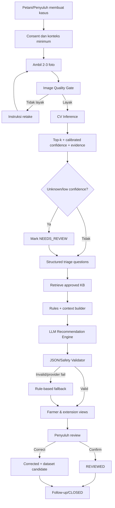
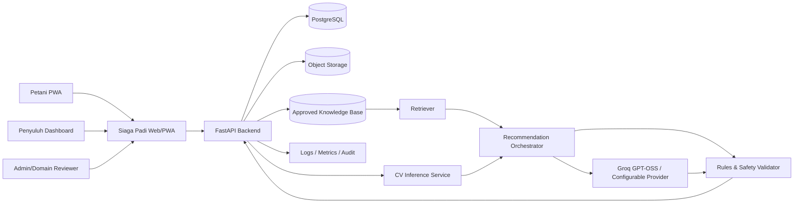
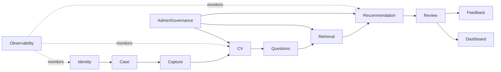
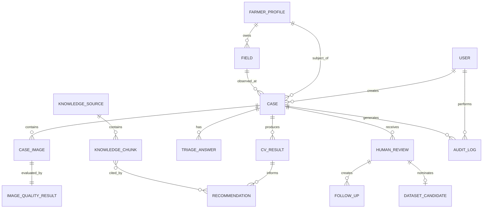

# FUNCTIONAL REQUIREMENTS DOCUMENT (FRD)

## SIAGA PADI — MVP Web/PWA untuk Triase Visual Penyakit Padi dan Rekomendasi Berbasis Bukti

> **Document ID:** `FRD-SIPADI-MVP-001`  
> **Versi:** `0.1.0`  
> **Status:** Draft for Review  
> **Baseline keputusan:** 17 Juli 2026  
> **Target MVP:** 16 Agustus 2026  
>
> Dokumen ini mendetailkan baseline fungsional, data, AI, keamanan, pengujian, operasional, dan pembagian tanggung jawab untuk MVP **Siaga Padi**. Sistem bersifat **penyuluh-assisted, farmer-accessible**: petani dapat melakukan pemeriksaan sederhana secara mandiri, sementara penyuluh berperan sebagai pendamping, reviewer, dan pengelola tindak lanjut.
>
> **Batas keselamatan utama:** hasil Computer Vision dan LLM adalah **triase/indikasi awal**, bukan diagnosis agronomi final dan bukan pengganti pemeriksaan petugas Pengendali Organisme Pengganggu Tumbuhan (POPT), penyuluh, laboratorium, atau ahli tanaman.

---

# 0. Kontrol Dokumen

| Atribut | Nilai |
|---|---|
| Nama Project | `Siaga Padi` |
| Nama Objective / Modul | `MVP Triase Visual Penyakit Padi dan AI Recommendation & Explanation Engine` |
| Document ID | `FRD-SIPADI-MVP-001` |
| Versi | `0.1.0` |
| Status | `Draft for Review` |
| Prioritas | `Must` |
| Target Release | `MVP 30 Hari / 16 Agustus 2026` |
| Tanggal Dibuat | `2026-07-17` |
| Terakhir Diperbarui | `2026-07-17` |
| Project Co-owner | `Fahri Alfiansyah; Chelsa Rachel Wibowo` |
| Product Owner | `Fahri Alfiansyah` |
| Business Owner | `Project Team Siaga Padi; pilot partner TBD` |
| Technical Owner | `Fahri Alfiansyah` |
| Computer Vision & Dataset Owner | `Chelsa Rachel Wibowo` |
| Penulis | `Fahri Alfiansyah; Chelsa Rachel Wibowo` |
| Reviewer Produk/Web | `Chelsa Rachel Wibowo` |
| Reviewer CV/Data | `Fahri Alfiansyah` |
| Domain Reviewer | `Penyuluh/POPT/agronomist pilot — TBD` |
| Klasifikasi Dokumen | `Internal / Terbatas sampai sign-off pilot` |
| Dokumen Terkait | `UX flow, API Spec, Dataset Card, Model Card, Knowledge Base Catalog, UAT Plan` |

## 0.1 Riwayat Revisi

| Versi | Tanggal | Penulis | Bagian yang Diubah | Ringkasan Perubahan |
|---|---|---|---|---|
| 0.1.0 | 2026-07-17 | Fahri & Chelsa | Initial | Baseline FRD lengkap untuk web-first MVP, CV, dan LLM |
| 0.2.0 | TBD | Project Team | Setelah validasi domain | Penyesuaian kelas penyakit, aturan rekomendasi, dan target model |
| 1.0.0 | TBD | Project Team | Approved baseline | Baseline siap development/UAT pilot |

## 0.2 Persetujuan

| Role | Nama | Status | Tanggal | Catatan |
|---|---|---|---|---|
| Product Owner | Fahri Alfiansyah | Pending | — | Memastikan scope dan outcome |
| Technical Owner | Fahri Alfiansyah | Pending | — | Memastikan arsitektur web/backend/integrasi |
| CV & Dataset Owner | Chelsa Rachel Wibowo | Pending | — | Memastikan dataset, model, dan evaluasi |
| Domain Reviewer | TBD | Pending | — | Memvalidasi gejala, kelas, dan rekomendasi |
| Pilot Representative | TBD | Pending | — | Petani/penyuluh untuk UAT |
| Privacy/Security Reviewer | Internal peer review | Pending | — | Minimum review untuk pilot |

---

# 1. Ringkasan Objective

## 1.1 Nama Objective

`Menyediakan triase visual awal penyakit daun padi melalui kamera smartphone, rekomendasi tindakan berbasis sumber tervalidasi, dan workflow review penyuluh dalam satu web application/PWA.`

## 1.2 Ringkasan Singkat

Siaga Padi adalah aplikasi web responsif/PWA yang membantu petani dan penyuluh mendokumentasikan gejala tanaman padi, memeriksa kualitas foto, memperoleh indikasi awal penyakit melalui Computer Vision, menjawab pertanyaan triase terstruktur, dan menerima rekomendasi tindakan yang mudah dipahami serta dapat ditelusuri ke knowledge base resmi.

Computer Vision merupakan komponen AI utama. **AI Recommendation and Explanation Engine** berbasis LLM masuk langsung ke MVP, tetapi hanya berfungsi untuk menjelaskan hasil, menyusun langkah monitoring, dan membuat narasi berbeda untuk petani dan penyuluh. LLM tidak boleh menetapkan diagnosis final, membuat dosis pestisida, atau menghasilkan rekomendasi tanpa evidence. Apabila LLM tidak tersedia, sistem tetap menghasilkan hasil CV dan rekomendasi rule-based.

Fase pertama berupa web application/PWA karena paling realistis untuk dua AI Engineer dengan laptop dan smartphone: tidak memerlukan distribusi aplikasi native, dapat menggunakan kamera dan GPS smartphone, lebih cepat diuji lintas perangkat, dan tetap dapat berkembang menuju aplikasi mobile atau edge inference setelah kebutuhan lapangan tervalidasi.

## 1.3 Problem Statement

### Kondisi saat ini

Pengamatan penyakit padi di lapangan umumnya memerlukan inspeksi visual, pengetahuan tentang gejala, pencatatan lokasi dan fase pertumbuhan, serta tindak lanjut oleh petani, penyuluh, atau POPT. Kualitas hasil sangat dipengaruhi pengalaman pengamat, kualitas dokumentasi foto, kecepatan pelaporan, dan akses terhadap panduan yang sesuai.

Indonesia memiliki skala produksi padi yang besar. BPS melaporkan luas panen padi 2025 sekitar 11,32 juta hektare dengan produksi 60,21 juta ton GKG. Pada Mei 2026 saja, luas panen tercatat 0,96 juta hektare dengan produksi 4,92 juta ton GKG. Pemerintah juga masih menekankan monitoring dan deteksi dini OPT pada 2026 karena perubahan iklim menggeser pola serangan dan El Niño meningkatkan risiko beberapa hama/OPT.

### Masalah utama

1. Dokumentasi gejala dari petani tidak selalu cukup jelas untuk ditinjau ulang.
2. Tidak semua petani mempunyai akses cepat ke penyuluh atau POPT saat gejala pertama muncul.
3. Aplikasi klasifikasi gambar yang hanya menampilkan label penyakit tidak cukup operasional.
4. Hasil model dapat tampak meyakinkan walaupun foto buruk atau gejalanya berada di luar kelas model.
5. Rekomendasi generatif tanpa evidence dapat menyesatkan, terutama jika menyangkut bahan pengendalian.
6. Penyuluh memerlukan rekap kasus, lokasi, koreksi, dan status tindak lanjut, bukan hanya hasil inferensi satu foto.

### Penyebab

- Literasi digital, kualitas perangkat, kualitas internet, usia, serta pengalaman penggunaan teknologi petani sangat beragam.
- Data penyakit padi lokal yang berlabel ahli dan mencakup banyak perangkat/kondisi lapangan masih terbatas.
- Model publik sering diuji pada dataset yang distribusinya berbeda dari sawah Indonesia.
- Pengamatan visual tertentu memiliki kemiripan antarkelas dan dapat dipengaruhi fase pertumbuhan, varietas, cahaya, blur, atau latar belakang.
- Banyak sistem demo tidak memiliki mekanisme abstention, human review, data lineage, dan monitoring model.

### Dampak

- Keterlambatan eskalasi gejala yang berpotensi menyebar.
- Pengambilan tindakan berdasarkan dugaan yang belum tervalidasi.
- Dokumentasi lapangan sulit digunakan untuk evaluasi wilayah.
- Rendahnya kepercayaan pengguna terhadap AI ketika hasil tidak dapat dijelaskan.
- Dataset feedback tidak terkumpul secara sistematis untuk meningkatkan model.

## 1.4 Proposed Solution

Membangun PWA dengan alur:

1. Petani atau penyuluh membuat kasus dan memilih/mencatat lahan.
2. Pengguna mengambil 2–3 foto dengan panduan framing.
3. Sistem menolak atau meminta pengambilan ulang jika kualitas tidak memadai.
4. Model CV menghasilkan prediksi top-k, confidence terkalibrasi, status abstention, dan visual evidence.
5. Pengguna menjawab pertanyaan triase yang dipilih dari question bank.
6. Backend mengambil panduan relevan dari knowledge base tervalidasi.
7. LLM menghasilkan dua output terstruktur: ringkasan sederhana untuk petani dan catatan teknis untuk penyuluh.
8. Rules/safety validator memeriksa evidence, batas rekomendasi, confidence, dan eskalasi.
9. Penyuluh dapat memvalidasi, mengoreksi, memberi catatan, dan menutup kasus.
10. Koreksi yang memenuhi syarat masuk candidate queue untuk dataset berikutnya.

## 1.5 Nilai yang Dihasilkan

| Penerima Manfaat | Nilai / Outcome |
|---|---|
| Petani | Pemeriksaan awal yang sederhana, panduan pengambilan foto, tindakan awal yang mudah dipahami, dan akses eskalasi ke penyuluh |
| Penyuluh | Bukti visual lebih terstruktur, prioritas kasus, histori, peta, validasi, dan draft catatan tindak lanjut |
| POPT/Agronomist | Candidate cases terorganisasi untuk review dan pengembangan dataset |
| Pemerintah daerah/kelompok tani | Gambaran awal pola kasus tanpa menggantikan sistem surveilans resmi |
| Tim pengembang | Portfolio AI end-to-end yang mencakup CV, calibration, RAG, structured LLM output, PWA, human review, dan MLOps |

---

# 2. Tujuan, Outcome, dan Indikator Keberhasilan

## 2.1 Tujuan Utama

1. Memungkinkan pengguna menyelesaikan satu pemeriksaan tanaman dengan smartphone dalam alur maksimal lima menit.
2. Mendeteksi foto tidak layak sebelum inferensi sehingga mengurangi hasil menyesatkan.
3. Menghasilkan indikasi awal untuk empat kelas MVP: `HEALTHY`, `LEAF_BLAST`, `BACTERIAL_LEAF_BLIGHT`, `BROWN_SPOT`, ditambah `UNKNOWN/UNCERTAIN`.
4. Memberikan rekomendasi tindakan dan monitoring yang seluruh klaim operasionalnya terhubung ke knowledge base.
5. Memungkinkan penyuluh memvalidasi atau mengoreksi hasil dan mendokumentasikan tindak lanjut.
6. Mengumpulkan feedback berizin untuk evaluasi domain shift dan iterasi model.
7. Menjaga fungsi inti tetap berjalan saat provider LLM gagal.

## 2.2 Non-Goals

- Diagnosis agronomi final atau pengganti pemeriksaan ahli/laboratorium.
- Rekomendasi dosis pestisida, merek dagang, atau keputusan penggunaan bahan kimia.
- Deteksi seluruh hama, penyakit batang/malai/akar, defisiensi nutrisi, atau keracunan pada MVP.
- Prediksi hasil panen.
- Integrasi langsung ke sistem pemerintah pada MVP.
- Drone, IoT sawah, kamera thermal, LiDAR, atau perangkat khusus.
- Chatbot pertanian terbuka untuk semua topik.
- VLM sebagai classifier utama.
- Keputusan otomatis untuk pengendalian massal tanpa human review.

## 2.3 Business Outcome

| Outcome ID | Outcome | Kondisi Awal | Target MVP | Cara Mengukur |
|---|---|---:|---:|---|
| BO-001 | Waktu membuat dokumentasi kasus | Tidak terstruktur | Median ≤ 5 menit | Event analytics/UAT |
| BO-002 | Foto kasus memenuhi minimum kualitas | Tidak terukur | ≥ 85% setelah maksimal 2 percobaan | Image-quality logs |
| BO-003 | Kasus confidence rendah yang dieskalasi | Tidak ada mekanisme | 100% ditandai `NEEDS_REVIEW` | State audit |
| BO-004 | Output rekomendasi memiliki evidence ID | Tidak konsisten | 100% | Schema validator |
| BO-005 | Penyuluh dapat menyelesaikan review | Manual/terpisah | ≥ 90% skenario UAT selesai | UAT logs |
| BO-006 | Feedback dapat menjadi kandidat dataset | Tidak terstruktur | ≥ 80% koreksi lengkap masuk queue | Dataset pipeline |

## 2.4 Product KPI

| KPI ID | Metrik | Definisi | Target MVP | Sumber Data | Frekuensi |
|---|---|---|---:|---|---|
| KPI-001 | Case completion rate | Kasus mencapai hasil triase / kasus dimulai | ≥ 80% | Product analytics | Mingguan |
| KPI-002 | First-photo acceptance | Foto pertama lolos quality gate | ≥ 60% | Inference log | Mingguan |
| KPI-003 | Retake success | Foto lolos setelah instruksi retake | ≥ 75% | Inference log | Mingguan |
| KPI-004 | Farmer comprehension | Pengguna memahami hasil dan next action | ≥ 80% skor UAT | Survey UAT | Per pilot |
| KPI-005 | Review turnaround | Median waktu submit ke review | Baseline dikumpulkan; target awal ≤ 24 jam | Audit log | Mingguan |
| KPI-006 | Degraded-mode success | Kasus tetap mendapat output aman saat LLM gagal | ≥ 99% | Resilience test | Release |

## 2.5 Technical / Operational KPI

| KPI ID | Metrik | Target |
|---|---|---:|
| TKPI-001 | Page load p95 setelah first visit | ≤ 3 detik pada jaringan 4G yang stabil |
| TKPI-002 | API non-AI latency p95 | ≤ 1,5 detik |
| TKPI-003 | Image-quality processing p95 | ≤ 2 detik |
| TKPI-004 | CV inference p95 | ≤ 8 detik pada GPU endpoint; ≤ 20 detik pada CPU demo |
| TKPI-005 | LLM recommendation p95 | ≤ 15 detik |
| TKPI-006 | End-to-end analysis p95 | ≤ 30 detik |
| TKPI-007 | API success rate | ≥ 98% |
| TKPI-008 | Structured output validity | 100% setelah retry/fallback |
| TKPI-009 | Availability prototype | ≥ 99% di luar planned maintenance |
| TKPI-010 | Duplicate-case prevention | 100% untuk request dengan idempotency key sama |

## 2.6 AI / Analytics KPI

| KPI ID | Metrik | Target | Dataset Evaluasi | Owner |
|---|---|---:|---|---|
| AIKPI-001 | CV macro-F1 | ≥ 0,85 | Cross-domain holdout | Chelsa |
| AIKPI-002 | Per-class recall | ≥ 0,75 | Cross-domain holdout | Chelsa |
| AIKPI-003 | Expected Calibration Error | ≤ 0,10 | Calibration set | Chelsa |
| AIKPI-004 | Unusable-image recall | ≥ 0,90 | Image-quality test set | Chelsa |
| AIKPI-005 | Unknown/abstention safety recall | ≥ 0,80 pada OOD test set awal | OOD set | Chelsa |
| AIKPI-006 | LLM JSON-schema validity | 100% setelah maksimal 2 retry | Golden prompts | Fahri |
| AIKPI-007 | Citation presence | 100% output actionable | KB evaluation set | Fahri |
| AIKPI-008 | Citation validity | ≥ 95% reference ID mendukung klaim | Expert review | Fahri & domain reviewer |
| AIKPI-009 | Unsupported actionable claim | ≤ 2% | 100+ golden cases | Fahri |
| AIKPI-010 | Prohibited dosage/brand output | 0 kasus | Safety test set | Fahri & Chelsa |
| AIKPI-011 | Human override rate | Baseline dikumpulkan, tanpa target sebelum pilot | Production feedback | Chelsa |
| AIKPI-012 | Cross-device performance gap | Selisih macro-F1 antarkelompok perangkat ≤ 0,10 | Device-stratified test | Chelsa |

---

# 3. Ruang Lingkup

## 3.1 In Scope

- Responsive web app/PWA untuk mobile dan desktop.
- Authentication sederhana dan RBAC petani, penyuluh, admin.
- Assisted mode: penyuluh dapat membuat kasus atas nama petani dengan consent.
- Profil petani minimal dan data lahan minimal.
- Pengambilan/upload maksimum tiga foto per kasus.
- Client/server-side image-quality checks.
- CV classifier empat kelas + healthy + abstention.
- Top-k prediction, confidence terkalibrasi, dan Grad-CAM/evidence overlay untuk penyuluh.
- Pertanyaan triase terstruktur.
- AI Recommendation and Explanation Engine berbasis RAG + structured output.
- Provider abstraction: Groq default; Cerebras/OpenRouter/vLLM-compatible configurable.
- Rule-based fallback ketika LLM gagal.
- Review, koreksi, komentar, dan status tindak lanjut oleh penyuluh.
- Histori kasus.
- Dashboard dan peta sederhana untuk penyuluh.
- Knowledge base versioning dan evidence IDs.
- Feedback queue untuk candidate dataset.
- Audit logs, metrics minimum, health checks, dan feature flags.
- Bahasa Indonesia sebagai bahasa utama.

## 3.2 Out of Scope

- Native Android/iOS.
- Offline inference penuh.
- Integrasi WhatsApp, SSO pemerintah, SATUSEHAT, atau sistem kementerian.
- Open-ended chatbot.
- Penggunaan VLM sebagai sumber diagnosis utama.
- Rekomendasi pengendalian kimia yang spesifik dosis/merek.
- Segmentasi lesi presisi atau estimasi luas serangan skala hektare.
- Multi-tenancy pemerintah daerah penuh.
- Pembayaran/subscription.
- Dashboard nasional real-time.
- Hardware khusus.
- Data sharing lintas instansi otomatis.

## 3.3 Future Scope

| Fitur / Kapabilitas | Target Fase | Alasan Ditunda |
|---|---|---|
| VLM second opinion | Phase 2 | Perlu evaluasi keselamatan dan biaya multimodal |
| Native mobile / on-device inference | Phase 2/3 | Perlu validasi kebutuhan dan optimasi model |
| Voice-guided inspection | Phase 2 | Perlu uji aksesibilitas dan ASR/TTS |
| WhatsApp sharing/bot | Phase 2 | Perlu business API dan privacy design |
| Pest/whole-plant/malai classes | Phase 2 | Dataset dan validasi domain belum cukup |
| Weather/context integration | Phase 2 | Harus menghindari causal overclaim |
| District multi-tenancy | Phase 3 | Perlu IAM, SLA, dan governance lebih matang |
| Outbreak early-warning | Phase 3 | Perlu sampling bias correction dan integrasi surveilans |
| Field visit report/PDF | Phase 2 | Core triage lebih dahulu |
| Farmer-local language variants | Phase 2 | Perlu terminologi tervalidasi |

## 3.4 Batas Sistem

**Sistem mulai bertanggung jawab ketika:**

Pengguna yang memiliki akses membuat kasus, memberikan consent yang diperlukan, dan mengirim foto tanaman beserta konteks minimum.

**Sistem berhenti bertanggung jawab ketika:**

Hasil triase, rekomendasi berbasis evidence, status eskalasi, dan histori tersimpan; penyuluh dapat menutup atau meneruskan kasus ke proses lapangan di luar sistem.

**Di luar tanggung jawab sistem:**

- Kepastian diagnosis laboratorium.
- Keputusan resmi pengendalian OPT.
- Ketersediaan penyuluh/POPT di lapangan.
- Akurasi lokasi ketika GPS pengguna mati atau tidak presisi.
- Kerugian akibat tindakan di luar rekomendasi tervalidasi.
- Ketepatan panduan jika knowledge base belum diperbarui oleh domain owner.

---

# 4. Stakeholder, Pengguna, dan Hak Akses

## 4.1 Stakeholder dan Pembagian Tim

| Stakeholder / Area | Fahri Alfiansyah | Chelsa Rachel Wibowo |
|---|---|---|
| Project initiation | Co-creator & Product Co-owner | Co-creator & Product Co-owner |
| Product requirement | **Product & Requirement Lead** | Co-author & Technical Reviewer |
| Web platform | **Web Platform Lead**: frontend, backend, database, API, auth, deployment | Contributor & reviewer integrasi |
| Computer Vision | CV Integration Owner | **Computer Vision Lead**: model, training, calibration, evaluation |
| Dataset & experiment | Data pipeline/evaluation contributor | **Dataset & Experiment Lead** |
| LLM orchestration | **Lead**: provider abstraction, RAG, schema, guardrail | AI reviewer & evaluation contributor |
| Knowledge base | Pipeline/governance lead | Domain-content technical reviewer |
| Architecture & DevOps | **Technical Architecture Lead** | Contributor & reviewer |
| QA web/backend/LLM | **QA Lead** | Reviewer |
| QA CV/data | Reviewer | **QA Lead** |
| Documentation & demo | Product/docs/demo-flow lead | Model card/experiment report lead |
| User research/UAT | Requirement and feedback coordinator | Model-feedback and domain validation coordinator |
| Release decision | Accountable bersama; Fahri owns technical go/no-go | Accountable bersama; Chelsa owns AI/data go/no-go |

## 4.2 Role Pengguna

| Role | Tujuan | Kapabilitas Utama | Batas Kewenangan |
|---|---|---|---|
| Petani | Mendokumentasikan gejala dan memahami tindakan awal | Membuat kasus sendiri, foto, konteks, melihat hasil sederhana, berbagi ke penyuluh, histori sendiri | Tidak melihat data petani lain; tidak memvalidasi diagnosis |
| Penyuluh | Mendampingi, memprioritaskan, memvalidasi, dan menindaklanjuti | Assisted capture, review, koreksi, catatan, dashboard wilayah, export terbatas | Hanya wilayah/kelompok yang ditugaskan |
| Admin | Menjaga operasional sistem | User/role, provider/model config, KB version, thresholds, audit, system health | Tidak boleh mengubah label expert tanpa audit |
| Domain Reviewer/POPT | Validasi kelas, rekomendasi, dan kasus ambigu | Review candidate cases, approve KB entries, label gold set | Tidak mengelola deployment kecuali diberi role |
| System Actor | Menjalankan pipeline otomatis | Quality gate, CV, retrieval, LLM, validator, fallback, notifications | Tidak mengambil keputusan final |

## 4.3 Permission Matrix

| Resource / Aksi | Petani | Penyuluh | Admin | Domain Reviewer |
|---|---:|---:|---:|---:|
| Membuat kasus sendiri | Ya | Ya | Ya | Opsional |
| Membuat kasus assisted | Tidak | Ya | Ya | Tidak |
| Melihat kasus sendiri | Ya | Ya | Ya | Sesuai assignment |
| Melihat kasus wilayah | Tidak | Ya | Ya | Sesuai assignment |
| Mengubah draft sendiri | Ya | Ya | Ya | Tidak |
| Melihat hasil teknis lengkap | Ringkas | Ya | Ya | Ya |
| Memvalidasi/koreksi | Tidak | Ya | Ya (dengan alasan) | Ya |
| Menutup kasus | Terbatas | Ya | Ya | Rekomendasi |
| Mengubah KB | Tidak | Tidak | Draft | Review/approve |
| Mengubah threshold/model | Tidak | Tidak | Ya | Review |
| Export | Data sendiri | Wilayah, terbatas | Ya | Dataset terkontrol |
| Melihat audit log | Tidak | Terbatas | Ya | Terbatas |
| Memasukkan data ke candidate dataset | Consent saja | Nominate | Ya | Approve |

## 4.4 RACI

| Aktivitas | Fahri | Chelsa | Domain Reviewer | Penyuluh Pilot | Petani Pilot |
|---|---|---|---|---|---|
| Menyetujui product requirement | A/R | C | C | C | C |
| Menentukan arsitektur web/backend | A/R | C | I | I | I |
| Menentukan model CV/dataset | C | A/R | C | I | I |
| Menentukan kelas penyakit MVP | C | R | A/C | C | I |
| Menentukan LLM/RAG/guardrail | A/R | C | C | I | I |
| Menyetujui knowledge base | R | C | A | C | I |
| Implementasi frontend/backend | A/R | C | I | I | I |
| Implementasi CV pipeline | C | A/R | C | I | I |
| UAT | C | C | C | R | R |
| AI safety evaluation | A/R | A/R | C | C | I |
| Release MVP | A | A | C | C | I |

---

# 5. Asumsi, Batasan, dan Dependency

## 5.1 Asumsi

| ID | Asumsi | Dampak jika Tidak Benar | Validasi |
|---|---|---|---|
| ASM-001 | Petani/penyuluh mempunyai smartphone dengan kamera dan browser modern | Capture tidak dapat dilakukan | Device survey pilot |
| ASM-002 | Minimal koneksi tersedia saat submit, walau dapat tidak stabil | Pipeline tertunda | Network test dan upload retry |
| ASM-003 | Domain reviewer dapat memvalidasi kelas dan KB sebelum pilot nyata | Risiko rekomendasi salah | Sign-off domain |
| ASM-004 | Dataset publik dapat digunakan sesuai lisensi setelah audit | Training tertunda | License manifest |
| ASM-005 | Groq free/developer API tersedia saat development | LLM primary unavailable | Provider abstraction + fallback |
| ASM-006 | Hasil GPS bersifat opsional dan dapat dikurangi presisinya | Map kurang lengkap | UX consent + manual area |
| ASM-007 | MVP menguji workflow, bukan membuktikan kesiapan nasional | Ekspektasi scope terlalu tinggi | Demo disclaimer |

## 5.2 Batasan

| ID | Batasan | Dampak |
|---|---|---|
| CON-001 | Tim dua orang dan target 30 hari | Scope harus ketat; hanya core classes |
| CON-002 | Laptop dan smartphone, tanpa GPU khusus yang dijamin | Training perlu Colab/Kaggle/free compute atau endpoint |
| CON-003 | Software dan layanan diprioritaskan gratis/open-source | Hosting dan rate limit tidak production-grade |
| CON-004 | Belum ada partner domain final | Threshold dan rekomendasi berstatus draft sampai sign-off |
| CON-005 | LLM pihak ketiga | Data minimization dan provider policy wajib |
| CON-006 | Tidak semua gejala dapat dipastikan dari daun | Abstention dan human review wajib |
| CON-007 | PWA/browser camera berbeda antarperangkat | Testing device matrix wajib |

## 5.3 Dependency

| ID | Dependency | Owner | Target | Status | Fallback |
|---|---|---|---|---|---|
| DEP-001 | Dataset bootstrap dan lisensi | Chelsa | Day 3 | Open | Gunakan subset yang lisensinya jelas |
| DEP-002 | Domain review kelas/KB | Fahri | Day 10 | Open | Tandai content `UNVERIFIED`; demo synthetic only |
| DEP-003 | Groq API key | Fahri | Day 5 | Open | Cerebras/OpenRouter/local rules |
| DEP-004 | Object storage | Fahri | Day 4 | Open | Local MinIO |
| DEP-005 | CV inference environment | Chelsa | Day 12 | Open | CPU endpoint dengan SLA lebih longgar |
| DEP-006 | Pilot users | Keduanya | Day 22 | Open | Internal usability test |
| DEP-007 | Privacy consent text | Fahri | Day 12 | Open | Tidak menyimpan GPS/foto di demo publik |

## 5.4 Prasyarat MVP

- Repository, branching, issue board, CI skeleton tersedia.
- Dataset card dan license manifest dibuat sebelum training.
- Disease taxonomy dan `UNKNOWN` policy terdokumentasi.
- Knowledge base entries mempunyai source ID, version, reviewer status.
- Test images yang legal tersedia.
- Provider secrets hanya di server/environment.
- User representative tersedia untuk minimal satu sesi UAT.
- Disclaimer dan escalation rule tampil pada hasil.

---

# 6. Proses Bisnis dan Workflow

## 6.1 Proses Saat Ini — As-Is

| Tahap | Aktor | Aktivitas | Tool | Input | Output | Masalah |
|---|---|---|---|---|---|---|
| 1 | Petani | Menemukan gejala | Observasi | Tanaman | Dugaan | Bergantung pengalaman |
| 2 | Petani | Mengambil foto/menghubungi pihak lain | Kamera/chat | Foto bebas | Pesan | Foto sering tidak standar |
| 3 | Penyuluh | Memahami konteks | Chat/kunjungan | Foto dan cerita | Pertanyaan lanjutan | Data tersebar |
| 4 | Penyuluh/POPT | Menilai dan memberi arahan | Pengetahuan/panduan | Observasi | Tindakan | Tidak selalu terdokumentasi |
| 5 | Pengelola | Merekap | Spreadsheet/manual | Catatan | Rekap | Sulit ditelusuri dan dianalisis |

## 6.2 Proses Target — To-Be

| Tahap | Aktor / Sistem | Aktivitas | Otomatis / Manual | Output |
|---|---|---|---|---|
| 1 | Petani/Penyuluh | Membuat kasus dan memberi consent | Manual | Case draft |
| 2 | Aplikasi | Memandu capture dan memeriksa kualitas | Otomatis | Foto layak/retake |
| 3 | CV Service | Prediksi, calibration, evidence, abstention | Otomatis | CV result |
| 4 | Pengguna | Menjawab pertanyaan kontekstual | Manual | Triage context |
| 5 | Retriever/Rules/LLM | Mengambil KB dan menyusun rekomendasi | Otomatis | Structured recommendation |
| 6 | Safety Validator | Memeriksa schema/evidence/prohibited content | Otomatis | Approved/fallback |
| 7 | Petani | Melihat hasil sederhana | Manual | Next action |
| 8 | Penyuluh | Review/koreksi/tindak lanjut | Manual | Reviewed case |
| 9 | Sistem | Audit, metrics, feedback queue | Otomatis | Monitoring/dataset candidate |

## 6.3 End-to-End Workflow



## 6.4 Trigger

| Trigger ID | Trigger | Sumber | Frekuensi | Requirement |
|---|---|---|---|---|
| TRG-001 | Pengguna membuat kasus | UI | On demand | FR-002 |
| TRG-002 | Foto ditambahkan | UI/PWA | Per foto | FR-003/004 |
| TRG-003 | Semua foto minimum lolos | Workflow | Per kasus | FR-005 |
| TRG-004 | CV result tersedia | Event/internal queue | Per kasus | FR-006/007 |
| TRG-005 | Penyuluh membuka review | UI | On demand | FR-008 |
| TRG-006 | Provider LLM gagal/timeout | Orchestrator | Per request | FR-014 |
| TRG-007 | Koreksi disimpan dengan consent | UI | Per review | FR-012 |
| TRG-008 | Model/KB/provider diubah | Admin UI | On demand | FR-011/013 |

## 6.5 State dan Status

| Status | Deskripsi | Dapat Diubah Oleh | Transisi Berikutnya |
|---|---|---|---|
| DRAFT | Kasus belum lengkap | Creator | CAPTURED, CANCELLED |
| CAPTURED | Foto minimum tersedia | System | QUALITY_REJECTED, QUEUED |
| QUALITY_REJECTED | Foto tidak layak | System/User | CAPTURED, CANCELLED |
| QUEUED | Menunggu pipeline | System | PROCESSING_CV, FAILED |
| PROCESSING_CV | CV berjalan | System | NEEDS_CONTEXT, FAILED |
| NEEDS_CONTEXT | Menunggu jawaban triase | User | GENERATING_RECOMMENDATION |
| GENERATING_RECOMMENDATION | Retrieval/LLM/fallback berjalan | System | AUTO_TRIAGE_READY, NEEDS_REVIEW, FAILED |
| AUTO_TRIAGE_READY | Hasil awal tersedia | System | NEEDS_REVIEW, REVIEWED, CLOSED |
| NEEDS_REVIEW | Wajib/menunggu penyuluh | System | REVIEWED, REVISION_REQUIRED |
| REVISION_REQUIRED | Data/foto tambahan dibutuhkan | Reviewer | CAPTURED, NEEDS_CONTEXT |
| REVIEWED | Penyuluh/domain reviewer sudah menilai | Reviewer | CLOSED |
| CLOSED | Tindak lanjut dicatat/selesai | Reviewer/Admin | ARCHIVED |
| FAILED | Pipeline gagal | System | QUEUED, CANCELLED |
| ARCHIVED | Tidak aktif | Admin | — |
| CANCELLED | Dibatalkan | Creator/Admin | — |

## 6.6 State Transition Rules

| Rule ID | Dari | Ke | Aktor | Kondisi | Efek |
|---|---|---|---|---|---|
| STR-001 | DRAFT | CAPTURED | Creator | Consent dan foto minimum ada | Audit `case.captured` |
| STR-002 | CAPTURED | QUALITY_REJECTED | System | Salah satu syarat wajib gagal | Retake guidance |
| STR-003 | CAPTURED | QUEUED | System | Quality gate lulus | Idempotent job dibuat |
| STR-004 | PROCESSING_CV | NEEDS_CONTEXT | System | Result tersimpan | Question set dipilih |
| STR-005 | GENERATING_RECOMMENDATION | NEEDS_REVIEW | System | Confidence rendah/OOD/rule escalation | Review task dibuat |
| STR-006 | GENERATING_RECOMMENDATION | AUTO_TRIAGE_READY | System | Output valid dan tidak wajib review | Result tersedia |
| STR-007 | NEEDS_REVIEW | REVIEWED | Penyuluh/Reviewer | Alasan dan outcome diisi | Feedback record dibuat |
| STR-008 | REVIEWED | CLOSED | Penyuluh | Tindak lanjut/final note tersedia | Closure audit |
| STR-009 | FAILED | QUEUED | System/Admin | Retry budget tersedia | Retry count +1 |
| STR-010 | Any active | CANCELLED | Creator/Admin | Alasan diberikan | Temporary files cleaned |

---

# 7. Konteks Sistem dan Arsitektur Fungsional

## 7.1 System Context



## 7.2 Sistem Terkait

| Sistem | Peran | Arah Data | Metode | Owner | MVP SLA |
|---|---|---|---|---|---|
| GroqCloud | LLM primary | Keluar/masuk | OpenAI-compatible HTTPS | Fahri | Best effort/free; timeout 15s |
| Cerebras/OpenRouter/vLLM | Optional fallback/benchmark | Keluar/masuk | OpenAI-compatible HTTPS | Fahri | Best effort |
| PostgreSQL/Supabase | Source of truth app | Dua arah | SQL/REST internal | Fahri | 99% target prototype |
| Object Storage | Foto/evidence | Dua arah | S3-compatible | Fahri | 99% target |
| CV Service | Image inference | Internal | REST/internal queue | Chelsa | p95 ≤ 8s GPU |
| Knowledge Base | Approved guidance | Internal | SQL/vector retrieval | Fahri/domain reviewer | Versioned |
| Map tiles | Peta opsional | Keluar | HTTPS | Fahri | Degraded mode without map |

## 7.3 Modul / Komponen Fungsional

| Module ID | Nama Modul | Tujuan | Input | Output | Owner |
|---|---|---|---|---|---|
| MOD-001 | Identity & Access | Auth, RBAC, assisted mode | Credentials/roles | Session/permissions | Fahri |
| MOD-002 | Case & Field Management | Kelola kasus, petani, lahan | User input | Case record | Fahri |
| MOD-003 | Capture & Quality | Foto dan quality gate | Images | Accepted/rejected images | Fahri + Chelsa |
| MOD-004 | CV Triage | Prediksi/evidence/abstention | Accepted images | CV result | Chelsa |
| MOD-005 | Context Questionnaire | Konteks nonvisual | Answers | Triage context | Fahri + Chelsa |
| MOD-006 | Knowledge & Retrieval | Evidence retrieval | Disease/context | KB chunks | Fahri |
| MOD-007 | AI Recommendation | Structured explanation | CV/context/KB | Recommendation JSON | Fahri |
| MOD-008 | Human Review | Validasi/koreksi/follow-up | Case result | Reviewed case | Fahri |
| MOD-009 | Dashboard & Map | Prioritas dan agregasi | Cases | KPIs/map/list | Fahri |
| MOD-010 | Feedback & Dataset | Candidate data pipeline | Corrected cases | Dataset candidates | Chelsa |
| MOD-011 | Admin & Governance | Config/version/control | Admin actions | Config/audit | Fahri + Chelsa |
| MOD-012 | Observability & Resilience | Logs/metrics/fallback | Events/errors | Alerts/health | Fahri |

## 7.4 Dependency Antar-Modul



## 7.5 Keputusan Provider LLM untuk MVP

### Keputusan utama

| Urutan | Provider/Model | Peran | Alasan |
|---:|---|---|---|
| 1 | Groq `openai/gpt-oss-120b` | Default recommendation engine | Free plan tersedia, OpenAI-compatible, strict structured outputs, cepat, harga upgrade rendah |
| 2 | Groq `openai/gpt-oss-20b` | Fallback hemat/cepat | Biaya lebih rendah dan throughput tinggi |
| 3 | Rule-based templates | Mandatory offline/degraded fallback | Menjaga fungsi aman tanpa LLM |
| 4 | Cerebras `gpt-oss-120b` | Benchmark/free provider alternative | Kuota gratis dan throughput tinggi |
| 5 | Gemini 3.1 Flash-Lite / Mistral Small 4 | VLM/paid experiment, feature flag | Multimodal murah; bukan classifier utama |
| 6 | Self-host vLLM | Future deployment | Kontrol data/model saat GPU tersedia |
| 7 | OpenRouter | Routing/temporary fallback | Banyak model, tetapi free router dapat berubah dan limit rendah |
| 8 | Hugging Face Inference Providers | Eksperimen | Model registry kuat, tetapi free credits hosted sangat kecil |

### Estimasi API LLM

Asumsi satu analisis: 1.500 input tokens + 500 output tokens, tidak termasuk caching.

| Model | Perkiraan biaya per 1.000 analisis | Catatan |
|---|---:|---|
| Groq GPT-OSS 20B | sekitar USD 0,2625 | Sangat hemat; fallback |
| Groq GPT-OSS 120B | sekitar USD 0,525 | Default kualitas/biaya |
| Gemini 3.1 Flash-Lite paid | sekitar USD 1,125 | Bisa menerima multimodal |
| GPT-5.4 mini | sekitar USD 3,375 | Benchmark kualitas, bukan default |
| Rule-based | USD 0 inference API | Tetap membutuhkan hosting backend |

> Harga dan free limits dapat berubah. Konfigurasi provider harus dapat diubah tanpa perubahan business logic. Biaya rupiah mengikuti kurs dan pajak pada saat penggunaan.

---

# 8. Ringkasan Kebutuhan Fungsional

| FR ID | Nama Requirement | Modul | Actor | Priority | Release | Status |
|---|---|---|---|---|---|---|
| FR-001 | Authentication, role, dan assisted usage | MOD-001 | Semua role | Must | MVP | Draft |
| FR-002 | Profil petani, lahan, consent, dan case creation | MOD-002 | Petani/Penyuluh | Must | MVP | Draft |
| FR-003 | Smartphone photo capture dan upload | MOD-003 | Petani/Penyuluh | Must | MVP | Draft |
| FR-004 | Image-quality validation dan retake guidance | MOD-003 | System/User | Must | MVP | Draft |
| FR-005 | CV inference, confidence, evidence, dan abstention | MOD-004 | System | Must | MVP | Draft |
| FR-006 | Structured follow-up triage questionnaire | MOD-005 | Petani/Penyuluh | Must | MVP | Draft |
| FR-007 | AI Recommendation and Explanation Engine | MOD-006/007 | System | Must | MVP | Draft |
| FR-008 | Penyuluh review, correction, dan follow-up | MOD-008 | Penyuluh/Reviewer | Must | MVP | Draft |
| FR-009 | Case result dan history untuk petani | MOD-002/008 | Petani | Must | MVP | Draft |
| FR-010 | Dashboard dan map untuk penyuluh | MOD-009 | Penyuluh | Should | MVP | Draft |
| FR-011 | Knowledge-base governance dan citation | MOD-006/011 | Admin/Reviewer | Must | MVP | Draft |
| FR-012 | Feedback dan dataset candidate queue | MOD-010 | System/Reviewer | Should | MVP | Draft |
| FR-013 | Admin model/provider/threshold configuration | MOD-011 | Admin | Must | MVP | Draft |
| FR-014 | Offline/degraded mode dan rule-based fallback | MOD-012 | System/User | Must | MVP | Draft |

## 8.1 Prioritas MoSCoW

- **Must:** Tanpa fitur ini, Siaga Padi tidak aman atau tidak memberikan nilai inti.
- **Should:** Penting untuk pilot, tetapi dapat memiliki workaround.
- **Could:** Nilai tambahan yang tidak menghambat release.
- **Won't for MVP:** Dicatat sebagai future scope.

---

# 9. Detail Kebutuhan Fungsional

> Setiap requirement di bawah merupakan baseline yang dapat diuji. ID, rules, output, dan acceptance criteria harus dipertahankan atau direvisi melalui decision log.

# 9.1 FR-001 — Authentication, Role, dan Assisted Usage
## 9.1.1 Metadata
| Field | Nilai |
|---|---|
| Requirement ID | `FR-001` |
| Nama | Authentication, Role, dan Assisted Usage |
| Modul | MOD-001 |
| Requirement Type | Functional / Security |
| Source | Project baseline + research Juli 2026 |
| Owner | Fahri Alfiansyah |
| Priority | Must |
| Target Release | MVP |
| Status | Draft |
| Related Objective | OBJ-001 |
| Related Business Rule | BR-001-xx |
| Related API/Event | Lihat Integration Impact |

## 9.1.2 Tujuan

Memastikan setiap pengguna hanya dapat mengakses data dan aksi sesuai perannya, sekaligus memungkinkan penyuluh mendampingi petani yang tidak menggunakan aplikasi secara mandiri.

## 9.1.3 User Story

> Sebagai petani atau penyuluh, saya ingin masuk dengan akun yang sesuai dan menggunakan mode pendampingan ketika dibutuhkan, sehingga kasus tetap dapat dicatat tanpa mengorbankan kepemilikan data dan audit trail.

## 9.1.4 Requirement Statement

> Sistem harus menyediakan autentikasi, RBAC, session management, dan assisted mode yang mencatat petani, penyuluh pendamping, serta dasar persetujuan.

## 9.1.5 Actor

- Primary: Petani, Penyuluh
- Secondary: Admin
- System: Identity service/session middleware

## 9.1.6 Preconditions

1. Akun telah dibuat atau diprovisikan oleh admin untuk pilot.
2. Browser mendukung secure cookies/local storage yang dibutuhkan.
3. Untuk assisted mode, penyuluh mempunyai permission wilayah dan petani menyetujui pencatatan.

## 9.1.7 Trigger

Pengguna membuka halaman yang memerlukan autentikasi atau penyuluh memilih `Buat kasus untuk petani`.

## 9.1.8 Input

| Field | Tipe | Wajib | Default | Validasi | Contoh |
|---|---|---|---|---|---|
| username | string | Ya | — | 3–100 karakter | penyuluh.demo |
| password | password | Ya | — | Minimum 10 karakter untuk pilot | •••••••••• |
| assisted_farmer_id | UUID | Kondisional | — | Harus berada dalam scope wilayah | uuid |
| consent_method | enum | Kondisional | — | VERBAL_RECORDED / WRITTEN / DIGITAL | VERBAL_RECORDED |

## 9.1.9 Business Rules

- BR-001-01: Petani hanya dapat melihat kasus miliknya sendiri.
- BR-001-02: Penyuluh hanya dapat melihat kasus dalam assignment wilayah/kelompok.
- BR-001-03: Assisted mode wajib menyimpan `created_by`, `subject_farmer_id`, `consent_method`, dan timestamp.
- BR-001-04: Tidak ada akun bersama pada pilot.
- BR-001-05: Password tidak pernah disimpan plaintext; session token tidak ditaruh pada URL.
- BR-001-06: Maksimal lima login gagal dalam 15 menit sebelum temporary lock.

## 9.1.10 Main Flow

1. Pengguna membuka aplikasi dan diarahkan ke login.
2. Sistem memvalidasi credential dan status akun.
3. Sistem membuat session aman dan memuat role/permission.
4. Dashboard sesuai role ditampilkan.
5. Untuk assisted mode, penyuluh mencari petani yang berada dalam scope.
6. Penyuluh mencatat metode consent dan membuat kasus atas nama petani.
7. Sistem menyimpan actor, subject, permission scope, dan audit event.

## 9.1.11 Alternative Flow

### AF-01 — Akun petani belum ada

1. Penyuluh membuat profil minimal dengan consent.
2. Sistem menandai profil `ASSISTED_ONLY` sampai petani mengaktifkan akun.

### AF-02 — Session berakhir

1. Sistem menyimpan draft lokal non-sensitif sementara.
2. Pengguna login ulang dan melanjutkan draft.

## 9.1.12 Exception dan Error Flow

| Error ID | Kondisi | Respons Sistem | Status Akhir | Retry | Pesan Pengguna |
|---|---|---|---|---|---|
| ERR-001 | Credential salah | Tolak login dan tambah counter | UNAUTHENTICATED | Manual | Username atau kata sandi tidak sesuai. |
| ERR-002 | Role tidak memiliki akses | Kembalikan 403 tanpa data | Tidak berubah | Tidak | Anda tidak memiliki akses. |
| ERR-003 | Petani di luar scope | Tolak assisted mode | Tidak berubah | Tidak | Petani tidak berada dalam wilayah tugas Anda. |
| ERR-004 | Rate limit login | Temporary lock | LOCKED_TEMPORARY | Setelah cooldown | Terlalu banyak percobaan. Coba kembali nanti. |

## 9.1.13 Output

| Output | Format | Consumer | Penyimpanan | Retensi |
|---|---|---|---|---|
| User session | Secure cookie/token | Web client | Session store | Sesuai session policy |
| Auth audit | JSON event | Audit service | Audit log | Minimum 1 tahun pilot |

## 9.1.14 Postconditions

- Session aktif sesuai role.
- Semua aksi berikutnya membawa actor/correlation ID.
- Assisted case menyimpan subject dan consent.

## 9.1.15 UI / UX Requirements

**Halaman/komponen**

- Halaman login sederhana
- Role-aware home
- Modal assisted mode dengan consent
- Session-expiry notification

**Informasi wajib tampil**

- Nama pengguna dan role
- Wilayah/assignment untuk penyuluh
- Indikator bahwa penyuluh sedang bertindak atas nama petani

**State wajib**

- Loading.
- Empty.
- Success.
- Validation error.
- System error.
- Offline/degraded.
- No permission.
- Unsaved changes.
- Stale data.
- Confirmation untuk aksi destruktif.

**Responsive behavior**

Mobile adalah prioritas untuk capture dan farmer result. Desktop/tablet dioptimalkan untuk review, dashboard, dan admin. Semua aksi inti tetap tersedia pada kedua kelas viewport.

**Accessibility**

- Keyboard navigable.
- Label form dan error dapat dibaca screen reader.
- Status tidak dibedakan hanya dengan warna.
- Touch target minimum 44×44 px.
- Bahasa Indonesia sederhana; istilah teknis mempunyai penjelasan.

## 9.1.16 Permission dan Data Access

| Aksi | Permission | Scope Data | Catatan |
|---|---|---|---|
| Login | public | N/A | Hanya credential validation |
| Assisted create | case.assisted_create | Assigned farmers | Consent wajib |
| User admin | user.manage | All pilot users | Admin only |

## 9.1.17 Data Impact

**Data dibaca**

- `users`
- `roles`
- `assignments`

**Data dibuat**

- `sessions`
- `consent_records`
- `audit_logs`

**Data diperbarui**

- `last_login_at`
- `failed_login_count`

**Data dihapus:** Session expiry/hard delete token; user soft delete

**Data lineage:** Semua record membawa `case_id`, actor, source/version, timestamp, dan correlation ID. AI output tidak menimpa versi sebelumnya.

## 9.1.18 Integration Impact

Tidak ada identity eksternal pada MVP; interface disiapkan untuk OIDC future.

| Integration ID | Arah | Endpoint/Topic | Authentication | Timeout | Retry | Idempotency |
|---|---|---|---|---|---|---|
| INT-001-01 | Internal/Outbound | Ditentukan pada API spec | Service auth/API key | 5–15 detik | 0–3 | request_id/job_id |

## 9.1.19 Audit dan Observability

**Audit event wajib**

- Actor ID dan role
- Action dan resource ID
- Nilai sebelum/sesudah untuk perubahan
- Timestamp dan correlation ID
- Client/source
- Result/error code
- AI/provider/model/config version bila relevan

**Logs**

- `auth.success`
- `auth.failure`
- `auth.lock`
- `assisted_mode.start`

**Metrics**

- `login_success_rate`
- `login_failure_rate`
- `active_sessions`
- `403_count`

**Alerts**

- Error rate >5% selama 5 menit.
- Dependency down lebih dari 5 menit.
- Safety/schema/citation violation apa pun pada production-like pilot.

## 9.1.20 Non-Functional Requirement Khusus

| NFR ID | Kategori | Requirement |
|---|---|---|
| NFR-001-01 | Security | TLS wajib; password menggunakan Argon2id/bcrypt. |
| NFR-001-02 | Performance | Login p95 ≤ 2 detik. |
| NFR-001-03 | Privacy | Assisted mode tidak boleh menyembunyikan siapa actor sebenarnya. |

## 9.1.21 Acceptance Criteria

### AC-001-01 — Happy Path

```gherkin
Given akun penyuluh aktif dan memiliki assignment
When penyuluh login
Then dashboard penyuluh tampil
And permission sesuai assignment diterapkan
And audit login tercatat
```

### AC-001-02 — Assisted Mode

```gherkin
Given penyuluh memiliki izin dan petani memberi consent
When penyuluh membuat kasus assisted
Then kasus menyimpan actor penyuluh dan subject petani
And metode consent tercatat
```

### AC-001-03 — Permission

```gherkin
Given petani mencoba membuka kasus petani lain
When request dikirim
Then sistem mengembalikan 403 atau 404 aman
And tidak membocorkan metadata
```

## 9.1.22 Test Data

| Test Data ID | Kondisi | Contoh | Expected Use |
|---|---|---|---|
| TD-001-01 | Normal | Data valid dan role benar | Happy path |
| TD-001-02 | Validation | Field/format salah | Validation |
| TD-001-03 | Duplicate | Idempotency key sama | Idempotency |
| TD-001-04 | Unauthorized | Role/scope salah | Permission |
| TD-001-05 | Dependency failure | Timeout/429/service down | Resilience |
| TD-001-06 | Boundary | Nilai threshold/min/max | Boundary |


## 9.1.23 Definition of Done

Requirement dianggap selesai apabila:

- [ ] Requirement dan acceptance criteria disetujui.
- [ ] UI loading, empty, success, error, offline/degraded, dan permission tersedia.
- [ ] Implementasi frontend/backend/AI yang relevan selesai.
- [ ] Unit dan integration test lulus.
- [ ] Security/privacy test relevan lulus.
- [ ] Performance target diuji.
- [ ] Audit, metrics, dan error visibility tersedia.
- [ ] API/schema/model/KB documentation diperbarui.
- [ ] Tidak ada blocker/critical defect.
- [ ] UAT relevan lulus.
- [ ] Owner menerima hasil.

## 9.1.24 Dependency dan Open Questions

**Dependency**

- `DEP-007`

**Open questions**

| Question ID | Pertanyaan | Owner | Due Date | Status |
|---|---|---|---|---|
| OQ-001-01 | Metode aktivasi akun petani produksi: password, magic link, atau OTP? | Fahri Alfiansyah | Sebelum sign-off terkait | Open |

---
# 9.2 FR-002 — Profil Petani, Lahan, Consent, dan Case Creation
## 9.2.1 Metadata
| Field | Nilai |
|---|---|
| Requirement ID | `FR-002` |
| Nama | Profil Petani, Lahan, Consent, dan Case Creation |
| Modul | MOD-002 |
| Requirement Type | Functional / Privacy |
| Source | Project baseline + research Juli 2026 |
| Owner | Fahri Alfiansyah |
| Priority | Must |
| Target Release | MVP |
| Status | Draft |
| Related Objective | OBJ-001 |
| Related Business Rule | BR-002-xx |
| Related API/Event | Lihat Integration Impact |

## 9.2.2 Tujuan

Membuat konteks kasus yang cukup untuk interpretasi dan tindak lanjut tanpa mengumpulkan data berlebihan.

## 9.2.3 User Story

> Sebagai petani atau penyuluh, saya ingin membuat kasus yang terkait dengan lahan dan fase tanaman, sehingga hasil dapat ditinjau dalam konteks yang benar.

## 9.2.4 Requirement Statement

> Sistem harus memungkinkan pembuatan profil minimal, lahan, dan kasus dengan field wajib yang tervalidasi serta pilihan lokasi presisi atau area umum.

## 9.2.5 Actor

- Primary: Petani/Penyuluh
- Secondary: Admin
- Reviewer: Penyuluh

## 9.2.6 Preconditions

1. Pengguna login.
2. Consent privacy telah ditampilkan.
3. Untuk lokasi presisi, permission GPS diberikan.

## 9.2.7 Trigger

Pengguna menekan `Periksa tanaman` atau `Buat kasus baru`.

## 9.2.8 Input

| Field | Tipe | Wajib | Default | Validasi | Contoh |
|---|---|---|---|---|---|
| farmer_name | string | Ya | — | 2–100 karakter; dapat alias | Pak Budi |
| farmer_phone | string | Tidak | — | Format Indonesia; terenkripsi/masked | 08xxxxxxxxxx |
| field_name | string | Ya | Lahan utama | 2–100 karakter | Petak Utara |
| location_mode | enum | Ya | AREA_ONLY | EXACT_GPS / AREA_ONLY / NONE | AREA_ONLY |
| latitude/longitude | decimal | Kondisional | — | Rentang valid; presisi dikurangi pada UI | -6.2, 107.1 |
| province/regency/district/village | string/code | Minimal kabupaten | — | Referensi wilayah atau free text | Subang |
| growth_stage | enum | Ya | UNKNOWN | SEEDLING/VEGETATIVE/REPRODUCTIVE/RIPENING/UNKNOWN | VEGETATIVE |
| observed_at | datetime | Ya | now | Tidak boleh jauh di masa depan | 2026-07-17T10:00:00+07:00 |
| notes | string | Tidak | — | Maksimum 500 karakter | Bercak muncul 3 hari |

## 9.2.9 Business Rules

- BR-002-01: Sistem tidak mewajibkan nomor identitas nasional.
- BR-002-02: Lokasi presisi bersifat opt-in; area kabupaten/kecamatan cukup untuk MVP.
- BR-002-03: Koordinat yang ditampilkan pada dashboard agregat dibulatkan atau diagregasi.
- BR-002-04: Satu kasus merepresentasikan satu waktu observasi dan satu lahan.
- BR-002-05: Petani dapat meminta penghapusan data sesuai retention/legal hold.
- BR-002-06: Kasus baru dimulai dalam status DRAFT.

## 9.2.10 Main Flow

1. Pengguna memilih petani/lahan atau membuat data baru.
2. Sistem menampilkan pemberitahuan tujuan data.
3. Pengguna memilih mode lokasi dan fase pertumbuhan.
4. Sistem memvalidasi field minimum.
5. Sistem membuat case ID dan idempotency key.
6. Pengguna diarahkan ke capture.
7. Audit `case.created` dibuat.

## 9.2.11 Alternative Flow

### AF-01 — GPS ditolak

1. Sistem menawarkan pemilihan area manual.
2. Case tetap dapat dibuat tanpa koordinat presisi.

### AF-02 — Lahan belum diketahui

1. Pengguna memilih `Belum tahu`.
2. Sistem menyimpan area administratif minimal.

## 9.2.12 Exception dan Error Flow

| Error ID | Kondisi | Respons Sistem | Status Akhir | Retry | Pesan Pengguna |
|---|---|---|---|---|---|
| ERR-001 | Field wajib kosong | Tandai field | DRAFT | Manual | Lengkapi informasi yang wajib. |
| ERR-002 | Koordinat invalid | Abaikan GPS dan tawarkan area manual | DRAFT | Manual | Lokasi tidak dapat digunakan. |
| ERR-003 | Duplicate submit | Kembalikan case existing | DRAFT | Tidak | Kasus sudah dibuat. |

## 9.2.13 Output

| Output | Format | Consumer | Penyimpanan | Retensi |
|---|---|---|---|---|
| Case record | JSON | Capture module | PostgreSQL | Sesuai retention |
| Consent/location record | JSON | Privacy/audit | PostgreSQL | Sesuai policy |

## 9.2.14 Postconditions

- Case DRAFT dibuat.
- Owner/subject dan lokasi-mode tercatat.
- Pengguna diarahkan ke capture.

## 9.2.15 UI / UX Requirements

**Halaman/komponen**

- Wizard maksimal 3 langkah
- Large touch targets
- GPS optional banner
- Progress indicator

**Informasi wajib tampil**

- Siapa pemilik kasus
- Lahan/fase/waktu
- Status consent/lokasi

**State wajib**

- Loading.
- Empty.
- Success.
- Validation error.
- System error.
- Offline/degraded.
- No permission.
- Unsaved changes.
- Stale data.
- Confirmation untuk aksi destruktif.

**Responsive behavior**

Mobile adalah prioritas untuk capture dan farmer result. Desktop/tablet dioptimalkan untuk review, dashboard, dan admin. Semua aksi inti tetap tersedia pada kedua kelas viewport.

**Accessibility**

- Keyboard navigable.
- Label form dan error dapat dibaca screen reader.
- Status tidak dibedakan hanya dengan warna.
- Touch target minimum 44×44 px.
- Bahasa Indonesia sederhana; istilah teknis mempunyai penjelasan.

## 9.2.16 Permission dan Data Access

| Aksi | Permission | Scope Data | Catatan |
|---|---|---|---|
| Create own | case.create | Own | Petani |
| Create assisted | case.assisted_create | Assigned | Penyuluh |
| Update draft | case.update | Own/assigned | Sebelum submit |

## 9.2.17 Data Impact

**Data dibaca**

- `farmers`
- `fields`
- `administrative_areas`

**Data dibuat**

- `farmers(optional)`
- `fields`
- `cases`
- `consents`

**Data diperbarui**

- `field last_observed_at`

**Data dihapus:** Soft delete; photo deletion separate

**Data lineage:** Semua record membawa `case_id`, actor, source/version, timestamp, dan correlation ID. AI output tidak menimpa versi sebelumnya.

## 9.2.18 Integration Impact

Browser Geolocation API opsional; tidak ada geocoding wajib.

| Integration ID | Arah | Endpoint/Topic | Authentication | Timeout | Retry | Idempotency |
|---|---|---|---|---|---|---|
| INT-002-01 | Internal/Outbound | Ditentukan pada API spec | Service auth/API key | 5–15 detik | 0–3 | request_id/job_id |

## 9.2.19 Audit dan Observability

**Audit event wajib**

- Actor ID dan role
- Action dan resource ID
- Nilai sebelum/sesudah untuk perubahan
- Timestamp dan correlation ID
- Client/source
- Result/error code
- AI/provider/model/config version bila relevan

**Logs**

- `case.created`
- `consent.recorded`
- `location.permission_denied`

**Metrics**

- `case_start_count`
- `gps_opt_in_rate`
- `draft_abandon_rate`

**Alerts**

- Error rate >5% selama 5 menit.
- Dependency down lebih dari 5 menit.
- Safety/schema/citation violation apa pun pada production-like pilot.

## 9.2.20 Non-Functional Requirement Khusus

| NFR ID | Kategori | Requirement |
|---|---|---|
| NFR-002-01 | Privacy | Data minimization dan purpose notice wajib. |
| NFR-002-02 | Usability | Wizard dapat diselesaikan dengan satu tangan pada mobile. |
| NFR-002-03 | Reliability | Draft tersimpan lokal jika network putus sebelum upload. |

## 9.2.21 Acceptance Criteria

### AC-002-01 — Area-only

```gherkin
Given pengguna menolak GPS
When pengguna memilih kabupaten dan membuat kasus
Then kasus berhasil dibuat tanpa koordinat presisi
And location_mode AREA_ONLY tersimpan
```

### AC-002-02 — Duplicate

```gherkin
Given request dengan idempotency key telah berhasil
When request yang sama dikirim ulang
Then tidak ada kasus duplikat
```

## 9.2.22 Test Data

| Test Data ID | Kondisi | Contoh | Expected Use |
|---|---|---|---|
| TD-002-01 | Normal | Data valid dan role benar | Happy path |
| TD-002-02 | Validation | Field/format salah | Validation |
| TD-002-03 | Duplicate | Idempotency key sama | Idempotency |
| TD-002-04 | Unauthorized | Role/scope salah | Permission |
| TD-002-05 | Dependency failure | Timeout/429/service down | Resilience |
| TD-002-06 | Boundary | Nilai threshold/min/max | Boundary |


## 9.2.23 Definition of Done

Requirement dianggap selesai apabila:

- [ ] Requirement dan acceptance criteria disetujui.
- [ ] UI loading, empty, success, error, offline/degraded, dan permission tersedia.
- [ ] Implementasi frontend/backend/AI yang relevan selesai.
- [ ] Unit dan integration test lulus.
- [ ] Security/privacy test relevan lulus.
- [ ] Performance target diuji.
- [ ] Audit, metrics, dan error visibility tersedia.
- [ ] API/schema/model/KB documentation diperbarui.
- [ ] Tidak ada blocker/critical defect.
- [ ] UAT relevan lulus.
- [ ] Owner menerima hasil.

## 9.2.24 Dependency dan Open Questions

**Dependency**

- Tidak ada dependency eksternal khusus selain platform dasar.

**Open questions**

| Question ID | Pertanyaan | Owner | Due Date | Status |
|---|---|---|---|---|
| OQ-002-01 | Wilayah pilot dan tingkat detail administratif minimum? | Fahri Alfiansyah | Sebelum sign-off terkait | Open |
| OQ-002-02 | Retensi foto/lokasi final? | Fahri Alfiansyah | Sebelum sign-off terkait | Open |

---
# 9.3 FR-003 — Smartphone Photo Capture dan Upload
## 9.3.1 Metadata
| Field | Nilai |
|---|---|
| Requirement ID | `FR-003` |
| Nama | Smartphone Photo Capture dan Upload |
| Modul | MOD-003 |
| Requirement Type | Functional |
| Source | Project baseline + research Juli 2026 |
| Owner | Fahri Alfiansyah |
| Priority | Must |
| Target Release | MVP |
| Status | Draft |
| Related Objective | OBJ-001 |
| Related Business Rule | BR-003-xx |
| Related API/Event | Lihat Integration Impact |

## 9.3.2 Tujuan

Menghasilkan bukti visual yang konsisten dan legal dari browser smartphone.

## 9.3.3 User Story

> Sebagai petani, saya ingin dipandu mengambil foto daun yang benar, sehingga sistem mempunyai gambar yang cukup jelas untuk dianalisis.

## 9.3.4 Requirement Statement

> Sistem harus menyediakan camera capture dan gallery upload, panduan visual, kompresi aman, metadata minimum, resumable retry, dan maksimum tiga foto per kasus.

## 9.3.5 Actor

- Primary: Petani/Penyuluh
- System: PWA capture/upload service

## 9.3.6 Preconditions

1. Case DRAFT tersedia.
2. Permission kamera atau akses galeri tersedia.
3. Consent penyimpanan foto telah diberikan.

## 9.3.7 Trigger

Pengguna membuka langkah `Ambil foto`.

## 9.3.8 Input

| Field | Tipe | Wajib | Default | Validasi | Contoh |
|---|---|---|---|---|---|
| image | JPEG/PNG/WebP | Ya | — | Maksimum 8 MB setelah processing | leaf_1.jpg |
| capture_type | enum | Ya | CAMERA | CAMERA/GALLERY | CAMERA |
| view_type | enum | Ya | LEAF_CLOSEUP | LEAF_CLOSEUP/WHOLE_PLANT/SECOND_ANGLE | LEAF_CLOSEUP |
| client_timestamp | datetime | Ya | now | ISO 8601 | 2026-07-17T10:01:00+07:00 |
| device_metadata | object | Tidak | — | Tidak menyimpan serial/device ID | browser, dimensions |

## 9.3.9 Business Rules

- BR-003-01: Minimum dua foto dan maksimum tiga foto per kasus MVP.
- BR-003-02: EXIF GPS dihapus sebelum storage; lokasi berasal dari case consent.
- BR-003-03: Sisi terpanjang dinormalisasi, tetapi original opsional disimpan hanya jika consent penelitian ada.
- BR-003-04: Tidak boleh ada wajah yang diperlukan; jika wajah terdeteksi, pengguna diminta crop/retake atau sistem melakukan blur.
- BR-003-05: Upload menggunakan signed URL atau authenticated endpoint.
- BR-003-06: Hash file digunakan untuk duplicate detection.

## 9.3.10 Main Flow

1. Sistem menampilkan contoh foto baik/buruk.
2. Pengguna mengaktifkan kamera atau galeri.
3. Overlay memandu daun memenuhi area frame.
4. Client melakukan resize/compression dan menghapus EXIF sensitif.
5. Foto ditampilkan untuk konfirmasi.
6. Foto diupload dengan progress dan retry.
7. Server memvalidasi MIME, size, checksum, dan scan dasar.
8. Image record ditautkan ke case.

## 9.3.11 Alternative Flow

### AF-01 — Kamera tidak tersedia

1. Sistem menawarkan upload galeri.
2. Panduan tetap ditampilkan.

### AF-02 — Network putus

1. Blob disimpan sementara di IndexedDB dengan expiry.
2. Upload dilanjutkan saat koneksi kembali.

## 9.3.12 Exception dan Error Flow

| Error ID | Kondisi | Respons Sistem | Status Akhir | Retry | Pesan Pengguna |
|---|---|---|---|---|---|
| ERR-001 | File terlalu besar/format salah | Tolak file | DRAFT | Manual | Gunakan foto JPG, PNG, atau WebP yang lebih kecil. |
| ERR-002 | Upload timeout | Retry dengan backoff | DRAFT | 3 kali | Upload tertunda. Kami akan mencoba lagi. |
| ERR-003 | Malicious/corrupt file | Quarantine/reject | DRAFT | Tidak | Foto tidak dapat dibaca. |
| ERR-004 | Duplicate image | Gunakan existing image reference | DRAFT | Tidak | Foto yang sama sudah ditambahkan. |

## 9.3.13 Output

| Output | Format | Consumer | Penyimpanan | Retensi |
|---|---|---|---|---|
| Normalized image | WebP/JPEG | Quality service | Object storage | Default 180 hari pilot |
| Thumbnail | WebP | UI | Object storage/cache | Sama dengan case |
| Image metadata | JSON | CV/audit | PostgreSQL | Sesuai case |

## 9.3.14 Postconditions

- Dua/tiga image records tersedia.
- EXIF sensitif dihapus.
- Case dapat masuk quality gate.

## 9.3.15 UI / UX Requirements

**Halaman/komponen**

- Full-screen mobile camera
- Framing overlay
- Retake/Use photo buttons
- Upload progress
- Offline pending badge

**Informasi wajib tampil**

- Jumlah foto minimum
- Tips cahaya/fokus
- Status upload dan privacy note

**State wajib**

- Loading.
- Empty.
- Success.
- Validation error.
- System error.
- Offline/degraded.
- No permission.
- Unsaved changes.
- Stale data.
- Confirmation untuk aksi destruktif.

**Responsive behavior**

Mobile adalah prioritas untuk capture dan farmer result. Desktop/tablet dioptimalkan untuk review, dashboard, dan admin. Semua aksi inti tetap tersedia pada kedua kelas viewport.

**Accessibility**

- Keyboard navigable.
- Label form dan error dapat dibaca screen reader.
- Status tidak dibedakan hanya dengan warna.
- Touch target minimum 44×44 px.
- Bahasa Indonesia sederhana; istilah teknis mempunyai penjelasan.

## 9.3.16 Permission dan Data Access

| Aksi | Permission | Scope Data | Catatan |
|---|---|---|---|
| Upload | case.image.create | Own/assigned case | Signed/authenticated |
| Delete draft image | case.image.delete | Own/assigned draft | Before submit |

## 9.3.17 Data Impact

**Data dibaca**

- `case`

**Data dibuat**

- `case_images`
- `upload_jobs`

**Data diperbarui**

- `case image_count`

**Data dihapus:** Hard delete temporary blob; object follows retention

**Data lineage:** Semua record membawa `case_id`, actor, source/version, timestamp, dan correlation ID. AI output tidak menimpa versi sebelumnya.

## 9.3.18 Integration Impact

Browser MediaDevices, IndexedDB, object storage.

| Integration ID | Arah | Endpoint/Topic | Authentication | Timeout | Retry | Idempotency |
|---|---|---|---|---|---|---|
| INT-003-01 | Internal/Outbound | Ditentukan pada API spec | Service auth/API key | 5–15 detik | 0–3 | request_id/job_id |

## 9.3.19 Audit dan Observability

**Audit event wajib**

- Actor ID dan role
- Action dan resource ID
- Nilai sebelum/sesudah untuk perubahan
- Timestamp dan correlation ID
- Client/source
- Result/error code
- AI/provider/model/config version bila relevan

**Logs**

- `image.capture`
- `image.upload.success`
- `image.upload.failure`
- `image.exif_removed`

**Metrics**

- `upload_success_rate`
- `average_image_size`
- `retake_count`
- `offline_queue_depth`

**Alerts**

- Error rate >5% selama 5 menit.
- Dependency down lebih dari 5 menit.
- Safety/schema/citation violation apa pun pada production-like pilot.

## 9.3.20 Non-Functional Requirement Khusus

| NFR ID | Kategori | Requirement |
|---|---|---|
| NFR-003-01 | Compatibility | Chrome/Edge/Safari mobile modern. |
| NFR-003-02 | Performance | Client compression ≤ 3 detik pada mid-range phone. |
| NFR-003-03 | Security | Content-type sniffing dan signed upload wajib. |

## 9.3.21 Acceptance Criteria

### AC-003-01 — Camera

```gherkin
Given permission kamera diberikan
When pengguna mengambil dan menyetujui dua foto
Then foto dinormalisasi dan diupload
And EXIF GPS tidak tersimpan
```

### AC-003-02 — Offline

```gherkin
Given koneksi terputus setelah capture
When pengguna menyimpan draft
Then foto tetap berada di pending queue lokal
And tidak hilang sampai expiry/logout
```

## 9.3.22 Test Data

| Test Data ID | Kondisi | Contoh | Expected Use |
|---|---|---|---|
| TD-003-01 | Normal | Data valid dan role benar | Happy path |
| TD-003-02 | Validation | Field/format salah | Validation |
| TD-003-03 | Duplicate | Idempotency key sama | Idempotency |
| TD-003-04 | Unauthorized | Role/scope salah | Permission |
| TD-003-05 | Dependency failure | Timeout/429/service down | Resilience |
| TD-003-06 | Boundary | Nilai threshold/min/max | Boundary |


## 9.3.23 Definition of Done

Requirement dianggap selesai apabila:

- [ ] Requirement dan acceptance criteria disetujui.
- [ ] UI loading, empty, success, error, offline/degraded, dan permission tersedia.
- [ ] Implementasi frontend/backend/AI yang relevan selesai.
- [ ] Unit dan integration test lulus.
- [ ] Security/privacy test relevan lulus.
- [ ] Performance target diuji.
- [ ] Audit, metrics, dan error visibility tersedia.
- [ ] API/schema/model/KB documentation diperbarui.
- [ ] Tidak ada blocker/critical defect.
- [ ] UAT relevan lulus.
- [ ] Owner menerima hasil.

## 9.3.24 Dependency dan Open Questions

**Dependency**

- `DEP-004`

**Open questions**

| Question ID | Pertanyaan | Owner | Due Date | Status |
|---|---|---|---|---|
| OQ-003-01 | Apakah original-resolution image disimpan untuk dataset research atau hanya normalized image? | Fahri Alfiansyah | Sebelum sign-off terkait | Open |

---
# 9.4 FR-004 — Image-Quality Validation dan Retake Guidance
## 9.4.1 Metadata
| Field | Nilai |
|---|---|
| Requirement ID | `FR-004` |
| Nama | Image-Quality Validation dan Retake Guidance |
| Modul | MOD-003 |
| Requirement Type | AI / Functional |
| Source | Project baseline + research Juli 2026 |
| Owner | Chelsa Rachel Wibowo |
| Priority | Must |
| Target Release | MVP |
| Status | Draft |
| Related Objective | OBJ-001 |
| Related Business Rule | BR-004-xx |
| Related API/Event | Lihat Integration Impact |

## 9.4.2 Tujuan

Mencegah inferensi pada foto yang tidak cukup jelas atau tidak relevan.

## 9.4.3 User Story

> Sebagai pengguna, saya ingin tahu mengapa foto saya belum dapat dianalisis dan bagaimana memperbaikinya, sehingga saya tidak menerima hasil yang menyesatkan.

## 9.4.4 Requirement Statement

> Sistem harus mengevaluasi blur, exposure, resolution, leaf coverage, obstruction, dan relevansi tanaman sebelum menjalankan classifier.

## 9.4.5 Actor

- Primary: System
- Secondary: Petani/Penyuluh
- Owner: CV service

## 9.4.6 Preconditions

1. Image upload valid.
2. Quality model/rules version aktif.

## 9.4.7 Trigger

Image record berstatus `UPLOADED`.

## 9.4.8 Input

| Field | Tipe | Wajib | Default | Validasi | Contoh |
|---|---|---|---|---|---|
| image_uri | URI | Ya | — | Signed/internal | s3://... |
| quality_threshold_version | string | Ya | active | Existing version | iq-v1 |
| view_type | enum | Ya | — | Known enum | LEAF_CLOSEUP |

## 9.4.9 Business Rules

- BR-004-01: Foto gagal jika blur, terlalu gelap/terang, resolusi minimum, atau leaf coverage wajib tidak terpenuhi.
- BR-004-02: Sistem harus memberikan maksimal tiga alasan utama, bukan skor teknis mentah kepada petani.
- BR-004-03: Satu foto gagal tidak selalu menggagalkan kasus jika minimum foto layak masih terpenuhi.
- BR-004-04: Setelah tiga retake gagal, pengguna boleh submit sebagai `NEEDS_REVIEW` tanpa auto-diagnosis.
- BR-004-05: Threshold dapat dikonfigurasi dan versioned.

## 9.4.10 Main Flow

1. Quality worker mengambil normalized image.
2. Rules/model menghitung blur, exposure, resolution, leaf/non-leaf probability, dan coverage.
3. Setiap check menghasilkan pass/fail dan score.
4. Aggregator menetapkan accepted/rejected.
5. UI menerima alasan sederhana dan tips retake.
6. Accepted image diteruskan ke CV; rejected image tetap tercatat untuk UX metrics tetapi tidak menjadi training default.

## 9.4.11 Alternative Flow

### AF-01 — Borderline quality

1. Sistem menerima dengan warning.
2. Confidence downstream dapat diberi quality penalty.

### AF-02 — Tidak dapat menilai leaf coverage

1. Tandai `QUALITY_UNCERTAIN`.
2. Case masuk review atau memerlukan foto tambahan.

## 9.4.12 Exception dan Error Flow

| Error ID | Kondisi | Respons Sistem | Status Akhir | Retry | Pesan Pengguna |
|---|---|---|---|---|---|
| ERR-001 | Quality service timeout | Retry atau local-rule fallback | UPLOADED | 2 kali | Pemeriksaan foto tertunda. |
| ERR-002 | Model tidak tersedia | Gunakan deterministic checks | DEGRADED | Otomatis | Pemeriksaan dasar digunakan. |
| ERR-003 | Image decode gagal | Reject | QUALITY_REJECTED | Tidak | Foto rusak atau tidak terbaca. |

## 9.4.13 Output

| Output | Format | Consumer | Penyimpanan | Retensi |
|---|---|---|---|---|
| Quality result | JSON | CV orchestrator/UI | PostgreSQL | Sesuai case |
| Retake guidance | JSON | UI | Case result | Sesuai case |

## 9.4.14 Postconditions

- Hanya foto accepted masuk classifier.
- Quality version dan scores tersimpan.
- Retake action tersedia.

## 9.4.15 UI / UX Requirements

**Halaman/komponen**

- Quality result card
- Specific retake tips
- Before/after examples
- Skip-to-review after repeated failure

**Informasi wajib tampil**

- Layak/tidak layak
- Alasan: buram, gelap, terlalu jauh, bukan daun
- Aksi berikutnya

**State wajib**

- Loading.
- Empty.
- Success.
- Validation error.
- System error.
- Offline/degraded.
- No permission.
- Unsaved changes.
- Stale data.
- Confirmation untuk aksi destruktif.

**Responsive behavior**

Mobile adalah prioritas untuk capture dan farmer result. Desktop/tablet dioptimalkan untuk review, dashboard, dan admin. Semua aksi inti tetap tersedia pada kedua kelas viewport.

**Accessibility**

- Keyboard navigable.
- Label form dan error dapat dibaca screen reader.
- Status tidak dibedakan hanya dengan warna.
- Touch target minimum 44×44 px.
- Bahasa Indonesia sederhana; istilah teknis mempunyai penjelasan.

## 9.4.16 Permission dan Data Access

| Aksi | Permission | Scope Data | Catatan |
|---|---|---|---|
| View own quality | case.read | Own/assigned | Petani simplified |
| View technical scores | case.ai_detail.read | Assigned/admin | Not farmer default |

## 9.4.17 Data Impact

**Data dibaca**

- `case_images`

**Data dibuat**

- `image_quality_results`

**Data diperbarui**

- `image status`

**Data dihapus:** Follows image

**Data lineage:** Semua record membawa `case_id`, actor, source/version, timestamp, dan correlation ID. AI output tidak menimpa versi sebelumnya.

## 9.4.18 Integration Impact

OpenCV/ONNX/PyTorch internal; no third-party image API.

| Integration ID | Arah | Endpoint/Topic | Authentication | Timeout | Retry | Idempotency |
|---|---|---|---|---|---|---|
| INT-004-01 | Internal/Outbound | Ditentukan pada API spec | Service auth/API key | 5–15 detik | 0–3 | request_id/job_id |

## 9.4.19 Audit dan Observability

**Audit event wajib**

- Actor ID dan role
- Action dan resource ID
- Nilai sebelum/sesudah untuk perubahan
- Timestamp dan correlation ID
- Client/source
- Result/error code
- AI/provider/model/config version bila relevan

**Logs**

- `quality.completed`
- `quality.rejected`
- `quality.fallback`

**Metrics**

- `quality_accept_rate`
- `reject_reason_distribution`
- `retake_success_rate`
- `quality_latency`

**Alerts**

- Error rate >5% selama 5 menit.
- Dependency down lebih dari 5 menit.
- Safety/schema/citation violation apa pun pada production-like pilot.

## 9.4.20 Non-Functional Requirement Khusus

| NFR ID | Kategori | Requirement |
|---|---|---|
| NFR-004-01 | AI safety | Tidak ada classifier jika seluruh foto mandatory gagal. |
| NFR-004-02 | Performance | p95 ≤ 2 detik target. |
| NFR-004-03 | Explainability | Setiap reject memiliki machine-readable reason code. |

## 9.4.21 Acceptance Criteria

### AC-004-01 — Blur

```gherkin
Given foto blur di bawah threshold
When quality gate berjalan
Then foto ditolak
And UI meminta pengguna menstabilkan kamera
```

### AC-004-02 — Repeated failure

```gherkin
Given pengguna gagal tiga kali
When memilih kirim ke penyuluh
Then kasus berstatus NEEDS_REVIEW
And classifier tidak menghasilkan label pasti
```

## 9.4.22 Test Data

| Test Data ID | Kondisi | Contoh | Expected Use |
|---|---|---|---|
| TD-004-01 | Normal | Data valid dan role benar | Happy path |
| TD-004-02 | Validation | Field/format salah | Validation |
| TD-004-03 | Duplicate | Idempotency key sama | Idempotency |
| TD-004-04 | Unauthorized | Role/scope salah | Permission |
| TD-004-05 | Dependency failure | Timeout/429/service down | Resilience |
| TD-004-06 | Boundary | Nilai threshold/min/max | Boundary |


## 9.4.23 Definition of Done

Requirement dianggap selesai apabila:

- [ ] Requirement dan acceptance criteria disetujui.
- [ ] UI loading, empty, success, error, offline/degraded, dan permission tersedia.
- [ ] Implementasi frontend/backend/AI yang relevan selesai.
- [ ] Unit dan integration test lulus.
- [ ] Security/privacy test relevan lulus.
- [ ] Performance target diuji.
- [ ] Audit, metrics, dan error visibility tersedia.
- [ ] API/schema/model/KB documentation diperbarui.
- [ ] Tidak ada blocker/critical defect.
- [ ] UAT relevan lulus.
- [ ] Owner menerima hasil.

## 9.4.24 Dependency dan Open Questions

**Dependency**

- `DEP-005`

**Open questions**

| Question ID | Pertanyaan | Owner | Due Date | Status |
|---|---|---|---|---|
| OQ-004-01 | Threshold minimum per device group setelah pilot? | Chelsa Rachel Wibowo | Sebelum sign-off terkait | Open |

---
# 9.5 FR-005 — CV Inference, Confidence, Evidence, dan Abstention
## 9.5.1 Metadata
| Field | Nilai |
|---|---|
| Requirement ID | `FR-005` |
| Nama | CV Inference, Confidence, Evidence, dan Abstention |
| Modul | MOD-004 |
| Requirement Type | AI |
| Source | Project baseline + research Juli 2026 |
| Owner | Chelsa Rachel Wibowo |
| Priority | Must |
| Target Release | MVP |
| Status | Draft |
| Related Objective | OBJ-001 |
| Related Business Rule | BR-005-xx |
| Related API/Event | Lihat Integration Impact |

## 9.5.2 Tujuan

Memberikan indikasi awal penyakit yang terukur, dapat dijelaskan, dan mampu menolak kasus di luar kompetensi model.

## 9.5.3 User Story

> Sebagai penyuluh, saya ingin melihat prediksi, tingkat keyakinan, kualitas, dan bukti visual, sehingga saya dapat menilai apakah hasil layak digunakan atau harus direview.

## 9.5.4 Requirement Statement

> Sistem harus menjalankan model versioned pada foto layak, mengagregasi multi-image prediction, melakukan calibration, menampilkan top-k/evidence, dan abstain pada confidence/OOD tertentu.

## 9.5.5 Actor

- Primary: CV Service
- Consumer: Petani/Penyuluh/Recommendation Engine
- Reviewer: Chelsa/Domain reviewer

## 9.5.6 Preconditions

1. Minimum dua foto accepted.
2. Model dan threshold aktif tersedia.
3. Case job idempotency key dibuat.

## 9.5.7 Trigger

Case masuk status `QUEUED`.

## 9.5.8 Input

| Field | Tipe | Wajib | Default | Validasi | Contoh |
|---|---|---|---|---|---|
| accepted_images | array<URI> | Ya | — | 2–3 images | [...] |
| model_version | string | Ya | active | Approved model | cv-rice-v0.1 |
| class_thresholds | object | Ya | versioned | 0–1 | {blast:0.72} |
| quality_scores | array | Ya | — | Matched images | [...] |

## 9.5.9 Business Rules

- BR-005-01: Kelas MVP hanya HEALTHY, LEAF_BLAST, BACTERIAL_LEAF_BLIGHT, BROWN_SPOT.
- BR-005-02: `UNKNOWN/UNCERTAIN` adalah outcome wajib, bukan error.
- BR-005-03: Confidence yang ditampilkan harus berasal dari calibrated probabilities.
- BR-005-04: Prediksi antar-foto yang konflik melewati threshold memicu NEEDS_REVIEW.
- BR-005-05: Petani tidak melihat heatmap sebagai bukti diagnosis; heatmap hanya bantuan reviewer.
- BR-005-06: Model version, preprocessing version, threshold version, dan inference environment wajib disimpan.
- BR-005-07: Model tidak memberikan rekomendasi pengendalian.

## 9.5.10 Main Flow

1. Worker memuat model dan preprocessing version.
2. Setiap accepted image diproses.
3. Model menghasilkan logits/embedding.
4. Calibration mengubah probability.
5. OOD/quality/conflict checks dijalankan.
6. Multi-image aggregator menghasilkan top-k dan status abstention.
7. Grad-CAM/evidence map dibuat untuk reviewer.
8. Result disimpan atomically.
9. Case berpindah ke NEEDS_CONTEXT.

## 9.5.11 Alternative Flow

### AF-01 — Satu foto rusak saat inference

1. Foto dikeluarkan dan audit dibuat.
2. Proses lanjut jika masih ada minimum evidence yang disepakati; jika tidak, review.

### AF-02 — Conflict antar-foto

1. Tidak memilih label tunggal sebagai final.
2. Tampilkan alternatives dan wajib review.

## 9.5.12 Exception dan Error Flow

| Error ID | Kondisi | Respons Sistem | Status Akhir | Retry | Pesan Pengguna |
|---|---|---|---|---|---|
| ERR-001 | Model load gagal | Retry/rollback model | FAILED | 2 kali | Analisis sementara gagal. |
| ERR-002 | GPU unavailable | Gunakan CPU/fallback endpoint | PROCESSING_CV | Otomatis | Analisis membutuhkan waktu lebih lama. |
| ERR-003 | Result duplicate | Kembalikan existing versioned result | Tidak berubah | Tidak | Hasil sudah tersedia. |

## 9.5.13 Output

| Output | Format | Consumer | Penyimpanan | Retensi |
|---|---|---|---|---|
| CV result | JSON | Recommendation/UI | PostgreSQL | Sesuai case |
| Evidence image | WebP/array | Reviewer UI | Object storage | Sesuai image |
| Inference metrics | Metrics | Observability | Time series | 30–90 hari |

## 9.5.14 Postconditions

- Versioned result tersedia.
- Abstention/escalation flag tersedia.
- No recommendation generated by CV itself.

## 9.5.15 UI / UX Requirements

**Halaman/komponen**

- Farmer: simple indication/confidence band/disclaimer
- Reviewer: top-k, exact calibrated score, quality, Grad-CAM, model version
- Conflict and unknown badges

**Informasi wajib tampil**

- Indikasi awal
- Confidence band: tinggi/sedang/rendah
- Alternatif untuk reviewer
- Model limitations

**State wajib**

- Loading.
- Empty.
- Success.
- Validation error.
- System error.
- Offline/degraded.
- No permission.
- Unsaved changes.
- Stale data.
- Confirmation untuk aksi destruktif.

**Responsive behavior**

Mobile adalah prioritas untuk capture dan farmer result. Desktop/tablet dioptimalkan untuk review, dashboard, dan admin. Semua aksi inti tetap tersedia pada kedua kelas viewport.

**Accessibility**

- Keyboard navigable.
- Label form dan error dapat dibaca screen reader.
- Status tidak dibedakan hanya dengan warna.
- Touch target minimum 44×44 px.
- Bahasa Indonesia sederhana; istilah teknis mempunyai penjelasan.

## 9.5.16 Permission dan Data Access

| Aksi | Permission | Scope Data | Catatan |
|---|---|---|---|
| Farmer result | case.result.read | Own | Simplified |
| Technical result | case.ai_detail.read | Assigned/admin | Full |
| Model rollback | model.manage | Admin | Audited |

## 9.5.17 Data Impact

**Data dibaca**

- `case_images`
- `quality_results`
- `model_registry`

**Data dibuat**

- `cv_results`
- `evidence_artifacts`

**Data diperbarui**

- `case status`

**Data dihapus:** Immutable result versions; soft supersede

**Data lineage:** Semua record membawa `case_id`, actor, source/version, timestamp, dan correlation ID. AI output tidak menimpa versi sebelumnya.

## 9.5.18 Integration Impact

Internal model service using PyTorch/timm/ONNX; optional MLflow model registry.

| Integration ID | Arah | Endpoint/Topic | Authentication | Timeout | Retry | Idempotency |
|---|---|---|---|---|---|---|
| INT-005-01 | Internal/Outbound | Ditentukan pada API spec | Service auth/API key | 5–15 detik | 0–3 | request_id/job_id |

## 9.5.19 Audit dan Observability

**Audit event wajib**

- Actor ID dan role
- Action dan resource ID
- Nilai sebelum/sesudah untuk perubahan
- Timestamp dan correlation ID
- Client/source
- Result/error code
- AI/provider/model/config version bila relevan

**Logs**

- `cv.inference.started`
- `cv.inference.completed`
- `cv.abstained`
- `cv.conflict`
- `cv.failed`

**Metrics**

- `cv_latency`
- `class_distribution`
- `confidence_distribution`
- `abstention_rate`
- `prediction_conflict_rate`

**Alerts**

- Error rate >5% selama 5 menit.
- Dependency down lebih dari 5 menit.
- Safety/schema/citation violation apa pun pada production-like pilot.

## 9.5.20 Non-Functional Requirement Khusus

| NFR ID | Kategori | Requirement |
|---|---|---|
| NFR-005-01 | Reproducibility | Model/preprocessing/threshold versions wajib. |
| NFR-005-02 | Performance | p95 ≤ 8 detik GPU target. |
| NFR-005-03 | Safety | Unknown/low-confidence tidak boleh ditampilkan sebagai kepastian. |

## 9.5.21 Acceptance Criteria

### AC-005-01 — Confident

```gherkin
Given dua foto layak menghasilkan kelas sama di atas threshold
When inference selesai
Then top-k dan calibrated confidence disimpan
And case dapat melanjutkan ke pertanyaan
```

### AC-005-02 — Abstention

```gherkin
Given confidence di bawah threshold atau OOD tinggi
When inference selesai
Then primary outcome UNKNOWN/UNCERTAIN
And case ditandai NEEDS_REVIEW
```

### AC-005-03 — Versioning

```gherkin
Given model baru diaktifkan
When kasus diproses
Then result menyimpan exact model dan threshold version
```

## 9.5.22 Test Data

| Test Data ID | Kondisi | Contoh | Expected Use |
|---|---|---|---|
| TD-005-01 | Normal | Data valid dan role benar | Happy path |
| TD-005-02 | Validation | Field/format salah | Validation |
| TD-005-03 | Duplicate | Idempotency key sama | Idempotency |
| TD-005-04 | Unauthorized | Role/scope salah | Permission |
| TD-005-05 | Dependency failure | Timeout/429/service down | Resilience |
| TD-005-06 | Boundary | Nilai threshold/min/max | Boundary |


## 9.5.23 Definition of Done

Requirement dianggap selesai apabila:

- [ ] Requirement dan acceptance criteria disetujui.
- [ ] UI loading, empty, success, error, offline/degraded, dan permission tersedia.
- [ ] Implementasi frontend/backend/AI yang relevan selesai.
- [ ] Unit dan integration test lulus.
- [ ] Security/privacy test relevan lulus.
- [ ] Performance target diuji.
- [ ] Audit, metrics, dan error visibility tersedia.
- [ ] API/schema/model/KB documentation diperbarui.
- [ ] Tidak ada blocker/critical defect.
- [ ] UAT relevan lulus.
- [ ] Owner menerima hasil.

## 9.5.24 Dependency dan Open Questions

**Dependency**

- `DEP-001`
- `DEP-005`

**Open questions**

| Question ID | Pertanyaan | Owner | Due Date | Status |
|---|---|---|---|---|
| OQ-005-01 | Final thresholds per class setelah calibration? | Chelsa Rachel Wibowo | Sebelum sign-off terkait | Open |
| OQ-005-02 | Apakah severity visual masuk MVP atau hanya triage priority? | Chelsa Rachel Wibowo | Sebelum sign-off terkait | Open |

---
# 9.6 FR-006 — Structured Follow-up Triage Questionnaire
## 9.6.1 Metadata
| Field | Nilai |
|---|---|
| Requirement ID | `FR-006` |
| Nama | Structured Follow-up Triage Questionnaire |
| Modul | MOD-005 |
| Requirement Type | Functional / Analytics |
| Source | Project baseline + research Juli 2026 |
| Owner | Fahri Alfiansyah & Chelsa Rachel Wibowo |
| Priority | Must |
| Target Release | MVP |
| Status | Draft |
| Related Objective | OBJ-001 |
| Related Business Rule | BR-006-xx |
| Related API/Event | Lihat Integration Impact |

## 9.6.2 Tujuan

Mengumpulkan konteks nonvisual yang tidak dapat dipastikan dari foto dan mengurangi ketergantungan pada generasi pertanyaan bebas.

## 9.6.3 User Story

> Sebagai petani, saya ingin menjawab pertanyaan singkat yang relevan dengan hasil foto, sehingga penyuluh dan sistem memperoleh konteks tambahan.

## 9.6.4 Requirement Statement

> Sistem harus memilih 2–5 pertanyaan dari question bank versioned berdasarkan CV result, fase, dan quality, lalu menghitung triage flags menggunakan rules yang dapat diaudit.

## 9.6.5 Actor

- Primary: Petani/Penyuluh
- System: Question selector/rules
- Reviewer: Domain reviewer

## 9.6.6 Preconditions

1. CV result tersedia atau case quality-only review.
2. Question bank active version tersedia.

## 9.6.7 Trigger

Case berstatus NEEDS_CONTEXT.

## 9.6.8 Input

| Field | Tipe | Wajib | Default | Validasi | Contoh |
|---|---|---|---|---|---|
| case_id | UUID | Ya | — | Existing | uuid |
| question_id | string | Ya | — | Active bank | Q-BLAST-01 |
| answer | enum/boolean/number | Ya | — | Schema per question | YES |
| answered_by | UUID | Ya | session actor | Valid user | uuid |

## 9.6.9 Business Rules

- BR-006-01: LLM tidak membuat pertanyaan baru langsung untuk pengguna pada MVP.
- BR-006-02: Pertanyaan berasal dari bank yang disetujui domain reviewer.
- BR-006-03: Maksimum lima pertanyaan dalam satu kasus.
- BR-006-04: Pertanyaan harus dapat dijawab tanpa istilah teknis atau menyediakan ilustrasi.
- BR-006-05: Jawaban `TIDAK_TAHU` selalu tersedia.
- BR-006-06: Triage score/flags tidak mengubah label CV secara diam-diam; hanya menambah konteks/escalation.

## 9.6.10 Main Flow

1. Selector membaca top-k, growth stage, dan quality.
2. Sistem memilih question set versioned.
3. UI menampilkan satu pertanyaan per layar.
4. Pengguna menjawab atau memilih tidak tahu.
5. Sistem memvalidasi dan menyimpan jawaban.
6. Rules menghitung escalation/urgency flags.
7. Context package dikirim ke retrieval/recommendation.

## 9.6.11 Alternative Flow

### AF-01 — Pengguna tidak tahu

1. Jawaban UNKNOWN disimpan.
2. Sistem tidak menghukum pengguna; uncertainty note ditambahkan.

### AF-02 — Penyuluh mengisi saat assisted

1. Actor penyuluh dan source `ASSISTED` disimpan.

## 9.6.12 Exception dan Error Flow

| Error ID | Kondisi | Respons Sistem | Status Akhir | Retry | Pesan Pengguna |
|---|---|---|---|---|---|
| ERR-001 | Question version hilang | Gunakan generic safe set | NEEDS_CONTEXT | Otomatis | Pertanyaan umum digunakan. |
| ERR-002 | Jawaban invalid | Tolak field | NEEDS_CONTEXT | Manual | Pilih salah satu jawaban. |
| ERR-003 | Submit duplicate | Return existing answers | Tidak berubah | Tidak | Jawaban sudah tersimpan. |

## 9.6.13 Output

| Output | Format | Consumer | Penyimpanan | Retensi |
|---|---|---|---|---|
| Triage answers | JSON | Recommendation/reviewer | PostgreSQL | Sesuai case |
| Triage flags | JSON | Rules/UI | PostgreSQL | Sesuai case |

## 9.6.14 Postconditions

- Context package siap.
- Escalation flags tersedia.
- Question version tersimpan.

## 9.6.15 UI / UX Requirements

**Halaman/komponen**

- One-question-per-screen
- Yes/No/Not sure buttons
- Optional illustration
- Progress 1/4

**Informasi wajib tampil**

- Mengapa pertanyaan ditanyakan
- Pilihan tidak tahu
- Tidak ada rekomendasi bahan kimia

**State wajib**

- Loading.
- Empty.
- Success.
- Validation error.
- System error.
- Offline/degraded.
- No permission.
- Unsaved changes.
- Stale data.
- Confirmation untuk aksi destruktif.

**Responsive behavior**

Mobile adalah prioritas untuk capture dan farmer result. Desktop/tablet dioptimalkan untuk review, dashboard, dan admin. Semua aksi inti tetap tersedia pada kedua kelas viewport.

**Accessibility**

- Keyboard navigable.
- Label form dan error dapat dibaca screen reader.
- Status tidak dibedakan hanya dengan warna.
- Touch target minimum 44×44 px.
- Bahasa Indonesia sederhana; istilah teknis mempunyai penjelasan.

## 9.6.16 Permission dan Data Access

| Aksi | Permission | Scope Data | Catatan |
|---|---|---|---|
| Answer own | case.context.update | Own | Before recommendation |
| Answer assisted | case.context.update | Assigned | Actor tracked |
| Manage questions | question.manage | Admin/domain reviewer | Versioned |

## 9.6.17 Data Impact

**Data dibaca**

- `cv_results`
- `question_bank`

**Data dibuat**

- `triage_answers`
- `triage_flags`

**Data diperbarui**

- `case status`

**Data dihapus:** Follows case retention

**Data lineage:** Semua record membawa `case_id`, actor, source/version, timestamp, dan correlation ID. AI output tidak menimpa versi sebelumnya.

## 9.6.18 Integration Impact

None external.

| Integration ID | Arah | Endpoint/Topic | Authentication | Timeout | Retry | Idempotency |
|---|---|---|---|---|---|---|
| INT-006-01 | Internal/Outbound | Ditentukan pada API spec | Service auth/API key | 5–15 detik | 0–3 | request_id/job_id |

## 9.6.19 Audit dan Observability

**Audit event wajib**

- Actor ID dan role
- Action dan resource ID
- Nilai sebelum/sesudah untuk perubahan
- Timestamp dan correlation ID
- Client/source
- Result/error code
- AI/provider/model/config version bila relevan

**Logs**

- `question_set.selected`
- `triage.answer`
- `triage.completed`

**Metrics**

- `question_completion_rate`
- `unknown_answer_rate`
- `average_questions`

**Alerts**

- Error rate >5% selama 5 menit.
- Dependency down lebih dari 5 menit.
- Safety/schema/citation violation apa pun pada production-like pilot.

## 9.6.20 Non-Functional Requirement Khusus

| NFR ID | Kategori | Requirement |
|---|---|---|
| NFR-006-01 | Usability | Total completion target ≤ 90 detik. |
| NFR-006-02 | Governance | Question bank versioned dan approved. |
| NFR-006-03 | Accessibility | Buttons readable and keyboard/screen-reader accessible. |

## 9.6.21 Acceptance Criteria

### AC-006-01 — Dynamic set

```gherkin
Given CV top-1 LEAF_BLAST
When question set dipilih
Then hanya pertanyaan approved yang relevan ditampilkan
And version disimpan
```

### AC-006-02 — No hidden relabel

```gherkin
Given jawaban tidak konsisten dengan CV
When rules berjalan
Then CV label tidak ditimpa
And case ditandai conflict/review
```

## 9.6.22 Test Data

| Test Data ID | Kondisi | Contoh | Expected Use |
|---|---|---|---|
| TD-006-01 | Normal | Data valid dan role benar | Happy path |
| TD-006-02 | Validation | Field/format salah | Validation |
| TD-006-03 | Duplicate | Idempotency key sama | Idempotency |
| TD-006-04 | Unauthorized | Role/scope salah | Permission |
| TD-006-05 | Dependency failure | Timeout/429/service down | Resilience |
| TD-006-06 | Boundary | Nilai threshold/min/max | Boundary |


## 9.6.23 Definition of Done

Requirement dianggap selesai apabila:

- [ ] Requirement dan acceptance criteria disetujui.
- [ ] UI loading, empty, success, error, offline/degraded, dan permission tersedia.
- [ ] Implementasi frontend/backend/AI yang relevan selesai.
- [ ] Unit dan integration test lulus.
- [ ] Security/privacy test relevan lulus.
- [ ] Performance target diuji.
- [ ] Audit, metrics, dan error visibility tersedia.
- [ ] API/schema/model/KB documentation diperbarui.
- [ ] Tidak ada blocker/critical defect.
- [ ] UAT relevan lulus.
- [ ] Owner menerima hasil.

## 9.6.24 Dependency dan Open Questions

**Dependency**

- `DEP-002`

**Open questions**

| Question ID | Pertanyaan | Owner | Due Date | Status |
|---|---|---|---|---|
| OQ-006-01 | Final question bank dan terminology lokal setelah domain workshop? | Fahri Alfiansyah & Chelsa Rachel Wibowo | Sebelum sign-off terkait | Open |

---
# 9.7 FR-007 — AI Recommendation and Explanation Engine
## 9.7.1 Metadata
| Field | Nilai |
|---|---|
| Requirement ID | `FR-007` |
| Nama | AI Recommendation and Explanation Engine |
| Modul | MOD-006 / MOD-007 |
| Requirement Type | AI / Integration / Safety |
| Source | Project baseline + research Juli 2026 |
| Owner | Fahri Alfiansyah |
| Priority | Must |
| Target Release | MVP |
| Status | Draft |
| Related Objective | OBJ-001 |
| Related Business Rule | BR-007-xx |
| Related API/Event | Lihat Integration Impact |

## 9.7.2 Tujuan

Mengubah hasil CV dan konteks menjadi rekomendasi yang mudah dipahami, role-specific, terstruktur, dan seluruhnya berbasis evidence.

## 9.7.3 User Story

> Sebagai petani, saya ingin mengetahui apa yang perlu dilakukan sekarang dan kapan harus menghubungi penyuluh; sebagai penyuluh, saya ingin melihat dasar rekomendasi dan ketidakpastian.

## 9.7.4 Requirement Statement

> Sistem harus mengambil evidence dari knowledge base approved, membangun prompt terstruktur, memanggil provider LLM configurable, memvalidasi JSON schema dan safety rules, serta menjalankan rule-based fallback jika gagal.

## 9.7.5 Actor

- Primary: Recommendation Orchestrator
- Consumers: Petani/Penyuluh
- External: Groq/Cerebras/OpenRouter/vLLM-compatible
- Reviewer: Admin/domain reviewer

## 9.7.6 Preconditions

1. CV result dan triage context tersedia.
2. KB active version mempunyai entry yang sesuai.
3. Provider configuration atau fallback rules tersedia.

## 9.7.7 Trigger

Context package selesai dan case masuk GENERATING_RECOMMENDATION.

## 9.7.8 Input

| Field | Tipe | Wajib | Default | Validasi | Contoh |
|---|---|---|---|---|---|
| cv_result | object | Ya | — | Versioned | {...} |
| triage_context | object | Ya | — | Question version | {...} |
| kb_chunks | array | Ya | — | Approved + source IDs | [...] |
| provider_config | object | Ya | active | Server-side only | groq/gpt-oss |
| output_schema_version | string | Ya | recommendation-v1 | Existing schema | recommendation-v1 |

## 9.7.9 Business Rules

- BR-007-01: Default provider adalah Groq `openai/gpt-oss-120b`; fallback model `openai/gpt-oss-20b`.
- BR-007-02: LLM hanya menerima data minimum: CV/context, pseudonymous case ID, dan approved KB chunks.
- BR-007-03: Nama, nomor telepon, exact GPS, dan raw photo tidak dikirim ke text LLM.
- BR-007-04: Output harus valid terhadap JSON Schema dan memuat reference IDs.
- BR-007-05: LLM tidak boleh menyatakan diagnosis final, dosis, merek pestisida, atau tindakan berisiko tanpa human validation.
- BR-007-06: Setiap actionable statement harus didukung reference ID atau berasal dari deterministic rules.
- BR-007-07: Jika confidence rendah/OOD/conflict, output harus menekankan ketidakpastian dan eskalasi.
- BR-007-08: Provider fail, timeout, schema fail, missing evidence, atau safety violation memicu retry terbatas lalu rule-based fallback.
- BR-007-09: Temperature default ≤ 0,2; tools/web search provider dinonaktifkan.
- BR-007-10: Prompt, model, provider, KB, schema, and rules versions wajib disimpan.
- BR-007-11: Output untuk petani dan penyuluh berbeda dalam kedalaman, bukan fakta.
- BR-007-12: Free-tier Gemini tidak digunakan untuk private production data; VLM disabled by default.

## 9.7.10 Main Flow

1. Retriever mencari top-k chunks dari KB approved berdasarkan disease/context.
2. Evidence filter menghapus draft/unapproved/stale entries.
3. Context builder membuat payload tanpa PII/exact GPS.
4. Orchestrator memilih provider/model berdasarkan feature flag dan health.
5. LLM dipanggil dengan strict JSON schema.
6. Pydantic validator memeriksa schema, enum, length, reference IDs, dan prohibited terms.
7. Citation validator memastikan reference IDs ada pada retrieved set.
8. Safety rules menentukan escalation dan menghapus/menolak output berbahaya.
9. Jika valid, dua views disimpan: `farmer_explanation` dan `extension_note`.
10. Jika gagal setelah retry, deterministic fallback dibuat.
11. Audit dan token/cost/latency metrics dicatat.

## 9.7.11 Alternative Flow

### AF-01 — Groq free limit tercapai

1. Orchestrator mencoba GPT-OSS 20B/provider fallback sesuai allowlist.
2. Jika tidak tersedia, rule-based template digunakan.

### AF-02 — Evidence kurang

1. LLM tidak dipanggil atau diperintahkan abstain.
2. Output `INSUFFICIENT_EVIDENCE` dan review wajib.

### AF-03 — VLM experiment

1. Hanya melalui feature flag dan synthetic/public image.
2. Output diperlakukan sebagai second opinion, tidak menimpa CV.

## 9.7.12 Exception dan Error Flow

| Error ID | Kondisi | Respons Sistem | Status Akhir | Retry | Pesan Pengguna |
|---|---|---|---|---|---|
| ERR-001 | Provider timeout/429 | Retry backoff/provider switch | GENERATING_RECOMMENDATION | 2 kali | Rekomendasi dasar sedang digunakan. |
| ERR-002 | Invalid JSON/schema | Repair retry then fallback | GENERATING_RECOMMENDATION | 1–2 kali | Format hasil diperbaiki. |
| ERR-003 | Unknown reference ID | Reject output | NEEDS_REVIEW | Tidak/regen | Sumber rekomendasi tidak dapat diverifikasi. |
| ERR-004 | Prohibited dosage/brand/final diagnosis | Block and fallback | NEEDS_REVIEW | Tidak | Hasil generatif tidak digunakan. |
| ERR-005 | All providers unavailable | Rule-based output | AUTO_TRIAGE_READY/NEEDS_REVIEW | Scheduled | Mode terbatas aktif. |

## 9.7.13 Output

| Output | Format | Consumer | Penyimpanan | Retensi |
|---|---|---|---|---|
| Farmer explanation | JSON | Farmer UI | PostgreSQL | Versioned |
| Extension note | JSON | Reviewer UI | PostgreSQL | Versioned |
| Citations | array<reference_id> | UI/audit | PostgreSQL | Versioned |
| Generation metadata | JSON | Observability | LLM run table | 90 days+ |

## 9.7.14 Postconditions

- Recommendation result valid/fallback tersedia.
- Escalation status konsisten dengan rules.
- Tidak ada PII/raw image pada provider log payload.
- Versions dan cost metrics tercatat.

## 9.7.15 UI / UX Requirements

**Halaman/komponen**

- Farmer action card: indication, actions now, monitoring, when to contact extension
- Extension technical card: top-k, uncertainty, evidence excerpts, rule flags
- Source drawer
- Degraded-mode badge

**Informasi wajib tampil**

- Bukan diagnosis final
- Confidence/uncertainty
- Actions now
- What to monitor
- What to avoid
- Escalation
- Reference IDs and source titles

**State wajib**

- Loading.
- Empty.
- Success.
- Validation error.
- System error.
- Offline/degraded.
- No permission.
- Unsaved changes.
- Stale data.
- Confirmation untuk aksi destruktif.

**Responsive behavior**

Mobile adalah prioritas untuk capture dan farmer result. Desktop/tablet dioptimalkan untuk review, dashboard, dan admin. Semua aksi inti tetap tersedia pada kedua kelas viewport.

**Accessibility**

- Keyboard navigable.
- Label form dan error dapat dibaca screen reader.
- Status tidak dibedakan hanya dengan warna.
- Touch target minimum 44×44 px.
- Bahasa Indonesia sederhana; istilah teknis mempunyai penjelasan.

## 9.7.16 Permission dan Data Access

| Aksi | Permission | Scope Data | Catatan |
|---|---|---|---|
| Farmer explanation | case.result.read | Own | Simplified |
| Technical explanation | case.ai_detail.read | Assigned/admin | Full |
| Provider config | llm.manage | Admin | Secrets never returned |
| Prompt/KB review | kb.review | Domain/admin | Versioned |

## 9.7.17 Data Impact

**Data dibaca**

- `cv_results`
- `triage_answers`
- `knowledge_entries`
- `provider_configs`

**Data dibuat**

- `llm_runs`
- `recommendations`
- `citation_validations`

**Data diperbarui**

- `case status`
- `provider health`

**Data dihapus:** Provider payload metadata retention minimized; result follows case

**Data lineage:** Semua record membawa `case_id`, actor, source/version, timestamp, dan correlation ID. AI output tidak menimpa versi sebelumnya.

## 9.7.18 Integration Impact

OpenAI-compatible HTTPS. Default base URL Groq; optional Cerebras/OpenRouter/self-host vLLM. Server-side API key only.

| Integration ID | Arah | Endpoint/Topic | Authentication | Timeout | Retry | Idempotency |
|---|---|---|---|---|---|---|
| INT-007-01 | Internal/Outbound | Ditentukan pada API spec | Service auth/API key | 5–15 detik | 0–3 | request_id/job_id |

## 9.7.19 Audit dan Observability

**Audit event wajib**

- Actor ID dan role
- Action dan resource ID
- Nilai sebelum/sesudah untuk perubahan
- Timestamp dan correlation ID
- Client/source
- Result/error code
- AI/provider/model/config version bila relevan

**Logs**

- `llm.request`
- `llm.success`
- `llm.timeout`
- `llm.schema_failure`
- `llm.safety_block`
- `recommendation.fallback`

**Metrics**

- `llm_latency`
- `tokens_in_out`
- `estimated_cost`
- `schema_failure_rate`
- `citation_failure_rate`
- `fallback_rate`
- `provider_429`

**Alerts**

- Error rate >5% selama 5 menit.
- Dependency down lebih dari 5 menit.
- Safety/schema/citation violation apa pun pada production-like pilot.

## 9.7.20 Non-Functional Requirement Khusus

| NFR ID | Kategori | Requirement |
|---|---|---|
| NFR-007-01 | Reliability | Fallback success ≥ 99%. |
| NFR-007-02 | Performance | Provider response p95 ≤ 15 detik. |
| NFR-007-03 | Privacy | No name/phone/exact GPS/raw image to text LLM. |
| NFR-007-04 | Determinism | Temperature ≤ 0,2; strict schema. |
| NFR-007-05 | Safety | 0 prohibited dosage outputs in release test. |
| NFR-007-06 | Portability | Provider switch melalui config, bukan code change. |

## 9.7.21 Acceptance Criteria

### AC-007-01 — Valid recommendation

```gherkin
Given CV/context tersedia dan KB approved ditemukan
When Groq GPT-OSS 120B menghasilkan JSON valid
Then farmer dan extension views tersimpan
And setiap actionable item memiliki reference ID
And generation versions tercatat
```

### AC-007-02 — Provider failure

```gherkin
Given provider timeout atau limit
When retry habis
Then rule-based recommendation tersedia
And UI menampilkan mode terbatas
And fungsi CV tetap dapat digunakan
```

### AC-007-03 — Safety block

```gherkin
Given output memuat dosis atau diagnosis final
When validator berjalan
Then output diblokir
And fallback aman digunakan
And security/safety audit dibuat
```

### AC-007-04 — Low confidence

```gherkin
Given CV outcome UNKNOWN/UNCERTAIN
When recommendation dibuat
Then output tidak menyatakan penyakit pasti
And escalation_required true
```

### AC-007-05 — Privacy

```gherkin
Given case memiliki nama, telepon, dan exact GPS
When payload LLM dibangun
Then field tersebut tidak dikirim ke provider
```

## 9.7.22 Test Data

| Test Data ID | Kondisi | Contoh | Expected Use |
|---|---|---|---|
| TD-007-01 | Normal | Data valid dan role benar | Happy path |
| TD-007-02 | Validation | Field/format salah | Validation |
| TD-007-03 | Duplicate | Idempotency key sama | Idempotency |
| TD-007-04 | Unauthorized | Role/scope salah | Permission |
| TD-007-05 | Dependency failure | Timeout/429/service down | Resilience |
| TD-007-06 | Boundary | Nilai threshold/min/max | Boundary |


## 9.7.23 Definition of Done

Requirement dianggap selesai apabila:

- [ ] Requirement dan acceptance criteria disetujui.
- [ ] UI loading, empty, success, error, offline/degraded, dan permission tersedia.
- [ ] Implementasi frontend/backend/AI yang relevan selesai.
- [ ] Unit dan integration test lulus.
- [ ] Security/privacy test relevan lulus.
- [ ] Performance target diuji.
- [ ] Audit, metrics, dan error visibility tersedia.
- [ ] API/schema/model/KB documentation diperbarui.
- [ ] Tidak ada blocker/critical defect.
- [ ] UAT relevan lulus.
- [ ] Owner menerima hasil.

## 9.7.24 Dependency dan Open Questions

**Dependency**

- `DEP-002`
- `DEP-003`

**Open questions**

| Question ID | Pertanyaan | Owner | Due Date | Status |
|---|---|---|---|---|
| OQ-007-01 | Apakah paid provider fallback diaktifkan otomatis atau manual spend approval? | Fahri Alfiansyah | Sebelum sign-off terkait | Open |
| OQ-007-02 | Batas budget bulanan pilot? | Fahri Alfiansyah | Sebelum sign-off terkait | Open |

---
# 9.8 FR-008 — Penyuluh Review, Correction, dan Follow-up
## 9.8.1 Metadata
| Field | Nilai |
|---|---|
| Requirement ID | `FR-008` |
| Nama | Penyuluh Review, Correction, dan Follow-up |
| Modul | MOD-008 |
| Requirement Type | Functional / AI Governance |
| Source | Project baseline + research Juli 2026 |
| Owner | Fahri Alfiansyah |
| Priority | Must |
| Target Release | MVP |
| Status | Draft |
| Related Objective | OBJ-001 |
| Related Business Rule | BR-008-xx |
| Related API/Event | Lihat Integration Impact |

## 9.8.2 Tujuan

Memastikan hasil AI dapat dikoreksi, disertai alasan, dan dihubungkan ke tindak lanjut manusia.

## 9.8.3 User Story

> Sebagai penyuluh, saya ingin melihat seluruh evidence dan mengonfirmasi, mengoreksi, atau meminta foto tambahan, sehingga hasil kasus tidak berhenti pada prediksi otomatis.

## 9.8.4 Requirement Statement

> Sistem harus menyediakan review queue, detail case, approve/correct/unknown/request-more-evidence actions, notes, follow-up status, dan immutable AI history.

## 9.8.5 Actor

- Primary: Penyuluh/Domain Reviewer
- Secondary: Admin
- System: Review service

## 9.8.6 Preconditions

1. Case AUTO_TRIAGE_READY atau NEEDS_REVIEW.
2. Reviewer memiliki assignment.

## 9.8.7 Trigger

Reviewer membuka queue atau menerima notification in-app.

## 9.8.8 Input

| Field | Tipe | Wajib | Default | Validasi | Contoh |
|---|---|---|---|---|---|
| review_outcome | enum | Ya | — | CONFIRMED/CORRECTED/UNKNOWN/NEED_MORE_EVIDENCE | CORRECTED |
| corrected_label | enum | Kondisional | — | Approved taxonomy | BROWN_SPOT |
| reason_code | enum | Ya | — | Standard reason bank | VISUAL_MISMATCH |
| review_notes | string | Tidak | — | Maks. 1000 karakter | ... |
| follow_up_status | enum | Ya | PENDING | PENDING/SCHEDULED/DONE/ESCALATED | SCHEDULED |

## 9.8.9 Business Rules

- BR-008-01: AI result immutable; correction membuat human review version.
- BR-008-02: Correction wajib alasan.
- BR-008-03: Reviewer tidak boleh memilih kelas di luar taxonomy tanpa memilih OTHER/UNKNOWN.
- BR-008-04: Kasus confidence rendah tidak dapat ditandai final otomatis.
- BR-008-05: Petani melihat status review dan penjelasan sederhana, bukan komentar internal sensitif.
- BR-008-06: Dataset nomination terpisah dari review dan mengikuti consent.

## 9.8.10 Main Flow

1. Reviewer membuka prioritized queue.
2. Sistem memfilter berdasarkan assignment dan severity/review reason.
3. Reviewer melihat foto, quality, CV top-k, answers, recommendation, citations, history.
4. Reviewer memilih outcome dan alasan.
5. Reviewer mengisi follow-up.
6. Sistem menyimpan review version dan audit before/after.
7. Petani mendapat status hasil diperbarui.
8. Eligible feedback dikirim ke candidate queue.

## 9.8.11 Alternative Flow

### AF-01 — Need more evidence

1. Reviewer menentukan foto/konteks tambahan.
2. Case berpindah REVISION_REQUIRED dan pengguna menerima guidance.

### AF-02 — Escalate to POPT

1. Reviewer menandai ESCALATED.
2. Sistem hanya mencatat proses; kunjungan di luar sistem.

## 9.8.12 Exception dan Error Flow

| Error ID | Kondisi | Respons Sistem | Status Akhir | Retry | Pesan Pengguna |
|---|---|---|---|---|---|
| ERR-001 | Concurrent review | Optimistic lock/conflict dialog | NEEDS_REVIEW | Manual | Kasus telah diperbarui reviewer lain. |
| ERR-002 | Missing reason | Reject submit | NEEDS_REVIEW | Manual | Pilih alasan koreksi. |
| ERR-003 | No permission | 403 | Tidak berubah | Tidak | Kasus di luar wilayah Anda. |

## 9.8.13 Output

| Output | Format | Consumer | Penyimpanan | Retensi |
|---|---|---|---|---|
| Human review | JSON | Case/UI/dataset | PostgreSQL | Long-term |
| Follow-up record | JSON | Dashboard | PostgreSQL | Sesuai case |
| Notification | In-app | Petani | Notification table | 30 hari |

## 9.8.14 Postconditions

- Review audit tersimpan.
- Case status REVIEWED/REVISION_REQUIRED.
- Correction candidate dinilai untuk dataset.

## 9.8.15 UI / UX Requirements

**Halaman/komponen**

- Review queue
- Side-by-side images/evidence
- Sticky action bar
- Reason selector
- Follow-up timeline

**Informasi wajib tampil**

- Why review required
- AI and human result versions
- Evidence/source
- Follow-up status

**State wajib**

- Loading.
- Empty.
- Success.
- Validation error.
- System error.
- Offline/degraded.
- No permission.
- Unsaved changes.
- Stale data.
- Confirmation untuk aksi destruktif.

**Responsive behavior**

Mobile adalah prioritas untuk capture dan farmer result. Desktop/tablet dioptimalkan untuk review, dashboard, dan admin. Semua aksi inti tetap tersedia pada kedua kelas viewport.

**Accessibility**

- Keyboard navigable.
- Label form dan error dapat dibaca screen reader.
- Status tidak dibedakan hanya dengan warna.
- Touch target minimum 44×44 px.
- Bahasa Indonesia sederhana; istilah teknis mempunyai penjelasan.

## 9.8.16 Permission dan Data Access

| Aksi | Permission | Scope Data | Catatan |
|---|---|---|---|
| Review | case.review | Assigned | Penyuluh |
| Domain review | case.domain_review | Assigned | POPT |
| Override admin | case.override | All | Reason and audit |

## 9.8.17 Data Impact

**Data dibaca**

- `case`
- `images`
- `AI results`
- `KB references`

**Data dibuat**

- `reviews`
- `follow_ups`
- `notifications`

**Data diperbarui**

- `case current status`

**Data dihapus:** Review immutable; correction by new version

**Data lineage:** Semua record membawa `case_id`, actor, source/version, timestamp, dan correlation ID. AI output tidak menimpa versi sebelumnya.

## 9.8.18 Integration Impact

None required.

| Integration ID | Arah | Endpoint/Topic | Authentication | Timeout | Retry | Idempotency |
|---|---|---|---|---|---|---|
| INT-008-01 | Internal/Outbound | Ditentukan pada API spec | Service auth/API key | 5–15 detik | 0–3 | request_id/job_id |

## 9.8.19 Audit dan Observability

**Audit event wajib**

- Actor ID dan role
- Action dan resource ID
- Nilai sebelum/sesudah untuk perubahan
- Timestamp dan correlation ID
- Client/source
- Result/error code
- AI/provider/model/config version bila relevan

**Logs**

- `review.opened`
- `review.submitted`
- `review.corrected`
- `review.escalated`

**Metrics**

- `review_turnaround`
- `override_rate`
- `reason_distribution`
- `backlog`

**Alerts**

- Error rate >5% selama 5 menit.
- Dependency down lebih dari 5 menit.
- Safety/schema/citation violation apa pun pada production-like pilot.

## 9.8.20 Non-Functional Requirement Khusus

| NFR ID | Kategori | Requirement |
|---|---|---|
| NFR-008-01 | Concurrency | Optimistic locking. |
| NFR-008-02 | Auditability | Before/after + actor + reason mandatory. |
| NFR-008-03 | Usability | Desktop and mobile review supported. |

## 9.8.21 Acceptance Criteria

### AC-008-01 — Correct

```gherkin
Given reviewer assigned
When reviewer corrects label with reason
Then AI result remains immutable
And human review becomes current reviewed result
And audit records both
```

### AC-008-02 — More evidence

```gherkin
Given evidence insufficient
When reviewer requests photo tambahan
Then case REVISION_REQUIRED
And petani melihat specific guidance
```

## 9.8.22 Test Data

| Test Data ID | Kondisi | Contoh | Expected Use |
|---|---|---|---|
| TD-008-01 | Normal | Data valid dan role benar | Happy path |
| TD-008-02 | Validation | Field/format salah | Validation |
| TD-008-03 | Duplicate | Idempotency key sama | Idempotency |
| TD-008-04 | Unauthorized | Role/scope salah | Permission |
| TD-008-05 | Dependency failure | Timeout/429/service down | Resilience |
| TD-008-06 | Boundary | Nilai threshold/min/max | Boundary |


## 9.8.23 Definition of Done

Requirement dianggap selesai apabila:

- [ ] Requirement dan acceptance criteria disetujui.
- [ ] UI loading, empty, success, error, offline/degraded, dan permission tersedia.
- [ ] Implementasi frontend/backend/AI yang relevan selesai.
- [ ] Unit dan integration test lulus.
- [ ] Security/privacy test relevan lulus.
- [ ] Performance target diuji.
- [ ] Audit, metrics, dan error visibility tersedia.
- [ ] API/schema/model/KB documentation diperbarui.
- [ ] Tidak ada blocker/critical defect.
- [ ] UAT relevan lulus.
- [ ] Owner menerima hasil.

## 9.8.24 Dependency dan Open Questions

**Dependency**

- `DEP-006`

**Open questions**

| Question ID | Pertanyaan | Owner | Due Date | Status |
|---|---|---|---|---|
| OQ-008-01 | Siapa yang berhak final sign-off untuk kasus pilot: penyuluh atau POPT? | Fahri Alfiansyah | Sebelum sign-off terkait | Open |

---
# 9.9 FR-009 — Case Result dan History untuk Petani
## 9.9.1 Metadata
| Field | Nilai |
|---|---|
| Requirement ID | `FR-009` |
| Nama | Case Result dan History untuk Petani |
| Modul | MOD-002 / MOD-008 |
| Requirement Type | Functional / UX |
| Source | Project baseline + research Juli 2026 |
| Owner | Fahri Alfiansyah |
| Priority | Must |
| Target Release | MVP |
| Status | Draft |
| Related Objective | OBJ-001 |
| Related Business Rule | BR-009-xx |
| Related API/Event | Lihat Integration Impact |

## 9.9.2 Tujuan

Memberikan hasil yang sederhana, tidak menakutkan, dan tetap menunjukkan ketidakpastian serta status review.

## 9.9.3 User Story

> Sebagai petani, saya ingin melihat hasil pemeriksaan, tindakan awal, dan riwayat lahanku dalam bahasa sederhana.

## 9.9.4 Requirement Statement

> Sistem harus menampilkan result card role-specific, status review, timeline, dan histori kasus milik petani dengan filter sederhana.

## 9.9.5 Actor

- Primary: Petani
- Secondary: Penyuluh

## 9.9.6 Preconditions

1. Pengguna login atau assisted result dibagikan melalui account view.
2. Case result/fallback tersedia.

## 9.9.7 Trigger

Pengguna membuka halaman hasil atau histori.

## 9.9.8 Input

| Field | Tipe | Wajib | Default | Validasi | Contoh |
|---|---|---|---|---|---|
| case_id | UUID | Ya | — | Owned/authorized | uuid |
| filter_status | enum | Tidak | ALL | Known status | NEEDS_REVIEW |

## 9.9.9 Business Rules

- BR-009-01: Bahasa petani tidak menggunakan kepastian absolut.
- BR-009-02: Confidence ditampilkan sebagai band + explanation; angka exact opsional.
- BR-009-03: Result card selalu menampilkan disclaimer dan escalation.
- BR-009-04: Histori hanya milik petani/assisted subject.
- BR-009-05: Source summary dapat dibuka tetapi tidak memenuhi layar utama.

## 9.9.10 Main Flow

1. Pengguna membuka hasil.
2. Sistem memverifikasi ownership.
3. UI menampilkan indication, uncertainty, actions, monitoring, avoid actions, and review status.
4. Pengguna dapat meminta review atau melihat update penyuluh.
5. Histori menampilkan cards berdasarkan waktu/lahan/status.
6. Pengguna dapat membuka timeline per kasus.

## 9.9.11 Alternative Flow

### AF-01 — Result pending

1. UI menampilkan progress dan expected next state, bukan spinner tanpa batas.

### AF-02 — Degraded result

1. Badge mode terbatas dan rule-based guidance ditampilkan.

## 9.9.12 Exception dan Error Flow

| Error ID | Kondisi | Respons Sistem | Status Akhir | Retry | Pesan Pengguna |
|---|---|---|---|---|---|
| ERR-001 | Unauthorized | Return safe 404/403 | Tidak berubah | Tidak | Data tidak tersedia. |
| ERR-002 | Result not found | Show pending/error state | FAILED/PENDING | Retry | Hasil belum tersedia. |

## 9.9.13 Output

| Output | Format | Consumer | Penyimpanan | Retensi |
|---|---|---|---|---|
| Result UI | HTML/JSON | Petani | N/A | Session |
| Case timeline | JSON | Petani | PostgreSQL | Sesuai case |

## 9.9.14 Postconditions

- Petani memahami next action/status.
- View event tercatat secara minimal.

## 9.9.15 UI / UX Requirements

**Halaman/komponen**

- Large cards
- Icon + text status
- Timeline
- Contact extension CTA
- No technical jargon by default

**Informasi wajib tampil**

- Indication
- What to do now
- Monitor
- Avoid
- Review status
- Last updated

**State wajib**

- Loading.
- Empty.
- Success.
- Validation error.
- System error.
- Offline/degraded.
- No permission.
- Unsaved changes.
- Stale data.
- Confirmation untuk aksi destruktif.

**Responsive behavior**

Mobile adalah prioritas untuk capture dan farmer result. Desktop/tablet dioptimalkan untuk review, dashboard, dan admin. Semua aksi inti tetap tersedia pada kedua kelas viewport.

**Accessibility**

- Keyboard navigable.
- Label form dan error dapat dibaca screen reader.
- Status tidak dibedakan hanya dengan warna.
- Touch target minimum 44×44 px.
- Bahasa Indonesia sederhana; istilah teknis mempunyai penjelasan.

## 9.9.16 Permission dan Data Access

| Aksi | Permission | Scope Data | Catatan |
|---|---|---|---|
| View | case.read | Own | RLS enforced |
| Request review | case.review_request | Own | Creates task |

## 9.9.17 Data Impact

**Data dibaca**

- `cases`
- `recommendations`
- `reviews`

**Data dibuat**

- `review_requests`
- `view analytics`

**Data diperbarui**

- `last_viewed_at`

**Data dihapus:** None

**Data lineage:** Semua record membawa `case_id`, actor, source/version, timestamp, dan correlation ID. AI output tidak menimpa versi sebelumnya.

## 9.9.18 Integration Impact

Optional PWA push future; MVP in-app only.

| Integration ID | Arah | Endpoint/Topic | Authentication | Timeout | Retry | Idempotency |
|---|---|---|---|---|---|---|
| INT-009-01 | Internal/Outbound | Ditentukan pada API spec | Service auth/API key | 5–15 detik | 0–3 | request_id/job_id |

## 9.9.19 Audit dan Observability

**Audit event wajib**

- Actor ID dan role
- Action dan resource ID
- Nilai sebelum/sesudah untuk perubahan
- Timestamp dan correlation ID
- Client/source
- Result/error code
- AI/provider/model/config version bila relevan

**Logs**

- `result.viewed`
- `review.requested`

**Metrics**

- `result_view_rate`
- `history_usage`
- `review_request_rate`

**Alerts**

- Error rate >5% selama 5 menit.
- Dependency down lebih dari 5 menit.
- Safety/schema/citation violation apa pun pada production-like pilot.

## 9.9.20 Non-Functional Requirement Khusus

| NFR ID | Kategori | Requirement |
|---|---|---|
| NFR-009-01 | Accessibility | Contrast, large touch targets, non-color labels. |
| NFR-009-02 | Performance | History first page p95 ≤ 2 detik. |
| NFR-009-03 | Comprehension | UAT comprehension ≥ 80%. |

## 9.9.21 Acceptance Criteria

### AC-009-01 — Own history

```gherkin
Given petani login
When membuka histori
Then hanya kasus miliknya tampil
And status terbaru jelas
```

### AC-009-02 — Uncertain

```gherkin
Given case UNKNOWN
When result ditampilkan
Then UI tidak menyebut diagnosis pasti
And CTA penyuluh ditonjolkan
```

## 9.9.22 Test Data

| Test Data ID | Kondisi | Contoh | Expected Use |
|---|---|---|---|
| TD-009-01 | Normal | Data valid dan role benar | Happy path |
| TD-009-02 | Validation | Field/format salah | Validation |
| TD-009-03 | Duplicate | Idempotency key sama | Idempotency |
| TD-009-04 | Unauthorized | Role/scope salah | Permission |
| TD-009-05 | Dependency failure | Timeout/429/service down | Resilience |
| TD-009-06 | Boundary | Nilai threshold/min/max | Boundary |


## 9.9.23 Definition of Done

Requirement dianggap selesai apabila:

- [ ] Requirement dan acceptance criteria disetujui.
- [ ] UI loading, empty, success, error, offline/degraded, dan permission tersedia.
- [ ] Implementasi frontend/backend/AI yang relevan selesai.
- [ ] Unit dan integration test lulus.
- [ ] Security/privacy test relevan lulus.
- [ ] Performance target diuji.
- [ ] Audit, metrics, dan error visibility tersedia.
- [ ] API/schema/model/KB documentation diperbarui.
- [ ] Tidak ada blocker/critical defect.
- [ ] UAT relevan lulus.
- [ ] Owner menerima hasil.

## 9.9.24 Dependency dan Open Questions

**Dependency**

- Tidak ada dependency eksternal khusus selain platform dasar.

**Open questions**

| Question ID | Pertanyaan | Owner | Due Date | Status |
|---|---|---|---|---|
| OQ-009-01 | Apakah perlu mode tanpa akun untuk menunjukkan hasil satu kali pada pilot? | Fahri Alfiansyah | Sebelum sign-off terkait | Open |

---
# 9.10 FR-010 — Dashboard dan Map untuk Penyuluh
## 9.10.1 Metadata
| Field | Nilai |
|---|---|
| Requirement ID | `FR-010` |
| Nama | Dashboard dan Map untuk Penyuluh |
| Modul | MOD-009 |
| Requirement Type | Reporting / Functional |
| Source | Project baseline + research Juli 2026 |
| Owner | Fahri Alfiansyah |
| Priority | Should |
| Target Release | MVP |
| Status | Draft |
| Related Objective | OBJ-001 |
| Related Business Rule | BR-010-xx |
| Related API/Event | Lihat Integration Impact |

## 9.10.2 Tujuan

Membantu penyuluh memprioritaskan kasus dan memahami sebaran awal tanpa mengklaim surveilans epidemiologis.

## 9.10.3 User Story

> Sebagai penyuluh, saya ingin melihat queue, status, dan area kasus, sehingga saya dapat menentukan tindak lanjut.

## 9.10.4 Requirement Statement

> Sistem harus menyediakan dashboard KPI, filter, prioritized case list, dan map agregat/privacy-preserving.

## 9.10.5 Actor

- Primary: Penyuluh
- Secondary: Admin/Domain reviewer

## 9.10.6 Preconditions

1. Pengguna memiliki assignment.
2. Cases tersedia.

## 9.10.7 Trigger

Penyuluh membuka dashboard.

## 9.10.8 Input

| Field | Tipe | Wajib | Default | Validasi | Contoh |
|---|---|---|---|---|---|
| date_range | date range | Tidak | 7 days | Max 90 days MVP | ... |
| area | code | Tidak | assignment | Within scope | ... |
| status/class/review_reason | filters | Tidak | ALL | Known enum | NEEDS_REVIEW |

## 9.10.9 Business Rules

- BR-010-01: Dashboard adalah operational triage dashboard, bukan angka prevalensi resmi.
- BR-010-02: Map petani tidak menampilkan exact point kepada role tanpa kebutuhan.
- BR-010-03: Area dengan sample kecil menggunakan aggregation/suppression.
- BR-010-04: KPI dihitung backend; LLM hanya boleh menarasikan agregat future feature.
- BR-010-05: Queue default memprioritaskan safety/review reason, bukan sekadar confidence tertinggi.

## 9.10.10 Main Flow

1. Dashboard memuat assignment.
2. Backend menghitung counts/status/review backlog.
3. Map menampilkan aggregate markers/area.
4. User memfilter dan memilih case.
5. Drill-down membuka review detail.
6. Export terbatas menghasilkan CSV tanpa unnecessary PII.

## 9.10.11 Alternative Flow

### AF-01 — Map unavailable

1. List/table tetap berfungsi.
2. UI menampilkan map degraded state.

### AF-02 — No cases

1. Empty state berisi cara membuat assisted case.

## 9.10.12 Exception dan Error Flow

| Error ID | Kondisi | Respons Sistem | Status Akhir | Retry | Pesan Pengguna |
|---|---|---|---|---|---|
| ERR-001 | Aggregation query timeout | Show cached summary | DEGRADED | Retry | Data terbaru belum lengkap. |
| ERR-002 | Export too broad | Reject/narrow filter | Tidak berubah | Manual | Persempit rentang atau wilayah. |

## 9.10.13 Output

| Output | Format | Consumer | Penyimpanan | Retensi |
|---|---|---|---|---|
| Dashboard data | JSON | Web UI | Cache | ≤15 min |
| Export | CSV | Authorized user | Temporary storage | 24 jam |

## 9.10.14 Postconditions

- Operational queue tersedia.
- No exact private location leakage.

## 9.10.15 UI / UX Requirements

**Halaman/komponen**

- Top KPI row
- Prioritized table/cards
- Simple map
- Filters
- Stale indicator

**Informasi wajib tampil**

- New cases
- Needs review
- Overdue follow-up
- Unknown rate
- Last refresh

**State wajib**

- Loading.
- Empty.
- Success.
- Validation error.
- System error.
- Offline/degraded.
- No permission.
- Unsaved changes.
- Stale data.
- Confirmation untuk aksi destruktif.

**Responsive behavior**

Mobile adalah prioritas untuk capture dan farmer result. Desktop/tablet dioptimalkan untuk review, dashboard, dan admin. Semua aksi inti tetap tersedia pada kedua kelas viewport.

**Accessibility**

- Keyboard navigable.
- Label form dan error dapat dibaca screen reader.
- Status tidak dibedakan hanya dengan warna.
- Touch target minimum 44×44 px.
- Bahasa Indonesia sederhana; istilah teknis mempunyai penjelasan.

## 9.10.16 Permission dan Data Access

| Aksi | Permission | Scope Data | Catatan |
|---|---|---|---|
| View dashboard | dashboard.read | Assigned area | RLS |
| Export | dashboard.export | Assigned area | Masked |

## 9.10.17 Data Impact

**Data dibaca**

- `cases`
- `reviews`
- `assignments`

**Data dibuat**

- `export_jobs`

**Data diperbarui**

- Tidak ada perubahan material.

**Data dihapus:** Export hard delete 24h

**Data lineage:** Semua record membawa `case_id`, actor, source/version, timestamp, dan correlation ID. AI output tidak menimpa versi sebelumnya.

## 9.10.18 Integration Impact

OpenStreetMap/MapLibre or equivalent open map; app must work without map tiles.

| Integration ID | Arah | Endpoint/Topic | Authentication | Timeout | Retry | Idempotency |
|---|---|---|---|---|---|---|
| INT-010-01 | Internal/Outbound | Ditentukan pada API spec | Service auth/API key | 5–15 detik | 0–3 | request_id/job_id |

## 9.10.19 Audit dan Observability

**Audit event wajib**

- Actor ID dan role
- Action dan resource ID
- Nilai sebelum/sesudah untuk perubahan
- Timestamp dan correlation ID
- Client/source
- Result/error code
- AI/provider/model/config version bila relevan

**Logs**

- `dashboard.viewed`
- `dashboard.filtered`
- `export.created`

**Metrics**

- `dashboard_latency`
- `queue_backlog`
- `export_count`

**Alerts**

- Error rate >5% selama 5 menit.
- Dependency down lebih dari 5 menit.
- Safety/schema/citation violation apa pun pada production-like pilot.

## 9.10.20 Non-Functional Requirement Khusus

| NFR ID | Kategori | Requirement |
|---|---|---|
| NFR-010-01 | Performance | Dashboard p95 ≤ 3 detik for MVP capacity. |
| NFR-010-02 | Privacy | Aggregation and masking before render. |
| NFR-010-03 | Resilience | List works when map unavailable. |

## 9.10.21 Acceptance Criteria

### AC-010-01 — Scope

```gherkin
Given penyuluh assigned Kecamatan A
When dashboard dibuka
Then hanya data scope A tampil
```

### AC-010-02 — Map privacy

```gherkin
Given user melihat map aggregate
When area sample kecil
Then exact point tidak ditampilkan
```

## 9.10.22 Test Data

| Test Data ID | Kondisi | Contoh | Expected Use |
|---|---|---|---|
| TD-010-01 | Normal | Data valid dan role benar | Happy path |
| TD-010-02 | Validation | Field/format salah | Validation |
| TD-010-03 | Duplicate | Idempotency key sama | Idempotency |
| TD-010-04 | Unauthorized | Role/scope salah | Permission |
| TD-010-05 | Dependency failure | Timeout/429/service down | Resilience |
| TD-010-06 | Boundary | Nilai threshold/min/max | Boundary |


## 9.10.23 Definition of Done

Requirement dianggap selesai apabila:

- [ ] Requirement dan acceptance criteria disetujui.
- [ ] UI loading, empty, success, error, offline/degraded, dan permission tersedia.
- [ ] Implementasi frontend/backend/AI yang relevan selesai.
- [ ] Unit dan integration test lulus.
- [ ] Security/privacy test relevan lulus.
- [ ] Performance target diuji.
- [ ] Audit, metrics, dan error visibility tersedia.
- [ ] API/schema/model/KB documentation diperbarui.
- [ ] Tidak ada blocker/critical defect.
- [ ] UAT relevan lulus.
- [ ] Owner menerima hasil.

## 9.10.24 Dependency dan Open Questions

**Dependency**

- Tidak ada dependency eksternal khusus selain platform dasar.

**Open questions**

| Question ID | Pertanyaan | Owner | Due Date | Status |
|---|---|---|---|---|
| OQ-010-01 | Minimum aggregation threshold untuk map pilot? | Fahri Alfiansyah | Sebelum sign-off terkait | Open |

---
# 9.11 FR-011 — Knowledge-base Governance dan Citation
## 9.11.1 Metadata
| Field | Nilai |
|---|---|
| Requirement ID | `FR-011` |
| Nama | Knowledge-base Governance dan Citation |
| Modul | MOD-006 / MOD-011 |
| Requirement Type | AI Governance / Data |
| Source | Project baseline + research Juli 2026 |
| Owner | Fahri Alfiansyah & Domain Reviewer |
| Priority | Must |
| Target Release | MVP |
| Status | Draft |
| Related Objective | OBJ-001 |
| Related Business Rule | BR-011-xx |
| Related API/Event | Lihat Integration Impact |

## 9.11.2 Tujuan

Memastikan rekomendasi hanya menggunakan sumber yang dapat ditelusuri, versioned, dan disetujui.

## 9.11.3 User Story

> Sebagai domain reviewer, saya ingin meninjau dan menyetujui panduan yang digunakan AI, sehingga rekomendasi tidak bersumber dari teks acak.

## 9.11.4 Requirement Statement

> Sistem harus menyediakan catalog sumber, chunking/versioning, approval status, validity period, retrieval filter, citation IDs, dan rollback.

## 9.11.5 Actor

- Primary: Admin/Domain Reviewer
- System: Ingestion/retriever
- Consumer: Recommendation Engine

## 9.11.6 Preconditions

1. Dokumen sumber legal tersedia.
2. Reviewer ditetapkan.

## 9.11.7 Trigger

Admin menambah atau memperbarui sumber/entry.

## 9.11.8 Input

| Field | Tipe | Wajib | Default | Validasi | Contoh |
|---|---|---|---|---|---|
| source_title | string | Ya | — | 5–250 karakter | Pengendalian ... |
| source_url | URL | Ya | — | HTTPS/official preferred | https://... |
| publisher | string | Ya | — | Known organization | Kementerian Pertanian |
| published_at | date | Tidak | — | Valid date | 2024-01-01 |
| content | text/file | Ya | — | Legal and parsed | ... |
| status | enum | Ya | DRAFT | DRAFT/IN_REVIEW/APPROVED/RETIRED | APPROVED |
| valid_from/to | date | Tidak | — | Logical range | ... |

## 9.11.9 Business Rules

- BR-011-01: Hanya entry APPROVED dan tidak expired dapat diretrieve untuk user output.
- BR-011-02: Setiap chunk mempunyai stable reference ID, source version, page/section locator jika tersedia.
- BR-011-03: Perubahan content membuat version baru, bukan overwrite.
- BR-011-04: Sumber resmi/jurnal/domain-reviewed diprioritaskan.
- BR-011-05: Dokumen yang memuat dosis/merek tidak otomatis boleh dinarasikan; policy tags berlaku.
- BR-011-06: Retrieval log menyimpan reference IDs, bukan seluruh prompt sensitif.

## 9.11.10 Main Flow

1. Admin mendaftarkan source dan license/usage metadata.
2. Parser mengekstrak dan membagi content.
3. Admin mengisi disease tags, action type, audience, risk tags.
4. Domain reviewer meninjau chunks dan rekomendasi ringkas.
5. Entry disetujui dan embedding dibuat.
6. Retriever hanya mengakses approved index.
7. Revision/retirement otomatis memengaruhi active index.
8. Audit dibuat.

## 9.11.11 Alternative Flow

### AF-01 — Source updated

1. Version baru dibuat.
2. Versi lama tetap dapat menelusuri historical output.

### AF-02 — Source unavailable online

1. Snapshot/hash disimpan jika legal.
2. Entry ditandai source availability.

## 9.11.12 Exception dan Error Flow

| Error ID | Kondisi | Respons Sistem | Status Akhir | Retry | Pesan Pengguna |
|---|---|---|---|---|---|
| ERR-001 | Parse failed | Quarantine | DRAFT | Manual | Dokumen tidak dapat diproses. |
| ERR-002 | No license/usage basis | Block approval | IN_REVIEW | Manual | Status penggunaan sumber belum jelas. |
| ERR-003 | Embedding service unavailable | Keep approved but not active | APPROVED_PENDING_INDEX | Retry | Index sedang diperbarui. |

## 9.11.13 Output

| Output | Format | Consumer | Penyimpanan | Retensi |
|---|---|---|---|---|
| KB source/version/chunks | JSON/vector | Retriever | PostgreSQL/vector store | Versioned |
| Approval audit | JSON | Audit | Immutable | Long-term |

## 9.11.14 Postconditions

- Approved entries searchable.
- Historical citations resolvable.
- Retired content removed from active retrieval.

## 9.11.15 UI / UX Requirements

**Halaman/komponen**

- Source catalog
- Chunk preview
- Approval workflow
- Diff/version view
- Test retrieval

**Informasi wajib tampil**

- Publisher/date/source
- Approval status
- Policy tags
- Last reviewed

**State wajib**

- Loading.
- Empty.
- Success.
- Validation error.
- System error.
- Offline/degraded.
- No permission.
- Unsaved changes.
- Stale data.
- Confirmation untuk aksi destruktif.

**Responsive behavior**

Mobile adalah prioritas untuk capture dan farmer result. Desktop/tablet dioptimalkan untuk review, dashboard, dan admin. Semua aksi inti tetap tersedia pada kedua kelas viewport.

**Accessibility**

- Keyboard navigable.
- Label form dan error dapat dibaca screen reader.
- Status tidak dibedakan hanya dengan warna.
- Touch target minimum 44×44 px.
- Bahasa Indonesia sederhana; istilah teknis mempunyai penjelasan.

## 9.11.16 Permission dan Data Access

| Aksi | Permission | Scope Data | Catatan |
|---|---|---|---|
| Create draft | kb.create | All KB | Admin |
| Approve | kb.approve | Assigned domain | Domain reviewer |
| Retire | kb.retire | All | Admin+reason |

## 9.11.17 Data Impact

**Data dibaca**

- `knowledge_sources`
- `versions`

**Data dibuat**

- `knowledge_chunks`
- `embeddings`
- `approvals`

**Data diperbarui**

- `active_version`

**Data dihapus:** Retire/soft delete; preserve lineage

**Data lineage:** Semua record membawa `case_id`, actor, source/version, timestamp, dan correlation ID. AI output tidak menimpa versi sebelumnya.

## 9.11.18 Integration Impact

Local embedding model preferred; pgvector/Qdrant.

| Integration ID | Arah | Endpoint/Topic | Authentication | Timeout | Retry | Idempotency |
|---|---|---|---|---|---|---|
| INT-011-01 | Internal/Outbound | Ditentukan pada API spec | Service auth/API key | 5–15 detik | 0–3 | request_id/job_id |

## 9.11.19 Audit dan Observability

**Audit event wajib**

- Actor ID dan role
- Action dan resource ID
- Nilai sebelum/sesudah untuk perubahan
- Timestamp dan correlation ID
- Client/source
- Result/error code
- AI/provider/model/config version bila relevan

**Logs**

- `kb.source.created`
- `kb.approved`
- `kb.retired`
- `kb.indexed`

**Metrics**

- `approved_chunk_count`
- `retrieval_hit_rate`
- `stale_entry_count`
- `citation_resolution_rate`

**Alerts**

- Error rate >5% selama 5 menit.
- Dependency down lebih dari 5 menit.
- Safety/schema/citation violation apa pun pada production-like pilot.

## 9.11.20 Non-Functional Requirement Khusus

| NFR ID | Kategori | Requirement |
|---|---|---|
| NFR-011-01 | Traceability | 100% active chunks have source/version/locator. |
| NFR-011-02 | Governance | Dual control recommended for high-risk action content. |
| NFR-011-03 | Retrieval | Top-k latency p95 ≤ 2 detik. |

## 9.11.21 Acceptance Criteria

### AC-011-01 — Approved only

```gherkin
Given draft and approved chunks exist
When retrieval runs
Then only approved chunks returned
```

### AC-011-02 — Historical citation

```gherkin
Given source version retired after a result
When old case opened
Then its original citation remains resolvable
```

## 9.11.22 Test Data

| Test Data ID | Kondisi | Contoh | Expected Use |
|---|---|---|---|
| TD-011-01 | Normal | Data valid dan role benar | Happy path |
| TD-011-02 | Validation | Field/format salah | Validation |
| TD-011-03 | Duplicate | Idempotency key sama | Idempotency |
| TD-011-04 | Unauthorized | Role/scope salah | Permission |
| TD-011-05 | Dependency failure | Timeout/429/service down | Resilience |
| TD-011-06 | Boundary | Nilai threshold/min/max | Boundary |


## 9.11.23 Definition of Done

Requirement dianggap selesai apabila:

- [ ] Requirement dan acceptance criteria disetujui.
- [ ] UI loading, empty, success, error, offline/degraded, dan permission tersedia.
- [ ] Implementasi frontend/backend/AI yang relevan selesai.
- [ ] Unit dan integration test lulus.
- [ ] Security/privacy test relevan lulus.
- [ ] Performance target diuji.
- [ ] Audit, metrics, dan error visibility tersedia.
- [ ] API/schema/model/KB documentation diperbarui.
- [ ] Tidak ada blocker/critical defect.
- [ ] UAT relevan lulus.
- [ ] Owner menerima hasil.

## 9.11.24 Dependency dan Open Questions

**Dependency**

- `DEP-002`

**Open questions**

| Question ID | Pertanyaan | Owner | Due Date | Status |
|---|---|---|---|---|
| OQ-011-01 | Domain reviewer named person and KB review cadence? | Fahri Alfiansyah & Domain Reviewer | Sebelum sign-off terkait | Open |

---
# 9.12 FR-012 — Feedback dan Dataset Candidate Queue
## 9.12.1 Metadata
| Field | Nilai |
|---|---|
| Requirement ID | `FR-012` |
| Nama | Feedback dan Dataset Candidate Queue |
| Modul | MOD-010 |
| Requirement Type | AI / Data |
| Source | Project baseline + research Juli 2026 |
| Owner | Chelsa Rachel Wibowo |
| Priority | Should |
| Target Release | MVP |
| Status | Draft |
| Related Objective | OBJ-001 |
| Related Business Rule | BR-012-xx |
| Related API/Event | Lihat Integration Impact |

## 9.12.2 Tujuan

Mengubah koreksi lapangan menjadi data yang dapat diaudit tanpa langsung mencemari training set.

## 9.12.3 User Story

> Sebagai CV engineer, saya ingin menerima kandidat gambar yang telah dikoreksi dan berizin, sehingga model dapat dievaluasi dan ditingkatkan secara bertanggung jawab.

## 9.12.4 Requirement Statement

> Sistem harus membuat candidate records dari koreksi yang memenuhi consent, melakukan de-identification, deduplication, quality checks, dan approval sebelum masuk dataset version.

## 9.12.5 Actor

- Primary: CV/Data Owner
- Source: Reviewer/System
- Approver: Domain reviewer

## 9.12.6 Preconditions

1. Review/correction tersedia.
2. Consent research/training memungkinkan penggunaan.
3. Image retention belum habis.

## 9.12.7 Trigger

Review outcome CORRECTED/CONFIRMED dan candidate eligibility rules terpenuhi.

## 9.12.8 Input

| Field | Tipe | Wajib | Default | Validasi | Contoh |
|---|---|---|---|---|---|
| case/image references | UUIDs | Ya | — | Existing | ... |
| human_label | enum | Ya | — | Taxonomy | LEAF_BLAST |
| label_confidence | enum | Ya | — | HIGH/MEDIUM/LOW | HIGH |
| consent_training | boolean | Ya | false | Explicit | true |
| reviewer_id | UUID | Ya | — | Authorized | ... |

## 9.12.9 Business Rules

- BR-012-01: Tidak ada auto-training dari production feedback.
- BR-012-02: Candidate hanya masuk jika consent training true.
- BR-012-03: PII, exact GPS, phone, and user identity removed from export.
- BR-012-04: Field/device/date groups dipertahankan dalam pseudonymous form untuk split anti-leakage.
- BR-012-05: Duplicate/near-duplicate detection sebelum approval.
- BR-012-06: Ambiguous labels require secondary review.
- BR-012-07: Dataset version mempunyai manifest, license, source distribution, and exclusions.

## 9.12.10 Main Flow

1. System membuat candidate link, bukan copy publik.
2. De-identification job membuat research asset.
3. Hash/embedding mendeteksi duplicate.
4. Data owner memeriksa quality dan metadata.
5. Domain reviewer approve/reject/relabel.
6. Approved candidates masuk staging dataset.
7. Dataset release dibuat hanya melalui versioned pipeline.
8. Training menggunakan immutable manifest.

## 9.12.11 Alternative Flow

### AF-01 — Consent absent

1. Hanya aggregate model feedback disimpan.
2. Image tidak masuk candidate dataset.

### AF-02 — Label disagreement

1. Candidate status DISPUTED.
2. Tidak masuk training sampai adjudication.

## 9.12.12 Exception dan Error Flow

| Error ID | Kondisi | Respons Sistem | Status Akhir | Retry | Pesan Pengguna |
|---|---|---|---|---|---|
| ERR-001 | De-identification failed | Quarantine | BLOCKED | Retry | Candidate tidak dapat diproses. |
| ERR-002 | Duplicate | Link existing candidate | DUPLICATE | Tidak | Data serupa sudah ada. |
| ERR-003 | Expired/deleted image | Candidate canceled | UNAVAILABLE | Tidak | Foto tidak tersedia. |

## 9.12.13 Output

| Output | Format | Consumer | Penyimpanan | Retensi |
|---|---|---|---|---|
| Dataset candidate | JSON + image ref | Data curation | Research storage | Per consent |
| Dataset manifest | JSON/CSV | Training pipeline | Version control/DVC | Immutable |

## 9.12.14 Postconditions

- No direct production-to-training path.
- Dataset lineage tersedia.
- Consent constraints enforced.

## 9.12.15 UI / UX Requirements

**Halaman/komponen**

- Candidate queue
- Image/label review
- Duplicate warning
- Dataset release builder

**Informasi wajib tampil**

- Source type
- Consent
- Label/reviewer
- Quality
- Device/field group pseudonym

**State wajib**

- Loading.
- Empty.
- Success.
- Validation error.
- System error.
- Offline/degraded.
- No permission.
- Unsaved changes.
- Stale data.
- Confirmation untuk aksi destruktif.

**Responsive behavior**

Mobile adalah prioritas untuk capture dan farmer result. Desktop/tablet dioptimalkan untuk review, dashboard, dan admin. Semua aksi inti tetap tersedia pada kedua kelas viewport.

**Accessibility**

- Keyboard navigable.
- Label form dan error dapat dibaca screen reader.
- Status tidak dibedakan hanya dengan warna.
- Touch target minimum 44×44 px.
- Bahasa Indonesia sederhana; istilah teknis mempunyai penjelasan.

## 9.12.16 Permission dan Data Access

| Aksi | Permission | Scope Data | Catatan |
|---|---|---|---|
| Nominate | dataset.nominate | Assigned cases | System/reviewer |
| Approve | dataset.approve | Candidate scope | Domain/data owner |
| Export | dataset.export | Approved version | Restricted |

## 9.12.17 Data Impact

**Data dibaca**

- `cases`
- `reviews`
- `consents`
- `images`

**Data dibuat**

- `dataset_candidates`
- `dataset_versions`
- `manifests`

**Data diperbarui**

- `candidate status`

**Data dihapus:** Hard delete if consent withdrawn unless legal hold

**Data lineage:** Semua record membawa `case_id`, actor, source/version, timestamp, dan correlation ID. AI output tidak menimpa versi sebelumnya.

## 9.12.18 Integration Impact

DVC/MLflow optional; local object storage.

| Integration ID | Arah | Endpoint/Topic | Authentication | Timeout | Retry | Idempotency |
|---|---|---|---|---|---|---|
| INT-012-01 | Internal/Outbound | Ditentukan pada API spec | Service auth/API key | 5–15 detik | 0–3 | request_id/job_id |

## 9.12.19 Audit dan Observability

**Audit event wajib**

- Actor ID dan role
- Action dan resource ID
- Nilai sebelum/sesudah untuk perubahan
- Timestamp dan correlation ID
- Client/source
- Result/error code
- AI/provider/model/config version bila relevan

**Logs**

- `candidate.created`
- `candidate.approved`
- `candidate.rejected`
- `dataset.released`

**Metrics**

- `candidate_count`
- `approval_rate`
- `duplicate_rate`
- `class_distribution`

**Alerts**

- Error rate >5% selama 5 menit.
- Dependency down lebih dari 5 menit.
- Safety/schema/citation violation apa pun pada production-like pilot.

## 9.12.20 Non-Functional Requirement Khusus

| NFR ID | Kategori | Requirement |
|---|---|---|
| NFR-012-01 | Privacy | De-identification before research export. |
| NFR-012-02 | Lineage | Every training image traceable to allowed source. |
| NFR-012-03 | Quality | No disputed candidate in training release. |

## 9.12.21 Acceptance Criteria

### AC-012-01 — Consent

```gherkin
Given corrected case without training consent
When eligibility runs
Then no image candidate is created
```

### AC-012-02 — Version

```gherkin
Given approved candidates
When dataset version released
Then immutable manifest and class/source/device statistics produced
```

## 9.12.22 Test Data

| Test Data ID | Kondisi | Contoh | Expected Use |
|---|---|---|---|
| TD-012-01 | Normal | Data valid dan role benar | Happy path |
| TD-012-02 | Validation | Field/format salah | Validation |
| TD-012-03 | Duplicate | Idempotency key sama | Idempotency |
| TD-012-04 | Unauthorized | Role/scope salah | Permission |
| TD-012-05 | Dependency failure | Timeout/429/service down | Resilience |
| TD-012-06 | Boundary | Nilai threshold/min/max | Boundary |


## 9.12.23 Definition of Done

Requirement dianggap selesai apabila:

- [ ] Requirement dan acceptance criteria disetujui.
- [ ] UI loading, empty, success, error, offline/degraded, dan permission tersedia.
- [ ] Implementasi frontend/backend/AI yang relevan selesai.
- [ ] Unit dan integration test lulus.
- [ ] Security/privacy test relevan lulus.
- [ ] Performance target diuji.
- [ ] Audit, metrics, dan error visibility tersedia.
- [ ] API/schema/model/KB documentation diperbarui.
- [ ] Tidak ada blocker/critical defect.
- [ ] UAT relevan lulus.
- [ ] Owner menerima hasil.

## 9.12.24 Dependency dan Open Questions

**Dependency**

- `DEP-001`
- `DEP-002`

**Open questions**

| Question ID | Pertanyaan | Owner | Due Date | Status |
|---|---|---|---|---|
| OQ-012-01 | Consent wording for model improvement and withdrawal process? | Chelsa Rachel Wibowo | Sebelum sign-off terkait | Open |

---
# 9.13 FR-013 — Admin Model, Provider, dan Threshold Configuration
## 9.13.1 Metadata
| Field | Nilai |
|---|---|
| Requirement ID | `FR-013` |
| Nama | Admin Model, Provider, dan Threshold Configuration |
| Modul | MOD-011 |
| Requirement Type | Functional / Security / AI Governance |
| Source | Project baseline + research Juli 2026 |
| Owner | Fahri Alfiansyah & Chelsa Rachel Wibowo |
| Priority | Must |
| Target Release | MVP |
| Status | Draft |
| Related Objective | OBJ-001 |
| Related Business Rule | BR-013-xx |
| Related API/Event | Lihat Integration Impact |

## 9.13.2 Tujuan

Mengubah model/provider/threshold dengan aman, versioned, dapat dirollback, dan tanpa menyimpan secret di client.

## 9.13.3 User Story

> Sebagai admin teknis, saya ingin mengaktifkan versi model dan provider melalui konfigurasi, sehingga eksperimen dan fallback dapat dilakukan tanpa mengubah business logic.

## 9.13.4 Requirement Statement

> Sistem harus menyediakan registry/configuration untuk model CV, threshold, quality gate, LLM provider/model, prompt/schema, feature flags, dan rollback.

## 9.13.5 Actor

- Primary: Admin
- Reviewers: Fahri/Chelsa
- System: Config service

## 9.13.6 Preconditions

1. Admin authenticated.
2. Candidate config telah diuji di staging.

## 9.13.7 Trigger

Admin membuka configuration atau deployment pipeline mengajukan version.

## 9.13.8 Input

| Field | Tipe | Wajib | Default | Validasi | Contoh |
|---|---|---|---|---|---|
| config_type | enum | Ya | — | CV/QUALITY/LLM/KB/FEATURE | LLM |
| version | semver/string | Ya | — | Unique | llm-config-v1 |
| values | object | Ya | — | Schema validated | {provider:groq} |
| change_reason | string | Ya | — | 10–500 chars | Free limit fallback |
| effective_at | datetime | Tidak | now | Valid | ... |

## 9.13.9 Business Rules

- BR-013-01: API keys hanya environment/secret manager, tidak dalam database plaintext atau UI response.
- BR-013-02: Hanya satu active version per config scope/environment.
- BR-013-03: Critical change requires second-person review: CV model, threshold, KB, safety, provider privacy mode.
- BR-013-04: Rollback version wajib tersedia.
- BR-013-05: Free/paid provider selection mempunyai monthly spend limit and allowlist.
- BR-013-06: Deprecated model tidak boleh dipilih setelah cutoff.
- BR-013-07: Change audit menyimpan diff.

## 9.13.10 Main Flow

1. Admin membuat draft config.
2. Schema dan compatibility checks berjalan.
3. Peer reviewer menyetujui critical change.
4. Config diaktifkan melalui feature flag/canary.
5. Health metrics dipantau.
6. Jika error meningkat, rollback dilakukan.
7. Setiap case menyimpan config versions yang digunakan.

## 9.13.11 Alternative Flow

### AF-01 — Emergency rollback

1. Authorized admin dapat rollback segera.
2. Post-hoc review wajib.

### AF-02 — Provider unavailable

1. Health checker menonaktifkan route.
2. Fallback chain digunakan.

## 9.13.12 Exception dan Error Flow

| Error ID | Kondisi | Respons Sistem | Status Akhir | Retry | Pesan Pengguna |
|---|---|---|---|---|---|
| ERR-001 | Invalid config | Reject activation | DRAFT | Manual | Konfigurasi tidak valid. |
| ERR-002 | Missing approval | Block critical activation | IN_REVIEW | Manual | Persetujuan kedua dibutuhkan. |
| ERR-003 | Secret exposure attempt | Mask/reject/log security event | BLOCKED | Tidak | Secret tidak dapat ditampilkan. |

## 9.13.13 Output

| Output | Format | Consumer | Penyimpanan | Retensi |
|---|---|---|---|---|
| Config version | JSON | Services | PostgreSQL/config store | Immutable versions |
| Activation event | Event | Services | Audit | Long-term |

## 9.13.14 Postconditions

- Services use active config.
- Rollback path available.
- Case provenance complete.

## 9.13.15 UI / UX Requirements

**Halaman/komponen**

- Config catalog
- Masked values
- Diff
- Approve/activate/rollback
- Provider health/cost

**Informasi wajib tampil**

- Version/status/owner
- Non-secret values
- Last health
- Spend usage

**State wajib**

- Loading.
- Empty.
- Success.
- Validation error.
- System error.
- Offline/degraded.
- No permission.
- Unsaved changes.
- Stale data.
- Confirmation untuk aksi destruktif.

**Responsive behavior**

Mobile adalah prioritas untuk capture dan farmer result. Desktop/tablet dioptimalkan untuk review, dashboard, dan admin. Semua aksi inti tetap tersedia pada kedua kelas viewport.

**Accessibility**

- Keyboard navigable.
- Label form dan error dapat dibaca screen reader.
- Status tidak dibedakan hanya dengan warna.
- Touch target minimum 44×44 px.
- Bahasa Indonesia sederhana; istilah teknis mempunyai penjelasan.

## 9.13.16 Permission dan Data Access

| Aksi | Permission | Scope Data | Catatan |
|---|---|---|---|
| Create | config.create | Environment | Admin |
| Approve | config.approve | Critical configs | Second owner |
| Activate | config.activate | Environment | Admin |
| Read secret | — | — | Never via UI |

## 9.13.17 Data Impact

**Data dibaca**

- `configs`
- `model_registry`
- `provider_health`

**Data dibuat**

- `config_versions`
- `approvals`

**Data diperbarui**

- `active pointers`

**Data dihapus:** No hard delete active history

**Data lineage:** Semua record membawa `case_id`, actor, source/version, timestamp, dan correlation ID. AI output tidak menimpa versi sebelumnya.

## 9.13.18 Integration Impact

Environment variables/secret manager; provider health endpoints.

| Integration ID | Arah | Endpoint/Topic | Authentication | Timeout | Retry | Idempotency |
|---|---|---|---|---|---|---|
| INT-013-01 | Internal/Outbound | Ditentukan pada API spec | Service auth/API key | 5–15 detik | 0–3 | request_id/job_id |

## 9.13.19 Audit dan Observability

**Audit event wajib**

- Actor ID dan role
- Action dan resource ID
- Nilai sebelum/sesudah untuk perubahan
- Timestamp dan correlation ID
- Client/source
- Result/error code
- AI/provider/model/config version bila relevan

**Logs**

- `config.created`
- `config.approved`
- `config.activated`
- `config.rolled_back`

**Metrics**

- `config_change_count`
- `rollback_count`
- `provider_health`
- `spend_estimate`

**Alerts**

- Error rate >5% selama 5 menit.
- Dependency down lebih dari 5 menit.
- Safety/schema/citation violation apa pun pada production-like pilot.

## 9.13.20 Non-Functional Requirement Khusus

| NFR ID | Kategori | Requirement |
|---|---|---|
| NFR-013-01 | Security | Secrets server-side only. |
| NFR-013-02 | Availability | Config cache with last-known-good. |
| NFR-013-03 | Governance | Critical two-person approval. |

## 9.13.21 Acceptance Criteria

### AC-013-01 — Provider switch

```gherkin
Given Cerebras config approved
When admin activates it
Then new LLM runs use Cerebras
And old cases retain Groq provenance
```

### AC-013-02 — Rollback

```gherkin
Given new CV model increases errors
When rollback executed
Then previous model becomes active without DB migration
```

## 9.13.22 Test Data

| Test Data ID | Kondisi | Contoh | Expected Use |
|---|---|---|---|
| TD-013-01 | Normal | Data valid dan role benar | Happy path |
| TD-013-02 | Validation | Field/format salah | Validation |
| TD-013-03 | Duplicate | Idempotency key sama | Idempotency |
| TD-013-04 | Unauthorized | Role/scope salah | Permission |
| TD-013-05 | Dependency failure | Timeout/429/service down | Resilience |
| TD-013-06 | Boundary | Nilai threshold/min/max | Boundary |


## 9.13.23 Definition of Done

Requirement dianggap selesai apabila:

- [ ] Requirement dan acceptance criteria disetujui.
- [ ] UI loading, empty, success, error, offline/degraded, dan permission tersedia.
- [ ] Implementasi frontend/backend/AI yang relevan selesai.
- [ ] Unit dan integration test lulus.
- [ ] Security/privacy test relevan lulus.
- [ ] Performance target diuji.
- [ ] Audit, metrics, dan error visibility tersedia.
- [ ] API/schema/model/KB documentation diperbarui.
- [ ] Tidak ada blocker/critical defect.
- [ ] UAT relevan lulus.
- [ ] Owner menerima hasil.

## 9.13.24 Dependency dan Open Questions

**Dependency**

- `DEP-003`

**Open questions**

| Question ID | Pertanyaan | Owner | Due Date | Status |
|---|---|---|---|---|
| OQ-013-01 | Apakah config admin UI masuk day-30 atau YAML-only dengan audit endpoint? | Fahri Alfiansyah & Chelsa Rachel Wibowo | Sebelum sign-off terkait | Open |

---
# 9.14 FR-014 — Offline/Degraded Mode dan Rule-based Fallback
## 9.14.1 Metadata
| Field | Nilai |
|---|---|
| Requirement ID | `FR-014` |
| Nama | Offline/Degraded Mode dan Rule-based Fallback |
| Modul | MOD-012 |
| Requirement Type | Reliability / Functional |
| Source | Project baseline + research Juli 2026 |
| Owner | Fahri Alfiansyah |
| Priority | Must |
| Target Release | MVP |
| Status | Draft |
| Related Objective | OBJ-001 |
| Related Business Rule | BR-014-xx |
| Related API/Event | Lihat Integration Impact |

## 9.14.2 Tujuan

Menjaga alur aman ketika koneksi, map, LLM, storage, atau AI service terganggu.

## 9.14.3 User Story

> Sebagai pengguna, saya ingin draft/foto saya tidak hilang dan tetap menerima arahan aman ketika layanan tertentu gagal.

## 9.14.4 Requirement Statement

> Sistem harus menyimpan draft lokal sementara, menampilkan status dependency, melakukan retry terkontrol, dan menyediakan rule-based recommendation tanpa LLM.

## 9.14.5 Actor

- Primary: System/User
- Admin: Operations

## 9.14.6 Preconditions

1. PWA terpasang atau browser membuka app.
2. Fallback templates/version tersedia.

## 9.14.7 Trigger

Network offline, timeout, 429, dependency health fail, atau explicit feature disable.

## 9.14.8 Input

| Field | Tipe | Wajib | Default | Validasi | Contoh |
|---|---|---|---|---|---|
| pending_actions | array | Ya | — | Encrypted/limited local data | [...] |
| dependency_status | object | Ya | — | Health state | {llm:down} |
| fallback_rule_version | string | Ya | active | Approved | rules-v1 |

## 9.14.9 Business Rules

- BR-014-01: Draft lokal mempunyai expiry maksimum tujuh hari dan dihapus saat logout jika shared device selected.
- BR-014-02: Tidak ada silent failure; setiap pending/failed state terlihat.
- BR-014-03: LLM failure tidak menggagalkan CV result.
- BR-014-04: Rule-based fallback hanya menggunakan approved deterministic content.
- BR-014-05: Retry menggunakan exponential backoff, maximum attempts, and idempotency.
- BR-014-06: Peta tidak boleh menjadi blocker.
- BR-014-07: Jika CV unavailable, sistem hanya menyimpan kasus/request review; tidak membuat label.

## 9.14.10 Main Flow

1. Client mendeteksi network/dependency state.
2. Draft dan pending upload disimpan di IndexedDB.
3. Saat online, sync manager mengirim idempotent requests.
4. Backend memeriksa provider/service health.
5. Jika LLM gagal, fallback renderer membuat output dari CV/flags/KB templates.
6. UI menampilkan degraded badge dan last sync.
7. Admin melihat backlog/errors.

## 9.14.11 Alternative Flow

### AF-01 — Full offline capture

1. Case/photo disimpan local pending.
2. No diagnosis shown sampai CV online.

### AF-02 — LLM only down

1. CV and questionnaire continue.
2. Rule-based recommendation shown.

## 9.14.12 Exception dan Error Flow

| Error ID | Kondisi | Respons Sistem | Status Akhir | Retry | Pesan Pengguna |
|---|---|---|---|---|---|
| ERR-001 | Local storage full | Warn and allow photo export/delete | DRAFT_LOCAL | Manual | Penyimpanan perangkat penuh. |
| ERR-002 | Sync conflict | Server version wins with conflict UI | CONFLICT | Manual | Data berubah di perangkat lain. |
| ERR-003 | Fallback missing | Show minimal safety notice/review | NEEDS_REVIEW | No | Rekomendasi belum tersedia; hubungi penyuluh. |

## 9.14.13 Output

| Output | Format | Consumer | Penyimpanan | Retensi |
|---|---|---|---|---|
| Pending queue | IndexedDB records | Sync service | Device | 7 days |
| Fallback recommendation | JSON | UI | PostgreSQL after sync | Versioned |
| Health state | JSON | UI/admin | Cache | Short |

## 9.14.14 Postconditions

- No silent loss where browser permits storage.
- Safe result or explicit pending/review state exists.

## 9.14.15 UI / UX Requirements

**Halaman/komponen**

- Offline banner
- Pending count
- Retry button
- Degraded-mode badge
- Last synced timestamp

**Informasi wajib tampil**

- Which service unavailable
- What still works
- Whether result is saved
- Next retry/manual action

**State wajib**

- Loading.
- Empty.
- Success.
- Validation error.
- System error.
- Offline/degraded.
- No permission.
- Unsaved changes.
- Stale data.
- Confirmation untuk aksi destruktif.

**Responsive behavior**

Mobile adalah prioritas untuk capture dan farmer result. Desktop/tablet dioptimalkan untuk review, dashboard, dan admin. Semua aksi inti tetap tersedia pada kedua kelas viewport.

**Accessibility**

- Keyboard navigable.
- Label form dan error dapat dibaca screen reader.
- Status tidak dibedakan hanya dengan warna.
- Touch target minimum 44×44 px.
- Bahasa Indonesia sederhana; istilah teknis mempunyai penjelasan.

## 9.14.16 Permission dan Data Access

| Aksi | Permission | Scope Data | Catatan |
|---|---|---|---|
| Retry own | case.retry | Own | Idempotent |
| Retry any | case.retry_admin | All | Admin |
| View health | system.health.read | Admin/limited user | No secrets |

## 9.14.17 Data Impact

**Data dibaca**

- `pending actions`
- `fallback rules`

**Data dibuat**

- `retry jobs`
- `fallback results`

**Data diperbarui**

- `sync status`

**Data dihapus:** Expired local drafts

**Data lineage:** Semua record membawa `case_id`, actor, source/version, timestamp, dan correlation ID. AI output tidak menimpa versi sebelumnya.

## 9.14.18 Integration Impact

Service worker/Workbox, IndexedDB, backend health.

| Integration ID | Arah | Endpoint/Topic | Authentication | Timeout | Retry | Idempotency |
|---|---|---|---|---|---|---|
| INT-014-01 | Internal/Outbound | Ditentukan pada API spec | Service auth/API key | 5–15 detik | 0–3 | request_id/job_id |

## 9.14.19 Audit dan Observability

**Audit event wajib**

- Actor ID dan role
- Action dan resource ID
- Nilai sebelum/sesudah untuk perubahan
- Timestamp dan correlation ID
- Client/source
- Result/error code
- AI/provider/model/config version bila relevan

**Logs**

- `offline.detected`
- `sync.started`
- `sync.completed`
- `fallback.used`
- `retry.exhausted`

**Metrics**

- `offline_draft_count`
- `sync_success_rate`
- `fallback_rate`
- `retry_backlog`

**Alerts**

- Error rate >5% selama 5 menit.
- Dependency down lebih dari 5 menit.
- Safety/schema/citation violation apa pun pada production-like pilot.

## 9.14.20 Non-Functional Requirement Khusus

| NFR ID | Kategori | Requirement |
|---|---|---|
| NFR-014-01 | Reliability | Fallback result success ≥99% when CV result exists. |
| NFR-014-02 | Transparency | All degraded states visible. |
| NFR-014-03 | Storage | Local expiry and logout cleanup. |

## 9.14.21 Acceptance Criteria

### AC-014-01 — LLM down

```gherkin
Given CV result exists dan provider LLM timeout
When recommendation requested
Then rule-based result tampil
And case tidak FAILED
And degraded badge terlihat
```

### AC-014-02 — Offline upload

```gherkin
Given pengguna offline setelah capture
When connection returns
Then upload resumes once
And no duplicate image/case created
```

## 9.14.22 Test Data

| Test Data ID | Kondisi | Contoh | Expected Use |
|---|---|---|---|
| TD-014-01 | Normal | Data valid dan role benar | Happy path |
| TD-014-02 | Validation | Field/format salah | Validation |
| TD-014-03 | Duplicate | Idempotency key sama | Idempotency |
| TD-014-04 | Unauthorized | Role/scope salah | Permission |
| TD-014-05 | Dependency failure | Timeout/429/service down | Resilience |
| TD-014-06 | Boundary | Nilai threshold/min/max | Boundary |


## 9.14.23 Definition of Done

Requirement dianggap selesai apabila:

- [ ] Requirement dan acceptance criteria disetujui.
- [ ] UI loading, empty, success, error, offline/degraded, dan permission tersedia.
- [ ] Implementasi frontend/backend/AI yang relevan selesai.
- [ ] Unit dan integration test lulus.
- [ ] Security/privacy test relevan lulus.
- [ ] Performance target diuji.
- [ ] Audit, metrics, dan error visibility tersedia.
- [ ] API/schema/model/KB documentation diperbarui.
- [ ] Tidak ada blocker/critical defect.
- [ ] UAT relevan lulus.
- [ ] Owner menerima hasil.

## 9.14.24 Dependency dan Open Questions

**Dependency**

- Tidak ada dependency eksternal khusus selain platform dasar.

**Open questions**

| Question ID | Pertanyaan | Owner | Due Date | Status |
|---|---|---|---|---|
| OQ-014-01 | Apakah pilot mengizinkan PWA install atau cukup browser-only? | Fahri Alfiansyah | Sebelum sign-off terkait | Open |

---

# 10. Data Requirements

## 10.1 Entitas Data Utama

| Entity | Deskripsi | Source of Truth | Owner | Klasifikasi |
|---|---|---|---|---|
| User | Akun, role, assignment | PostgreSQL | Fahri | Internal/PII |
| FarmerProfile | Profil minimal petani/subject | PostgreSQL | Fahri | Personal |
| Field | Lahan dan area administratif | PostgreSQL | Fahri | Personal/Internal |
| ConsentRecord | Dasar persetujuan penggunaan/penyimpanan/training | PostgreSQL/Audit | Fahri | Sensitive governance |
| Case | Unit pemeriksaan | PostgreSQL | Fahri | Internal |
| CaseImage | Metadata dan URI foto | PostgreSQL + Object Storage | Fahri/Chelsa | Personal/Internal |
| ImageQualityResult | Hasil quality gate | PostgreSQL | Chelsa | Internal |
| CVResult | Prediksi versioned | PostgreSQL | Chelsa | Internal |
| TriageAnswer | Jawaban pertanyaan terstruktur | PostgreSQL | Fahri | Internal |
| KnowledgeSource/Chunk | Evidence yang disetujui | PostgreSQL + vector store | Fahri/Domain reviewer | Internal/Public-source |
| Recommendation | Output LLM/fallback versioned | PostgreSQL | Fahri | Internal |
| HumanReview | Validasi/koreksi manusia | PostgreSQL | Penyuluh/Reviewer | Internal |
| FollowUp | Status tindak lanjut | PostgreSQL | Penyuluh | Internal |
| DatasetCandidate | Kandidat de-identified untuk model improvement | Research storage | Chelsa | Restricted |
| Model/ConfigVersion | Versi model, threshold, provider, prompt, schema | Registry/PostgreSQL | Fahri/Chelsa | Restricted |
| LLMRun | Metadata request, tokens, provider, safety result | PostgreSQL/logs | Fahri | Restricted |
| AuditLog | Aktivitas penting | Append-only store | Fahri | Restricted |

## 10.2 Conceptual Data Model



## 10.3 Data Dictionary Utama

| Field | Entity | Tipe | Wajib | Deskripsi | Validasi | Sensitivitas | Retensi Awal |
|---|---|---|---:|---|---|---|---|
| `id` | Semua entity | UUID | Ya | ID unik | UUID v4/v7 | Internal | Sesuai entity |
| `subject_farmer_id` | Case | UUID | Ya | Petani pemilik/subjek | Existing profile | Personal | 2 tahun pilot, review |
| `created_by` | Case | UUID | Ya | Actor pembuat | Existing user | Internal | 2 tahun |
| `assisted_mode` | Case | Boolean | Ya | Dibuat oleh penyuluh | true/false | Internal | 2 tahun |
| `consent_record_id` | Case | UUID | Ya | Consent terkait | Existing active | Sensitive | Selama data ada |
| `location_mode` | Field/Case | Enum | Ya | EXACT/AREA/NONE | Allowed enum | Personal | 2 tahun |
| `latitude/longitude` | Field | Decimal | Tidak | Lokasi presisi | Valid range | Personal | 180 hari atau policy pilot |
| `area_codes` | Field | Object | Ya sebagian | Wilayah admin | Reference/free text | Internal | 2 tahun |
| `growth_stage` | Case | Enum | Ya | Fase tanaman | Allowed enum | Internal | 2 tahun |
| `observed_at` | Case | Datetime | Ya | Waktu observasi | ISO 8601 +07/UTC | Internal | 2 tahun |
| `status` | Case | Enum | Ya | Workflow status | State machine | Internal | 2 tahun |
| `object_uri` | CaseImage | URI | Ya | Lokasi internal foto | Signed/internal | Personal | 180 hari default |
| `sha256` | CaseImage | String | Ya | Dedup/integrity | 64 hex | Internal | Selama metadata |
| `quality_code` | ImageQualityResult | Enum | Ya | Reason code | Taxonomy | Internal | 2 tahun |
| `model_version` | CVResult | String | Ya | Versi model | Registry | Internal | Long-term |
| `class_probabilities` | CVResult | JSON | Ya | Calibrated probabilities | Sum/valid range | Internal | 2 tahun |
| `abstention_reason` | CVResult | Enum | Tidak | OOD/low/conflict | Allowed enum | Internal | 2 tahun |
| `question_version` | TriageAnswer | String | Ya | Bank pertanyaan | Existing | Internal | 2 tahun |
| `reference_ids` | Recommendation | Array | Ya | KB evidence | Must resolve | Internal | Long-term |
| `provider/model` | LLMRun | String | Ya | Runtime provenance | Allowlist | Restricted | 90 hari metadata |
| `prompt_hash` | LLMRun | String | Ya | Versi prompt tanpa menyimpan PII | Hash | Restricted | Long-term |
| `safety_result` | LLMRun | Object | Ya | Validator outcome | Schema | Restricted | 1 tahun |
| `review_outcome` | HumanReview | Enum | Ya | Human decision | Allowed enum | Internal | Long-term |
| `reason_code` | HumanReview | Enum | Ya | Alasan decision | Bank alasan | Internal | Long-term |
| `training_consent` | ConsentRecord | Boolean | Ya | Izin model improvement | Explicit | Sensitive | Selama candidate ada |
| `dataset_version` | DatasetCandidate | String | Tidak | Release dataset | Immutable | Restricted | Per research policy |
| `correlation_id` | AuditLog | String | Ya | Trace request | Unique | Internal | 1 tahun minimum |

## 10.4 Data Quality Rules

| DQ ID | Dimensi | Aturan | Threshold | Tindakan jika Gagal |
|---|---|---|---:|---|
| DQ-001 | Completeness | Field wajib case terisi | 100% | Reject/save draft |
| DQ-002 | Uniqueness | Case/image/request ID tidak duplikat | 100% | Idempotent return/dedup |
| DQ-003 | Validity | Enum/schema/coordinate valid | 100% | Reject/quarantine |
| DQ-004 | Image quality | Minimum accepted images | 2 | Retake/review |
| DQ-005 | Lineage | AI output memiliki exact versions | 100% | Block publish |
| DQ-006 | Citation | Reference ID resolvable | 100% generation; ≥95% semantic validity | Reject/fallback/review |
| DQ-007 | Dataset license | Setiap public image punya source/license record | 100% | Exclude |
| DQ-008 | Dataset split | Tidak ada field/device/near-duplicate leakage | 100% check | Re-split |
| DQ-009 | Timeliness | Dashboard freshness | ≤15 menit | Stale indicator |
| DQ-010 | Consent | Training candidate mempunyai explicit consent | 100% | Do not create candidate |

## 10.5 Retention dan Deletion — Baseline Pilot

| Jenis Data | Retensi Awal | Metode Penghapusan | Archive | Catatan |
|---|---:|---|---|---|
| Case metadata | 2 tahun | Soft delete lalu purge terjadwal | Opsional | Final ditentukan pilot/legal |
| Normalized photos | 180 hari | Hard delete object + tombstone | Tidak default | Lebih lama hanya dengan consent |
| Exact GPS | 180 hari atau lebih pendek | Field null/purge | Tidak | Area aggregate dapat dipertahankan |
| AI results/reviews | 2 tahun | Pseudonymize/soft delete | Ya | Diperlukan audit model |
| Audit/security logs | 1 tahun minimum pilot | Immutable then purge | Ya | Produksi B2G dapat berbeda |
| LLM request metadata | 90 hari | Hard delete | Tidak | Prompt content tidak wajib disimpan |
| Dataset candidates | Sesuai explicit consent | Hard delete/withdrawal workflow | Restricted | Manifest records withdrawal |
| Temporary uploads/exports | 24 jam–7 hari | Hard delete | Tidak | Scheduler |
| Local PWA drafts | Maks. 7 hari | Device cleanup/logout | Tidak | Shared-device option |

## 10.6 Dataset Strategy

### Public bootstrap

1. **Paddy Doctor**: 16.225 citra lapangan dengan kelas penyakit/hama dan healthy; audit lisensi serta gunakan subset RGB yang sesuai.
2. Dataset publik berlisensi jelas untuk kelas healthy, leaf blast, bacterial leaf blight, dan brown spot.
3. Setiap source dicatat dalam `dataset_sources.yaml` dengan URL, license, download date, hash, class mapping, dan exclusions.
4. Dataset yang lisensinya ambigu tidak masuk training, meskipun dapat digunakan untuk exploratory viewing jika diizinkan.

### Local collection

- Target awal 300–500 foto lokal, bukan syarat day-30 demo.
- Minimum 3 perangkat berbeda, variasi cahaya, umur tanaman, varietas, jarak, dan latar.
- Consent penggunaan aplikasi dipisah dari consent model improvement.
- Label oleh penyuluh/POPT; kasus ambigu memerlukan adjudication.
- Split berdasarkan field/device/date, bukan random image-only.
- Simpan negative/OOD images: tanah, gulma, daun nonpadi, blur, gejala di luar taxonomy.

### Synthetic/augmentation

Diperbolehkan:

- Rotation/crop moderat.
- Brightness/contrast/color jitter yang realistis.
- Blur, compression, shadow, background variation.
- CutMix/MixUp setelah evaluasi.
- Synthetic UI/network/error data.
- Domain randomization untuk quality gate.

Tidak diperlakukan sebagai ground truth utama:

- Lesi penyakit hasil generative diffusion tanpa validasi ahli.
- Manipulasi yang mengubah ciri diagnostik.
- Synthetic image yang identik masuk train dan test.
- Augmentation setelah split yang menyebabkan leakage.

---

# 11. Integration Requirements

## 11.1 Integration Catalog

| INT ID | Sistem | Arah | Protocol | Data | SLA MVP | Owner |
|---|---|---|---|---|---|---|
| INT-001 | Groq API | Outbound | HTTPS OpenAI-compatible | Pseudonymous CV/context/KB text | Timeout 15s; best effort | Fahri |
| INT-002 | Cerebras/OpenRouter/vLLM | Outbound | HTTPS OpenAI-compatible | Sama, feature flag | Best effort | Fahri |
| INT-003 | Object Storage | Both | S3-compatible | Images/evidence | 99% prototype | Fahri |
| INT-004 | CV Service | Internal | REST/queue | Images/model result | p95 ≤8s GPU | Chelsa |
| INT-005 | PostgreSQL/pgvector | Internal | SQL | App data/KB vectors | 99% prototype | Fahri |
| INT-006 | Map tiles | Outbound | HTTPS | Tile requests only | Optional | Fahri |
| INT-007 | Browser Camera/GPS | Client | Web APIs | Image/location permission | Device dependent | Fahri |

## 11.2 API Contract Summary

| API ID | Method | Endpoint | Purpose | Auth | Response |
|---|---|---|---|---|---|
| API-001 | POST | `/api/v1/auth/login` | Login | Public credential | 200/session |
| API-002 | POST | `/api/v1/cases` | Membuat case | Bearer/session | 201 |
| API-003 | POST | `/api/v1/cases/{id}/uploads/presign` | Signed upload | Auth + scope | 200 |
| API-004 | POST | `/api/v1/cases/{id}/images/complete` | Complete upload | Auth + idempotency | 202 |
| API-005 | POST | `/api/v1/cases/{id}/analyze` | Memulai pipeline | Auth + scope | 202/job |
| API-006 | GET | `/api/v1/cases/{id}` | Detail/status | Auth + RLS | 200 |
| API-007 | POST | `/api/v1/cases/{id}/answers` | Submit triage answers | Auth + scope | 200 |
| API-008 | POST | `/api/v1/cases/{id}/review` | Human review | Reviewer permission | 201 |
| API-009 | GET | `/api/v1/dashboard` | Dashboard | Assigned role | 200 |
| API-010 | GET | `/api/v1/knowledge/references/{id}` | Resolve citation | Authorized | 200 |
| API-011 | POST | `/api/v1/admin/configs` | Draft config | Admin | 201 |
| API-012 | POST | `/api/v1/admin/configs/{id}/activate` | Activate | Two-person policy | 200 |
| API-013 | GET | `/api/v1/health` | Dependency health | Limited/public safe | 200 |
| API-014 | POST | `/api/v1/sync/batch` | PWA pending sync | Auth/idempotent | 207/200 |

## 11.3 Event / Job Contract Summary

| Event ID | Topic/Queue | Producer | Consumer | Trigger | Schema |
|---|---|---|---|---|---|
| EVT-001 | `image.uploaded` | API | Quality worker | Upload complete | v1 |
| EVT-002 | `image.quality_completed` | Quality worker | Case orchestrator | Check complete | v1 |
| EVT-003 | `case.cv_requested` | Orchestrator | CV worker | Min images accepted | v1 |
| EVT-004 | `case.cv_completed` | CV worker | Question/recommendation | Result stored | v1 |
| EVT-005 | `case.recommendation_requested` | API | LLM orchestrator | Answers complete | v1 |
| EVT-006 | `case.review_required` | Rules | Review service | Escalation | v1 |
| EVT-007 | `case.reviewed` | Review service | Feedback/dashboard | Human decision | v1 |
| EVT-008 | `dataset.candidate_created` | Feedback service | Data curation | Eligibility pass | v1 |
| EVT-009 | `config.activated` | Admin service | All services | Version activation | v1 |

> MVP dapat menggunakan Redis queue/background tasks daripada Kafka agar ringan. Event names tetap dipertahankan sebagai domain contract sehingga migrasi broker tidak mengubah business semantics.

## 11.4 LLM Provider Contract

```yaml
llm:
  enabled: true
  provider: groq
  base_url: https://api.groq.com/openai/v1
  api_key_env: GROQ_API_KEY
  primary_model: openai/gpt-oss-120b
  fallback_models:
    - openai/gpt-oss-20b
  optional_providers:
    - cerebras
    - openrouter
    - vllm
  timeout_seconds: 15
  max_retries: 2
  temperature: 0.1
  max_output_tokens: 800
  reasoning_effort: low
  strict_json_schema: true
  schema_version: recommendation-v1
  web_search_enabled: false
  tool_use_enabled: false
  send_raw_images: false
  send_exact_location: false
  send_pii: false
  require_approved_evidence: true
  require_reference_ids: true
  prohibited:
    - final_diagnosis
    - pesticide_dosage
    - commercial_brand_recommendation
  fallback: rule_based_recommendation
```

## 11.5 Integration Failure Policy

- Timeout LLM: 15 detik per attempt.
- Timeout CV internal: 30 detik sebelum job retry.
- Retry: exponential backoff dengan jitter, maksimum 2–3 sesuai dependency.
- Idempotency: `request_id`, `case_id`, `image_hash`, dan `job_type+version`.
- Circuit breaker: aktif setelah error rate/timeout threshold; provider dilewati sementara.
- Dead-letter state: job masuk `FAILED/NEEDS_MANUAL_RETRY`, bukan hilang.
- Reconciliation: scheduled checker mencari case stuck lebih dari threshold.
- Fallback:
  - Map down → list tetap tersedia.
  - LLM down → rules template.
  - CV down → simpan case dan request human review, tanpa label.
  - Storage down → local/pending upload.
  - Vector search down → disease-specific approved fallback snippets.
- No silent failure: semua mode terbatas terlihat pada UI dan logs.

---

# 12. Reporting, Dashboard, Search, dan Notifikasi

## 12.1 Dashboard Requirements

| Dashboard | Pengguna | KPI / Informasi | Filter | Refresh | Drill-down |
|---|---|---|---|---|---|
| Penyuluh Operations | Penyuluh | New, Needs Review, Overdue, Unknown, class distribution | Date/area/status/class | 5–15 menit | Ya |
| AI Quality | Fahri/Chelsa/Admin | Latency, errors, abstention, override, class drift, quality rejects | Model/version/date/device | 15 menit/daily | Ya |
| Provider/Cost | Fahri/Admin | Calls, tokens, estimated spend, 429, fallback | Provider/model/date | Near real-time | Ya |
| Dataset Curation | Chelsa/Reviewer | Candidates, consent, duplicates, class balance | Status/class/source | Daily | Ya |
| KB Governance | Fahri/Domain reviewer | Approved/draft/stale/citation failures | Status/source/disease | Daily | Ya |

## 12.2 Definisi KPI Dashboard

| KPI | Formula | Source | Freshness | Empty State |
|---|---|---|---|---|
| Needs Review | Count active cases with status NEEDS_REVIEW | Case | ≤15 menit | 0 |
| Unknown Rate | UNKNOWN CV cases / processed cases | CVResult | ≤15 menit | N/A |
| Override Rate | Human corrected / reviewed cases | HumanReview | Daily | N/A |
| Fallback Rate | Rule fallback / recommendation requests | LLMRun | ≤15 menit | 0 |
| Quality Reject Rate | Rejected images / uploaded images | QualityResult | ≤15 menit | N/A |
| Citation Failure | Citation-validator fail / LLM outputs | LLMRun | Near real-time | 0 |
| Estimated Cost | Sum token × configured price | LLMRun/price config | ≤15 menit | USD 0 |

## 12.3 Search Requirements

- Searchable: case ID, farmer alias/name (authorized only), field name, area, review note.
- Exact match: case ID, model version, reference ID.
- Filters: status, date, area, class, confidence band, review reason, model version.
- Permission filtering diterapkan sebelum query results.
- Default page size 20; maksimum 100 untuk admin.
- Search p95 ≤2 detik pada kapasitas MVP.
- Exact GPS dan phone tidak muncul pada global search snippets.
- Highlight tidak boleh membocorkan text dari record tanpa permission.

## 12.4 Notification Requirements

| ID | Trigger | Severity | Recipient | Channel | Dedup/Cooldown | Ack |
|---|---|---|---|---|---|---|
| NOTIF-001 | Case NEEDS_REVIEW | Medium/High by rules | Assigned penyuluh | In-app | 1 per case/update | Ya |
| NOTIF-002 | Request more evidence | Medium | Petani/assisted penyuluh | In-app | Per review | Ya |
| NOTIF-003 | Review completed | Info | Petani | In-app | Per version | Tidak |
| NOTIF-004 | LLM safety/citation failure | High | Admin | Alert/log | 15 min grouped | Ya |
| NOTIF-005 | Queue stuck/service down | High | Fahri/Chelsa | Alert | 15 min | Ya |
| NOTIF-006 | Dataset candidate disputed | Medium | Chelsa/domain reviewer | In-app | Per candidate | Ya |

---

# 13. Security, Privacy, dan Audit

## 13.1 Authentication

- MVP: username/password provisioned, secure session cookie.
- Password hash Argon2id/bcrypt.
- MFA diwajibkan untuk admin sebelum external pilot; dapat ditunda pada local demo.
- Session timeout: 8 jam idle untuk petani/penyuluh, 2 jam untuk admin.
- Temporary account lock setelah lima kegagalan dalam 15 menit.
- CSRF protection untuk cookie session.
- API keys/provider secrets hanya server-side.
- Tidak ada secrets di frontend bundle atau repository.

## 13.2 Authorization

- RBAC + assignment-based ABAC.
- Row-level scope: own farmer data atau assigned area/group.
- Admin privileged actions mempunyai explicit permission.
- Critical AI config memakai peer approval.
- Exact GPS, phone, consent, provider payload metadata mempunyai field-level access.
- Export restricted, logged, masked, dan expiring.
- Object URLs signed dan short-lived.

## 13.3 Data Protection

- TLS modern untuk seluruh external traffic.
- Encryption at rest mengikuti storage/database provider.
- Local development secrets melalui `.env` yang tidak di-commit; production secret manager.
- EXIF removal dan face avoidance/blur.
- Database backups encrypted.
- File validation, content sniffing, checksum, dan optional malware scan.
- Provider payload minimal dan pseudonymous.
- Groq zero-data-retention setting digunakan bila tersedia/diaktifkan; organisasi memverifikasi dashboard policy sebelum pilot.
- Free services yang menggunakan data untuk product improvement tidak menerima private production data.

## 13.4 Privacy

| Data | Tujuan | Dasar/Persetujuan | Masking/Minimization | Retensi |
|---|---|---|---|---|
| Nama/alias petani | Ownership dan follow-up | Service consent | Alias diperbolehkan | 2 tahun/review |
| Nomor telepon | Kontak opsional | Explicit | Masked; tidak ke LLM | Minimum |
| Lokasi | Context dan assignment | Opt-in/area selection | Aggregate/round; exact restricted | 180 hari exact |
| Foto tanaman | CV/review | Service consent | EXIF removed; avoid faces | 180 hari |
| Foto untuk training | Model improvement | Separate explicit consent | De-identified | Per consent |
| Triage answers | Context/review | Service purpose | No unnecessary PII | 2 tahun |
| Provider payload | Generate explanation | Legitimate service purpose + notice | Pseudonymous/no raw image | Minimal/provider policy |
| Audit logs | Security/accountability | Operational/legal | Restricted | ≥1 tahun |

Baseline kepatuhan mengikuti prinsip UU No. 27 Tahun 2022 tentang Pelindungan Data Pribadi dan PP No. 71 Tahun 2019 tentang Penyelenggaraan Sistem dan Transaksi Elektronik. Review hukum formal diperlukan sebelum deployment B2G/komersial.

## 13.5 Audit Requirements

Wajib dicatat:

- Login/logout/failure/lock.
- Consent create/update/withdrawal.
- View exact location/sensitive field.
- Create/update/cancel case.
- Upload/delete/download image.
- AI processing start/result/error/fallback.
- Model/provider/prompt/schema/KB/config version.
- Human review, correction, escalation.
- Export.
- Dataset nomination/approval/release/withdrawal.
- KB approval/retirement.
- Permission/config changes.
- LLM safety/citation/schema violation.
- Retry/manual replay/rollback.

Audit log minimal: actor, role, action, resource, before/after hash/value where safe, timestamp, correlation ID, client/IP truncated as appropriate, result, error, source version.

## 13.6 Threats dan Kontrol Minimum

| Threat | Kontrol |
|---|---|
| IDOR/data petani lain | RLS/authorization test pada setiap endpoint |
| API key leak | Server-only secret, scanning, rotation |
| Malicious upload | MIME sniffing, decode validation, size limit, signed URL |
| Prompt injection dari KB | Approved KB only, treat chunks as data, no tools/web, schema/safety validation |
| LLM hallucination | Evidence-required output, citations, low temperature, deterministic rules, fallback |
| GPS privacy leak | Opt-in, aggregation, field masking |
| Model inversion/data leakage | No raw training data public; restricted model/data artifacts |
| Dataset poisoning | Human approval, provenance, no auto-training |
| Stale recommendation | KB validity dates and review cadence |
| Shared phone exposure | Logout cleanup, minimal local data, shared-device option |
| Provider outage/rate limit | Circuit breaker, fallback model/rules |
| Over-trust by user | Clear triage wording, uncertainty, escalation CTA |

---

# 14. AI / ML / Analytics Requirements

## 14.1 Tujuan AI

AI membantu pengguna memperoleh indikasi awal dari foto, memastikan kualitas input, mengumpulkan konteks terstruktur, dan menjelaskan tindakan berbasis knowledge base. AI tidak mengambil keputusan final pengendalian.

## 14.2 Batas Keputusan AI

**AI boleh:**

- Menilai kualitas gambar.
- Mengklasifikasikan kelas yang berada dalam taxonomy MVP.
- Abstain/menyatakan unknown.
- Menampilkan top-k dan visual evidence untuk reviewer.
- Memilih pertanyaan dari bank approved.
- Mengurutkan urgensi review berdasarkan deterministic rules.
- Mengambil evidence approved.
- Menyederhanakan dan memformat rekomendasi.
- Menyusun farmer explanation dan extension note.
- Membuat rule-based fallback.

**AI tidak boleh:**

- Menyatakan diagnosis final.
- Mengganti hasil human review.
- Menghasilkan dosis, merek, atau perintah penggunaan pestisida.
- Memberikan rekomendasi tanpa source/evidence.
- Mengakses data di luar permission.
- Mengirim PII/exact GPS/raw photos ke text LLM.
- Menganggap tidak ada penyakit hanya karena kelas healthy memiliki skor tertinggi.
- Menghasilkan statistik wilayah tanpa backend aggregation.
- Menggunakan feedback langsung untuk retraining otomatis.

## 14.3 Input AI

| Input | Source | Format | Batas | Freshness | Sensitivitas |
|---|---|---|---|---|---|
| Normalized leaf images | Object storage | JPEG/WebP | 2–3 × max 8MB | Case time | Personal/Internal |
| Quality scores | Quality service | JSON | Per image | Real-time | Internal |
| Growth stage/area | Case | Enum/text | Minimum context | Real-time | Internal |
| Triage answers | User | JSON | 2–5 | Real-time | Internal |
| Approved KB chunks | Retriever | Text + metadata | Top-k configured | Valid active version | Internal/Public source |
| Model/config versions | Registry | JSON | Active | Real-time | Restricted |

## 14.4 Output AI

| Field | Tipe | Wajib | Deskripsi |
|---|---|---:|---|
| `primary_class` | enum | Ya | Kelas atau UNKNOWN |
| `class_probabilities` | object | Ya | Calibrated probabilities |
| `confidence_band` | enum | Ya | HIGH/MEDIUM/LOW/UNKNOWN |
| `abstention` | object | Ya | Flag dan reason |
| `visual_evidence` | array | Tidak | Heatmap/artifact reviewer |
| `quality_summary` | object | Ya | Input quality |
| `farmer_summary` | string | Ya | Bahasa sederhana |
| `actions_now` | array | Ya | Tindakan approved |
| `monitoring_steps` | array | Ya | Yang dipantau |
| `avoid_actions` | array | Ya | Batas tindakan |
| `escalation_required` | boolean | Ya | Wajib review |
| `escalation_reason` | string/code | Kondisional | Alasan |
| `extension_note` | object/string | Ya | Detail reviewer |
| `reference_ids` | array | Ya | Evidence lineage |
| `warning_codes` | array | Ya | Limitations |
| `model/provider/config_versions` | object | Ya | Reproducibility |

## 14.5 Confidence dan Abstention

| Kondisi | Perilaku |
|---|---|
| Confidence di atas class threshold, quality baik, foto konsisten | Tampilkan indikasi normal + tetap disclaimer |
| Confidence medium/borderline | Tampilkan uncertainty; penyuluh review disarankan/wajib sesuai rule |
| Confidence rendah | UNKNOWN/UNCERTAIN; review wajib |
| OOD score tinggi | UNKNOWN; tidak memilih kelas |
| Prediksi antar-foto konflik | Tampilkan alternatives reviewer; review wajib |
| Evidence tidak cukup | `INSUFFICIENT_EVIDENCE`; fallback aman |
| KB tidak cukup | Tidak membuat tindakan spesifik; review |
| Provider LLM tidak tersedia | Rule-based explanation |
| Model CV tidak tersedia | Simpan case; human review; tidak ada label |

## 14.6 Human-in-the-Loop

| Tahap | Reviewer | Aksi | Alasan Wajib |
|---|---|---|---:|
| Kelas/taxonomy | Domain reviewer | Approve/revise | Ya |
| KB content | Domain reviewer | Approve/retire | Ya |
| Low-confidence case | Penyuluh | Confirm/correct/unknown | Ya |
| Dataset candidate | Data/domain reviewer | Approve/reject | Ya |
| Model promotion | Chelsa + Fahri | Promote/rollback | Ya |
| Provider/safety config | Fahri + Chelsa | Activate/rollback | Ya |
| Production pilot | Pilot owner/domain reviewer | Go/no-go | Ya |

## 14.7 Model Governance

### CV baseline

- Model candidates: EfficientNet-B0 dan MobileNetV3-Large.
- Framework: PyTorch + timm; export ONNX optional.
- Input size: mulai 224/256; ditentukan experiment.
- Loss: weighted cross entropy/focal hanya jika class imbalance terbukti.
- Calibration: temperature scaling per release.
- Explainability: Grad-CAM for reviewer.
- Registry: model card, dataset version, code commit, metrics, thresholds, known limitations.
- Rollback: previous approved model.
- Re-evaluation: setiap dataset/model release dan setelah ≥100 reviewed local cases.

### LLM baseline

- Provider primary: Groq.
- Model primary: `openai/gpt-oss-120b`.
- Fallback: `openai/gpt-oss-20b`, then approved rules.
- Context: structured CV/answers + approved KB only.
- Structured output: strict JSON Schema + Pydantic validation.
- Temperature: 0.1.
- Prompt version: versioned and hashed.
- No provider web/tools.
- No raw image; VLM separately feature-flagged.
- Re-evaluation: prompt/model/provider change or monthly during pilot.

### Embedding/retrieval

- Candidate: BAAI/bge-m3 or multilingual-e5, local/open-source.
- Retrieval: metadata filter first, hybrid/vector optional.
- Top-k and similarity threshold calibrated on KB golden questions.
- Reranking optional only if latency permits.
- Every returned chunk includes reference ID and locator.

## 14.8 AI Evaluation

### CV evaluation

| Test Set | Metric | Target | Release Rule |
|---|---|---:|---|
| Public bootstrap holdout by source | Macro-F1 | ≥0,85 | Must |
| Local/device holdout | Macro-F1 | Report + target ≥0,80 initial | Pilot gate |
| Per-class | Recall | ≥0,75 | Must |
| Calibration | ECE | ≤0,10 | Must |
| OOD set | Unknown recall | ≥0,80 initial | Must |
| Quality set | Reject unusable recall | ≥0,90 | Must |
| Device segments | Max F1 gap | ≤0,10 | Investigate if failed |
| Conflict cases | Escalation recall | ≥0,95 | Must |

### LLM/RAG evaluation

| Test Set | Metric | Target | Release Rule |
|---|---|---:|---|
| 100+ golden structured cases | JSON validity | 100% after retry/fallback | Must |
| Same set | Citation presence | 100% | Must |
| Expert-reviewed sample | Citation entailment/validity | ≥95% | Must |
| Safety adversarial | Dosage/brand/final diagnosis violations | 0 | Must |
| Low-confidence cases | Correct uncertainty/escalation | 100% | Must |
| Provider failure tests | Fallback success | ≥99% | Must |
| Bahasa Indonesia test | Clarity/comprehension | ≥80% UAT | Pilot gate |
| Repeatability | Critical fields consistency | ≥95% at temp 0.1 | Should |

## 14.9 AI Monitoring

- Image-quality distribution.
- Class probability and class distribution.
- Confidence/abstention/conflict rate.
- Device/source/area segment metrics.
- Human override and reason codes.
- Drift indicators, without claiming causal outbreak.
- CV/LLM latency and errors.
- Provider/model/version distribution.
- Token/cost and rate-limit usage.
- Structured-output repair/failure rate.
- Citation missing/invalid.
- Prohibited content blocks.
- Fallback usage.
- KB retrieval zero-hit/stale reference.
- Dataset candidate class/source balance.

## 14.10 Model Baseline Experiment Plan

1. Audit licenses and class mapping.
2. Near-duplicate removal.
3. Source/field-aware split.
4. Train MobileNetV3 and EfficientNet-B0 with identical protocol.
5. Evaluate macro-F1, per-class recall, calibration, device/source gap.
6. Select model on safety-weighted score, not accuracy only.
7. Add temperature scaling and per-class thresholds.
8. Build OOD set.
9. Evaluate multi-image aggregation.
10. Create model card and promote only after domain error review.

---

# 15. Non-Functional Requirements

## 15.1 Performance

| NFR ID | Requirement | Target MVP |
|---|---|---:|
| NFR-PERF-001 | PWA shell load p95 after first visit | ≤3 detik |
| NFR-PERF-002 | API non-AI p95 | ≤1,5 detik |
| NFR-PERF-003 | Dashboard p95 | ≤3 detik |
| NFR-PERF-004 | Quality gate p95 | ≤2 detik |
| NFR-PERF-005 | CV inference p95 | ≤8 detik GPU / ≤20 detik CPU demo |
| NFR-PERF-006 | Retrieval p95 | ≤2 detik |
| NFR-PERF-007 | LLM p95 | ≤15 detik |
| NFR-PERF-008 | End-to-end p95 | ≤30 detik |
| NFR-PERF-009 | Image client processing | ≤3 detik typical mid-range device |

## 15.2 Capacity dan Scalability

| Metrik | Kapasitas MVP | Peak/Design Ceiling |
|---|---:|---:|
| Registered users | 300 | 1.000 |
| Concurrent users | 20 | 50 |
| Cases/day | 300 | 1.000 |
| Analyses/day | 300 | 1.000 free-limit-aware |
| Images/case | 2–3 | 3 |
| Image normalized max | 8 MB | 8 MB |
| KB chunks | 5.000 | 50.000 |
| Dashboard range | 90 days | 1 year future |
| Dataset candidates/month | 1.000 | 10.000 future |

## 15.3 Availability dan Resilience

- Availability prototype: ≥99% di luar maintenance.
- Planned maintenance dikomunikasikan pada in-app banner.
- Last-known-good config.
- Queue buffering minimum 24 jam.
- Provider circuit breaker.
- Idempotent jobs.
- Stuck-job reconciliation.
- Fallback rules.
- No silent failure.
- PWA draft/pending sync.
- Separate readiness and liveness probes.

## 15.4 Disaster Recovery

| Item | Target MVP |
|---|---:|
| RTO | 8 jam |
| RPO database | 24 jam prototype; target 1 jam pilot |
| Backup | Daily database; object versioning if available |
| Restore test | Sebelum external pilot |
| Config/model backup | Every approved version |
| KB backup | Every version/change |
| Local demo recovery | Docker Compose reproducible |

## 15.5 Compatibility

- Chrome/Edge latest two major versions.
- Safari iOS latest two major versions, best effort for camera quirks.
- Android Chrome modern.
- Desktop minimum 1366×768 for dashboard.
- Mobile target width 360px upward.
- API versioned `/api/v1`.
- PWA install optional; browser use remains supported.
- Reduced-motion setting respected.

## 15.6 Maintainability

- Monorepo or clearly separated apps/services.
- Strict type/schema shared where possible.
- Provider abstraction behind interface.
- Feature flags for LLM/VLM/map/provider.
- Database migration reversible.
- Config and model versions immutable.
- OpenAPI generated.
- Test fixtures and golden AI cases versioned.
- Docker Compose local.
- CI lint/type/unit/integration.
- Runbooks and ADR/decision log.
- No hard-coded provider/model names in product logic.

## 15.7 Usability dan Accessibility

- Farmer flow ≤5 minutes.
- Maximum five triage questions.
- Large touch targets and concise Indonesian.
- Instructional visuals.
- Text alternatives and screen-reader labels.
- Errors explain correction, not only code.
- Network/degraded state explicit.
- Avoid technical certainty wording.
- Extension dashboard supports keyboard and desktop workflow.
- Future voice support does not block MVP.

---

# 16. Observability dan Operasional

## 16.1 Logs

| Log | Level | Retensi | Consumer |
|---|---|---:|---|
| Application log | INFO/WARN/ERROR | 30 hari | Fahri |
| CV inference log | INFO/WARN/ERROR | 90 hari metadata | Chelsa |
| LLM/provider log | INFO/WARN/ERROR | 90 hari metadata | Fahri |
| Audit log | Append-only | ≥1 tahun | Owners/reviewer |
| Security log | WARN/ERROR | ≥1 tahun | Owners |
| Dataset lineage log | Immutable/versioned | Selama dataset | Chelsa |
| Client error log | Sanitized | 30 hari | Fahri |

Logs tidak boleh memuat password, API key, raw phone, full prompt dengan PII, signed storage URLs jangka panjang, atau exact GPS kecuali security incident yang berizin.

## 16.2 Metrics

- Request rate, error rate, p50/p95/p99.
- Active users/case funnel.
- Upload size/success/retry.
- Queue depth/job age.
- CV/quality latency and distribution.
- Model class/confidence/abstention/conflict.
- Retrieval latency/hit/zero-hit.
- LLM calls/tokens/cost/429/timeout.
- JSON/citation/safety validation.
- Fallback rate.
- Review backlog/turnaround/override.
- DB connection/storage errors.
- Data freshness.
- PWA offline queue and sync.

## 16.3 Alerts

| Alert | Trigger | Severity | Recipient | Response |
|---|---|---|---|---|
| API error high | >5% 5 min | High | Fahri | 15 min |
| CV failure high | >5% 10 min | High | Chelsa/Fahri | 15 min |
| LLM all providers down | 5 min, fallback active | Medium | Fahri | 30 min |
| Fallback also fails | Any repeated | Critical | Fahri/Chelsa | Immediate |
| Safety violation | Any output reaches pre-publish block | High | Both | Same day review |
| Citation validation fail | >0 production-like | High | Fahri | Same day |
| Queue oldest age | >15 min | High | Both | 30 min |
| Storage approaching limit | >80% | Medium | Fahri | 1 day |
| Unknown/override spike | >2× baseline | Medium | Chelsa | Weekly investigation |
| KB stale | Past review date | Medium | Fahri/domain | Weekly |

## 16.4 Runbook Minimum

- Menjalankan stack lokal.
- Memeriksa health services.
- Mengganti provider/model melalui config.
- Menonaktifkan LLM/VLM.
- Menjalankan fallback.
- Retry/replay job idempotent.
- Menangani queue backlog.
- Rollback CV model/config/KB.
- Rotate API key.
- Restore database/object storage.
- Remove/withdraw user data.
- Resolve stuck case.
- Investigate safety/citation failure.
- Disable public access.
- Generate incident report.

## 16.5 Operational Ownership

| Area | Primary | Backup |
|---|---|---|
| Frontend/backend/database | Fahri | Chelsa |
| CV/quality/model registry | Chelsa | Fahri |
| LLM/RAG/provider | Fahri | Chelsa |
| Dataset pipeline | Chelsa | Fahri |
| Security/privacy incident | Fahri | Chelsa |
| AI safety incident | Fahri + Chelsa | Domain reviewer |
| User/pilot support | Keduanya | Pilot representative |

---

# 17. MVP Definition dan Release Plan

## 17.1 MVP Core

| FR ID | Requirement | Alasan Wajib |
|---|---|---|
| FR-001 | Auth/role/assisted usage | Privacy dan target user |
| FR-002 | Case/field/consent | Context dan ownership |
| FR-003 | Photo capture | Input utama |
| FR-004 | Quality gate | Safety input |
| FR-005 | CV inference/abstention | AI core |
| FR-006 | Structured triage | Context nonvisual |
| FR-007 | AI Recommendation Engine | Dipilih masuk MVP |
| FR-008 | Human review | Safety/governance |
| FR-009 | Farmer result/history | Product value |
| FR-011 | KB/citation | Evidence safety |
| FR-013 | Versioned config | Reproducibility |
| FR-014 | Fallback/degraded | Reliability |

## 17.2 MVP Extended

| FR ID | Requirement | Alasan |
|---|---|---|
| FR-010 | Dashboard/map | Nilai penyuluh; map dapat simplified |
| FR-012 | Dataset candidate queue | Penting untuk learning loop; UI dapat minimal |

## 17.3 Ditunda

| Feature | Target | Alasan |
|---|---|---|
| VLM second opinion | Phase 2 | Evaluasi multimodal/privacy |
| Voice guidance | Phase 2 | Tidak menghambat core |
| PDF/report generator | Phase 2 | Core review dahulu |
| Weather integration | Phase 2 | Perlu validation |
| Native app | Phase 2/3 | PWA cukup untuk validasi |
| New disease/pest classes | Phase 2 | Dataset/domain review |
| LLM open chat | Won't | Risiko scope/hallucination |

## 17.4 Entry Criteria Development

- [ ] FRD v0.1 disepakati Fahri/Chelsa.
- [ ] Repository/CI/code standards tersedia.
- [ ] Dataset license manifest awal.
- [ ] Taxonomy MVP baseline.
- [ ] Low-fidelity UX flow.
- [ ] API/data schema awal.
- [ ] Provider credentials dan fallback config.
- [ ] Privacy/consent draft.
- [ ] Risk critical mempunyai mitigasi.

## 17.5 Exit Criteria MVP

- [ ] Semua Must FR implemented.
- [ ] Unit/integration/E2E lulus.
- [ ] CV target pada defined holdout terpenuhi atau deviation disetujui dan ditampilkan.
- [ ] LLM safety/citation/schema gates lulus.
- [ ] Fallback test lulus.
- [ ] UAT petani dan penyuluh lulus.
- [ ] No blocker/critical defect.
- [ ] Security/privacy checklist lulus.
- [ ] Monitoring/runbook/rollback tersedia.
- [ ] Domain reviewer menyetujui KB dan wording sebelum real-user recommendations.
- [ ] Demo disclaimer aktif.
- [ ] Product owners menyetujui release.

## 17.6 Go / No-Go Criteria

| Area | Go | No-Go |
|---|---|---|
| Functional | Semua Must happy/error paths lulus | Fitur core gagal |
| CV | Threshold/calibration/unknown policy aktif | Model memberi certainty tanpa abstention |
| LLM | Schema/citation/safety/fallback lulus | Dosis/brand/final diagnosis lolos validator |
| Data | License/consent/lineage jelas | Dataset atau photo usage ambigu |
| Privacy | RLS, masking, provider minimization | PII/raw GPS dikirim ke LLM |
| Domain | KB/action content approved | Tidak ada domain sign-off untuk live pilot |
| Operations | Health/retry/rollback ready | Silent failures/no recovery |
| User | UAT comprehension acceptable | Petani salah memahami triage sebagai diagnosis final |

## 17.7 Rollback Plan

Trigger rollback:

- Critical security/privacy issue.
- Safety recommendation violation.
- Sharp increase in CV error/override.
- New model/config causes failure.
- Provider policy or availability changes.
- Corrupt migration/data.

Steps:

1. Disable affected feature via flag.
2. Route LLM to rules or previous provider.
3. Roll back active model/config/KB pointer.
4. Stop new processing if data integrity at risk.
5. Preserve audit/evidence.
6. Reprocess only idempotently after fix.
7. Notify pilot users if result affected.
8. Document incident and decision.
9. Owner: Fahri for platform/LLM; Chelsa for CV/data.
10. Target rollback technical: ≤30 minutes for feature/config; full restore follows RTO.

---

# 18. Testing dan UAT

## 18.1 Test Strategy

- Frontend unit/component tests.
- Backend unit/API tests.
- Database/RLS tests.
- Upload/content validation tests.
- PWA offline/sync tests.
- CV unit/inference/calibration/OOD tests.
- Dataset leakage/provenance tests.
- LLM golden set, schema, citation, safety, repeatability.
- Provider fail/429/timeout tests.
- End-to-end tests.
- Security tests: authz/IDOR/secret/upload/CSRF.
- Performance tests.
- Accessibility checks.
- Cross-device/browser tests.
- UAT petani/penyuluh.
- Backup/restore and rollback rehearsal.

## 18.2 UAT Scenario Matrix

| UAT ID | Scenario | Role | FR | Expected Result | Status |
|---|---|---|---|---|---|
| UAT-001 | Petani membuat kasus dan foto layak | Petani | 001–007,009 | Hasil sederhana ≤5 menit | Pending |
| UAT-002 | Foto blur lalu retake | Petani | 003–004 | Guidance dipahami; second photo passes | Pending |
| UAT-003 | Confidence rendah | Petani | 005–009 | Tidak ada diagnosis pasti; review CTA | Pending |
| UAT-004 | Assisted case | Penyuluh | 001–003 | Actor/subject/consent benar | Pending |
| UAT-005 | Correct AI result | Penyuluh | 008/012 | AI history immutable; reason saved | Pending |
| UAT-006 | Provider LLM down | Semua | 007/014 | Rule fallback; CV tetap tersedia | Pending |
| UAT-007 | Offline capture/sync | Petani | 003/014 | Draft tidak hilang/duplicate | Pending |
| UAT-008 | Unauthorized case access | Petani | 001/009 | Denied/no leak | Pending |
| UAT-009 | Dashboard scope | Penyuluh | 010 | Hanya assignment | Pending |
| UAT-010 | Citation source view | Penyuluh | 007/011 | Source resolvable | Pending |
| UAT-011 | Dataset consent false | Reviewer | 012 | No training candidate | Pending |
| UAT-012 | Admin rollback | Admin | 013 | Previous version active | Pending |
| UAT-013 | Shared phone logout | Petani | 001/014 | Local sensitive drafts cleaned | Pending |
| UAT-014 | User comprehension interview | Petani | 009 | Memahami indikasi vs diagnosis | Pending |

## 18.3 Defect Severity

| Severity | Definisi | Contoh | Release |
|---|---|---|---|
| Blocker | Core tidak dapat digunakan | Login/upload total gagal | No-Go |
| Critical | Data leak/safety/AI harmful | Kasus petani lain terlihat; dosis lolos | No-Go |
| Major | Fitur penting gagal, workaround ada | Map/dashboard fail, list works | Decision |
| Minor | Gangguan kecil | Label/layout minor | Dapat ditunda |

## 18.4 Golden LLM Safety Cases

Minimum harus mencakup:

- High-confidence class dengan KB lengkap.
- Low confidence/OOD.
- Conflicting photos.
- Missing KB.
- KB dengan dosis/merek yang harus dibatasi.
- User answer unknown.
- Prompt injection text di notes.
- Citation ID palsu.
- Provider timeout/429.
- Invalid JSON.
- Bahasa yang terlalu pasti.
- Request untuk “obat paling ampuh”.
- Exact GPS/name/phone redaction.
- Model/provider switch.
- Rule-based fallback equivalence.

## 18.5 Device Matrix

- Android entry/mid-range + Chrome.
- Android modern + Chrome.
- iPhone/Safari jika tersedia.
- Laptop Chrome/Edge.
- Camera permission denied.
- Low storage.
- 3G/slow 4G simulation.
- Offline/online transition.
- Portrait/landscape.
- Dark/light OS modes.
- Different image resolutions/compression.

---

# 19. Requirement Traceability Matrix

| Business Outcome | Objective | FR | UI | API/Event | Test | Release |
|---|---|---|---|---|---|---|
| BO-001 | OBJ-001 | FR-001/002/003/006/009 | Farmer wizard | API-001/002/003/007 | UAT-001 | MVP |
| BO-002 | OBJ-001 | FR-003/004 | Capture/quality | EVT-001/002 | UAT-002 | MVP |
| BO-003 | OBJ-001 | FR-005/006/008 | Result/review | EVT-004/006 | UAT-003/005 | MVP |
| BO-004 | OBJ-001 | FR-007/011 | Recommendation/source | INT-001/API-010 | UAT-010 | MVP |
| BO-005 | OBJ-001 | FR-008/010 | Review/dashboard | API-008/009 | UAT-005/009 | MVP |
| BO-006 | OBJ-001 | FR-008/012 | Candidate queue | EVT-007/008 | UAT-011 | Extended |
| Reliability | OBJ-001 | FR-013/014 | Admin/degraded | API-012/013/014 | UAT-006/007/012 | MVP |
| Privacy | OBJ-001 | FR-001/002/003/007 | Consent/settings | All | UAT-008/013 | MVP |

---

# 20. Risiko dan Mitigasi

| Risk ID | Risiko | Prob. | Impact | Score | Mitigasi | Contingency | Owner |
|---|---|---:|---:|---:|---|---|---|
| RISK-001 | Domain shift dataset publik vs sawah Indonesia | High | High | 16 | Source/device split, local collection, abstention | Limit pilot, human review | Chelsa |
| RISK-002 | Kelas mirip/visual insufficient | High | High | 16 | Multi-image, questions, unknown | Escalate | Chelsa |
| RISK-003 | Pengguna menganggap hasil sebagai diagnosis final | Medium | High | 12 | Wording, disclaimer, UAT, review CTA | Disable auto-ready | Fahri |
| RISK-004 | LLM hallucination/rekomendasi berbahaya | Medium | Critical | 15 | Approved RAG, strict schema, validators, rules | Block + fallback | Fahri |
| RISK-005 | Source/KB salah atau stale | Medium | High | 12 | Domain approval/version/expiry | Retire content | Fahri/Domain |
| RISK-006 | Free provider limit/outage/deprecation | High | Medium | 12 | Provider abstraction, multiple fallbacks | Rules/local | Fahri |
| RISK-007 | Privacy GPS/foto/identity | Medium | High | 12 | Opt-in, minimization, masking, ZDR | Purge/disable | Fahri |
| RISK-008 | Dataset license ambigu | Medium | High | 12 | Manifest and exclude-by-default | Collect own data | Chelsa |
| RISK-009 | Label quality rendah | High | High | 16 | Expert review, disagreement state | Reduce classes | Chelsa |
| RISK-010 | Smartphone/browser camera quirks | High | Medium | 12 | Device testing, gallery fallback | Assisted capture | Fahri |
| RISK-011 | Tim dua orang/scope terlalu besar | High | High | 16 | Strict MVP, feature flags, Should cuts | Drop map/candidate UI | Keduanya |
| RISK-012 | GPU tidak tersedia | Medium | Medium | 9 | Lightweight model, hosted/free compute | CPU SLA/deferred | Chelsa |
| RISK-013 | Biased sampling/map interpreted as outbreak | Medium | High | 12 | Operational disclaimer, aggregation | Hide aggregate narrative | Keduanya |
| RISK-014 | Feedback poisoning/auto-retraining | Medium | High | 12 | No auto-train, approvals | Quarantine dataset | Chelsa |
| RISK-015 | Security vulnerability/IDOR | Medium | Critical | 15 | RLS/authz tests/security checklist | Disable external access | Fahri |
| RISK-016 | Trademark/domain conflict “Siaga Padi” | Low/Unknown | Medium | 6 | PDKI/domain/legal screening | Rename before public launch | Keduanya |
| RISK-017 | Lack of domain partner | High | High | 16 | Seek reviewer early | Synthetic/internal demo only | Keduanya |
| RISK-018 | Paid API cost unexpectedly grows | Medium | Medium | 9 | Spend limit, token caps, cache, dashboard | Disable paid route | Fahri |
| RISK-019 | Model deprecation | Medium | Medium | 9 | Allowlist/health/deprecation checks | Config switch | Fahri |
| RISK-020 | Malicious prompt via notes/KB | Medium | High | 12 | Separate data/instruction, approved KB, no tools | Fallback/block | Fahri |

---

# 21. Open Questions

| ID | Pertanyaan | Dampak | Owner | Due | Status |
|---|---|---|---|---|---|
| OQ-001 | Wilayah dan kelompok pilot pertama? | Assignment, taxonomy, local data | Keduanya | Day 7 | Open |
| OQ-002 | Siapa domain reviewer/POPT/agronomist? | KB/model sign-off | Keduanya | Day 7 | Open |
| OQ-003 | Final empat kelas setelah audit data/domain? | Model scope | Chelsa | Day 5 | Open |
| OQ-004 | Apakah severity masuk MVP atau hanya priority flag? | UX/model | Chelsa/Fahri | Day 8 | Open |
| OQ-005 | Exact retention photos/GPS? | Privacy/storage | Fahri | Day 12 | Open |
| OQ-006 | Authentication production pilot? | Security/UX/cost | Fahri | Day 12 | Open |
| OQ-007 | Paid fallback budget per month? | Provider routing | Fahri | Day 14 | Open |
| OQ-008 | Domain approval wording and action list? | Safety | Domain reviewer | Day 15 | Open |
| OQ-009 | PWA install required or browser-only accepted? | Testing/onboarding | Fahri | Day 10 | Open |
| OQ-010 | Original images stored or normalized only? | Dataset/storage/privacy | Chelsa/Fahri | Day 8 | Open |
| OQ-011 | Map aggregation threshold? | Privacy | Fahri | Day 18 | Open |
| OQ-012 | Trademark/domain availability “Siaga Padi”? | Branding | Keduanya | Before public launch | Open |
| OQ-013 | VLM second opinion masuk extended MVP? | Scope/cost/safety | Keduanya | After day 30 | Deferred |
| OQ-014 | Data sharing agreement dengan dinas/kelompok? | B2G pilot | Business owner | Before pilot | Open |
| OQ-015 | Apakah petani dapat memakai aplikasi tanpa akun? | Privacy/history | Fahri | Day 10 | Open |

---

# 22. Decision Log

| Decision ID | Tanggal | Keputusan | Opsi | Alasan | Dampak |
|---|---|---|---|---|---|
| DEC-001 | 2026-07-17 | Nama project `Siaga Padi` | PadiTriage/Siaga Padi | Lebih mudah dipahami dan scalable | Branding/docs |
| DEC-002 | 2026-07-17 | Web-first responsive PWA | Native/web/PWA | Cepat diuji dengan smartphone, biaya rendah | Architecture |
| DEC-003 | 2026-07-17 | Primary users petani + penyuluh, role berbeda | Petani only/penyuluh only/dual | Penyuluh-assisted, farmer-accessible | RBAC/workflow |
| DEC-004 | 2026-07-17 | Fahri lead product/web/backend/LLM | Split lain | Sesuai kompetensi dan kesepakatan | Ownership |
| DEC-005 | 2026-07-17 | Chelsa lead CV/dataset/experiment | Split lain | Sesuai kompetensi dan kesepakatan | Ownership |
| DEC-006 | 2026-07-17 | CV adalah AI utama | LLM/VLM primary | Reproducibility dan scope | AI boundary |
| DEC-007 | 2026-07-17 | AI Recommendation Engine masuk MVP | Extended/MVP | Dipilih user; menambah nilai operasional | FR-007 Must |
| DEC-008 | 2026-07-17 | LLM hanya explanation/recommendation berbasis evidence | Free chatbot | Mengurangi hallucination | Guardrails |
| DEC-009 | 2026-07-17 | Groq GPT-OSS 120B default | HF/OpenRouter/Gemini/etc. | Free, cepat, structured output, cheap upgrade | INT-001 |
| DEC-010 | 2026-07-17 | GPT-OSS 20B + rules fallback | Single model | Reliability/cost | FR-014 |
| DEC-011 | 2026-07-17 | VLM hanya future second opinion | Primary multimodal | Safety dan resource | Future |
| DEC-012 | 2026-07-17 | Four-class MVP + healthy + unknown | Broad taxonomy | Realistic two-person scope | CV model |
| DEC-013 | 2026-07-17 | No dosage/brand/final diagnosis | Free-form advice | User safety | Validator |
| DEC-014 | 2026-07-17 | No automatic retraining | Online learning | Poisoning/consent risk | Dataset governance |

---

# 23. Final Checklist FRD

## 23.1 Product

- [x] Problem statement jelas.
- [x] Primary users dan role berbeda jelas.
- [x] Value petani dan penyuluh jelas.
- [x] Scope/non-goals/future scope jelas.
- [x] KPI mempunyai target.
- [x] Must/Should dibedakan.
- [ ] Domain reviewer mengonfirmasi terminology.
- [ ] Pilot representative mengonfirmasi workflow.

## 23.2 Functional

- [x] Setiap FR mempunyai ID.
- [x] Main/alternative/error flow tersedia.
- [x] Input/output/business rules tersedia.
- [x] State transition tersedia.
- [x] Acceptance criteria testable.
- [x] Permission per aksi tersedia.
- [ ] UX wireframe dihubungkan dengan UI IDs.
- [ ] API spec final dibuat dari summary.

## 23.3 Data dan Integration

- [x] Source of truth/data model tersedia.
- [x] Data dictionary/data quality tersedia.
- [x] API/event/provider contract diidentifikasi.
- [x] Timeout/retry/idempotency/fallback tersedia.
- [x] Retention baseline tersedia.
- [ ] Retention disetujui legal/pilot.
- [ ] Dataset license manifest selesai.
- [ ] Domain-approved KB selesai.

## 23.4 Security dan Operations

- [x] Auth/authz/RLS baseline.
- [x] Sensitive data/masking/provider minimization.
- [x] Audit requirements.
- [x] Metrics/logs/alerts/runbook.
- [x] RTO/RPO/rollback.
- [x] LLM safety constraints.
- [ ] Security test report.
- [ ] Backup restore rehearsal.
- [ ] PDKI/domain/name screening.

## 23.5 Testing

- [x] Happy path/validation/permission/dependency tests.
- [x] AI evaluation targets.
- [x] UAT matrix.
- [x] Device/network matrix.
- [x] Definition of Done.
- [ ] Golden set dibuat.
- [ ] UAT dijalankan.
- [ ] Domain safety sign-off.

---

# 24. Sign-Off

Dengan persetujuan ini, pihak terkait menyatakan FRD cukup jelas untuk baseline desain, development, testing, dan UAT. Approval domain wajib sebelum rekomendasi digunakan oleh petani nyata di luar controlled demo.

| Role | Nama | Keputusan | Tanggal | Catatan |
|---|---|---|---|---|
| Product Owner | Fahri Alfiansyah | Approve/Reject | — | — |
| Technical Owner | Fahri Alfiansyah | Approve/Reject | — | — |
| CV & Dataset Owner | Chelsa Rachel Wibowo | Approve/Reject | — | — |
| Domain Reviewer | TBD | Approve/Reject | — | — |
| Pilot Penyuluh | TBD | Approve/Reject | — | — |
| Privacy/Security Review | TBD/Internal | Approve/Reject | — | — |

---

# Lampiran A — Konvensi ID

| Artefak | Format |
|---|---|
| Objective | `OBJ-001` |
| Business Outcome | `BO-001` |
| Functional Requirement | `FR-001` |
| Business Rule | `BR-001-01` |
| Acceptance Criteria | `AC-001-01` |
| NFR | `NFR-PERF-001` |
| API | `API-001` |
| Event | `EVT-001` |
| Integration | `INT-001` |
| Data Quality | `DQ-001` |
| Test Data | `TD-001-01` |
| UAT | `UAT-001` |
| Risk | `RISK-001` |
| Dependency | `DEP-001` |
| Assumption | `ASM-001` |
| Constraint | `CON-001` |
| Open Question | `OQ-001` |
| Decision | `DEC-001` |

---

# Lampiran B — Roadmap 30 Hari

## Minggu 1 — Foundation, Domain, dan Data

### Hari 1–2

- Finalisasi FRD baseline dan ADR.
- Bootstrap monorepo, CI, Docker Compose.
- UI design tokens dan PWA shell.
- PostgreSQL schema awal.
- Provider abstraction skeleton.
- Dataset license/source manifest.

### Hari 3–4

- Auth/RBAC/assignment.
- Case/farmer/field/consent APIs.
- Capture prototype dan object storage.
- Data audit, duplicate scan, taxonomy mapping.
- KB catalog dan source IDs.

### Hari 5–7

- Image upload, compression, EXIF removal.
- Quality deterministic checks baseline.
- Train/evaluate first CV baselines.
- Golden LLM schema/prompt cases.
- Groq GPT-OSS 120B + strict JSON integration.
- Domain workshop pertama atau mark blocked.

**Milestone M1:** Case dapat dibuat, foto tersimpan aman, dataset/model baseline pertama dan LLM structured proof tersedia.

## Minggu 2 — AI Core

### Hari 8–10

- Quality model/rules dan retake UI.
- CV service endpoint/job.
- Multi-image aggregation.
- Calibration/threshold/OOD baseline.
- Question bank dan triage rules.
- KB chunking/embedding/retrieval.

### Hari 11–14

- Recommendation context builder.
- Farmer/extension JSON schema.
- Citation/safety validators.
- Rules fallback.
- Result UI.
- Model/prompt/KB provenance.
- Provider failure tests.

**Milestone M2:** End-to-end foto → CV → pertanyaan → evidence → LLM/fallback → result berjalan.

## Minggu 3 — Human Review dan Operations

### Hari 15–17

- Review queue/detail/correction/revision.
- Farmer history/timeline.
- Notifications in-app.
- Dataset candidate eligibility and de-identification skeleton.

### Hari 18–21

- Dashboard/list/map simplified.
- Admin config/feature flags/provider health.
- Audit/metrics/logs.
- PWA offline draft/pending sync.
- Security and RLS tests.

**Milestone M3:** Penyuluh dapat review dan sistem mempunyai monitoring/fallback.

## Minggu 4 — Evaluation, UAT, dan Release

### Hari 22–24

- Cross-device testing.
- CV evaluation, model card, calibration report.
- LLM golden/safety/citation evaluation.
- Performance/load test.
- Privacy/retention review.

### Hari 25–27

- UAT petani/penyuluh.
- Fix blocker/critical.
- Domain wording/KB sign-off.
- Backup/rollback rehearsal.

### Hari 28–30

- Final demo dataset.
- Deployment controlled pilot/demo.
- Runbook/API/README.
- Demo script.
- Go/no-go and FRD v0.2 updates.

**Milestone M4:** Controlled MVP siap didemokan; real pilot hanya jika domain/privacy gates terpenuhi.

### Scope cut order jika terlambat

1. Map visual → pertahankan list/dashboard.
2. Dataset candidate UI → pertahankan backend queue/export.
3. Admin UI → config YAML/API dengan audit.
4. PWA install polish → responsive browser tetap.
5. Advanced Grad-CAM presentation → retain reviewer artifact.
6. Jangan memotong quality gate, abstention, citation/safety validator, review, atau fallback.

---

# Lampiran C — Tech Stack Gratis/Open-source

| Layer | Pilihan |
|---|---|
| Web | React 18, TypeScript 5, Rspack, React Router 7 |
| State/data | TanStack Query, Zustand |
| UI | Tailwind CSS 4, accessible component primitives |
| PWA | Workbox/service worker, IndexedDB |
| Map | MapLibre GL JS + OpenStreetMap-compatible tiles |
| Backend | Python 3.11+, FastAPI, Uvicorn, Pydantic v2, SQLAlchemy 2 |
| Package | `uv` |
| Database | PostgreSQL/Supabase; pgvector |
| Queue/cache | Redis + RQ/Arq/Celery or FastAPI background worker MVP |
| Storage | MinIO/S3-compatible/Supabase Storage |
| CV | PyTorch, timm, OpenCV, Albumentations, Captum/Grad-CAM, ONNX Runtime optional |
| Experiment | MLflow local, DVC optional |
| Retrieval | pgvector/Qdrant, BGE-M3 or multilingual-e5 |
| LLM SDK | OpenAI Python SDK with configurable `base_url` |
| LLM primary | Groq GPT-OSS 120B free/developer |
| LLM fallback | Groq GPT-OSS 20B + rules |
| Self-host future | vLLM OpenAI-compatible server |
| Testing | pytest, Vitest, Playwright, Schemathesis optional |
| Observability | OpenTelemetry, Prometheus/Grafana optional, structured logs |
| Local infra | Docker Compose |
| CI | GitHub Actions/GitLab CI free quota |

---

# Lampiran D — Contoh Output Recommendation Schema

```json
{
  "schema_version": "recommendation-v1",
  "case_id": "pseudonymous-case-id",
  "result_status": "AUTO_TRIAGE_READY",
  "indication": {
    "class_code": "LEAF_BLAST",
    "label_id": "Indikasi blas daun",
    "confidence_band": "MEDIUM",
    "is_final_diagnosis": false
  },
  "farmer_explanation": {
    "summary": "Foto menunjukkan pola yang dapat menyerupai blas daun, tetapi hasil ini masih merupakan pemeriksaan awal.",
    "actions_now": [
      {
        "text": "Periksa beberapa rumpun lain di sekitar titik yang sama dan catat apakah pola serupa ditemukan.",
        "reference_ids": ["KB-BLAST-MONITOR-001"]
      }
    ],
    "monitoring_steps": [
      {
        "text": "Ambil foto ulang dari daun yang berbeda dalam 1–2 hari apabila gejala bertambah.",
        "reference_ids": ["KB-GENERAL-MONITOR-001"]
      }
    ],
    "avoid_actions": [
      {
        "text": "Jangan menentukan penggunaan bahan pengendalian hanya dari hasil aplikasi ini.",
        "reference_ids": ["POLICY-SAFETY-001"]
      }
    ]
  },
  "extension_note": {
    "cv_top_k": [
      {"class_code": "LEAF_BLAST", "probability": 0.79},
      {"class_code": "BROWN_SPOT", "probability": 0.14}
    ],
    "quality_summary": "ACCEPTED_WITH_WARNING",
    "conflict_flags": [],
    "review_reasons": ["MEDIUM_CONFIDENCE"]
  },
  "escalation": {
    "required": true,
    "reason_code": "MEDIUM_CONFIDENCE"
  },
  "reference_ids": [
    "KB-BLAST-MONITOR-001",
    "KB-GENERAL-MONITOR-001",
    "POLICY-SAFETY-001"
  ],
  "warning_codes": [
    "TRIAGE_NOT_DIAGNOSIS"
  ],
  "provenance": {
    "cv_model_version": "cv-rice-v0.1",
    "threshold_version": "threshold-v1",
    "kb_version": "kb-v1",
    "llm_provider": "groq",
    "llm_model": "openai/gpt-oss-120b",
    "prompt_version": "rec-prompt-v1",
    "fallback_used": false
  }
}
```

---

# Lampiran E — Skenario Demo

## Demo utama: Petani mandiri

1. Login sebagai petani.
2. Buat kasus di `Petak Utara`, fase vegetatif.
3. Ambil foto pertama yang sengaja blur.
4. Sistem menolak dan memberi instruksi.
5. Ambil dua foto layak.
6. CV menghasilkan indikasi + medium confidence.
7. Jawab tiga pertanyaan singkat.
8. LLM menghasilkan rekomendasi dengan source IDs.
9. Hasil menampilkan “bukan diagnosis final” dan CTA penyuluh.
10. Petani mengirim review request.

## Demo penyuluh

1. Login sebagai penyuluh.
2. Buka queue dan lihat alasan `MEDIUM_CONFIDENCE`.
3. Lihat top-k, quality, Grad-CAM, jawaban, dan sources.
4. Koreksi/konfirmasi dengan reason code.
5. Tambahkan follow-up.
6. Petani melihat status baru.
7. Dengan consent, case muncul di dataset candidate queue.

## Demo resilience

1. Nonaktifkan provider LLM.
2. Jalankan kasus baru.
3. CV dan triage tetap berjalan.
4. Rules fallback menghasilkan output aman.
5. UI menampilkan degraded badge.
6. Admin dashboard menunjukkan timeout/fallback.
7. Aktifkan provider kembali; new requests use provider tanpa migration.

## Demo governance

1. Buka KB source/version.
2. Tunjukkan reference ID pada hasil.
3. Retire satu entry pada staging.
4. New retrieval tidak menggunakan entry retired.
5. Historical result tetap dapat resolve original version.

---

# Lampiran F — Riset Provider LLM/VLM dan Keputusan

## Perbandingan ringkas per 17 Juli 2026

| Platform | Free Development | Kualitas/Kecepatan | Structured Output | Privasi/Operasional | Posisi Siaga Padi |
|---|---|---|---|---|---|
| Groq | Free limits untuk GPT-OSS 120B/20B | Sangat cepat | Strict JSON Schema pada model terpilih | Input/output tidak disimpan default menurut docs; ZDR tersedia | **Primary** |
| Cerebras | Free tier besar untuk GPT-OSS 120B | Sangat cepat | Validasi app tetap wajib | Provider alternative | Free benchmark/fallback |
| OpenRouter | Free router/`:free`, limit lebih rendah/availability berubah | Tergantung provider | Tergantung model/provider | Routing/privacy controls | Router/fallback, bukan primary |
| Hugging Face Inference Providers | Credit free sangat kecil | Tergantung provider | Tergantung backend | Bagus sebagai registry | Model discovery; bukan hosted primary |
| Self-host vLLM | Software open-source; compute tidak gratis | Tergantung GPU | OpenAI-compatible; guided/structured capabilities | Kontrol tinggi | Future GPU deployment |
| Gemini API | Free/cheap multimodal tier | Cepat dan multimodal | Structured output | Free-tier data terms perlu kehati-hatian | VLM experiment/public/synthetic only; paid if private |
| Mistral API | Free experiment/cheap paid depending account | Small 4 multimodal murah | Supported API patterns | Paid direct provider | Cheap VLM alternative |
| Together/Fireworks | Mostly paid, inexpensive open models | Good | Model dependent | Direct inference | Optional paid fallback |
| OpenAI API | Paid | High quality benchmark | Structured outputs | Paid policy | Premium benchmark/fallback |

### Mengapa Groq GPT-OSS 120B dipilih

- Free quota cukup untuk development/controlled demo.
- OpenAI-compatible sehingga integrasi web backend sederhana.
- Strict structured output mengurangi parsing tidak stabil.
- Kecepatan tinggi mendukung UX rekomendasi.
- Paid rate sangat rendah untuk workload teks terstruktur.
- GPT-OSS 20B memberi fallback lebih cepat/hemat.
- Provider abstraction menghindari lock-in.

### Mengapa Hugging Face bukan primary hosted inference

Hugging Face tetap sangat berguna untuk model weights, dataset/model cards, dan eksperimen. Namun free hosted inference credits untuk user free sangat kecil dan tidak cukup dijadikan SLA aplikasi. Menjalankan model dari Hugging Face secara lokal tetap memerlukan compute/RAM/GPU; model open weights bukan berarti inference gratis tanpa hardware.

### Mengapa OpenRouter bukan primary

OpenRouter ideal untuk eksperimen banyak model dan fallback. Akan tetapi free router dapat memilih model secara dinamis, availability/latency berbeda, dan daily free request limit relatif kecil. Untuk output rekomendasi yang harus konsisten dan dapat direproduksi, direct provider/model lebih tepat.

### VLM

VLM tidak digunakan sebagai diagnosis utama pada MVP. Feature flag dapat menguji Gemini 3.1 Flash-Lite atau Mistral Small 4 sebagai second opinion pada synthetic/public data. Hasil VLM tidak boleh menimpa CV atau human review.

---

# Lampiran G — Referensi Utama

> Referensi harga, model, free limits, dan kebijakan provider bersifat dinamis dan harus diverifikasi ulang sebelum deployment.

## Indonesia dan domain padi

1. [BPS — Luas panen dan produksi padi 2025](https://www.bps.go.id/en/pressrelease/2026/02/02/2545/paddy-harvested-area-in-2025-was-approximately-11-32-million-hectares-with-60-21-million-tons-of-dry-unhusked-paddy--gkg--production.html)
2. [BPS — Luas panen dan produksi padi Mei 2026](https://www.bps.go.id/id/pressrelease/2026/07/01/2586/luas-panen-padi-pada-mei-2026-sebesar-0-96-juta-hektare-dengan-produksi-padi-sebanyak-4-92-juta-ton-gabah-kering-giling--gkg-.html)
3. [Kementerian Pertanian — Ancaman OPT dan El Niño 2026](https://www.pertanian.go.id/?act=view&id=7654&show=news)
4. [BRMP Padi — Bimtek monitoring hama penyakit, 7 Juli 2026](https://padi.brmp.pertanian.go.id/berita/brmp-padi-afaci-gelar-bimtek-monitoring-hama-penyakit-untuk-amankan-produksi-padi)
5. [Pertanian Press — Pengendalian Hama dan Penyakit Utama Tanaman Padi](https://repository.pertanian.go.id/handle/123456789/22636)
6. [Repository Kementan — Hama dan Penyakit Penting Tanaman Padi](https://repository.pertanian.go.id/handle/123456789/24241)
7. [Repository Kementan — Hawar Daun Bakteri](https://repository.pertanian.go.id/items/6bd6de0a-8da5-4a2c-8b4d-d9fa8a458160)
8. [Repository Kementan — Penyakit Blas dan Pengendalian](https://repository.pertanian.go.id/handle/123456789/9478)
9. [Paddy Doctor Dataset](https://paddydoc.github.io/dataset/)

## Provider dan model

10. [Groq rate limits](https://console.groq.com/docs/rate-limits)
11. [Groq pricing](https://groq.com/pricing)
12. [Groq structured outputs](https://console.groq.com/docs/structured-outputs)
13. [Groq data handling](https://console.groq.com/docs/your-data)
14. [Cerebras model catalog](https://inference-docs.cerebras.ai/models/overview)
15. [Cerebras rate limits](https://inference-docs.cerebras.ai/support/rate-limits)
16. [Gemini API pricing](https://ai.google.dev/gemini-api/docs/pricing)
17. [Mistral API pricing](https://mistral.ai/pricing/api/)
18. [OpenRouter pricing](https://openrouter.ai/pricing)
19. [OpenRouter free models router](https://openrouter.ai/docs/guides/routing/routers/free-router)
20. [Hugging Face Inference Providers pricing](https://huggingface.co/docs/inference-providers/pricing)
21. [GPT-OSS 20B model card](https://huggingface.co/openai/gpt-oss-20b)
22. [vLLM OpenAI-compatible server](https://docs.vllm.ai/en/latest/serving/online_serving/openai_compatible_server/)

## Regulasi

23. [UU No. 27 Tahun 2022 tentang Pelindungan Data Pribadi](https://peraturan.bpk.go.id/Details/229798/uu-no-27-tahun-2022)
24. [PP No. 71 Tahun 2019 tentang Penyelenggaraan Sistem dan Transaksi Elektronik](https://peraturan.bpk.go.id/Details/122030/pp-no-71-tahun-2019)

---

**End of Document**
