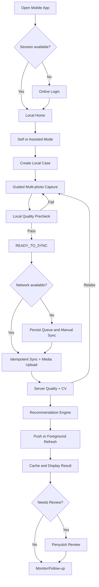
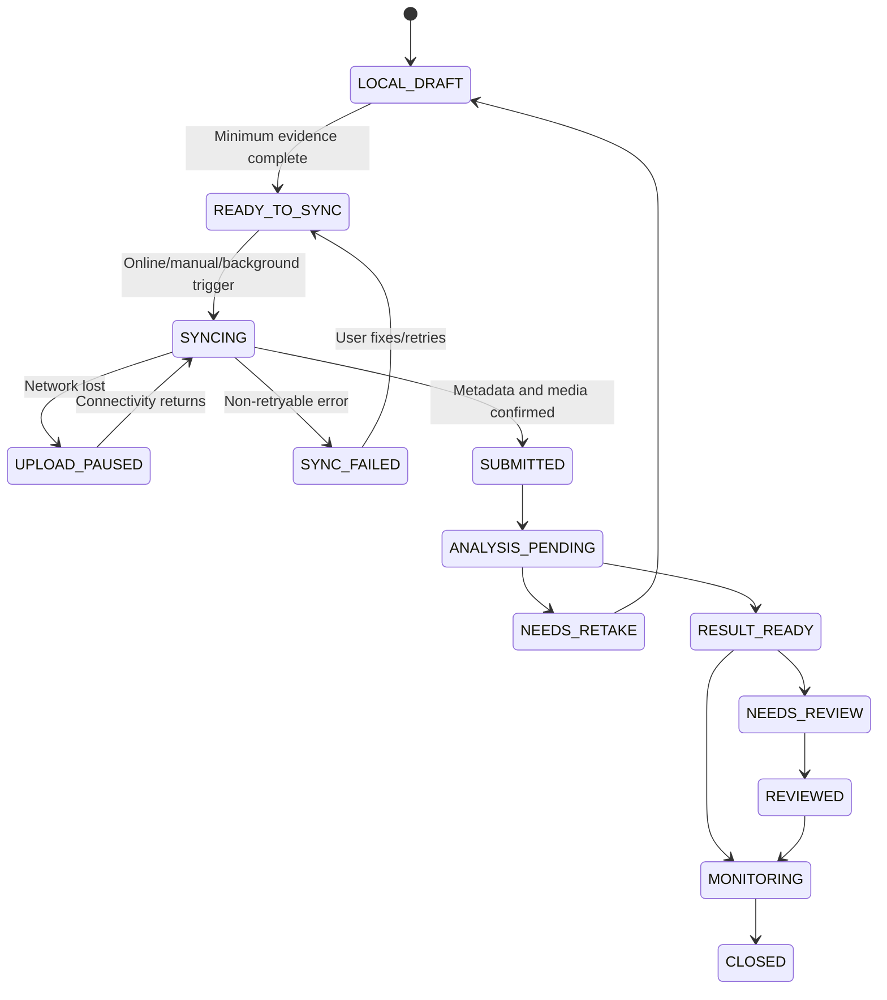
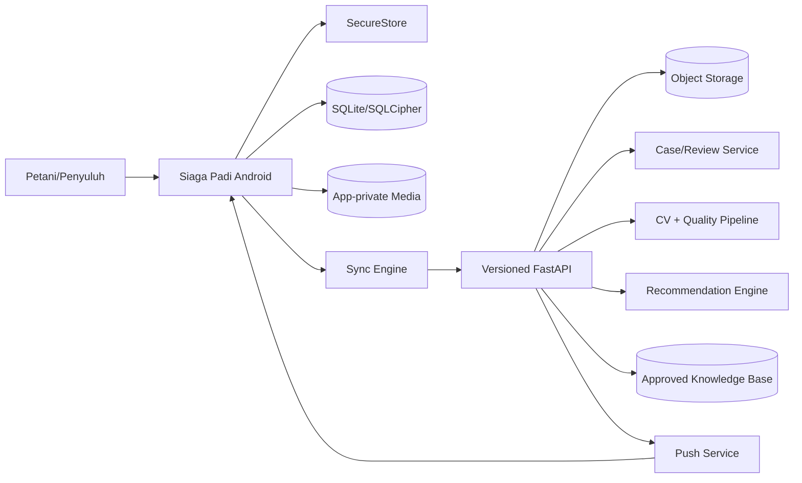
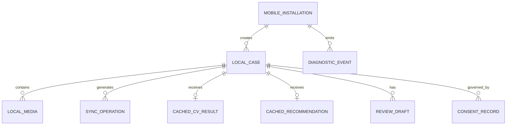

# FUNCTIONAL REQUIREMENTS DOCUMENT (FRD)

## SIAGA PADI — MOBILE ANDROID MVP UNTUK INSPEKSI LAPANGAN OFFLINE-FIRST

> **Document ID:** `FRD-SIPADI-MOBILE-001`  
> **Versi:** `0.1.0`  
> **Status:** Draft for Review  
> **Baseline keputusan:** 18 Juli 2026  
> **Target Release:** Phase 2 Mobile Android MVP; tanggal kickoff dan release final TBD  
>
> Dokumen ini menjadi baseline fungsional, data, AI integration, offline-first, keamanan, testing, distribusi, dan operasional untuk aplikasi native **Siaga Padi Mobile Android**. Dokumen dapat disusun sebelum Web/PWA selesai karena FRD adalah alat perencanaan; implementasi mobile tetap harus menjaga kompatibilitas dengan backend contract dan keputusan domain yang sama.
>
> **Hubungan dengan Web/PWA:** `FRD-SIPADI-WEB-001` mengatur channel Web/PWA. Dokumen ini mengatur channel native Android. Keduanya menggunakan backend API, entity ID, model CV, Recommendation Engine, knowledge base, role, audit, dan aturan keselamatan yang sama, tetapi memiliki UI, permission, storage, offline sync, background processing, distribution, dan UAT yang berbeda.
>
> **Batas keselamatan:** Computer Vision memberikan indikasi awal. Recommendation Engine menjelaskan output berbasis evidence. Aplikasi tidak menggantikan diagnosis POPT, penyuluh, agronomist, atau pemeriksaan laboratorium.
>
> **Keputusan eksplisit:** Hermes Agent dan 9Router tidak digunakan pada aplikasi, backend, development dependency, maupun release plan Siaga Padi.

---

# 0. Kontrol Dokumen

| Atribut | Nilai |
|---|---|
| Nama Project | `Siaga Padi` |
| Nama Objective / Modul | `Mobile Android MVP — Offline-first Field Inspection` |
| Document ID | `FRD-SIPADI-MOBILE-001` |
| Versi | `0.1.0` |
| Status | `Draft for Review` |
| Prioritas | `Must` |
| Target Release | `Phase 2 / 6 minggu setelah kickoff` |
| Tanggal Dibuat | `2026-07-18` |
| Terakhir Diperbarui | `2026-07-18` |
| Project Co-owner | `Fahri Alfiansyah; Chelsa Rachel Wibowo` |
| Product Owner | `Fahri Alfiansyah` |
| Mobile/Web/API Technical Owner | `Fahri Alfiansyah` |
| Computer Vision & Dataset Owner | `Chelsa Rachel Wibowo` |
| Penulis | `Fahri Alfiansyah; Chelsa Rachel Wibowo` |
| Reviewer Mobile/Product | `Chelsa Rachel Wibowo` |
| Reviewer CV/Data | `Fahri Alfiansyah` |
| Domain Reviewer | `Penyuluh/POPT/agronomist pilot — TBD` |
| Privacy/Security Reviewer | `TBD sebelum external pilot` |
| Klasifikasi Dokumen | `Internal / Terbatas sampai sign-off pilot` |
| Dokumen Terkait | `FRD-SIPADI-WEB-001; API Spec; Dataset Card; Model Card; KB Catalog; Mobile UX; Mobile UAT Plan; Privacy Policy` |

## 0.1 Riwayat Revisi

| Versi | Tanggal | Penulis | Bagian yang Diubah | Ringkasan Perubahan |
|---|---|---|---|---|
| 0.1.0 | 2026-07-18 | Fahri & Chelsa | Initial | Baseline Mobile Android MVP, offline-first, guided camera, sync, shared AI backend, privacy, dan Play readiness |
| 0.2.0 | TBD | Project Team | Setelah architecture spike | Finalisasi package, local encryption, upload protocol, map, dan device matrix |
| 1.0.0 | TBD | Project Team | Approved baseline | Siap development dan UAT mobile pilot |

## 0.2 Persetujuan

| Role | Nama | Status | Tanggal | Catatan |
|---|---|---|---|---|
| Product Owner | Fahri Alfiansyah | Pending | — | Scope dan outcome |
| Mobile/API Technical Owner | Fahri Alfiansyah | Pending | — | Arsitektur mobile, backend contract, release |
| CV & Dataset Owner | Chelsa Rachel Wibowo | Pending | — | Quality gate, CV integration, model evaluation |
| Domain Reviewer | TBD | Pending | — | Capture protocol dan rekomendasi |
| Pilot Representative | TBD | Pending | — | Petani/penyuluh |
| Privacy/Security Reviewer | TBD | Pending | — | Local data, consent, Play declaration |

---

# 1. Ringkasan Objective

## 1.1 Nama Objective

`Menyediakan aplikasi Android offline-first untuk guided inspection penyakit padi, sinkronisasi evidence, analisis CV dan rekomendasi berbasis backend, serta workflow review penyuluh di lapangan.`

## 1.2 Ringkasan Singkat

Siaga Padi Mobile Android adalah aplikasi native yang mengoptimalkan pekerjaan lapangan yang tidak nyaman dilakukan melalui browser: guided multi-photo capture, local draft, app-private media storage, durable sync queue, resumable upload, push notification, field visit mode, dan penyuluh review dari smartphone.

Aplikasi dirancang **offline-first**, bukan offline-only. Pengguna dapat membuat case, mengisi data minimum, mengambil foto, menjalankan precheck kualitas lokal, dan menyimpan draft tanpa internet. Disease classification utama, server quality validation, dan AI Recommendation and Explanation Engine tetap berjalan di backend. Saat offline, aplikasi menampilkan status `MENUNGGU SINKRONISASI/ANALISIS`, bukan menghasilkan diagnosis palsu.

Mobile MVP bersifat **Android-first** dengan React Native + Expo. Expo SDK 57 menggunakan React Native 0.86, target Android API 36, dan mendukung Android 7+, tetapi baseline produk menetapkan minimum tested Android 8/API 26 untuk menjaga cakupan perangkat lama sambil membatasi kompleksitas QA. Release setelah 31 Agustus 2026 harus menargetkan Android 16/API 36 sesuai kebijakan Google Play. [REF-006][REF-018]

## 1.3 Problem Statement

### Kondisi saat ini

Web/PWA dapat membuktikan workflow dan model, tetapi penggunaan di sawah menghadapi keterbatasan browser: lifecycle kamera, penyimpanan file, offline draft, background sync, push, dan kontrol distribusi tidak sekuat aplikasi native. Di sisi lain, konektivitas desa belum merata. Pemerintah masih menargetkan ribuan desa belum terhubung internet pada 2026, sehingga mobile app tidak boleh mengasumsikan koneksi selalu tersedia. [REF-002][REF-003]

BPS mencatat penetrasi internet dan telepon seluler Indonesia meningkat, tetapi akses tidak identik dengan koneksi stabil di lokasi sawah. Karena itu, smartphone layak sebagai perangkat utama, sementara data layer harus dirancang offline-first. [REF-001][REF-014]

Kementan pada 2026 aktif memperkuat literasi digital penyuluh, sehingga penyuluh relevan sebagai pengguna operasional, reviewer, dan pendamping petani. [REF-004][REF-005]

### Masalah utama

1. Evidence visual sering tidak cukup karena pengguna mengambil satu foto bebas.
2. Draft dan foto berisiko hilang ketika browser ditutup atau koneksi berubah.
3. Upload foto besar mudah gagal pada jaringan tidak stabil.
4. Pengguna lapangan membutuhkan status sinkronisasi yang jelas.
5. Permission kamera/lokasi dapat menurunkan kepercayaan bila diminta tanpa konteks.
6. Background task mobile tidak dijamin berjalan segera oleh OS.
7. Device Android beragam dalam kamera, memori, vendor battery optimization, dan OS.
8. Data foto, lokasi, dan identitas dapat tersimpan di perangkat yang hilang/dipinjam.
9. Aplikasi mobile harus memenuhi target API, Data safety, privacy policy, dan account deletion sebelum public release.

### Dampak

- Pemeriksaan perlu diulang karena evidence hilang atau tidak tersinkron.
- Penyuluh tidak dapat memproses kasus tepat waktu.
- Pengguna menerima kesan bahwa aplikasi gagal tanpa tahu apakah data aman.
- Data sensitif dapat bocor melalui notification, logs, galeri publik, atau storage plaintext.
- Public release dapat ditolak jika kebijakan Play tidak dipenuhi.

## 1.4 Proposed Solution

1. Android app dengan dua mode: `Periksa Lahan Saya` dan `Dampingi Petani`.
2. Guided multi-photo: rumpun, daun, close-up gejala, konteks sawah opsional.
3. Local image-quality precheck dan kompresi sebelum upload.
4. SQLite sebagai local source of truth; file berada di app-private storage.
5. Durable sync queue dengan client UUID, idempotency, checksum, retry, dan conflict handling.
6. Server CV dan Recommendation Engine yang sama dengan Web/PWA.
7. Push hanya sebagai sinyal; app mengambil data resmi dari API.
8. Penyuluh review dan follow-up dari mobile.
9. Permission in-context; tanpa background location.
10. Privacy center, dataset consent terpisah, account deletion readiness.
11. Target Android API 36 dan release pipeline yang dapat diaudit.

## 1.5 Nilai yang Dihasilkan

| Penerima Manfaat | Nilai / Outcome |
|---|---|
| Petani | Capture lebih mudah, draft tidak hilang, hasil dapat dibuka kembali, dan eskalasi penyuluh |
| Penyuluh | Assisted mode, offline case collection, review mobile, field visit list, dan follow-up |
| POPT/Agronomist | Evidence multi-angle dan metadata lebih konsisten |
| Pemerintah/kelompok tani | Data lapangan lebih terstruktur tanpa continuous tracking |
| Tim Siaga Padi | Produk AI lapangan end-to-end dengan offline-first, privacy, MLOps, dan mobile engineering |

---

# 2. Tujuan, Outcome, dan Indikator Keberhasilan

## 2.1 Tujuan Utama

1. Pengguna dapat membuat case dan mengambil evidence wajib tanpa internet.
2. Draft dan foto tetap tersedia setelah app ditutup atau perangkat restart.
3. Sync tidak menghasilkan duplikasi walaupun request diulang.
4. Foto tidak layak diberi feedback lokal sebelum pengguna meninggalkan lahan.
5. Hasil server dapat diterima melalui refresh atau push tanpa app harus tetap terbuka.
6. Penyuluh dapat membuat assisted case dan draft review offline.
7. Permission dan data sensitif mengikuti prinsip minimization.
8. Build siap menargetkan Android API 36 dan jalur Play compliance.

## 2.2 Non-Goals

- iOS pada Mobile MVP pertama.
- Disease classifier utama on-device.
- LLM/VLM on-device.
- Continuous/background GPS tracking.
- Exact alarm, SMS reading, contacts, microphone, Bluetooth, atau storage-all-files permission.
- Drone/IoT integration.
- Full offline map seluruh Indonesia.
- Chatbot pertanian terbuka.
- Hermes Agent dan 9Router.
- Automatic pesticide dosage/brand recommendation.

## 2.3 Business Outcome

| Outcome ID | Outcome | Kondisi Awal | Target Mobile MVP | Cara Mengukur |
|---|---|---:|---:|---|
| BO-MOB-001 | Case lapangan dapat dibuat offline | Tidak ada native workflow | 100% happy-path capture dapat selesai offline | UAT/network simulation |
| BO-MOB-002 | Draft recovery | Berisiko hilang | ≥ 99% pada crash/restart test | Automated/device test |
| BO-MOB-003 | Successful eventual sync | Belum ada durable queue | ≥ 95% setelah koneksi kembali tanpa intervensi; 100% dengan manual retry pada test | Sync logs |
| BO-MOB-004 | Duplicate prevention | Belum ada | 100% idempotent test | Backend audit |
| BO-MOB-005 | Guided capture completion | Satu foto bebas | ≥ 80% pengguna pilot menyelesaikan minimum slot | Analytics/UAT |
| BO-MOB-006 | Penyuluh mobile review | Desktop/web only | ≥ 90% UAT scenario selesai | UAT |
| BO-MOB-007 | Permission fallback | Tidak formal | 100% kamera/lokasi/notifikasi punya fallback | Permission tests |

## 2.4 Product KPI

| KPI ID | Metrik | Definisi | Target | Sumber |
|---|---|---|---:|---|
| KPI-MOB-001 | Offline case completion | Case mencapai READY_TO_SYNC saat offline / case dimulai offline | ≥ 80% | Mobile analytics |
| KPI-MOB-002 | First capture acceptance | Foto pertama lolos local precheck | ≥ 55% baseline awal | Quality logs |
| KPI-MOB-003 | Retake success | Foto lolos setelah feedback | ≥ 75% | Quality logs |
| KPI-MOB-004 | Sync queue success | Operation success / operation eligible | ≥ 95% otomatis | Sync metrics |
| KPI-MOB-005 | Manual retry recovery | Failed case berhasil setelah Retry | ≥ 90% | Sync metrics |
| KPI-MOB-006 | Crash-free sessions | Session tanpa crash | ≥ 99% internal pilot |
| KPI-MOB-007 | Review completion | Review submitted / review opened | ≥ 85% | Audit |
| KPI-MOB-008 | Permission fallback success | User tetap menyelesaikan flow dengan fallback | ≥ 80% | Analytics/UAT |

## 2.5 Technical / Operational KPI

| KPI ID | Metrik | Target |
|---|---|---:|
| TKPI-MOB-001 | Cold start p95 | ≤ 4 detik low-end; ≤ 2,5 detik mid-range |
| TKPI-MOB-002 | Local list load p95 | ≤ 500 ms untuk 1.000 case metadata |
| TKPI-MOB-003 | Local quality precheck p95 | ≤ 3 detik low-end; ≤ 1,5 detik mid-range |
| TKPI-MOB-004 | Draft autosave | ≤ 500 ms |
| TKPI-MOB-005 | Crash-free sessions | ≥ 99% internal pilot |
| TKPI-MOB-006 | Sync operation loss | 0 pada test restart/crash |
| TKPI-MOB-007 | Duplicate server entities | 0 pada idempotency suite |
| TKPI-MOB-008 | App binary | Target download estimate ≤ 80 MB; final benchmark |
| TKPI-MOB-009 | Battery | Tidak melakukan continuous location atau busy polling |
| TKPI-MOB-010 | Sensitive telemetry leak | 0 pada automated redaction tests |

## 2.6 AI / Analytics KPI

| KPI ID | Metrik | Target | Owner |
|---|---|---:|---|
| AIKPI-MOB-001 | Local unusable-image recall | ≥ 0,90 pada mobile quality set | Chelsa |
| AIKPI-MOB-002 | Local/server quality disagreement | Baseline; target ≤ 15% setelah kalibrasi | Chelsa |
| AIKPI-MOB-003 | Compression impact macro-F1 | Penurunan ≤ 0,02 dibanding original | Chelsa |
| AIKPI-MOB-004 | Device-tier performance gap | Quality latency memenuhi target tiap tier | Chelsa |
| AIKPI-MOB-005 | Result schema validity | 100% sebelum render | Fahri |
| AIKPI-MOB-006 | Recommendation citation render | 100% output actionable | Fahri |

---

# 3. Ruang Lingkup

## 3.1 In Scope

- Android native app menggunakan React Native + Expo.
- Android-first; min tested API 26, target API 36.
- Login, role, assisted usage.
- Contextual permission flow.
- Farmer/field/case local creation.
- Guided multi-photo camera capture.
- Local quality precheck dan compression.
- SQLite local source of truth.
- Offline drafts dan local history.
- Durable sync queue dan resumable media upload.
- Shared server CV inference dan AI Recommendation Engine.
- Result, citation, escalation, dan cached history.
- Penyuluh review dan follow-up.
- Push/in-app inbox.
- Field visit mode dasar.
- Privacy center dan Play readiness.
- Diagnostics, release, signing, rollback.

## 3.2 Out of Scope

- iOS release.
- On-device disease classifier sebagai production decision engine.
- On-device LLM/VLM.
- Background/continuous location.
- Full offline basemap.
- Automated WhatsApp/SMS sending.
- Multi-tenant enterprise administration penuh.
- Public Play production sebelum privacy/domain/pilot sign-off.
- APK sideload dari sumber tidak terkontrol.

## 3.3 Future Scope

| Kapabilitas | Target | Alasan Ditunda |
|---|---|---|
| On-device disease pre-screening via ONNX Runtime/ExecuTorch | Phase 3 | Perlu model compression, operator compatibility, dan device benchmark [REF-021][REF-022] |
| iOS app | Phase 3 | Prioritas pengguna dan biaya distribusi; shared architecture tetap cross-platform |
| Voice-guided inspection | Phase 2.1/3 | Perlu user validation dan audio UX |
| Full offline map pack | Phase 3 | Storage, tile license, dan update complexity |
| Background upload advanced native worker | Phase 2.1 | Expo background task tidak menjamin eksekusi segera; perlu native spike [REF-010] |
| Multilingual/local language | Phase 3 | Perlu domain copy review |
| QR farmer/field identity | Phase 3 | Perlu deployment workflow |

## 3.4 Batas Sistem

**Sistem mulai bertanggung jawab ketika:** aplikasi dibuka, pengguna login atau membuka offline session, dan membuat/membuka local case.

**Sistem berhenti bertanggung jawab ketika:** data tersinkron, analysis/recommendation diterima, review/follow-up disimpan, dan local/audit state diperbarui.

**Di luar tanggung jawab:** keakuratan GPS perangkat, availability OS background task, kualitas koneksi operator, keputusan agronomi final, dan layanan map/provider eksternal.

## 3.5 Pemisahan Web/PWA dan Mobile

| Area | Web/PWA FRD | Mobile FRD |
|---|---|---|
| UI/navigation | Browser responsive | Native Android navigation/lifecycle |
| Kamera | Browser media capture | Native guided camera flow |
| Local data | Browser storage/PWA cache | SQLite + app-private files |
| Offline | Draft/retry terbatas | Offline-first case capture + durable queue |
| Background | Service worker limitations | OS-controlled BackgroundTask; manual sync tetap wajib |
| Push | Web push optional | Native push + inbox |
| Distribution | URL/deployment | Signed APK/AAB, internal track, Play readiness |
| Permission | Browser permission | Android runtime permission lifecycle |
| Shared | API, data model, CV, LLM, KB, role, audit | API, data model, CV, LLM, KB, role, audit |

---

# 4. Stakeholder, Pengguna, dan Hak Akses

## 4.1 Stakeholder dan Pembagian Tim

| Area | Fahri Alfiansyah | Chelsa Rachel Wibowo |
|---|---|---|
| Project initiation | Co-creator & Product Co-owner | Co-creator & Product Co-owner |
| Product requirement | Product & Requirement Lead | Co-author & Technical Reviewer |
| Mobile platform | Mobile/API/Offline Architecture Lead | Mobile AI Integration Reviewer |
| Backend/API | Lead | Contributor/Reviewer |
| Computer Vision | Integration owner | CV Model Lead |
| Dataset/experiment | Pipeline contributor | Dataset & Experiment Lead |
| Local quality model | Integration/UI owner | Model/threshold owner |
| LLM recommendation | Orchestration owner | AI output reviewer |
| QA | Mobile/API/sync lead | CV/data/device-quality lead |
| Release | Android build/signing/operations lead | Model compatibility sign-off |

## 4.2 Role Pengguna

| Role | Tujuan | Kapabilitas | Batas |
|---|---|---|---|
| Petani | Memeriksa lahan sendiri | Capture, sync, result, history, request help | Data sendiri |
| Penyuluh | Mendampingi dan review | Assisted mode, assignments, review, follow-up | Wilayah/assignment |
| Admin teknis | Operasional sistem | Config, monitoring, user support | Tidak mengubah diagnosis tanpa audit |
| Domain reviewer | Validasi kasus khusus | Review/annotation terbatas | Scope yang ditugaskan |

## 4.3 Permission Matrix

| Resource/Aksi | Petani | Penyuluh | Admin | Domain Reviewer |
|---|---:|---:|---:|---:|
| Create self case | Ya | Ya | Terbatas | Tidak |
| Create assisted case | Tidak | Ya | Terbatas | Tidak |
| Capture evidence | Ya | Ya | Tidak | Tidak |
| View own/local history | Ya | Ya | Terbatas | Terbatas |
| Review/correct | Tidak | Ya | Tidak | Ya sesuai tugas |
| Manage app config | Tidak | Tidak | Ya | Tidak |
| Request account deletion | Ya | Ya | Facilitate | Ya |
| Export sensitive data | Terbatas | Terbatas | Audit required | Tidak |

## 4.4 RACI

| Aktivitas | Fahri | Chelsa | Domain Reviewer | Pilot User |
|---|---|---|---|---|
| Mobile requirement | A/R | C | C | C |
| Offline/API architecture | A/R | C | I | I |
| Camera/quality design | C/R integration | A/R model | C | C |
| CV compatibility | C | A/R | C | I |
| Recommendation safety | A/R | C | C | I |
| Device/UAT | R | R | C | A/R user validation |
| Release | A/R | C | I | I |

---

# 5. Asumsi, Batasan, dan Dependency

## 5.1 Asumsi

| ID | Asumsi | Dampak jika Salah | Validasi |
|---|---|---|---|
| ASM-MOB-001 | Mayoritas pilot memiliki Android API 26+ | Perlu menurunkan min SDK atau menyediakan web fallback | Device survey |
| ASM-MOB-002 | Backend Web/PWA dapat diekspos sebagai versioned mobile API | Rework backend | API architecture review |
| ASM-MOB-003 | Minimal 2 foto cukup untuk MVP | Capture protocol berubah | Domain pilot |
| ASM-MOB-004 | Server inference dapat diakses setelah sync | Offline result tidak tersedia | Infrastructure test |
| ASM-MOB-005 | Penyuluh bersedia assisted mode | Role flow berubah | User interview |
| ASM-MOB-006 | React Native + Expo memenuhi kebutuhan native MVP | Eject/native module spike | Sprint 0 prototype |

## 5.2 Batasan

| ID | Batasan | Dampak |
|---|---|---|
| CON-MOB-001 | Dua AI Engineer | Scope harus ketat dan reuse backend |
| CON-MOB-002 | Laptop + smartphone | Tidak self-host heavy mobile build infra/GPU |
| CON-MOB-003 | Koneksi sawah tidak stabil | Offline-first dan upload retry wajib |
| CON-MOB-004 | Background task dikontrol OS | Manual foreground sync wajib [REF-010] |
| CON-MOB-005 | Android device fragmentation | Device tier matrix dan graceful degradation |
| CON-MOB-006 | Data sensitif tersimpan lokal | Encryption/retention/remote logout planning |

## 5.3 Dependency

| ID | Dependency | Owner | Status | Fallback |
|---|---|---|---|---|
| DEP-MOB-001 | Identity API | Fahri | Open | Mock auth |
| DEP-MOB-007 | Case/API contract | Fahri | Open | Contract mock server |
| DEP-MOB-010 | Quality algorithm/model | Chelsa | Open | Deterministic checks only |
| DEP-MOB-014 | Idempotent backend | Fahri | Open | No mobile release until complete |
| DEP-MOB-015 | Resumable upload | Fahri | Open | Whole-file retry with size limit |
| DEP-MOB-017 | CV API | Chelsa/Fahri | Open | Staging mock result |
| DEP-MOB-019 | Recommendation API | Fahri | Open | Rule-based mock/fallback |
| DEP-MOB-023 | Push provider | Fahri | Open | Manual refresh/inbox |
| DEP-MOB-027 | Privacy review | Project | Open | Internal-only pilot |
| DEP-MOB-034 | Signing ownership | Project | Open | Development builds only |

## 5.4 Prasyarat Mobile MVP

- Shared backend contract versioned dan test environment tersedia.
- Android development build dapat mengakses camera, SQLite, SecureStore, location, notification.
- Client-generated UUID dan idempotency diterima server.
- Domain capture protocol minimum disepakati sementara.
- At least 3 physical Android devices tersedia untuk test awal; device cloud optional.
- Privacy copy dan assisted consent draft tersedia.
- No provider secret in mobile binary.

---

# 6. Proses Bisnis dan Workflow

## 6.1 Proses Saat Ini — As-Is

| Tahap | Aktor | Aktivitas | Masalah |
|---|---|---|---|
| 1 | Petani | Mengambil foto biasa/berkomunikasi manual | Foto tidak terstruktur |
| 2 | Penyuluh | Menerima foto/chat | Metadata/lokasi tidak konsisten |
| 3 | Pengguna | Mengulang kirim saat sinyal buruk | Duplikasi/kehilangan |
| 4 | Penyuluh | Memberi saran | Tidak selalu terdokumentasi |

## 6.2 Proses Target — To-Be

| Tahap | Aktor/Sistem | Aktivitas | Offline/Online | Output |
|---|---|---|---|---|
| 1 | User | Buat local case dan consent | Offline | LOCAL_DRAFT |
| 2 | User/App | Guided capture + local quality | Offline | READY_TO_SYNC |
| 3 | Sync Engine | Sync metadata/media | Online | SUBMITTED |
| 4 | Backend | CV + recommendation | Online server | RESULT_READY/NEEDS_REVIEW |
| 5 | App | Fetch/cache result | Online lalu offline-readable | Cached result |
| 6 | Penyuluh | Review/follow-up | Draft offline, commit online | REVIEWED/CLOSED |

## 6.3 End-to-End Workflow



## 6.4 Offline Sync Workflow



## 6.5 Trigger

| Trigger ID | Trigger | Source | Perilaku |
|---|---|---|---|
| TRG-MOB-001 | User creates case | UI | Local write |
| TRG-MOB-002 | Capture completed | Camera | Quality precheck |
| TRG-MOB-003 | Connectivity returns | OS/app | Schedule sync, not guaranteed immediate |
| TRG-MOB-004 | User taps Sync Now | UI | Foreground sync immediately |
| TRG-MOB-005 | Push signal | Push | Authenticated fetch |
| TRG-MOB-006 | Background task window | OS | Best-effort queue processing |
| TRG-MOB-007 | App resumes | Lifecycle | Refresh config, session, queue, visible resources |

## 6.6 State Transition Rules

| Rule ID | Dari | Ke | Kondisi |
|---|---|---|---|
| STR-MOB-001 | LOCAL_DRAFT | READY_TO_SYNC | Consent dan minimum evidence valid |
| STR-MOB-002 | READY_TO_SYNC | SYNCING | Session valid dan network tersedia |
| STR-MOB-003 | SYNCING | SUBMITTED | Server mengonfirmasi checksum seluruh evidence |
| STR-MOB-004 | ANALYSIS_PENDING | NEEDS_RETAKE | Server quality gate gagal |
| STR-MOB-005 | RESULT_READY | NEEDS_REVIEW | Low confidence/unknown/rule |
| STR-MOB-006 | REVIEWED | CLOSED | Follow-up selesai atau reason tercatat |

---

# 7. Konteks Sistem dan Arsitektur Fungsional

## 7.1 System Context



## 7.2 Prinsip Arsitektur

1. **Local source of truth:** semua layar membaca repository lokal; network memperbarui database lokal. [REF-014][REF-015]
2. **Offline-first:** case dan evidence dapat dibuat tanpa network.
3. **Server-authoritative setelah submit:** review/status final berasal dari server.
4. **Immutable evidence:** foto tidak dioverwrite; revision menambah evidence.
5. **Idempotent writes:** client-generated UUID dan operation ID.
6. **No secret client:** AI/provider/database secret hanya backend.
7. **Permission minimization:** foreground location saja, tanpa background tracking. [REF-016][REF-017]
8. **Background task best-effort:** manual sync adalah jalur deterministik. [REF-010]
9. **Versioned contracts:** app/config/schema/model version tercatat.
10. **Graceful degradation:** camera → gallery; location → manual; push → inbox/refresh; LLM → rule fallback.

## 7.3 Modul / Komponen Fungsional

| Module ID | Nama | Tujuan |
|---|---|---|
| MOD-MOB-001 | App Shell, Auth, Permission | Session, role, onboarding, permission |
| MOD-MOB-002 | Case & Assisted Mode | Local farmer/field/case |
| MOD-MOB-003 | Camera & Local Quality | Guided capture, precheck, compression |
| MOD-MOB-004 | Local Store & Sync | SQLite, queue, upload, conflict |
| MOD-MOB-005 | AI Result Experience | CV/recommendation fetch/cache/render |
| MOD-MOB-006 | Review & Notification | Penyuluh review, inbox, push |
| MOD-MOB-007 | Field Visit & Spatial | Assignment, map/list, offline pack |
| MOD-MOB-008 | Privacy | Consent, deletion, export |
| MOD-MOB-009 | Config & Observability | Flags, compatibility, diagnostics |
| MOD-MOB-010 | Release | Build, signing, distribution, update |

## 7.4 Technology Baseline

| Area | Baseline | Catatan |
|---|---|---|
| Framework | React Native 0.86 + Expo SDK 57 + TypeScript | Pin version after Sprint 0 [REF-006] |
| Node | 22.13.x minimum untuk SDK 57 | Development environment [REF-006] |
| Camera | expo-camera | Native camera preview/capture [REF-007] |
| Local DB | expo-sqlite; SQLCipher before external pilot | Persistent; SQLCipher requires development build [REF-008] |
| Secure token | expo-secure-store | Android Keystore-backed [REF-009] |
| Background | expo-background-task + task-manager | Deferred, OS-controlled [REF-010] |
| Location | expo-location foreground only | No background permission [REF-011] |
| Notifications | expo-notifications | Opaque payload only [REF-012] |
| Image | expo-image-manipulator | Resize/compression [REF-013] |
| API | OpenAPI-generated/typed client | Shared contract |
| Server | Existing Siaga Padi FastAPI services | Channel-agnostic |
| On-device ML future | ONNX Runtime RN or ExecuTorch | Not Mobile MVP [REF-021][REF-022] |

## 7.5 Platform Baseline

- Target Android: API 36 / Android 16 for release after 31 August 2026. [REF-018]
- Minimum product support: API 26 / Android 8.
- Expo framework support: Android 7+, tetapi API 24–25 tidak menjadi required QA baseline. [REF-006]
- Test tiers: low-end 3 GB RAM, mid 4–6 GB, high 8+ GB.
- iOS: architecture-compatible but out of scope.
- Development build required; Expo Go tidak menjadi release/runtime baseline.

---

# 8. Ringkasan Kebutuhan Fungsional

| FR ID | Nama Requirement | Modul | Owner | Priority | Release |
|---|---|---|---|---|---|
| FR-MOB-001 | Secure Authentication, Session, Role, dan Installation Registration | MOD-MOB-001 | Fahri Alfiansyah | Must | Mobile MVP |
| FR-MOB-002 | First-run Onboarding, Contextual Permissions, dan Accessibility Setup | MOD-MOB-001 | Fahri Alfiansyah | Must | Mobile MVP |
| FR-MOB-003 | Assisted Mode, Profil Petani, Lahan, dan Mobile Case Creation | MOD-MOB-002 | Fahri Alfiansyah | Must | Mobile MVP |
| FR-MOB-004 | Guided Multi-photo Camera Inspection | MOD-MOB-003 | Fahri Alfiansyah | Must | Mobile MVP |
| FR-MOB-005 | On-device Image Quality Precheck dan Image Optimization | MOD-MOB-003 | Chelsa Rachel Wibowo | Must | Mobile MVP |
| FR-MOB-006 | Offline-first Local Store, Draft, dan Local History | MOD-MOB-004 | Fahri Alfiansyah | Must | Mobile MVP |
| FR-MOB-007 | Sync Queue, Resumable Media Upload, Idempotency, dan Conflict Resolution | MOD-MOB-004 | Fahri Alfiansyah | Must | Mobile MVP |
| FR-MOB-008 | Server CV Analysis Submission, Progress, dan Result Delivery | MOD-MOB-005 | Chelsa Rachel Wibowo | Must | Mobile MVP |
| FR-MOB-009 | AI Recommendation and Explanation Mobile Experience | MOD-MOB-005 | Fahri Alfiansyah | Must | Mobile MVP |
| FR-MOB-010 | Penyuluh Review, Correction, Follow-up, dan Assisted Closure | MOD-MOB-006 | Chelsa Rachel Wibowo | Must | Mobile MVP |
| FR-MOB-011 | Push Notification, In-app Inbox, Reminder, dan Deep Link | MOD-MOB-006 | Fahri Alfiansyah | Should | Mobile MVP |
| FR-MOB-012 | Field Visit Mode, Map, Assignment, dan Offline Reference Pack | MOD-MOB-007 | Fahri Alfiansyah | Should | Mobile MVP |
| FR-MOB-013 | Privacy Center, Consent Management, Export, dan Account Deletion | MOD-MOB-008 | Fahri Alfiansyah | Must before external pilot | Mobile MVP |
| FR-MOB-014 | Remote Configuration, Feature Flags, Contract Compatibility, dan Kill Switch | MOD-MOB-009 | Fahri Alfiansyah | Must | Mobile MVP |
| FR-MOB-015 | Mobile Observability, Diagnostics, Crash Safety, dan Support Bundle | MOD-MOB-009 | Fahri Alfiansyah | Must | Mobile MVP |
| FR-MOB-016 | Android Build, Signing, Internal Distribution, Play Readiness, dan Update | MOD-MOB-010 | Fahri Alfiansyah | Must | Mobile MVP |


## 8.1 Prioritas MoSCoW

- **Must:** nilai utama, keselamatan, offline integrity, atau release blocker.
- **Should:** penting untuk pilot yang baik, tetapi fallback tersedia.
- **Could:** peningkatan pengalaman tanpa menghalangi core flow.
- **Won't for now:** dicatat untuk fase lanjutan.

---

# 9. Detail Kebutuhan Fungsional

> Seluruh requirement mobile harus diuji pada physical Android device. Emulator hanya melengkapi, bukan menggantikan camera, permission, background, storage, dan vendor battery tests.


# 9.1 FR-MOB-001 — Secure Authentication, Session, Role, dan Installation Registration

## 9.1.1 Metadata

| Field | Nilai |
|---|---|
| Requirement ID | `FR-MOB-001` |
| Nama | Secure Authentication, Session, Role, dan Installation Registration |
| Modul | MOD-MOB-001 |
| Requirement Type | Functional / Security |
| Owner | Fahri Alfiansyah |
| Priority | Must |
| Target Release | Mobile Android MVP |
| Status | Draft |
| Related Objective | OBJ-MOB-001 |
| Related API/Event | Lihat Integration Impact |

## 9.1.2 Tujuan

Memberikan akses aman kepada petani, penyuluh, dan admin serta mengikat sesi ke instalasi aplikasi tanpa memakai hardware identifier yang invasif.

## 9.1.3 User Story

> Sebagai pengguna Siaga Padi, saya ingin masuk secara aman dan tetap dapat membuka data lokal yang diizinkan ketika jaringan tidak stabil, sehingga pekerjaan lapangan tidak terhenti.

## 9.1.4 Requirement Statement

> Sistem harus menyediakan autentikasi berbasis token, penyimpanan credential yang aman, role-aware navigation, session expiry, logout, dan installation registration.

## 9.1.5 Actor

- Petani
- Penyuluh
- Admin
- Identity/API Service
- Mobile App

## 9.1.6 Preconditions

1. Aplikasi terpasang dari build yang sah.
2. Backend identity tersedia untuk login pertama.
3. Perangkat memiliki secure storage yang dapat digunakan.

## 9.1.7 Trigger

Aksi pengguna, lifecycle aplikasi, perubahan konektivitas, push signal, atau background task yang relevan dengan requirement ini.

## 9.1.8 Input

| Field | Tipe | Wajib | Deskripsi |
|---|---|---|---|
| email_or_phone | string | Ya | Identifier akun; MVP dapat membatasi email/nomor yang diundang. |
| password_or_otp | string | Ya | Credential sesuai metode yang dipilih. |
| installation_id | UUID | Ya | Dibuat aplikasi; bukan IMEI/serial perangkat. |
| app_version | string | Ya | Versi aplikasi dan build number. |
| device_platform | enum | Ya | android pada MVP. |

## 9.1.9 Business Rules

| Rule ID | Aturan |
|---|---|
| BR-001-01 | Token akses dan refresh token hanya boleh disimpan di SecureStore, bukan SQLite biasa atau log. |
| BR-001-02 | Mobile tidak boleh menyimpan API key Groq, object storage, database, atau provider AI. |
| BR-001-03 | Role berasal dari server dan tidak boleh dapat diubah melalui client. |
| BR-001-04 | Login pertama memerlukan internet; setelah itu pengguna dapat melihat data lokal yang sudah tersinkron sesuai kebijakan offline. |
| BR-001-05 | Logout menghapus token, subscription push, dan data sensitif lokal sesuai pilihan keamanan; draft belum sinkron harus diperingatkan. |
| BR-001-06 | Installation ID harus dapat dirotasi saat reinstall atau security reset. |

## 9.1.10 Main Flow

1. Pengguna membuka aplikasi.
2. Aplikasi memeriksa secure session dan minimum supported version.
3. Jika sesi valid, aplikasi mengambil role dan membuka home sesuai role.
4. Jika belum login, pengguna memasukkan credential.
5. Backend memvalidasi credential dan mengembalikan token serta profil minimum.
6. Aplikasi menyimpan token di SecureStore dan membuat/mendaftarkan installation ID.
7. Aplikasi mengunduh konfigurasi minimum, permission scope, dan data referensi.
8. Audit login dan installation registration dicatat.

## 9.1.11 Alternative Flow

### AF-01

Jika offline tetapi sesi lokal belum kedaluwarsa, aplikasi membuka mode offline terbatas.

### AF-02

Jika petani tidak memiliki akun, penyuluh dapat menggunakan Assisted Mode tanpa membuat sesi petani.

### AF-03

Jika biometric unlock tersedia, pengguna boleh mengaktifkannya sebagai local app lock; bukan pengganti autentikasi server.

## 9.1.12 Exception dan Error Flow

| Error ID | Kondisi | Respons Sistem | Recovery |
|---|---|---|---|
| MOB-AUTH-001 | Credential salah | Tampilkan pesan generik; jangan mengungkap akun terdaftar. | Retry/Manual sesuai kondisi |
| MOB-AUTH-002 | Token kedaluwarsa saat offline | Izinkan akses hanya ke draft lokal yang aman; blok aksi server. | Retry/Manual sesuai kondisi |
| MOB-AUTH-003 | SecureStore gagal | Blok penyimpanan sesi dan minta login ulang setelah perbaikan. | Retry/Manual sesuai kondisi |
| MOB-AUTH-004 | Versi aplikasi tidak didukung | Tampilkan mandatory update atau read-only sesuai remote config. | Retry/Manual sesuai kondisi |

## 9.1.13 Output

| Output | Format | Consumer | Retensi |
|---|---|---|---|
| AuthenticatedSession | JSON/UI/Local entity | Mobile user/backend | Sesuai retention |
| InstallationRegistration | JSON/UI/Local entity | Mobile user/backend | Sesuai retention |
| RoleNavigationState | JSON/UI/Local entity | Mobile user/backend | Sesuai retention |
| SecurityAuditEvent | JSON/UI/Local entity | Mobile user/backend | Sesuai retention |

## 9.1.14 Postconditions

- Output AuthenticatedSession tercatat atau ditampilkan sesuai flow.
- Output InstallationRegistration tercatat atau ditampilkan sesuai flow.
- Output RoleNavigationState tercatat atau ditampilkan sesuai flow.
- Output SecurityAuditEvent tercatat atau ditampilkan sesuai flow.

## 9.1.15 UI / UX Requirements

- Login satu layar dengan ukuran kontrol minimum 48dp.
- Pesan offline dan session-expired harus jelas.
- Tidak menampilkan detail teknis error autentikasi.
- Dukungan show/hide password dan autofill yang aman.
- Loading, empty, success, validation error, system error, offline, stale, no-permission, dan conflict state wajib tersedia.
- Semua aksi destruktif atau irreversible memerlukan confirmation.

## 9.1.16 Permission dan Data Access

| Aksi | Permission | Scope |
|---|---|---|
| View | mod-mob-001.read | Sesuai role/scope |
| Create/Update | mod-mob-001.write | Data sendiri/assignment |
| Approve/Review | mod-mob-001.review | Penyuluh dalam scope |
| Admin | mod-mob-001.admin | Admin terbatas |

## 9.1.17 Data Impact

- Membaca User, Role, AppConfig.
- Membuat/ubah MobileInstallation dan PushSubscription.
- Menyimpan token hanya di SecureStore.

## 9.1.18 Integration Impact

| Integration ID | Arah | Endpoint/Komponen | Authentication | Reliability |
|---|---|---|---|---|
| INT-001-01 | Outbound/Inbound | POST /api/v1/auth/login | OAuth2/Bearer atau native API | Idempotent/retry sesuai contract |
| INT-001-02 | Outbound/Inbound | POST /api/v1/auth/refresh | OAuth2/Bearer atau native API | Idempotent/retry sesuai contract |
| INT-001-03 | Outbound/Inbound | POST /api/v1/mobile/installations | OAuth2/Bearer atau native API | Idempotent/retry sesuai contract |
| INT-001-04 | Outbound/Inbound | POST /api/v1/auth/logout | OAuth2/Bearer atau native API | Idempotent/retry sesuai contract |

## 9.1.19 Audit dan Observability

**Audit/log minimum**

- Actor/user ID pseudonymous bila cukup.
- Installation ID dan app version.
- Action, resource ID, timestamp, correlation ID, result/error code.
- Nilai sensitif, token, foto, precise location, dan free-text tidak masuk log umum.

**Metrics**

- login_success_rate
- login_failure_reason
- session_refresh_latency
- offline_session_open_count

**Alerts**

- Lonjakan failure rate di atas threshold.
- Queue age atau crash rate melewati batas.
- Schema/config incompatibility.
- Indikasi data sensitif masuk telemetry.

## 9.1.20 Non-Functional Requirement Khusus

| NFR ID | Kategori | Requirement |
|---|---|---|
| NFR-001-01 | Requirement | Login online p95 ≤ 4 detik pada koneksi stabil. |
| NFR-001-02 | Requirement | Tidak ada credential atau token pada analytics/crash log. |
| NFR-001-03 | Requirement | Brute-force dan rate limit ditangani backend. |

## 9.1.21 Acceptance Criteria

### AC-001-01

```gherkin
Given kondisi awal dan permission sesuai skenario
When pengguna atau sistem menjalankan flow terkait
Then Login valid mengarahkan pengguna ke home sesuai role.
And state lokal serta audit/metric diperbarui tanpa silent failure
```

### AC-001-02

```gherkin
Given kondisi awal dan permission sesuai skenario
When pengguna atau sistem menjalankan flow terkait
Then Role tidak dapat diubah dari client.
And state lokal serta audit/metric diperbarui tanpa silent failure
```

### AC-001-03

```gherkin
Given kondisi awal dan permission sesuai skenario
When pengguna atau sistem menjalankan flow terkait
Then Token tidak tersimpan pada SQLite atau log.
And state lokal serta audit/metric diperbarui tanpa silent failure
```

### AC-001-04

```gherkin
Given kondisi awal dan permission sesuai skenario
When pengguna atau sistem menjalankan flow terkait
Then Mode offline terbatas tidak mengizinkan operasi server.
And state lokal serta audit/metric diperbarui tanpa silent failure
```

## 9.1.22 Test Data

| Test Data ID | Kondisi | Expected Use |
|---|---|---|
| TD-001-01 | Credential valid/invalid | Menjalankan happy/error/boundary test |
| TD-001-02 | Refresh token expired | Menjalankan happy/error/boundary test |
| TD-001-03 | SecureStore unavailable | Menjalankan happy/error/boundary test |
| TD-001-04 | Offline after previous login | Menjalankan happy/error/boundary test |
| TD-001-05 | Mandatory update | Menjalankan happy/error/boundary test |

## 9.1.23 Definition of Done

- Requirement dan acceptance criteria disetujui.
- UI semua state utama tersedia.
- Implementasi mobile dan contract backend selesai.
- Unit, integration, offline/sync, permission, dan device tests lulus.
- Security/privacy test relevan lulus.
- Telemetry telah disanitasi.
- Tidak ada defect blocker/critical.
- UAT role terkait lulus.

## 9.1.24 Dependency dan Open Questions

**Dependency**

- DEP-MOB-001 Identity API
- DEP-MOB-002 SecureStore
- DEP-MOB-003 Remote Config

**Open questions**

| Question ID | Pertanyaan | Owner | Status |
|---|---|---|---|
| OQ-001-01 | Metode login final: email-password, phone OTP, atau invite code? | Fahri Alfiansyah | Open |
| OQ-001-02 | Apakah biometric app lock masuk MVP atau Should? | Fahri Alfiansyah | Open |

---

# 9.2 FR-MOB-002 — First-run Onboarding, Contextual Permissions, dan Accessibility Setup

## 9.2.1 Metadata

| Field | Nilai |
|---|---|
| Requirement ID | `FR-MOB-002` |
| Nama | First-run Onboarding, Contextual Permissions, dan Accessibility Setup |
| Modul | MOD-MOB-001 |
| Requirement Type | Functional / Privacy / Accessibility |
| Owner | Fahri Alfiansyah |
| Priority | Must |
| Target Release | Mobile Android MVP |
| Status | Draft |
| Related Objective | OBJ-MOB-001 |
| Related API/Event | Lihat Integration Impact |

## 9.2.2 Tujuan

Menjelaskan fungsi aplikasi dan meminta kamera, lokasi, serta notifikasi hanya ketika fitur terkait digunakan.

## 9.2.3 User Story

> Sebagai petani atau penyuluh, saya ingin memahami alasan aplikasi meminta akses perangkat, sehingga saya dapat memutuskan dengan sadar dan tetap memakai alternatif bila izin ditolak.

## 9.2.4 Requirement Statement

> Sistem harus menyediakan onboarding singkat, permission education, contextual permission requests, dan pengaturan aksesibilitas dasar.

## 9.2.5 Actor

- Petani
- Penyuluh
- Android Permission System
- Mobile App

## 9.2.6 Preconditions

1. Aplikasi dibuka pertama kali atau permission belum diputuskan.

## 9.2.7 Trigger

Aksi pengguna, lifecycle aplikasi, perubahan konektivitas, push signal, atau background task yang relevan dengan requirement ini.

## 9.2.8 Input

| Field | Tipe | Wajib | Deskripsi |
|---|---|---|---|
| preferred_language | enum | Ya | Bahasa Indonesia pada MVP; bahasa daerah future. |
| text_scale_mode | enum | Tidak | Normal atau besar. |
| camera_permission | permission | Kondisional | Diminta saat membuka kamera. |
| foreground_location_permission | permission | Kondisional | Diminta saat menyimpan titik lahan. |
| notification_permission | permission | Kondisional | Diminta setelah manfaat dijelaskan. |

## 9.2.9 Business Rules

| Rule ID | Aturan |
|---|---|
| BR-002-01 | Tidak meminta seluruh permission pada launch pertama. |
| BR-002-02 | Tidak meminta background location. |
| BR-002-03 | Lokasi harus tetap dapat diisi manual bila permission ditolak. |
| BR-002-04 | Foto dapat dipilih dari galeri bila kamera ditolak, dengan keterbatasan evidence ditampilkan. |
| BR-002-05 | Notifikasi bukan syarat menyelesaikan kasus. |
| BR-002-06 | Warna tidak boleh menjadi satu-satunya pembeda status. |

## 9.2.10 Main Flow

1. Aplikasi menampilkan tiga kartu onboarding: fungsi, batas AI, dan privasi.
2. Pengguna memilih ukuran teks.
3. Saat membuka capture, aplikasi menjelaskan kebutuhan kamera lalu memanggil dialog sistem.
4. Saat menyimpan lokasi, aplikasi menjelaskan foreground location lalu memanggil dialog sistem.
5. Saat hasil pertama diproses, aplikasi menawarkan notifikasi hasil.
6. Pilihan disimpan lokal dan dapat diubah di Settings.

## 9.2.11 Alternative Flow

### AF-01

Pengguna melewati onboarding dan membacanya kembali dari Bantuan.

### AF-02

Permission denied once: tampilkan alternatif tanpa memaksa.

### AF-03

Permission denied permanently: tampilkan langkah membuka Settings hanya setelah pengguna mencoba fitur terkait.

## 9.2.12 Exception dan Error Flow

| Error ID | Kondisi | Respons Sistem | Recovery |
|---|---|---|---|
| MOB-PERM-001 | Camera denied | Tawarkan galeri atau batal. | Retry/Manual sesuai kondisi |
| MOB-PERM-002 | Location denied | Tawarkan pemilihan desa/lahan manual. | Retry/Manual sesuai kondisi |
| MOB-PERM-003 | Notification denied | Gunakan in-app status dan manual refresh. | Retry/Manual sesuai kondisi |
| MOB-PERM-004 | Permission state tidak konsisten | Sinkronkan ulang state dari OS. | Retry/Manual sesuai kondisi |

## 9.2.13 Output

| Output | Format | Consumer | Retensi |
|---|---|---|---|
| OnboardingState | JSON/UI/Local entity | Mobile user/backend | Sesuai retention |
| PermissionDecision | JSON/UI/Local entity | Mobile user/backend | Sesuai retention |
| AccessibilityPreference | JSON/UI/Local entity | Mobile user/backend | Sesuai retention |

## 9.2.14 Postconditions

- Output OnboardingState tercatat atau ditampilkan sesuai flow.
- Output PermissionDecision tercatat atau ditampilkan sesuai flow.
- Output AccessibilityPreference tercatat atau ditampilkan sesuai flow.

## 9.2.15 UI / UX Requirements

- Bahasa sederhana dan maksimal tiga ide per layar.
- Ikon disertai label.
- Kontrol dapat digunakan screen reader.
- Target sentuh minimum 48dp dan dukungan dynamic text tanpa clipping.
- Loading, empty, success, validation error, system error, offline, stale, no-permission, dan conflict state wajib tersedia.
- Semua aksi destruktif atau irreversible memerlukan confirmation.

## 9.2.16 Permission dan Data Access

| Aksi | Permission | Scope |
|---|---|---|
| View | mod-mob-001.read | Sesuai role/scope |
| Create/Update | mod-mob-001.write | Data sendiri/assignment |
| Approve/Review | mod-mob-001.review | Penyuluh dalam scope |
| Admin | mod-mob-001.admin | Admin terbatas |

## 9.2.17 Data Impact

- Menyimpan preference lokal; permission truth tetap berasal dari OS.
- Tidak mengunggah permission history selain event agregat minimum.

## 9.2.18 Integration Impact

| Integration ID | Arah | Endpoint/Komponen | Authentication | Reliability |
|---|---|---|---|---|
| INT-002-01 | Outbound/Inbound | Android runtime permissions | OAuth2/Bearer atau native API | Idempotent/retry sesuai contract |
| INT-002-02 | Outbound/Inbound | expo-camera | OAuth2/Bearer atau native API | Idempotent/retry sesuai contract |
| INT-002-03 | Outbound/Inbound | expo-location | OAuth2/Bearer atau native API | Idempotent/retry sesuai contract |
| INT-002-04 | Outbound/Inbound | expo-notifications | OAuth2/Bearer atau native API | Idempotent/retry sesuai contract |

## 9.2.19 Audit dan Observability

**Audit/log minimum**

- Actor/user ID pseudonymous bila cukup.
- Installation ID dan app version.
- Action, resource ID, timestamp, correlation ID, result/error code.
- Nilai sensitif, token, foto, precise location, dan free-text tidak masuk log umum.

**Metrics**

- onboarding_completion
- permission_grant_rate
- permission_denial_fallback_success
- large_text_usage

**Alerts**

- Lonjakan failure rate di atas threshold.
- Queue age atau crash rate melewati batas.
- Schema/config incompatibility.
- Indikasi data sensitif masuk telemetry.

## 9.2.20 Non-Functional Requirement Khusus

| NFR ID | Kategori | Requirement |
|---|---|---|
| NFR-002-01 | Requirement | Onboarding dapat selesai ≤ 2 menit. |
| NFR-002-02 | Requirement | Tidak ada dark pattern atau permission blocking yang tidak perlu. |

## 9.2.21 Acceptance Criteria

### AC-002-01

```gherkin
Given kondisi awal dan permission sesuai skenario
When pengguna atau sistem menjalankan flow terkait
Then Kamera diminta saat pengguna memilih Ambil Foto, bukan saat app launch.
And state lokal serta audit/metric diperbarui tanpa silent failure
```

### AC-002-02

```gherkin
Given kondisi awal dan permission sesuai skenario
When pengguna atau sistem menjalankan flow terkait
Then Lokasi manual tersedia bila izin lokasi ditolak.
And state lokal serta audit/metric diperbarui tanpa silent failure
```

### AC-002-03

```gherkin
Given kondisi awal dan permission sesuai skenario
When pengguna atau sistem menjalankan flow terkait
Then Aplikasi tetap dapat digunakan tanpa notifikasi.
And state lokal serta audit/metric diperbarui tanpa silent failure
```

### AC-002-04

```gherkin
Given kondisi awal dan permission sesuai skenario
When pengguna atau sistem menjalankan flow terkait
Then Large text tidak memotong CTA utama.
And state lokal serta audit/metric diperbarui tanpa silent failure
```

## 9.2.22 Test Data

| Test Data ID | Kondisi | Expected Use |
|---|---|---|
| TD-002-01 | First launch | Menjalankan happy/error/boundary test |
| TD-002-02 | Each permission grant/deny/never ask again | Menjalankan happy/error/boundary test |
| TD-002-03 | Large font | Menjalankan happy/error/boundary test |
| TD-002-04 | TalkBack navigation | Menjalankan happy/error/boundary test |
| TD-002-05 | No GPS hardware | Menjalankan happy/error/boundary test |

## 9.2.23 Definition of Done

- Requirement dan acceptance criteria disetujui.
- UI semua state utama tersedia.
- Implementasi mobile dan contract backend selesai.
- Unit, integration, offline/sync, permission, dan device tests lulus.
- Security/privacy test relevan lulus.
- Telemetry telah disanitasi.
- Tidak ada defect blocker/critical.
- UAT role terkait lulus.

## 9.2.24 Dependency dan Open Questions

**Dependency**

- DEP-MOB-004 UX copy tervalidasi
- DEP-MOB-005 Android permissions

**Open questions**

| Question ID | Pertanyaan | Owner | Status |
|---|---|---|---|
| OQ-002-01 | Apakah bahasa Jawa/Sunda masuk pilot tertentu? | Fahri Alfiansyah | Open |
| OQ-002-02 | Apakah audio onboarding diperlukan untuk MVP? | Fahri Alfiansyah | Open |

---

# 9.3 FR-MOB-003 — Assisted Mode, Profil Petani, Lahan, dan Mobile Case Creation

## 9.3.1 Metadata

| Field | Nilai |
|---|---|
| Requirement ID | `FR-MOB-003` |
| Nama | Assisted Mode, Profil Petani, Lahan, dan Mobile Case Creation |
| Modul | MOD-MOB-002 |
| Requirement Type | Functional / Data |
| Owner | Fahri Alfiansyah |
| Priority | Must |
| Target Release | Mobile Android MVP |
| Status | Draft |
| Related Objective | OBJ-MOB-001 |
| Related API/Event | Lihat Integration Impact |

## 9.3.2 Tujuan

Memungkinkan petani membuat kasus sendiri dan penyuluh membuat kasus untuk petani yang didampingi, termasuk saat offline.

## 9.3.3 User Story

> Sebagai penyuluh, saya ingin membuat pemeriksaan untuk petani tanpa mengharuskan petani memiliki akun, sehingga pendampingan lapangan tetap sederhana.

## 9.3.4 Requirement Statement

> Sistem harus menyediakan mode Periksa Lahan Saya dan Dampingi Petani, profil minimum, pilihan lahan, consent, serta client-generated case ID.

## 9.3.5 Actor

- Petani
- Penyuluh
- Mobile App
- Case API

## 9.3.6 Preconditions

1. Pengguna login atau memiliki sesi offline yang diizinkan.
2. Referensi minimum desa/kecamatan tersedia lokal.

## 9.3.7 Trigger

Aksi pengguna, lifecycle aplikasi, perubahan konektivitas, push signal, atau background task yang relevan dengan requirement ini.

## 9.3.8 Input

| Field | Tipe | Wajib | Deskripsi |
|---|---|---|---|
| mode | enum | Ya | SELF atau ASSISTED. |
| farmer_name_or_alias | string | Kondisional | Wajib di Assisted Mode; alias diperbolehkan. |
| farmer_contact | string | Tidak | Hanya dengan persetujuan. |
| field_id | UUID | Tidak | Lahan existing atau baru. |
| village_code | string | Ya | Dipilih dari referensi lokal. |
| location | object | Tidak | Koordinat foreground atau input manual. |
| consent_scope | array | Ya | Processing, penyuluh review, dan opsi dataset contribution. |

## 9.3.9 Business Rules

| Rule ID | Aturan |
|---|---|
| BR-003-01 | Case ID dibuat di perangkat sebagai UUID sebelum ada koneksi. |
| BR-003-02 | Nama lengkap dan nomor kontak tidak wajib untuk triase. |
| BR-003-03 | Consent untuk pelayanan tidak otomatis berarti consent penggunaan dataset. |
| BR-003-04 | Penyuluh hanya dapat membuat kasus assisted dalam wilayah/scope yang diberikan. |
| BR-003-05 | Case draft dapat diedit offline sampai submit. |
| BR-003-06 | Setelah submit, evidence asli immutable; koreksi dibuat sebagai revision. |

## 9.3.10 Main Flow

1. Pengguna memilih mode penggunaan.
2. Aplikasi memilih/membuat profil lahan dari data lokal.
3. Pengguna mengisi data minimum dan consent.
4. Aplikasi membuat local case ID dan status LOCAL_DRAFT.
5. Pengguna melanjutkan ke guided capture.
6. Setiap perubahan disimpan otomatis ke SQLite.

## 9.3.11 Alternative Flow

### AF-01

Petani anonim/alias untuk demo internal.

### AF-02

Lokasi GPS tidak tersedia: pilih desa dan isi deskripsi lokasi.

### AF-03

Lahan yang belum sinkron dapat dipakai oleh beberapa case lokal dengan temporary ID.

## 9.3.12 Exception dan Error Flow

| Error ID | Kondisi | Respons Sistem | Recovery |
|---|---|---|---|
| MOB-CASE-001 | Referensi wilayah belum tersedia | Izinkan draft dengan free-text yang harus direkonsiliasi sebelum submit. | Retry/Manual sesuai kondisi |
| MOB-CASE-002 | Consent belum lengkap | Blok submit; jelaskan scope yang wajib. | Retry/Manual sesuai kondisi |
| MOB-CASE-003 | Duplicate local case | Tampilkan draft yang sudah ada berdasarkan local ID/fingerprint. | Retry/Manual sesuai kondisi |

## 9.3.13 Output

| Output | Format | Consumer | Retensi |
|---|---|---|---|
| LocalCase | JSON/UI/Local entity | Mobile user/backend | Sesuai retention |
| FarmerProfileLink | JSON/UI/Local entity | Mobile user/backend | Sesuai retention |
| FieldProfileLink | JSON/UI/Local entity | Mobile user/backend | Sesuai retention |
| ConsentRecord | JSON/UI/Local entity | Mobile user/backend | Sesuai retention |

## 9.3.14 Postconditions

- Output LocalCase tercatat atau ditampilkan sesuai flow.
- Output FarmerProfileLink tercatat atau ditampilkan sesuai flow.
- Output FieldProfileLink tercatat atau ditampilkan sesuai flow.
- Output ConsentRecord tercatat atau ditampilkan sesuai flow.

## 9.3.15 UI / UX Requirements

- Mode assisted ditampilkan jelas agar penyuluh tidak salah mengatasnamakan petani.
- Form dipisah per langkah dan menggunakan pilihan daripada free text bila memungkinkan.
- Autosave indicator terlihat.
- Loading, empty, success, validation error, system error, offline, stale, no-permission, dan conflict state wajib tersedia.
- Semua aksi destruktif atau irreversible memerlukan confirmation.

## 9.3.16 Permission dan Data Access

| Aksi | Permission | Scope |
|---|---|---|
| View | mod-mob-002.read | Sesuai role/scope |
| Create/Update | mod-mob-002.write | Data sendiri/assignment |
| Approve/Review | mod-mob-002.review | Penyuluh dalam scope |
| Admin | mod-mob-002.admin | Admin terbatas |

## 9.3.17 Data Impact

- Membuat LocalCase, LocalFarmer, LocalField, ConsentRecord.
- Data tersimpan lokal sebelum sync.

## 9.3.18 Integration Impact

| Integration ID | Arah | Endpoint/Komponen | Authentication | Reliability |
|---|---|---|---|---|
| INT-003-01 | Outbound/Inbound | GET /api/v1/reference/regions | OAuth2/Bearer atau native API | Idempotent/retry sesuai contract |
| INT-003-02 | Outbound/Inbound | POST /api/v1/cases | OAuth2/Bearer atau native API | Idempotent/retry sesuai contract |
| INT-003-03 | Outbound/Inbound | POST /api/v1/farmers | OAuth2/Bearer atau native API | Idempotent/retry sesuai contract |
| INT-003-04 | Outbound/Inbound | POST /api/v1/fields | OAuth2/Bearer atau native API | Idempotent/retry sesuai contract |

## 9.3.19 Audit dan Observability

**Audit/log minimum**

- Actor/user ID pseudonymous bila cukup.
- Installation ID dan app version.
- Action, resource ID, timestamp, correlation ID, result/error code.
- Nilai sensitif, token, foto, precise location, dan free-text tidak masuk log umum.

**Metrics**

- case_create_started
- local_draft_created
- assisted_mode_usage
- consent_completion

**Alerts**

- Lonjakan failure rate di atas threshold.
- Queue age atau crash rate melewati batas.
- Schema/config incompatibility.
- Indikasi data sensitif masuk telemetry.

## 9.3.20 Non-Functional Requirement Khusus

| NFR ID | Kategori | Requirement |
|---|---|---|
| NFR-003-01 | Requirement | Autosave ≤ 500 ms untuk data teks. |
| NFR-003-02 | Requirement | Draft bertahan setelah app restart/crash. |

## 9.3.21 Acceptance Criteria

### AC-003-01

```gherkin
Given kondisi awal dan permission sesuai skenario
When pengguna atau sistem menjalankan flow terkait
Then Case dapat dibuat tanpa internet.
And state lokal serta audit/metric diperbarui tanpa silent failure
```

### AC-003-02

```gherkin
Given kondisi awal dan permission sesuai skenario
When pengguna atau sistem menjalankan flow terkait
Then Assisted Mode tidak memerlukan akun petani.
And state lokal serta audit/metric diperbarui tanpa silent failure
```

### AC-003-03

```gherkin
Given kondisi awal dan permission sesuai skenario
When pengguna atau sistem menjalankan flow terkait
Then Dataset consent terpisah dari service consent.
And state lokal serta audit/metric diperbarui tanpa silent failure
```

### AC-003-04

```gherkin
Given kondisi awal dan permission sesuai skenario
When pengguna atau sistem menjalankan flow terkait
Then Local case ID tidak berubah setelah sync.
And state lokal serta audit/metric diperbarui tanpa silent failure
```

## 9.3.22 Test Data

| Test Data ID | Kondisi | Expected Use |
|---|---|---|
| TD-003-01 | Self/assisted | Menjalankan happy/error/boundary test |
| TD-003-02 | Offline creation | Menjalankan happy/error/boundary test |
| TD-003-03 | Manual location | Menjalankan happy/error/boundary test |
| TD-003-04 | Partial consent | Menjalankan happy/error/boundary test |
| TD-003-05 | App killed during form | Menjalankan happy/error/boundary test |

## 9.3.23 Definition of Done

- Requirement dan acceptance criteria disetujui.
- UI semua state utama tersedia.
- Implementasi mobile dan contract backend selesai.
- Unit, integration, offline/sync, permission, dan device tests lulus.
- Security/privacy test relevan lulus.
- Telemetry telah disanitasi.
- Tidak ada defect blocker/critical.
- UAT role terkait lulus.

## 9.3.24 Dependency dan Open Questions

**Dependency**

- DEP-MOB-006 Region reference cache
- DEP-MOB-007 Case API contract

**Open questions**

| Question ID | Pertanyaan | Owner | Status |
|---|---|---|---|
| OQ-003-01 | Data minimum petani untuk pilot nyata? | Fahri Alfiansyah | Open |
| OQ-003-02 | Apakah satu petani dapat memiliki beberapa lahan tanpa akun? | Fahri Alfiansyah | Open |

---

# 9.4 FR-MOB-004 — Guided Multi-photo Camera Inspection

## 9.4.1 Metadata

| Field | Nilai |
|---|---|
| Requirement ID | `FR-MOB-004` |
| Nama | Guided Multi-photo Camera Inspection |
| Modul | MOD-MOB-003 |
| Requirement Type | Functional / Camera |
| Owner | Fahri Alfiansyah |
| Priority | Must |
| Target Release | Mobile Android MVP |
| Status | Draft |
| Related Objective | OBJ-MOB-001 |
| Related API/Event | Lihat Integration Impact |

## 9.4.2 Tujuan

Menghasilkan evidence visual yang lebih berguna daripada satu foto bebas melalui urutan foto dan panduan framing.

## 9.4.3 User Story

> Sebagai pengguna lapangan, saya ingin dipandu mengambil foto yang benar, sehingga sistem dan penyuluh memperoleh bukti yang cukup.

## 9.4.4 Requirement Statement

> Sistem harus menyediakan capture flow bertahap untuk foto rumpun, daun, close-up gejala, dan konteks sawah opsional.

## 9.4.5 Actor

- Petani
- Penyuluh
- Mobile Camera
- Mobile App

## 9.4.6 Preconditions

1. Case lokal tersedia.
2. Camera permission diberikan atau pengguna memilih galeri.

## 9.4.7 Trigger

Aksi pengguna, lifecycle aplikasi, perubahan konektivitas, push signal, atau background task yang relevan dengan requirement ini.

## 9.4.8 Input

| Field | Tipe | Wajib | Deskripsi |
|---|---|---|---|
| shot_type | enum | Ya | PLANT_OVERVIEW, LEAF, LESION_CLOSEUP, FIELD_CONTEXT. |
| image | file | Ya | JPEG/HEIC yang dikonversi ke format backend. |
| capture_timestamp | datetime | Ya | Waktu perangkat dengan server reconciliation. |
| orientation | enum | Ya | Portrait/landscape. |
| capture_source | enum | Ya | CAMERA atau GALLERY. |

## 9.4.9 Business Rules

| Rule ID | Aturan |
|---|---|
| BR-004-01 | MVP wajib minimal dua foto: LEAF dan LESION_CLOSEUP; PLANT_OVERVIEW direkomendasikan. |
| BR-004-02 | Tidak menggunakan front camera. |
| BR-004-03 | Setiap slot foto mempunyai contoh visual dan instruksi singkat. |
| BR-004-04 | Foto dari galeri ditandai dan timestamp capture asli tidak dianggap tepercaya tanpa metadata. |
| BR-004-05 | Duplikasi foto dideteksi melalui perceptual hash/sha256 minimum. |
| BR-004-06 | Flash/torch hanya saran; aplikasi tidak memaksa bila dapat menimbulkan glare. |

## 9.4.10 Main Flow

1. Aplikasi menampilkan daftar slot foto dan progres.
2. Pengguna membuka slot, melihat overlay framing, dan mengambil foto.
3. Foto disimpan sementara di app-private storage.
4. Precheck kualitas lokal berjalan.
5. Jika lolos, thumbnail dan status disimpan ke case.
6. Pengguna mengulangi untuk slot wajib lainnya.
7. Pengguna meninjau semua foto sebelum menandai case READY_TO_SYNC.

## 9.4.11 Alternative Flow

### AF-01

Pilih dari galeri jika kamera tidak tersedia.

### AF-02

Lewati PLANT_OVERVIEW dengan alasan.

### AF-03

Retake salah satu foto tanpa menghapus evidence lain.

## 9.4.12 Exception dan Error Flow

| Error ID | Kondisi | Respons Sistem | Recovery |
|---|---|---|---|
| MOB-CAM-001 | Camera init gagal | Tawarkan retry, restart camera, atau galeri. | Retry/Manual sesuai kondisi |
| MOB-CAM-002 | Storage hampir penuh | Tampilkan kebutuhan ruang dan kompresi agresif; jangan crash. | Retry/Manual sesuai kondisi |
| MOB-CAM-003 | File rusak | Tolak foto dan minta ambil ulang. | Retry/Manual sesuai kondisi |
| MOB-CAM-004 | Duplicate photo | Peringatkan dan minta bukti berbeda. | Retry/Manual sesuai kondisi |

## 9.4.13 Output

| Output | Format | Consumer | Retensi |
|---|---|---|---|
| LocalMediaEvidence | JSON/UI/Local entity | Mobile user/backend | Sesuai retention |
| CaptureChecklist | JSON/UI/Local entity | Mobile user/backend | Sesuai retention |
| PhotoMetadata | JSON/UI/Local entity | Mobile user/backend | Sesuai retention |

## 9.4.14 Postconditions

- Output LocalMediaEvidence tercatat atau ditampilkan sesuai flow.
- Output CaptureChecklist tercatat atau ditampilkan sesuai flow.
- Output PhotoMetadata tercatat atau ditampilkan sesuai flow.

## 9.4.15 UI / UX Requirements

- Overlay sederhana; jangan menutupi objek.
- Haptic/audio cue opsional setelah capture.
- Thumbnail dapat diperbesar.
- Tombol Ambil Ulang dan Gunakan Foto jelas.
- Loading, empty, success, validation error, system error, offline, stale, no-permission, dan conflict state wajib tersedia.
- Semua aksi destruktif atau irreversible memerlukan confirmation.

## 9.4.16 Permission dan Data Access

| Aksi | Permission | Scope |
|---|---|---|
| View | mod-mob-003.read | Sesuai role/scope |
| Create/Update | mod-mob-003.write | Data sendiri/assignment |
| Approve/Review | mod-mob-003.review | Penyuluh dalam scope |
| Admin | mod-mob-003.admin | Admin terbatas |

## 9.4.17 Data Impact

- Membuat LocalMedia dan PhotoQualityResult.
- Original local file disimpan hanya sampai kebijakan cleanup terpenuhi.

## 9.4.18 Integration Impact

| Integration ID | Arah | Endpoint/Komponen | Authentication | Reliability |
|---|---|---|---|---|
| INT-004-01 | Outbound/Inbound | expo-camera | OAuth2/Bearer atau native API | Idempotent/retry sesuai contract |
| INT-004-02 | Outbound/Inbound | expo-image-picker | OAuth2/Bearer atau native API | Idempotent/retry sesuai contract |
| INT-004-03 | Outbound/Inbound | app-private file system | OAuth2/Bearer atau native API | Idempotent/retry sesuai contract |

## 9.4.19 Audit dan Observability

**Audit/log minimum**

- Actor/user ID pseudonymous bila cukup.
- Installation ID dan app version.
- Action, resource ID, timestamp, correlation ID, result/error code.
- Nilai sensitif, token, foto, precise location, dan free-text tidak masuk log umum.

**Metrics**

- capture_completion
- retake_count
- gallery_usage
- duplicate_photo_rate
- camera_init_failure

**Alerts**

- Lonjakan failure rate di atas threshold.
- Queue age atau crash rate melewati batas.
- Schema/config incompatibility.
- Indikasi data sensitif masuk telemetry.

## 9.4.20 Non-Functional Requirement Khusus

| NFR ID | Kategori | Requirement |
|---|---|---|
| NFR-004-01 | Requirement | Preview kamera responsif pada perangkat 3 GB RAM. |
| NFR-004-02 | Requirement | Tidak ada upload sebelum pengguna menekan Submit/Sync. |
| NFR-004-03 | Requirement | Aplikasi tidak menyimpan foto ke galeri publik secara default. |

## 9.4.21 Acceptance Criteria

### AC-004-01

```gherkin
Given kondisi awal dan permission sesuai skenario
When pengguna atau sistem menjalankan flow terkait
Then Pengguna tidak dapat submit tanpa minimum slot foto kecuali override penyuluh dengan alasan.
And state lokal serta audit/metric diperbarui tanpa silent failure
```

### AC-004-02

```gherkin
Given kondisi awal dan permission sesuai skenario
When pengguna atau sistem menjalankan flow terkait
Then Setiap foto terkait satu shot_type.
And state lokal serta audit/metric diperbarui tanpa silent failure
```

### AC-004-03

```gherkin
Given kondisi awal dan permission sesuai skenario
When pengguna atau sistem menjalankan flow terkait
Then Foto tetap tersedia setelah app restart sebelum sync.
And state lokal serta audit/metric diperbarui tanpa silent failure
```

### AC-004-04

```gherkin
Given kondisi awal dan permission sesuai skenario
When pengguna atau sistem menjalankan flow terkait
Then Foto tidak muncul di galeri publik.
And state lokal serta audit/metric diperbarui tanpa silent failure
```

## 9.4.22 Test Data

| Test Data ID | Kondisi | Expected Use |
|---|---|---|
| TD-004-01 | Low-end device camera | Menjalankan happy/error/boundary test |
| TD-004-02 | Orientation changes | Menjalankan happy/error/boundary test |
| TD-004-03 | App background during camera | Menjalankan happy/error/boundary test |
| TD-004-04 | Gallery image | Menjalankan happy/error/boundary test |
| TD-004-05 | Duplicate image | Menjalankan happy/error/boundary test |
| TD-004-06 | Storage low | Menjalankan happy/error/boundary test |

## 9.4.23 Definition of Done

- Requirement dan acceptance criteria disetujui.
- UI semua state utama tersedia.
- Implementasi mobile dan contract backend selesai.
- Unit, integration, offline/sync, permission, dan device tests lulus.
- Security/privacy test relevan lulus.
- Telemetry telah disanitasi.
- Tidak ada defect blocker/critical.
- UAT role terkait lulus.

## 9.4.24 Dependency dan Open Questions

**Dependency**

- DEP-MOB-008 Camera module
- DEP-MOB-009 File storage

**Open questions**

| Question ID | Pertanyaan | Owner | Status |
|---|---|---|---|
| OQ-004-01 | Apakah PLANT_OVERVIEW wajib untuk semua kelas? | Fahri Alfiansyah | Open |
| OQ-004-02 | Perlu burst capture atau satu foto per slot? | Fahri Alfiansyah | Open |

---

# 9.5 FR-MOB-005 — On-device Image Quality Precheck dan Image Optimization

## 9.5.1 Metadata

| Field | Nilai |
|---|---|
| Requirement ID | `FR-MOB-005` |
| Nama | On-device Image Quality Precheck dan Image Optimization |
| Modul | MOD-MOB-003 |
| Requirement Type | AI / Functional |
| Owner | Chelsa Rachel Wibowo |
| Priority | Must |
| Target Release | Mobile Android MVP |
| Status | Draft |
| Related Objective | OBJ-MOB-001 |
| Related API/Event | Lihat Integration Impact |

## 9.5.2 Tujuan

Mencegah upload foto yang jelas tidak layak dan mengurangi bandwidth sebelum server quality gate.

## 9.5.3 User Story

> Sebagai pengguna, saya ingin tahu segera ketika foto terlalu blur atau gelap, sehingga saya dapat mengambil ulang sebelum meninggalkan lokasi.

## 9.5.4 Requirement Statement

> Sistem harus menjalankan quality precheck lokal, memberi retake guidance, mengompresi gambar, dan tetap menjalankan server-side validation setelah upload.

## 9.5.5 Actor

- Mobile App
- Local Quality Module
- User
- Server Quality Service

## 9.5.6 Preconditions

1. Foto berhasil disimpan lokal.

## 9.5.7 Trigger

Aksi pengguna, lifecycle aplikasi, perubahan konektivitas, push signal, atau background task yang relevan dengan requirement ini.

## 9.5.8 Input

| Field | Tipe | Wajib | Deskripsi |
|---|---|---|---|
| image_uri | URI | Ya | File lokal. |
| shot_type | enum | Ya | Jenis evidence. |
| device_memory_class | number | Tidak | Untuk memilih pipeline aman. |

## 9.5.9 Business Rules

| Rule ID | Aturan |
|---|---|
| BR-005-01 | MVP local precheck minimal mencakup resolusi, blur proxy, brightness, overexposure, file integrity, dan orientasi. |
| BR-005-02 | Local precheck bukan keputusan final; server melakukan validation ulang. |
| BR-005-03 | Threshold dapat diperbarui melalui remote config dengan versi. |
| BR-005-04 | Kompresi tidak boleh menghilangkan detail gejala secara signifikan; original lokal dapat dipertahankan sampai upload sukses. |
| BR-005-05 | EXIF yang tidak diperlukan harus dihapus; lokasi disimpan sebagai field terpisah. |
| BR-005-06 | Model ML ringan untuk leaf coverage bersifat Should dan harus dapat dimatikan. |

## 9.5.10 Main Flow

1. Aplikasi membaca gambar ke pipeline lokal.
2. Menghitung metrik kualitas deterministik dan opsional leaf-coverage model.
3. Membandingkan dengan threshold per shot_type.
4. Jika gagal, menampilkan satu atau dua instruksi paling relevan.
5. Jika lolos, resize/compress ke profile upload.
6. Menyimpan quality score, config version, checksum, dan optimized URI.

## 9.5.11 Alternative Flow

### AF-01

Perangkat sangat lambat: jalankan subset precheck minimum.

### AF-02

Pengguna penyuluh melakukan override dengan alasan untuk kasus langka.

### AF-03

Jika image manipulation gagal, upload original hanya bila ukuran di bawah limit.

## 9.5.12 Exception dan Error Flow

| Error ID | Kondisi | Respons Sistem | Recovery |
|---|---|---|---|
| MOB-IQ-001 | Quality module crash | Tandai LOCAL_CHECK_UNAVAILABLE dan lanjut ke server check. | Retry/Manual sesuai kondisi |
| MOB-IQ-002 | Compression gagal | Pertahankan original dan minta retry. | Retry/Manual sesuai kondisi |
| MOB-IQ-003 | File terlalu besar | Tawarkan kompresi ulang atau retake. | Retry/Manual sesuai kondisi |
| MOB-IQ-004 | Threshold config invalid | Gunakan bundled safe defaults. | Retry/Manual sesuai kondisi |

## 9.5.13 Output

| Output | Format | Consumer | Retensi |
|---|---|---|---|
| LocalPhotoQualityResult | JSON/UI/Local entity | Mobile user/backend | Sesuai retention |
| OptimizedImage | JSON/UI/Local entity | Mobile user/backend | Sesuai retention |
| ImageChecksum | JSON/UI/Local entity | Mobile user/backend | Sesuai retention |

## 9.5.14 Postconditions

- Output LocalPhotoQualityResult tercatat atau ditampilkan sesuai flow.
- Output OptimizedImage tercatat atau ditampilkan sesuai flow.
- Output ImageChecksum tercatat atau ditampilkan sesuai flow.

## 9.5.15 UI / UX Requirements

- Feedback spesifik: terlalu gelap, blur, terlalu jauh, atau glare.
- Tidak menampilkan skor teknis kepada petani.
- Penyuluh dapat membuka detail quality score.
- Loading, empty, success, validation error, system error, offline, stale, no-permission, dan conflict state wajib tersedia.
- Semua aksi destruktif atau irreversible memerlukan confirmation.

## 9.5.16 Permission dan Data Access

| Aksi | Permission | Scope |
|---|---|---|
| View | mod-mob-003.read | Sesuai role/scope |
| Create/Update | mod-mob-003.write | Data sendiri/assignment |
| Approve/Review | mod-mob-003.review | Penyuluh dalam scope |
| Admin | mod-mob-003.admin | Admin terbatas |

## 9.5.17 Data Impact

- Membuat quality metrics, optimized file, checksum, config version.

## 9.5.18 Integration Impact

| Integration ID | Arah | Endpoint/Komponen | Authentication | Reliability |
|---|---|---|---|---|
| INT-005-01 | Outbound/Inbound | expo-image-manipulator | OAuth2/Bearer atau native API | Idempotent/retry sesuai contract |
| INT-005-02 | Outbound/Inbound | Optional ONNX Runtime React Native/ExecuTorch future | OAuth2/Bearer atau native API | Idempotent/retry sesuai contract |
| INT-005-03 | Outbound/Inbound | Remote Config | OAuth2/Bearer atau native API | Idempotent/retry sesuai contract |

## 9.5.19 Audit dan Observability

**Audit/log minimum**

- Actor/user ID pseudonymous bila cukup.
- Installation ID dan app version.
- Action, resource ID, timestamp, correlation ID, result/error code.
- Nilai sensitif, token, foto, precise location, dan free-text tidak masuk log umum.

**Metrics**

- local_quality_reject_rate
- retake_success
- compression_ratio
- quality_processing_latency
- server_local_disagreement

**Alerts**

- Lonjakan failure rate di atas threshold.
- Queue age atau crash rate melewati batas.
- Schema/config incompatibility.
- Indikasi data sensitif masuk telemetry.

## 9.5.20 Non-Functional Requirement Khusus

| NFR ID | Kategori | Requirement |
|---|---|---|
| NFR-005-01 | Requirement | Local quality p95 ≤ 1,5 detik pada target mid-range dan ≤ 3 detik pada low-end. |
| NFR-005-02 | Requirement | Optimized image default ≤ 2 MB dengan dimensi minimum yang divalidasi model. |
| NFR-005-03 | Requirement | Tidak memblokir UI thread secara berlebihan. |

## 9.5.21 Acceptance Criteria

### AC-005-01

```gherkin
Given kondisi awal dan permission sesuai skenario
When pengguna atau sistem menjalankan flow terkait
Then Foto blur ditolak lokal sesuai test set.
And state lokal serta audit/metric diperbarui tanpa silent failure
```

### AC-005-02

```gherkin
Given kondisi awal dan permission sesuai skenario
When pengguna atau sistem menjalankan flow terkait
Then Foto yang lolos lokal tetap diperiksa server.
And state lokal serta audit/metric diperbarui tanpa silent failure
```

### AC-005-03

```gherkin
Given kondisi awal dan permission sesuai skenario
When pengguna atau sistem menjalankan flow terkait
Then Optimized image mempunyai checksum dan hubungan ke original.
And state lokal serta audit/metric diperbarui tanpa silent failure
```

### AC-005-04

```gherkin
Given kondisi awal dan permission sesuai skenario
When pengguna atau sistem menjalankan flow terkait
Then Threshold version tercatat.
And state lokal serta audit/metric diperbarui tanpa silent failure
```

## 9.5.22 Test Data

| Test Data ID | Kondisi | Expected Use |
|---|---|---|
| TD-005-01 | Blur/dark/glare | Menjalankan happy/error/boundary test |
| TD-005-02 | Very high resolution | Menjalankan happy/error/boundary test |
| TD-005-03 | Corrupt file | Menjalankan happy/error/boundary test |
| TD-005-04 | Low-memory device | Menjalankan happy/error/boundary test |
| TD-005-05 | Remote config invalid | Menjalankan happy/error/boundary test |

## 9.5.23 Definition of Done

- Requirement dan acceptance criteria disetujui.
- UI semua state utama tersedia.
- Implementasi mobile dan contract backend selesai.
- Unit, integration, offline/sync, permission, dan device tests lulus.
- Security/privacy test relevan lulus.
- Telemetry telah disanitasi.
- Tidak ada defect blocker/critical.
- UAT role terkait lulus.

## 9.5.24 Dependency dan Open Questions

**Dependency**

- DEP-MOB-010 Quality algorithm/model
- DEP-MOB-011 Server quality contract

**Open questions**

| Question ID | Pertanyaan | Owner | Status |
|---|---|---|---|
| OQ-005-01 | Target dimensi dan JPEG quality final setelah benchmark model? | Chelsa Rachel Wibowo | Open |
| OQ-005-02 | Apakah leaf segmentation lokal masuk Must atau Should? | Chelsa Rachel Wibowo | Open |

---

# 9.6 FR-MOB-006 — Offline-first Local Store, Draft, dan Local History

## 9.6.1 Metadata

| Field | Nilai |
|---|---|
| Requirement ID | `FR-MOB-006` |
| Nama | Offline-first Local Store, Draft, dan Local History |
| Modul | MOD-MOB-004 |
| Requirement Type | Functional / Data / Reliability |
| Owner | Fahri Alfiansyah |
| Priority | Must |
| Target Release | Mobile Android MVP |
| Status | Draft |
| Related Objective | OBJ-MOB-001 |
| Related API/Event | Lihat Integration Impact |

## 9.6.2 Tujuan

Memastikan aktivitas lapangan tidak hilang saat tanpa koneksi dan semua layar membaca state dari local database.

## 9.6.3 User Story

> Sebagai pengguna di area sinyal lemah, saya ingin membuat dan membuka draft tanpa internet, sehingga pekerjaan dapat dilanjutkan saat koneksi kembali.

## 9.6.4 Requirement Statement

> Sistem harus menggunakan SQLite sebagai local source of truth untuk state mobile, menyimpan draft dan metadata evidence, serta menampilkan status freshness/sync.

## 9.6.5 Actor

- Mobile App
- SQLite
- File Storage
- User

## 9.6.6 Preconditions

1. Database lokal berhasil diinisialisasi dan migrasi schema lulus.

## 9.6.7 Trigger

Aksi pengguna, lifecycle aplikasi, perubahan konektivitas, push signal, atau background task yang relevan dengan requirement ini.

## 9.6.8 Input

| Field | Tipe | Wajib | Deskripsi |
|---|---|---|---|
| local_entity | object | Ya | Case, field, farmer alias, media metadata, sync operation. |
| schema_version | integer | Ya | Versi database lokal. |
| encryption_mode | enum | Ya | Sandbox baseline; SQLCipher sebelum external pilot. |

## 9.6.9 Business Rules

| Rule ID | Aturan |
|---|---|
| BR-006-01 | UI membaca data dari local repository, bukan langsung dari network response. |
| BR-006-02 | Network response harus ditulis ke SQLite sebelum ditampilkan sebagai canonical mobile state. |
| BR-006-03 | Draft dan media tidak boleh hilang akibat app restart. |
| BR-006-04 | External pilot mewajibkan SQLCipher atau kontrol setara untuk database sensitif. |
| BR-006-05 | SecureStore tidak digunakan sebagai database utama. |
| BR-006-06 | Local history hanya menyimpan data sesuai user scope dan retention. |

## 9.6.10 Main Flow

1. App startup menjalankan database migration.
2. Repository membaca local state dan menampilkan segera.
3. Aksi pengguna menulis ke transaction lokal.
4. Sync engine mengantrekan operasi jaringan.
5. Saat response server diterima, repository merekonsiliasi dan memperbarui local state.
6. UI menerima perubahan dari local state.

## 9.6.11 Alternative Flow

### AF-01

Migration membutuhkan data transform: buat backup internal dan rollback bila gagal.

### AF-02

User memilih hapus cache media yang sudah tersinkron.

### AF-03

Read-only safe mode jika migration gagal setelah retry.

## 9.6.12 Exception dan Error Flow

| Error ID | Kondisi | Respons Sistem | Recovery |
|---|---|---|---|
| MOB-DB-001 | Migration gagal | Masuk safe mode, jangan menghapus data otomatis. | Retry/Manual sesuai kondisi |
| MOB-DB-002 | Disk penuh | Blok capture baru dan tawarkan cleanup media tersinkron. | Retry/Manual sesuai kondisi |
| MOB-DB-003 | Database corrupt | Gunakan recovery flow dan support bundle tanpa data sensitif. | Retry/Manual sesuai kondisi |
| MOB-DB-004 | Encryption key invalid | Minta re-auth; jangan fallback ke plaintext. | Retry/Manual sesuai kondisi |

## 9.6.13 Output

| Output | Format | Consumer | Retensi |
|---|---|---|---|
| LocalRepositoryState | JSON/UI/Local entity | Mobile user/backend | Sesuai retention |
| DraftPersistence | JSON/UI/Local entity | Mobile user/backend | Sesuai retention |
| LocalHistoryView | JSON/UI/Local entity | Mobile user/backend | Sesuai retention |
| DatabaseHealthEvent | JSON/UI/Local entity | Mobile user/backend | Sesuai retention |

## 9.6.14 Postconditions

- Output LocalRepositoryState tercatat atau ditampilkan sesuai flow.
- Output DraftPersistence tercatat atau ditampilkan sesuai flow.
- Output LocalHistoryView tercatat atau ditampilkan sesuai flow.
- Output DatabaseHealthEvent tercatat atau ditampilkan sesuai flow.

## 9.6.15 UI / UX Requirements

- Setiap case memiliki badge: Lokal, Menunggu Sync, Tersinkron, Gagal, Konflik.
- Freshness timestamp ditampilkan pada data server-cached.
- Cleanup tidak boleh menghapus draft belum sync.
- Loading, empty, success, validation error, system error, offline, stale, no-permission, dan conflict state wajib tersedia.
- Semua aksi destruktif atau irreversible memerlukan confirmation.

## 9.6.16 Permission dan Data Access

| Aksi | Permission | Scope |
|---|---|---|
| View | mod-mob-004.read | Sesuai role/scope |
| Create/Update | mod-mob-004.write | Data sendiri/assignment |
| Approve/Review | mod-mob-004.review | Penyuluh dalam scope |
| Admin | mod-mob-004.admin | Admin terbatas |

## 9.6.17 Data Impact

- SQLite entities: local_case, local_media, sync_operation, cached_reference, cached_result, app_config.
- Files tersimpan di app-private directory.

## 9.6.18 Integration Impact

| Integration ID | Arah | Endpoint/Komponen | Authentication | Reliability |
|---|---|---|---|---|
| INT-006-01 | Outbound/Inbound | expo-sqlite | OAuth2/Bearer atau native API | Idempotent/retry sesuai contract |
| INT-006-02 | Outbound/Inbound | SQLCipher config plugin | OAuth2/Bearer atau native API | Idempotent/retry sesuai contract |
| INT-006-03 | Outbound/Inbound | App file system | OAuth2/Bearer atau native API | Idempotent/retry sesuai contract |

## 9.6.19 Audit dan Observability

**Audit/log minimum**

- Actor/user ID pseudonymous bila cukup.
- Installation ID dan app version.
- Action, resource ID, timestamp, correlation ID, result/error code.
- Nilai sensitif, token, foto, precise location, dan free-text tidak masuk log umum.

**Metrics**

- db_migration_success
- draft_recovery
- disk_usage
- local_read_latency
- database_corruption_count

**Alerts**

- Lonjakan failure rate di atas threshold.
- Queue age atau crash rate melewati batas.
- Schema/config incompatibility.
- Indikasi data sensitif masuk telemetry.

## 9.6.20 Non-Functional Requirement Khusus

| NFR ID | Kategori | Requirement |
|---|---|---|
| NFR-006-01 | Requirement | Local list open p95 ≤ 500 ms untuk 1.000 case metadata. |
| NFR-006-02 | Requirement | Transaction atomic untuk case dan sync operation. |
| NFR-006-03 | Requirement | Backup/restore internal tidak menyalin token. |

## 9.6.21 Acceptance Criteria

### AC-006-01

```gherkin
Given kondisi awal dan permission sesuai skenario
When pengguna atau sistem menjalankan flow terkait
Then Draft tetap ada setelah force-close.
And state lokal serta audit/metric diperbarui tanpa silent failure
```

### AC-006-02

```gherkin
Given kondisi awal dan permission sesuai skenario
When pengguna atau sistem menjalankan flow terkait
Then UI dapat membuka daftar lokal tanpa internet.
And state lokal serta audit/metric diperbarui tanpa silent failure
```

### AC-006-03

```gherkin
Given kondisi awal dan permission sesuai skenario
When pengguna atau sistem menjalankan flow terkait
Then Data jaringan selalu masuk local DB sebelum UI final.
And state lokal serta audit/metric diperbarui tanpa silent failure
```

### AC-006-04

```gherkin
Given kondisi awal dan permission sesuai skenario
When pengguna atau sistem menjalankan flow terkait
Then Cleanup tidak menghapus unsynced evidence.
And state lokal serta audit/metric diperbarui tanpa silent failure
```

## 9.6.22 Test Data

| Test Data ID | Kondisi | Expected Use |
|---|---|---|
| TD-006-01 | Migration N-1 to N | Menjalankan happy/error/boundary test |
| TD-006-02 | Database full | Menjalankan happy/error/boundary test |
| TD-006-03 | Crash during transaction | Menjalankan happy/error/boundary test |
| TD-006-04 | Offline restart | Menjalankan happy/error/boundary test |
| TD-006-05 | SQLCipher build | Menjalankan happy/error/boundary test |

## 9.6.23 Definition of Done

- Requirement dan acceptance criteria disetujui.
- UI semua state utama tersedia.
- Implementasi mobile dan contract backend selesai.
- Unit, integration, offline/sync, permission, dan device tests lulus.
- Security/privacy test relevan lulus.
- Telemetry telah disanitasi.
- Tidak ada defect blocker/critical.
- UAT role terkait lulus.

## 9.6.24 Dependency dan Open Questions

**Dependency**

- DEP-MOB-012 Local schema
- DEP-MOB-013 Migration strategy

**Open questions**

| Question ID | Pertanyaan | Owner | Status |
|---|---|---|---|
| OQ-006-01 | Retention local default 30/90 hari? | Fahri Alfiansyah | Open |
| OQ-006-02 | Apakah petani boleh mengunduh semua riwayat untuk offline? | Fahri Alfiansyah | Open |

---

# 9.7 FR-MOB-007 — Sync Queue, Resumable Media Upload, Idempotency, dan Conflict Resolution

## 9.7.1 Metadata

| Field | Nilai |
|---|---|
| Requirement ID | `FR-MOB-007` |
| Nama | Sync Queue, Resumable Media Upload, Idempotency, dan Conflict Resolution |
| Modul | MOD-MOB-004 |
| Requirement Type | Integration / Reliability |
| Owner | Fahri Alfiansyah |
| Priority | Must |
| Target Release | Mobile Android MVP |
| Status | Draft |
| Related Objective | OBJ-MOB-001 |
| Related API/Event | Lihat Integration Impact |

## 9.7.2 Tujuan

Menyinkronkan data dan foto secara aman pada jaringan tidak stabil tanpa duplikasi atau kehilangan.

## 9.7.3 User Story

> Sebagai pengguna, saya ingin aplikasi melanjutkan upload ketika koneksi kembali, sehingga saya tidak perlu mengulang pemeriksaan.

## 9.7.4 Requirement Statement

> Sistem harus menyediakan durable sync queue, manual sync, retry dengan backoff, resumable upload, idempotency, dan aturan konflik eksplisit.

## 9.7.5 Actor

- Sync Engine
- BackgroundTask
- API Service
- Object Storage
- User

## 9.7.6 Preconditions

1. Local operation tersedia dan user memiliki sesi valid atau dapat refresh.

## 9.7.7 Trigger

Aksi pengguna, lifecycle aplikasi, perubahan konektivitas, push signal, atau background task yang relevan dengan requirement ini.

## 9.7.8 Input

| Field | Tipe | Wajib | Deskripsi |
|---|---|---|---|
| operation_id | UUID | Ya | ID idempotensi lokal. |
| entity_id | UUID | Ya | Client-generated entity ID. |
| operation_type | enum | Ya | CREATE_CASE, UPLOAD_MEDIA, SUBMIT_CASE, UPDATE_DRAFT, ACK_NOTIFICATION. |
| payload_version | string | Ya | Contract version. |
| retry_count | integer | Ya | Jumlah retry. |
| media_checksum | string | Kondisional | SHA-256 untuk upload media. |

## 9.7.9 Business Rules

| Rule ID | Aturan |
|---|---|
| BR-007-01 | Setiap write memiliki idempotency key. |
| BR-007-02 | Urutan dependency: create case → upload media → finalize media → submit case. |
| BR-007-03 | Background task bersifat best-effort; manual Sync Now wajib tersedia. |
| BR-007-04 | Retry hanya untuk error transient; 4xx validation tidak diulang otomatis tanpa perubahan. |
| BR-007-05 | Media upload harus dapat dilanjutkan atau dimulai ulang tanpa membuat evidence duplikat. |
| BR-007-06 | Conflict critical seperti review status menggunakan server-authoritative; draft lokal sebelum submit menggunakan local-authoritative. |
| BR-007-07 | Foto immutable; konflik foto menghasilkan evidence tambahan, bukan overwrite. |

## 9.7.10 Main Flow

1. Sync engine memilih operation READY berdasarkan dependency.
2. Memeriksa konektivitas dan session.
3. Mengirim request dengan operation/idempotency ID.
4. Untuk media, meminta upload session/presigned target dan mengunggah file.
5. Mencatat progress lokal.
6. Backend mengonfirmasi checksum dan resource ID.
7. Operation ditandai SUCCESS dan dependent operation dibuka.
8. Repository memperbarui local canonical state.

## 9.7.11 Alternative Flow

### AF-01

Pengguna menjalankan Sync Now saat foreground.

### AF-02

Wi-Fi only setting menunda media upload besar.

### AF-03

Server sudah memproses idempotency key: kembalikan result sebelumnya.

### AF-04

Conflict response membuat state SYNC_CONFLICT dan meminta resolution UI.

## 9.7.12 Exception dan Error Flow

| Error ID | Kondisi | Respons Sistem | Recovery |
|---|---|---|---|
| MOB-SYNC-001 | Network putus | Pause dan retry dengan exponential backoff. | Retry/Manual sesuai kondisi |
| MOB-SYNC-002 | 401 | Refresh session; jika gagal minta login. | Retry/Manual sesuai kondisi |
| MOB-SYNC-003 | Checksum mismatch | Upload ulang file; setelah batas tandai gagal. | Retry/Manual sesuai kondisi |
| MOB-SYNC-004 | Validation 422 | Tampilkan field/error dan hentikan auto-retry. | Retry/Manual sesuai kondisi |
| MOB-SYNC-005 | Conflict 409 | Jalankan policy atau minta pilihan pengguna. | Retry/Manual sesuai kondisi |
| MOB-SYNC-006 | App killed | Queue dan progress tetap persisten. | Retry/Manual sesuai kondisi |

## 9.7.13 Output

| Output | Format | Consumer | Retensi |
|---|---|---|---|
| SyncedResource | JSON/UI/Local entity | Mobile user/backend | Sesuai retention |
| UploadReceipt | JSON/UI/Local entity | Mobile user/backend | Sesuai retention |
| ConflictRecord | JSON/UI/Local entity | Mobile user/backend | Sesuai retention |
| SyncAudit | JSON/UI/Local entity | Mobile user/backend | Sesuai retention |

## 9.7.14 Postconditions

- Output SyncedResource tercatat atau ditampilkan sesuai flow.
- Output UploadReceipt tercatat atau ditampilkan sesuai flow.
- Output ConflictRecord tercatat atau ditampilkan sesuai flow.
- Output SyncAudit tercatat atau ditampilkan sesuai flow.

## 9.7.15 UI / UX Requirements

- Global sync indicator dan per-case status.
- Progress upload per evidence.
- Sync Now, Retry, dan Batalkan Upload tersedia.
- Pesan tidak menyalahkan pengguna atas jaringan lemah.
- Loading, empty, success, validation error, system error, offline, stale, no-permission, dan conflict state wajib tersedia.
- Semua aksi destruktif atau irreversible memerlukan confirmation.

## 9.7.16 Permission dan Data Access

| Aksi | Permission | Scope |
|---|---|---|
| View | mod-mob-004.read | Sesuai role/scope |
| Create/Update | mod-mob-004.write | Data sendiri/assignment |
| Approve/Review | mod-mob-004.review | Penyuluh dalam scope |
| Admin | mod-mob-004.admin | Admin terbatas |

## 9.7.17 Data Impact

- Membaca/ubah sync_operation, local_media, local_case.
- Menyimpan server_revision, ETag/version, last_sync_at.

## 9.7.18 Integration Impact

| Integration ID | Arah | Endpoint/Komponen | Authentication | Reliability |
|---|---|---|---|---|
| INT-007-01 | Outbound/Inbound | POST /api/v1/sync/operations | OAuth2/Bearer atau native API | Idempotent/retry sesuai contract |
| INT-007-02 | Outbound/Inbound | POST /api/v1/media/upload-sessions | OAuth2/Bearer atau native API | Idempotent/retry sesuai contract |
| INT-007-03 | Outbound/Inbound | Object storage multipart/resumable endpoint | OAuth2/Bearer atau native API | Idempotent/retry sesuai contract |
| INT-007-04 | Outbound/Inbound | expo-background-task | OAuth2/Bearer atau native API | Idempotent/retry sesuai contract |

## 9.7.19 Audit dan Observability

**Audit/log minimum**

- Actor/user ID pseudonymous bila cukup.
- Installation ID dan app version.
- Action, resource ID, timestamp, correlation ID, result/error code.
- Nilai sensitif, token, foto, precise location, dan free-text tidak masuk log umum.

**Metrics**

- sync_success_rate
- queue_age
- retry_count
- upload_resume_rate
- duplicate_prevented
- conflict_rate
- bytes_uploaded

**Alerts**

- Lonjakan failure rate di atas threshold.
- Queue age atau crash rate melewati batas.
- Schema/config incompatibility.
- Indikasi data sensitif masuk telemetry.

## 9.7.20 Non-Functional Requirement Khusus

| NFR ID | Kategori | Requirement |
|---|---|---|
| NFR-007-01 | Requirement | Tidak ada silent data loss. |
| NFR-007-02 | Requirement | Backoff dengan jitter; maksimum retry otomatis dapat dikonfigurasi. |
| NFR-007-03 | Requirement | Background sync tidak menjanjikan waktu eksekusi tertentu. |
| NFR-007-04 | Requirement | Manual foreground sync dapat memproses segera ketika online. |

## 9.7.21 Acceptance Criteria

### AC-007-01

```gherkin
Given kondisi awal dan permission sesuai skenario
When pengguna atau sistem menjalankan flow terkait
Then Case offline tersinkron tanpa mengganti client ID.
And state lokal serta audit/metric diperbarui tanpa silent failure
```

### AC-007-02

```gherkin
Given kondisi awal dan permission sesuai skenario
When pengguna atau sistem menjalankan flow terkait
Then Request duplikat tidak membuat case duplikat.
And state lokal serta audit/metric diperbarui tanpa silent failure
```

### AC-007-03

```gherkin
Given kondisi awal dan permission sesuai skenario
When pengguna atau sistem menjalankan flow terkait
Then Upload terputus dapat dilanjutkan/diulang dengan checksum.
And state lokal serta audit/metric diperbarui tanpa silent failure
```

### AC-007-04

```gherkin
Given kondisi awal dan permission sesuai skenario
When pengguna atau sistem menjalankan flow terkait
Then Validation error tidak diulang tanpa perubahan.
And state lokal serta audit/metric diperbarui tanpa silent failure
```

### AC-007-05

```gherkin
Given kondisi awal dan permission sesuai skenario
When pengguna atau sistem menjalankan flow terkait
Then App kill tidak menghapus queue.
And state lokal serta audit/metric diperbarui tanpa silent failure
```

## 9.7.22 Test Data

| Test Data ID | Kondisi | Expected Use |
|---|---|---|
| TD-007-01 | Airplane mode transitions | Menjalankan happy/error/boundary test |
| TD-007-02 | Flaky network | Menjalankan happy/error/boundary test |
| TD-007-03 | Duplicate submit | Menjalankan happy/error/boundary test |
| TD-007-04 | App killed mid-upload | Menjalankan happy/error/boundary test |
| TD-007-05 | 401 refresh | Menjalankan happy/error/boundary test |
| TD-007-06 | 409 conflict | Menjalankan happy/error/boundary test |
| TD-007-07 | Checksum mismatch | Menjalankan happy/error/boundary test |

## 9.7.23 Definition of Done

- Requirement dan acceptance criteria disetujui.
- UI semua state utama tersedia.
- Implementasi mobile dan contract backend selesai.
- Unit, integration, offline/sync, permission, dan device tests lulus.
- Security/privacy test relevan lulus.
- Telemetry telah disanitasi.
- Tidak ada defect blocker/critical.
- UAT role terkait lulus.

## 9.7.24 Dependency dan Open Questions

**Dependency**

- DEP-MOB-014 Idempotent backend
- DEP-MOB-015 Resumable upload
- DEP-MOB-016 Connectivity monitor

**Open questions**

| Question ID | Pertanyaan | Owner | Status |
|---|---|---|---|
| OQ-007-01 | Chunk size dan provider object storage final? | Fahri Alfiansyah | Open |
| OQ-007-02 | Apakah Wi-Fi only default untuk original high-res? | Fahri Alfiansyah | Open |

---

# 9.8 FR-MOB-008 — Server CV Analysis Submission, Progress, dan Result Delivery

## 9.8.1 Metadata

| Field | Nilai |
|---|---|
| Requirement ID | `FR-MOB-008` |
| Nama | Server CV Analysis Submission, Progress, dan Result Delivery |
| Modul | MOD-MOB-005 |
| Requirement Type | AI / Integration |
| Owner | Chelsa Rachel Wibowo |
| Priority | Must |
| Target Release | Mobile Android MVP |
| Status | Draft |
| Related Objective | OBJ-MOB-001 |
| Related API/Event | Lihat Integration Impact |

## 9.8.2 Tujuan

Mengirim evidence yang sudah sinkron ke pipeline CV dan menerima hasil secara konsisten tanpa menjalankan disease classifier utama di perangkat.

## 9.8.3 User Story

> Sebagai pengguna, saya ingin mengetahui bahwa analisis sedang diproses dan menerima hasil ketika siap, sehingga saya tidak perlu menunggu layar terbuka.

## 9.8.4 Requirement Statement

> Sistem harus memulai analysis setelah case lengkap, menampilkan progress state, menerima result melalui polling/push, dan menyimpan result ke local database.

## 9.8.5 Actor

- Mobile App
- CV Orchestrator
- Push Service
- User

## 9.8.6 Preconditions

1. Case dan evidence wajib sudah tersinkron.
2. Server quality gate lulus atau menghasilkan retake request.

## 9.8.7 Trigger

Aksi pengguna, lifecycle aplikasi, perubahan konektivitas, push signal, atau background task yang relevan dengan requirement ini.

## 9.8.8 Input

| Field | Tipe | Wajib | Deskripsi |
|---|---|---|---|
| case_id | UUID | Ya | ID case yang sama dari client. |
| analysis_request_id | UUID | Ya | Idempotent request. |
| requested_pipeline_version | string | Tidak | Default ditentukan server. |

## 9.8.9 Business Rules

| Rule ID | Aturan |
|---|---|
| BR-008-01 | Disease inference utama berada di backend pada Mobile MVP. |
| BR-008-02 | App tidak boleh menampilkan prediksi lama sebagai hasil case baru. |
| BR-008-03 | Jika server meminta retake, case kembali ke NEEDS_RETAKE dengan alasan. |
| BR-008-04 | Result harus memuat model_version, top-k, calibrated confidence, quality, abstention, evidence, dan timestamp. |
| BR-008-05 | Confidence rendah/unknown selalu diarahkan ke review. |
| BR-008-06 | Push hanya memberi sinyal; app mengambil result resmi dari API. |

## 9.8.10 Main Flow

1. Setelah submit sukses, app meminta analysis idempotently.
2. Case lokal menjadi ANALYSIS_PENDING.
3. App dapat ditutup.
4. Backend memproses quality dan CV.
5. Push/in-app refresh memberi tahu perubahan state.
6. App mengambil result, memvalidasi schema, menulis ke SQLite.
7. UI menampilkan result atau retake requirement.

## 9.8.11 Alternative Flow

### AF-01

Tanpa push permission, app polling saat foreground/manual refresh.

### AF-02

Jika LLM recommendation belum selesai, tampilkan CV result dengan status rekomendasi diproses.

### AF-03

Jika analysis queue lambat, tampilkan last update dan jangan membuat request baru.

## 9.8.12 Exception dan Error Flow

| Error ID | Kondisi | Respons Sistem | Recovery |
|---|---|---|---|
| MOB-CV-001 | Analysis timeout | Pertahankan pending dan sediakan retry status check. | Retry/Manual sesuai kondisi |
| MOB-CV-002 | Result schema invalid | Jangan tampilkan; log dan fetch ulang/fallback. | Retry/Manual sesuai kondisi |
| MOB-CV-003 | Model unavailable | Backend menghasilkan FAILED/DEGRADED; app tampilkan pesan aman. | Retry/Manual sesuai kondisi |
| MOB-CV-004 | Retake required | Buka capture slot terkait tanpa menghapus evidence lama. | Retry/Manual sesuai kondisi |

## 9.8.13 Output

| Output | Format | Consumer | Retensi |
|---|---|---|---|
| CachedCVResult | JSON/UI/Local entity | Mobile user/backend | Sesuai retention |
| AnalysisState | JSON/UI/Local entity | Mobile user/backend | Sesuai retention |
| RetakeRequest | JSON/UI/Local entity | Mobile user/backend | Sesuai retention |

## 9.8.14 Postconditions

- Output CachedCVResult tercatat atau ditampilkan sesuai flow.
- Output AnalysisState tercatat atau ditampilkan sesuai flow.
- Output RetakeRequest tercatat atau ditampilkan sesuai flow.

## 9.8.15 UI / UX Requirements

- Progress tidak menggunakan estimasi waktu palsu.
- Result menampilkan label, confidence band, uncertainty, dan bukan diagnosis final.
- Petani melihat bahasa sederhana; penyuluh dapat melihat detail teknis.
- Loading, empty, success, validation error, system error, offline, stale, no-permission, dan conflict state wajib tersedia.
- Semua aksi destruktif atau irreversible memerlukan confirmation.

## 9.8.16 Permission dan Data Access

| Aksi | Permission | Scope |
|---|---|---|
| View | mod-mob-005.read | Sesuai role/scope |
| Create/Update | mod-mob-005.write | Data sendiri/assignment |
| Approve/Review | mod-mob-005.review | Penyuluh dalam scope |
| Admin | mod-mob-005.admin | Admin terbatas |

## 9.8.17 Data Impact

- Membuat cached_cv_result dan analysis_state.
- Model output immutable per version; rerun membuat result version baru.

## 9.8.18 Integration Impact

| Integration ID | Arah | Endpoint/Komponen | Authentication | Reliability |
|---|---|---|---|---|
| INT-008-01 | Outbound/Inbound | POST /api/v1/cases/{id}/analysis | OAuth2/Bearer atau native API | Idempotent/retry sesuai contract |
| INT-008-02 | Outbound/Inbound | GET /api/v1/analyses/{id} | OAuth2/Bearer atau native API | Idempotent/retry sesuai contract |
| INT-008-03 | Outbound/Inbound | Push notification signal | OAuth2/Bearer atau native API | Idempotent/retry sesuai contract |

## 9.8.19 Audit dan Observability

**Audit/log minimum**

- Actor/user ID pseudonymous bila cukup.
- Installation ID dan app version.
- Action, resource ID, timestamp, correlation ID, result/error code.
- Nilai sensitif, token, foto, precise location, dan free-text tidak masuk log umum.

**Metrics**

- analysis_request_success
- analysis_turnaround
- retake_rate
- result_schema_failure
- push_to_fetch_latency

**Alerts**

- Lonjakan failure rate di atas threshold.
- Queue age atau crash rate melewati batas.
- Schema/config incompatibility.
- Indikasi data sensitif masuk telemetry.

## 9.8.20 Non-Functional Requirement Khusus

| NFR ID | Kategori | Requirement |
|---|---|---|
| NFR-008-01 | Requirement | App tidak hang saat analysis lama. |
| NFR-008-02 | Requirement | Result cache scoped per user dan case. |

## 9.8.21 Acceptance Criteria

### AC-008-01

```gherkin
Given kondisi awal dan permission sesuai skenario
When pengguna atau sistem menjalankan flow terkait
Then Analysis hanya dimulai setelah evidence lengkap.
And state lokal serta audit/metric diperbarui tanpa silent failure
```

### AC-008-02

```gherkin
Given kondisi awal dan permission sesuai skenario
When pengguna atau sistem menjalankan flow terkait
Then Result push diverifikasi melalui API.
And state lokal serta audit/metric diperbarui tanpa silent failure
```

### AC-008-03

```gherkin
Given kondisi awal dan permission sesuai skenario
When pengguna atau sistem menjalankan flow terkait
Then Low confidence menampilkan escalation.
And state lokal serta audit/metric diperbarui tanpa silent failure
```

### AC-008-04

```gherkin
Given kondisi awal dan permission sesuai skenario
When pengguna atau sistem menjalankan flow terkait
Then Retake flow mempertahankan audit evidence lama.
And state lokal serta audit/metric diperbarui tanpa silent failure
```

## 9.8.22 Test Data

| Test Data ID | Kondisi | Expected Use |
|---|---|---|
| TD-008-01 | Normal result | Menjalankan happy/error/boundary test |
| TD-008-02 | Low confidence | Menjalankan happy/error/boundary test |
| TD-008-03 | Unknown | Menjalankan happy/error/boundary test |
| TD-008-04 | Retake | Menjalankan happy/error/boundary test |
| TD-008-05 | No push | Menjalankan happy/error/boundary test |
| TD-008-06 | Malformed result | Menjalankan happy/error/boundary test |
| TD-008-07 | Delayed queue | Menjalankan happy/error/boundary test |

## 9.8.23 Definition of Done

- Requirement dan acceptance criteria disetujui.
- UI semua state utama tersedia.
- Implementasi mobile dan contract backend selesai.
- Unit, integration, offline/sync, permission, dan device tests lulus.
- Security/privacy test relevan lulus.
- Telemetry telah disanitasi.
- Tidak ada defect blocker/critical.
- UAT role terkait lulus.

## 9.8.24 Dependency dan Open Questions

**Dependency**

- DEP-MOB-017 CV API
- DEP-MOB-018 Push registration

**Open questions**

| Question ID | Pertanyaan | Owner | Status |
|---|---|---|---|
| OQ-008-01 | Apakah app menampilkan top-3 kepada petani atau hanya penyuluh? | Chelsa Rachel Wibowo | Open |
| OQ-008-02 | Kapan rerun model diizinkan? | Chelsa Rachel Wibowo | Open |

---

# 9.9 FR-MOB-009 — AI Recommendation and Explanation Mobile Experience

## 9.9.1 Metadata

| Field | Nilai |
|---|---|
| Requirement ID | `FR-MOB-009` |
| Nama | AI Recommendation and Explanation Mobile Experience |
| Modul | MOD-MOB-005 |
| Requirement Type | AI / Functional |
| Owner | Fahri Alfiansyah |
| Priority | Must |
| Target Release | Mobile Android MVP |
| Status | Draft |
| Related Objective | OBJ-MOB-001 |
| Related API/Event | Lihat Integration Impact |

## 9.9.2 Tujuan

Menyajikan rekomendasi evidence-based dari backend dalam bentuk ringkas, dapat dibaca, dan aman di smartphone.

## 9.9.3 User Story

> Sebagai petani, saya ingin memahami tindakan awal dan kapan perlu menghubungi penyuluh tanpa membaca istilah teknis panjang.

## 9.9.4 Requirement Statement

> Sistem harus menampilkan structured recommendation untuk petani dan detail penyuluh, citation, warning, serta fallback rule-based.

## 9.9.5 Actor

- Petani
- Penyuluh
- Recommendation API
- Mobile App

## 9.9.6 Preconditions

1. CV result tersedia atau backend menghasilkan degraded recommendation.

## 9.9.7 Trigger

Aksi pengguna, lifecycle aplikasi, perubahan konektivitas, push signal, atau background task yang relevan dengan requirement ini.

## 9.9.8 Input

| Field | Tipe | Wajib | Deskripsi |
|---|---|---|---|
| recommendation_id | UUID | Ya | ID output server. |
| schema_version | string | Ya | Versi schema terdukung. |
| audience | enum | Ya | FARMER atau EXTENSION_OFFICER. |

## 9.9.9 Business Rules

| Rule ID | Aturan |
|---|---|
| BR-009-01 | LLM tidak berjalan langsung di mobile dan provider key tidak pernah berada di app. |
| BR-009-02 | App hanya merender field schema yang diizinkan. |
| BR-009-03 | Actionable claim harus memiliki reference ID. |
| BR-009-04 | Tidak menampilkan dosis/merek pestisida dari LLM. |
| BR-009-05 | Jika schema/version tidak didukung, tampilkan safe summary atau minta update. |
| BR-009-06 | Rule-based fallback harus dibedakan secara internal, namun pengguna tetap mendapat pesan konsisten. |

## 9.9.10 Main Flow

1. App mengambil recommendation bersama/ setelah CV result.
2. Memvalidasi schema version dan required fields.
3. Menyimpan output lokal.
4. Petani melihat summary, tindakan sekarang, monitoring, hal yang dihindari, escalation.
5. Penyuluh dapat membuka evidence/citation dan technical note.
6. User dapat menandai dipahami atau minta bantuan penyuluh.

## 9.9.11 Alternative Flow

### AF-01

LLM gagal: backend mengirim rule-based recommendation.

### AF-02

Offline setelah pernah sync: cached recommendation dapat dibuka dengan freshness timestamp.

### AF-03

Text-to-speech menggunakan OS TTS sebagai Should tanpa mengirim teks ke pihak ketiga.

## 9.9.12 Exception dan Error Flow

| Error ID | Kondisi | Respons Sistem | Recovery |
|---|---|---|---|
| MOB-REC-001 | Unsupported schema | Tampilkan minimal safe result dan mandatory update bila perlu. | Retry/Manual sesuai kondisi |
| MOB-REC-002 | Citation missing | Sembunyikan actionable section dan tandai perlu review. | Retry/Manual sesuai kondisi |
| MOB-REC-003 | Recommendation pending | Tampilkan CV result + status pending. | Retry/Manual sesuai kondisi |
| MOB-REC-004 | Unsafe content flagged | Tampilkan fallback dan catat safety event. | Retry/Manual sesuai kondisi |

## 9.9.13 Output

| Output | Format | Consumer | Retensi |
|---|---|---|---|
| MobileRecommendationView | JSON/UI/Local entity | Mobile user/backend | Sesuai retention |
| Acknowledgement | JSON/UI/Local entity | Mobile user/backend | Sesuai retention |
| EscalationRequest | JSON/UI/Local entity | Mobile user/backend | Sesuai retention |

## 9.9.14 Postconditions

- Output MobileRecommendationView tercatat atau ditampilkan sesuai flow.
- Output Acknowledgement tercatat atau ditampilkan sesuai flow.
- Output EscalationRequest tercatat atau ditampilkan sesuai flow.

## 9.9.15 UI / UX Requirements

- Tindakan maksimal 3–5 poin pada layar utama.
- Citation dibuka sebagai bottom sheet/detail, bukan link eksternal mentah.
- Peringatan triase selalu terlihat.
- Dukungan text scaling dan read-aloud opsional.
- Loading, empty, success, validation error, system error, offline, stale, no-permission, dan conflict state wajib tersedia.
- Semua aksi destruktif atau irreversible memerlukan confirmation.

## 9.9.16 Permission dan Data Access

| Aksi | Permission | Scope |
|---|---|---|
| View | mod-mob-005.read | Sesuai role/scope |
| Create/Update | mod-mob-005.write | Data sendiri/assignment |
| Approve/Review | mod-mob-005.review | Penyuluh dalam scope |
| Admin | mod-mob-005.admin | Admin terbatas |

## 9.9.17 Data Impact

- Menyimpan cached_recommendation, reference metadata, acknowledgement.

## 9.9.18 Integration Impact

| Integration ID | Arah | Endpoint/Komponen | Authentication | Reliability |
|---|---|---|---|---|
| INT-009-01 | Outbound/Inbound | GET /api/v1/cases/{id}/recommendation | OAuth2/Bearer atau native API | Idempotent/retry sesuai contract |
| INT-009-02 | Outbound/Inbound | POST /api/v1/cases/{id}/acknowledgements | OAuth2/Bearer atau native API | Idempotent/retry sesuai contract |
| INT-009-03 | Outbound/Inbound | OS Text-to-Speech optional | OAuth2/Bearer atau native API | Idempotent/retry sesuai contract |

## 9.9.19 Audit dan Observability

**Audit/log minimum**

- Actor/user ID pseudonymous bila cukup.
- Installation ID dan app version.
- Action, resource ID, timestamp, correlation ID, result/error code.
- Nilai sensitif, token, foto, precise location, dan free-text tidak masuk log umum.

**Metrics**

- recommendation_open
- acknowledgement_rate
- citation_open
- escalation_cta
- schema_failure

**Alerts**

- Lonjakan failure rate di atas threshold.
- Queue age atau crash rate melewati batas.
- Schema/config incompatibility.
- Indikasi data sensitif masuk telemetry.

## 9.9.20 Non-Functional Requirement Khusus

| NFR ID | Kategori | Requirement |
|---|---|---|
| NFR-009-01 | Requirement | Render tanpa jaringan untuk cached result. |
| NFR-009-02 | Requirement | Tidak mengeksekusi HTML/script dari recommendation. |

## 9.9.21 Acceptance Criteria

### AC-009-01

```gherkin
Given kondisi awal dan permission sesuai skenario
When pengguna atau sistem menjalankan flow terkait
Then Petani melihat tindakan dan escalation.
And state lokal serta audit/metric diperbarui tanpa silent failure
```

### AC-009-02

```gherkin
Given kondisi awal dan permission sesuai skenario
When pengguna atau sistem menjalankan flow terkait
Then Penyuluh dapat melihat reference IDs.
And state lokal serta audit/metric diperbarui tanpa silent failure
```

### AC-009-03

```gherkin
Given kondisi awal dan permission sesuai skenario
When pengguna atau sistem menjalankan flow terkait
Then Output tanpa citation tidak menampilkan klaim operasional.
And state lokal serta audit/metric diperbarui tanpa silent failure
```

### AC-009-04

```gherkin
Given kondisi awal dan permission sesuai skenario
When pengguna atau sistem menjalankan flow terkait
Then LLM failure tetap menghasilkan fallback aman.
And state lokal serta audit/metric diperbarui tanpa silent failure
```

## 9.9.22 Test Data

| Test Data ID | Kondisi | Expected Use |
|---|---|---|
| TD-009-01 | Normal recommendation | Menjalankan happy/error/boundary test |
| TD-009-02 | Rule fallback | Menjalankan happy/error/boundary test |
| TD-009-03 | Missing citation | Menjalankan happy/error/boundary test |
| TD-009-04 | Large text | Menjalankan happy/error/boundary test |
| TD-009-05 | Offline cached | Menjalankan happy/error/boundary test |
| TD-009-06 | Unsupported schema | Menjalankan happy/error/boundary test |

## 9.9.23 Definition of Done

- Requirement dan acceptance criteria disetujui.
- UI semua state utama tersedia.
- Implementasi mobile dan contract backend selesai.
- Unit, integration, offline/sync, permission, dan device tests lulus.
- Security/privacy test relevan lulus.
- Telemetry telah disanitasi.
- Tidak ada defect blocker/critical.
- UAT role terkait lulus.

## 9.9.24 Dependency dan Open Questions

**Dependency**

- DEP-MOB-019 Recommendation API
- DEP-MOB-020 KB reference API

**Open questions**

| Question ID | Pertanyaan | Owner | Status |
|---|---|---|---|
| OQ-009-01 | Apakah TTS masuk Must untuk pilot dengan petani senior? | Fahri Alfiansyah | Open |
| OQ-009-02 | Berapa lama cached recommendation disimpan? | Fahri Alfiansyah | Open |

---

# 9.10 FR-MOB-010 — Penyuluh Review, Correction, Follow-up, dan Assisted Closure

## 9.10.1 Metadata

| Field | Nilai |
|---|---|
| Requirement ID | `FR-MOB-010` |
| Nama | Penyuluh Review, Correction, Follow-up, dan Assisted Closure |
| Modul | MOD-MOB-006 |
| Requirement Type | Functional / Human-in-the-loop |
| Owner | Chelsa Rachel Wibowo |
| Priority | Must |
| Target Release | Mobile Android MVP |
| Status | Draft |
| Related Objective | OBJ-MOB-001 |
| Related API/Event | Lihat Integration Impact |

## 9.10.2 Tujuan

Memungkinkan penyuluh meninjau kasus di lapangan, memperbaiki hasil, dan mencatat tindak lanjut termasuk saat koneksi terputus.

## 9.10.3 User Story

> Sebagai penyuluh, saya ingin meninjau evidence dan mencatat koreksi dari ponsel, sehingga tindak lanjut tidak bergantung pada desktop.

## 9.10.4 Requirement Statement

> Sistem harus menyediakan review queue, detail evidence, correction taxonomy, follow-up note, status transition, dan offline draft review.

## 9.10.5 Actor

- Penyuluh
- Mobile App
- Review API
- Petani

## 9.10.6 Preconditions

1. User role penyuluh.
2. Case berada dalam scope wilayah/assignment.

## 9.10.7 Trigger

Aksi pengguna, lifecycle aplikasi, perubahan konektivitas, push signal, atau background task yang relevan dengan requirement ini.

## 9.10.8 Input

| Field | Tipe | Wajib | Deskripsi |
|---|---|---|---|
| review_decision | enum | Ya | CONFIRM, CORRECT, INCONCLUSIVE, RETAKE_REQUIRED. |
| corrected_class | enum | Kondisional | Wajib jika CORRECT. |
| reason_code | enum | Ya | Reason taxonomy. |
| review_note | string | Tidak | Catatan terkontrol. |
| follow_up_date | date | Tidak | Jadwal monitoring. |
| dataset_candidate | boolean | Tidak | Hanya bila consent dan evidence lengkap. |

## 9.10.9 Business Rules

| Rule ID | Aturan |
|---|---|
| BR-010-01 | Review final memerlukan online commit untuk mencegah konflik; draft review boleh offline. |
| BR-010-02 | Koreksi wajib alasan dan tidak menghapus output model asli. |
| BR-010-03 | Penyuluh tidak boleh menyetujui kasus di luar scope. |
| BR-010-04 | Dataset candidate hanya jika consent dataset aktif. |
| BR-010-05 | Close case memerlukan status follow-up atau alasan no-follow-up. |
| BR-010-06 | Critical conflict server menang dan local draft review harus direbase. |

## 9.10.10 Main Flow

1. Penyuluh membuka review queue lokal/cached.
2. Memilih case dan melihat foto, quality, CV, triage, recommendation.
3. Mengisi decision dan note.
4. Jika offline, draft review disimpan lokal.
5. Saat online, app mengirim review dengan expected server revision.
6. Backend memvalidasi permission dan transition.
7. App memperbarui local state dan notifikasi petani.

## 9.10.11 Alternative Flow

### AF-01

Retake request membuka capture task untuk petani/penyuluh.

### AF-02

Inconclusive mengeskalasi ke POPT/agronomist.

### AF-03

Batch review tidak termasuk MVP; hanya satu case per commit.

## 9.10.12 Exception dan Error Flow

| Error ID | Kondisi | Respons Sistem | Recovery |
|---|---|---|---|
| MOB-REV-001 | Case sudah direview orang lain | Tampilkan latest server state dan pilihan buang/ubah draft. | Retry/Manual sesuai kondisi |
| MOB-REV-002 | Permission scope berubah | Blok commit dan hapus cache sensitif sesuai policy. | Retry/Manual sesuai kondisi |
| MOB-REV-003 | Invalid transition | Pertahankan draft; tampilkan state terbaru. | Retry/Manual sesuai kondisi |
| MOB-REV-004 | Dataset consent revoked | Set dataset_candidate false otomatis. | Retry/Manual sesuai kondisi |

## 9.10.13 Output

| Output | Format | Consumer | Retensi |
|---|---|---|---|
| ReviewRecord | JSON/UI/Local entity | Mobile user/backend | Sesuai retention |
| CorrectionRecord | JSON/UI/Local entity | Mobile user/backend | Sesuai retention |
| FollowUpTask | JSON/UI/Local entity | Mobile user/backend | Sesuai retention |
| DatasetCandidateSignal | JSON/UI/Local entity | Mobile user/backend | Sesuai retention |

## 9.10.14 Postconditions

- Output ReviewRecord tercatat atau ditampilkan sesuai flow.
- Output CorrectionRecord tercatat atau ditampilkan sesuai flow.
- Output FollowUpTask tercatat atau ditampilkan sesuai flow.
- Output DatasetCandidateSignal tercatat atau ditampilkan sesuai flow.

## 9.10.15 UI / UX Requirements

- Evidence viewer mendukung zoom.
- Decision dan reason menggunakan controlled options.
- Perubahan status dijelaskan sebelum submit.
- Draft review offline diberi badge jelas.
- Loading, empty, success, validation error, system error, offline, stale, no-permission, dan conflict state wajib tersedia.
- Semua aksi destruktif atau irreversible memerlukan confirmation.

## 9.10.16 Permission dan Data Access

| Aksi | Permission | Scope |
|---|---|---|
| View | mod-mob-006.read | Sesuai role/scope |
| Create/Update | mod-mob-006.write | Data sendiri/assignment |
| Approve/Review | mod-mob-006.review | Penyuluh dalam scope |
| Admin | mod-mob-006.admin | Admin terbatas |

## 9.10.17 Data Impact

- Membuat review draft lokal; setelah sync membuat server review dan correction.
- Menyimpan expected revision.

## 9.10.18 Integration Impact

| Integration ID | Arah | Endpoint/Komponen | Authentication | Reliability |
|---|---|---|---|---|
| INT-010-01 | Outbound/Inbound | GET /api/v1/reviews/queue | OAuth2/Bearer atau native API | Idempotent/retry sesuai contract |
| INT-010-02 | Outbound/Inbound | POST /api/v1/cases/{id}/reviews | OAuth2/Bearer atau native API | Idempotent/retry sesuai contract |
| INT-010-03 | Outbound/Inbound | POST /api/v1/cases/{id}/follow-ups | OAuth2/Bearer atau native API | Idempotent/retry sesuai contract |

## 9.10.19 Audit dan Observability

**Audit/log minimum**

- Actor/user ID pseudonymous bila cukup.
- Installation ID dan app version.
- Action, resource ID, timestamp, correlation ID, result/error code.
- Nilai sensitif, token, foto, precise location, dan free-text tidak masuk log umum.

**Metrics**

- review_completion
- override_rate
- inconclusive_rate
- review_conflict
- follow_up_created

**Alerts**

- Lonjakan failure rate di atas threshold.
- Queue age atau crash rate melewati batas.
- Schema/config incompatibility.
- Indikasi data sensitif masuk telemetry.

## 9.10.20 Non-Functional Requirement Khusus

| NFR ID | Kategori | Requirement |
|---|---|---|
| NFR-010-01 | Requirement | Detail case cached membuka p95 ≤ 1 detik. |
| NFR-010-02 | Requirement | Review audit immutable. |

## 9.10.21 Acceptance Criteria

### AC-010-01

```gherkin
Given kondisi awal dan permission sesuai skenario
When pengguna atau sistem menjalankan flow terkait
Then Koreksi tidak mengganti model output asli.
And state lokal serta audit/metric diperbarui tanpa silent failure
```

### AC-010-02

```gherkin
Given kondisi awal dan permission sesuai skenario
When pengguna atau sistem menjalankan flow terkait
Then Offline review tersimpan sebagai draft, bukan final.
And state lokal serta audit/metric diperbarui tanpa silent failure
```

### AC-010-03

```gherkin
Given kondisi awal dan permission sesuai skenario
When pengguna atau sistem menjalankan flow terkait
Then Permission scope diterapkan server dan client.
And state lokal serta audit/metric diperbarui tanpa silent failure
```

### AC-010-04

```gherkin
Given kondisi awal dan permission sesuai skenario
When pengguna atau sistem menjalankan flow terkait
Then Dataset candidate memerlukan consent.
And state lokal serta audit/metric diperbarui tanpa silent failure
```

## 9.10.22 Test Data

| Test Data ID | Kondisi | Expected Use |
|---|---|---|
| TD-010-01 | Confirm/correct/inconclusive | Menjalankan happy/error/boundary test |
| TD-010-02 | Offline draft | Menjalankan happy/error/boundary test |
| TD-010-03 | Concurrent review conflict | Menjalankan happy/error/boundary test |
| TD-010-04 | Scope revoked | Menjalankan happy/error/boundary test |
| TD-010-05 | Consent revoked | Menjalankan happy/error/boundary test |

## 9.10.23 Definition of Done

- Requirement dan acceptance criteria disetujui.
- UI semua state utama tersedia.
- Implementasi mobile dan contract backend selesai.
- Unit, integration, offline/sync, permission, dan device tests lulus.
- Security/privacy test relevan lulus.
- Telemetry telah disanitasi.
- Tidak ada defect blocker/critical.
- UAT role terkait lulus.

## 9.10.24 Dependency dan Open Questions

**Dependency**

- DEP-MOB-021 Review API
- DEP-MOB-022 Assignment/scope service

**Open questions**

| Question ID | Pertanyaan | Owner | Status |
|---|---|---|---|
| OQ-010-01 | Apakah penyuluh dapat menutup kasus tanpa respons petani? | Chelsa Rachel Wibowo | Open |
| OQ-010-02 | Apakah signature atau foto kunjungan diperlukan? | Chelsa Rachel Wibowo | Open |

---

# 9.11 FR-MOB-011 — Push Notification, In-app Inbox, Reminder, dan Deep Link

## 9.11.1 Metadata

| Field | Nilai |
|---|---|
| Requirement ID | `FR-MOB-011` |
| Nama | Push Notification, In-app Inbox, Reminder, dan Deep Link |
| Modul | MOD-MOB-006 |
| Requirement Type | Functional / Integration |
| Owner | Fahri Alfiansyah |
| Priority | Should |
| Target Release | Mobile Android MVP |
| Status | Draft |
| Related Objective | OBJ-MOB-001 |
| Related API/Event | Lihat Integration Impact |

## 9.11.2 Tujuan

Memberi tahu hasil analisis dan tindak lanjut tanpa memasukkan data sensitif pada payload notifikasi.

## 9.11.3 User Story

> Sebagai pengguna, saya ingin diberi tahu ketika hasil atau review siap, sehingga saya tidak perlu membuka aplikasi berulang kali.

## 9.11.4 Requirement Statement

> Sistem harus menyediakan opt-in push, in-app inbox, deep link aman, notification preference, dan deduplication.

## 9.11.5 Actor

- Push Service
- Mobile App
- Petani
- Penyuluh

## 9.11.6 Preconditions

1. User login; push token berhasil didaftarkan jika permission diberikan.

## 9.11.7 Trigger

Aksi pengguna, lifecycle aplikasi, perubahan konektivitas, push signal, atau background task yang relevan dengan requirement ini.

## 9.11.8 Input

| Field | Tipe | Wajib | Deskripsi |
|---|---|---|---|
| notification_type | enum | Ya | ANALYSIS_READY, REVIEW_REQUIRED, REVIEW_COMPLETE, FOLLOW_UP_DUE, SYNC_FAILED. |
| resource_id | UUID | Kondisional | Opaque resource ID. |
| dedup_key | string | Ya | Mencegah duplikasi. |
| deep_link | string | Tidak | Route internal yang tervalidasi. |

## 9.11.9 Business Rules

| Rule ID | Aturan |
|---|---|
| BR-011-01 | Payload push tidak boleh memuat diagnosis, nama petani, koordinat, atau foto. |
| BR-011-02 | Push hanya sinyal; data resmi diambil setelah auth dari API. |
| BR-011-03 | Deep link memeriksa session dan permission sebelum membuka resource. |
| BR-011-04 | User dapat mematikan kategori notifikasi non-esensial. |
| BR-011-05 | Reminder tidak menggunakan exact alarm special permission pada MVP. |
| BR-011-06 | Notification delivery tidak dianggap guaranteed. |

## 9.11.10 Main Flow

1. Backend menerbitkan notification event.
2. Push provider mengirim opaque payload.
3. App menerima dan menyimpan inbox metadata.
4. Jika user tap, app membuka route setelah auth dan fetch.
5. Event acknowledgement dikirim.

## 9.11.11 Alternative Flow

### AF-01

Permission denied: in-app inbox dan badge saat app dibuka.

### AF-02

User logout: push token dinonaktifkan.

### AF-03

Notification datang untuk case di luar scope: jangan tampilkan detail dan hapus lokal.

## 9.11.12 Exception dan Error Flow

| Error ID | Kondisi | Respons Sistem | Recovery |
|---|---|---|---|
| MOB-NOTIF-001 | Expired/invalid token | Backend menonaktifkan token. | Retry/Manual sesuai kondisi |
| MOB-NOTIF-002 | Deep link invalid | Buka inbox, bukan route eksternal. | Retry/Manual sesuai kondisi |
| MOB-NOTIF-003 | Duplicate event | Dedup berdasarkan key. | Retry/Manual sesuai kondisi |
| MOB-NOTIF-004 | Resource forbidden | Tampilkan tidak tersedia tanpa bocorkan data. | Retry/Manual sesuai kondisi |

## 9.11.13 Output

| Output | Format | Consumer | Retensi |
|---|---|---|---|
| PushSubscription | JSON/UI/Local entity | Mobile user/backend | Sesuai retention |
| InboxItem | JSON/UI/Local entity | Mobile user/backend | Sesuai retention |
| NotificationAcknowledgement | JSON/UI/Local entity | Mobile user/backend | Sesuai retention |

## 9.11.14 Postconditions

- Output PushSubscription tercatat atau ditampilkan sesuai flow.
- Output InboxItem tercatat atau ditampilkan sesuai flow.
- Output NotificationAcknowledgement tercatat atau ditampilkan sesuai flow.

## 9.11.15 UI / UX Requirements

- Copy generik: Hasil pemeriksaan sudah tersedia.
- Badge unread dan filter sederhana.
- Preference per kategori.
- Loading, empty, success, validation error, system error, offline, stale, no-permission, dan conflict state wajib tersedia.
- Semua aksi destruktif atau irreversible memerlukan confirmation.

## 9.11.16 Permission dan Data Access

| Aksi | Permission | Scope |
|---|---|---|
| View | mod-mob-006.read | Sesuai role/scope |
| Create/Update | mod-mob-006.write | Data sendiri/assignment |
| Approve/Review | mod-mob-006.review | Penyuluh dalam scope |
| Admin | mod-mob-006.admin | Admin terbatas |

## 9.11.17 Data Impact

- Menyimpan push token pada server, inbox metadata lokal, acknowledgement.

## 9.11.18 Integration Impact

| Integration ID | Arah | Endpoint/Komponen | Authentication | Reliability |
|---|---|---|---|---|
| INT-011-01 | Outbound/Inbound | expo-notifications | OAuth2/Bearer atau native API | Idempotent/retry sesuai contract |
| INT-011-02 | Outbound/Inbound | POST /api/v1/mobile/push-subscriptions | OAuth2/Bearer atau native API | Idempotent/retry sesuai contract |
| INT-011-03 | Outbound/Inbound | GET /api/v1/notifications | OAuth2/Bearer atau native API | Idempotent/retry sesuai contract |

## 9.11.19 Audit dan Observability

**Audit/log minimum**

- Actor/user ID pseudonymous bila cukup.
- Installation ID dan app version.
- Action, resource ID, timestamp, correlation ID, result/error code.
- Nilai sensitif, token, foto, precise location, dan free-text tidak masuk log umum.

**Metrics**

- push_delivery_signal
- notification_open
- deep_link_success
- dedup_count
- permission_rate

**Alerts**

- Lonjakan failure rate di atas threshold.
- Queue age atau crash rate melewati batas.
- Schema/config incompatibility.
- Indikasi data sensitif masuk telemetry.

## 9.11.20 Non-Functional Requirement Khusus

| NFR ID | Kategori | Requirement |
|---|---|---|
| NFR-011-01 | Requirement | Tidak ada sensitive data dalam OS notification history. |
| NFR-011-02 | Requirement | Deep link tidak menerima arbitrary external URL. |

## 9.11.21 Acceptance Criteria

### AC-011-01

```gherkin
Given kondisi awal dan permission sesuai skenario
When pengguna atau sistem menjalankan flow terkait
Then Push payload tidak mengandung diagnosis/lokasi.
And state lokal serta audit/metric diperbarui tanpa silent failure
```

### AC-011-02

```gherkin
Given kondisi awal dan permission sesuai skenario
When pengguna atau sistem menjalankan flow terkait
Then Tap push memerlukan permission valid.
And state lokal serta audit/metric diperbarui tanpa silent failure
```

### AC-011-03

```gherkin
Given kondisi awal dan permission sesuai skenario
When pengguna atau sistem menjalankan flow terkait
Then Tanpa push, inbox tetap bekerja.
And state lokal serta audit/metric diperbarui tanpa silent failure
```

### AC-011-04

```gherkin
Given kondisi awal dan permission sesuai skenario
When pengguna atau sistem menjalankan flow terkait
Then Duplicate notification tidak membuat item ganda.
And state lokal serta audit/metric diperbarui tanpa silent failure
```

## 9.11.22 Test Data

| Test Data ID | Kondisi | Expected Use |
|---|---|---|
| TD-011-01 | Permission denied | Menjalankan happy/error/boundary test |
| TD-011-02 | Token rotated | Menjalankan happy/error/boundary test |
| TD-011-03 | Deep link logged out | Menjalankan happy/error/boundary test |
| TD-011-04 | Forbidden case | Menjalankan happy/error/boundary test |
| TD-011-05 | Duplicate push | Menjalankan happy/error/boundary test |

## 9.11.23 Definition of Done

- Requirement dan acceptance criteria disetujui.
- UI semua state utama tersedia.
- Implementasi mobile dan contract backend selesai.
- Unit, integration, offline/sync, permission, dan device tests lulus.
- Security/privacy test relevan lulus.
- Telemetry telah disanitasi.
- Tidak ada defect blocker/critical.
- UAT role terkait lulus.

## 9.11.24 Dependency dan Open Questions

**Dependency**

- DEP-MOB-023 Push provider
- DEP-MOB-024 Notification API

**Open questions**

| Question ID | Pertanyaan | Owner | Status |
|---|---|---|---|
| OQ-011-01 | Apakah WhatsApp notification diperlukan di luar aplikasi? | Fahri Alfiansyah | Open |
| OQ-011-02 | Reminder follow-up default berapa hari? | Fahri Alfiansyah | Open |

---

# 9.12 FR-MOB-012 — Field Visit Mode, Map, Assignment, dan Offline Reference Pack

## 9.12.1 Metadata

| Field | Nilai |
|---|---|
| Requirement ID | `FR-MOB-012` |
| Nama | Field Visit Mode, Map, Assignment, dan Offline Reference Pack |
| Modul | MOD-MOB-007 |
| Requirement Type | Functional / Spatial |
| Owner | Fahri Alfiansyah |
| Priority | Should |
| Target Release | Mobile Android MVP |
| Status | Draft |
| Related Objective | OBJ-MOB-001 |
| Related API/Event | Lihat Integration Impact |

## 9.12.2 Tujuan

Membantu penyuluh merencanakan dan menjalankan kunjungan lapangan dengan daftar tugas serta peta yang tetap berguna tanpa koneksi.

## 9.12.3 User Story

> Sebagai penyuluh, saya ingin melihat daftar kasus dan lokasi kunjungan yang sudah dipersiapkan, sehingga inspeksi lapangan lebih terarah.

## 9.12.4 Requirement Statement

> Sistem harus menyediakan field visit list, assignment cache, map/coordinate view, offline reference pack, dan completion checklist.

## 9.12.5 Actor

- Penyuluh
- Assignment API
- Map SDK
- Mobile App

## 9.12.6 Preconditions

1. Role penyuluh; assignment tersedia atau dibuat dari case.

## 9.12.7 Trigger

Aksi pengguna, lifecycle aplikasi, perubahan konektivitas, push signal, atau background task yang relevan dengan requirement ini.

## 9.12.8 Input

| Field | Tipe | Wajib | Deskripsi |
|---|---|---|---|
| visit_date | date | Ya | Tanggal rencana. |
| case_ids | array | Ya | Kasus dalam scope. |
| offline_pack_scope | object | Tidak | Wilayah dan masa berlaku. |
| location_accuracy | number | Tidak | Akurasi saat check-in manual. |

## 9.12.9 Business Rules

| Rule ID | Aturan |
|---|---|
| BR-012-01 | Tidak melakukan continuous/background tracking. |
| BR-012-02 | Lokasi hanya diambil foreground saat pengguna memilih Simpan Lokasi/Check-in. |
| BR-012-03 | Offline pack tidak boleh mengandung kasus di luar assignment. |
| BR-012-04 | Map tile offline penuh tidak termasuk MVP; MVP dapat menggunakan cached metadata dan snapshot/limited tile pack sesuai lisensi. |
| BR-012-05 | Check-in bukan alat pemantauan pegawai dan bersifat opsional untuk pilot. |

## 9.12.10 Main Flow

1. Penyuluh memilih daftar kunjungan.
2. App mengunduh metadata kasus dan referensi minimum.
3. Saat offline, daftar dan detail cached dapat dibuka.
4. Pengguna memilih navigasi eksternal atau melihat peta internal.
5. Setelah kunjungan, pengguna mengisi checklist/follow-up.
6. Data masuk sync queue.

## 9.12.11 Alternative Flow

### AF-01

Tanpa map tile, tampilkan alamat/desa, koordinat, dan tombol buka map eksternal saat online.

### AF-02

Lokasi approximate atau manual.

### AF-03

Assignment berubah saat offline: server reconciliation saat sync.

## 9.12.12 Exception dan Error Flow

| Error ID | Kondisi | Respons Sistem | Recovery |
|---|---|---|---|
| MOB-FIELD-001 | Offline pack expired | Tandai stale; tetap tampilkan data yang aman. | Retry/Manual sesuai kondisi |
| MOB-FIELD-002 | Map unavailable | Gunakan list/address fallback. | Retry/Manual sesuai kondisi |
| MOB-FIELD-003 | Assignment revoked | Hapus cached sensitive detail pada next sync. | Retry/Manual sesuai kondisi |
| MOB-FIELD-004 | Location inaccurate | Tampilkan accuracy dan minta konfirmasi. | Retry/Manual sesuai kondisi |

## 9.12.13 Output

| Output | Format | Consumer | Retensi |
|---|---|---|---|
| FieldVisitPlan | JSON/UI/Local entity | Mobile user/backend | Sesuai retention |
| OfflineReferencePack | JSON/UI/Local entity | Mobile user/backend | Sesuai retention |
| VisitChecklist | JSON/UI/Local entity | Mobile user/backend | Sesuai retention |
| OptionalCheckIn | JSON/UI/Local entity | Mobile user/backend | Sesuai retention |

## 9.12.14 Postconditions

- Output FieldVisitPlan tercatat atau ditampilkan sesuai flow.
- Output OfflineReferencePack tercatat atau ditampilkan sesuai flow.
- Output VisitChecklist tercatat atau ditampilkan sesuai flow.
- Output OptionalCheckIn tercatat atau ditampilkan sesuai flow.

## 9.12.15 UI / UX Requirements

- List-first; map bukan satu-satunya navigasi.
- Status offline/stale terlihat.
- Tombol navigasi tidak mengirim data ke map provider tanpa tindakan user.
- Loading, empty, success, validation error, system error, offline, stale, no-permission, dan conflict state wajib tersedia.
- Semua aksi destruktif atau irreversible memerlukan confirmation.

## 9.12.16 Permission dan Data Access

| Aksi | Permission | Scope |
|---|---|---|
| View | mod-mob-007.read | Sesuai role/scope |
| Create/Update | mod-mob-007.write | Data sendiri/assignment |
| Approve/Review | mod-mob-007.review | Penyuluh dalam scope |
| Admin | mod-mob-007.admin | Admin terbatas |

## 9.12.17 Data Impact

- Menyimpan assignment cache, reference pack, visit checklist.
- Lokasi check-in hanya jika diaktifkan dan consent organisasi jelas.

## 9.12.18 Integration Impact

| Integration ID | Arah | Endpoint/Komponen | Authentication | Reliability |
|---|---|---|---|---|
| INT-012-01 | Outbound/Inbound | GET /api/v1/assignments | OAuth2/Bearer atau native API | Idempotent/retry sesuai contract |
| INT-012-02 | Outbound/Inbound | Map SDK/provider TBD | OAuth2/Bearer atau native API | Idempotent/retry sesuai contract |
| INT-012-03 | Outbound/Inbound | External map intent optional | OAuth2/Bearer atau native API | Idempotent/retry sesuai contract |

## 9.12.19 Audit dan Observability

**Audit/log minimum**

- Actor/user ID pseudonymous bila cukup.
- Installation ID dan app version.
- Action, resource ID, timestamp, correlation ID, result/error code.
- Nilai sensitif, token, foto, precise location, dan free-text tidak masuk log umum.

**Metrics**

- visit_pack_download
- offline_visit_open
- visit_completion
- map_fallback_usage

**Alerts**

- Lonjakan failure rate di atas threshold.
- Queue age atau crash rate melewati batas.
- Schema/config incompatibility.
- Indikasi data sensitif masuk telemetry.

## 9.12.20 Non-Functional Requirement Khusus

| NFR ID | Kategori | Requirement |
|---|---|---|
| NFR-012-01 | Requirement | Offline pack scoped dan memiliki expiry. |
| NFR-012-02 | Requirement | Tidak meminta background location. |

## 9.12.21 Acceptance Criteria

### AC-012-01

```gherkin
Given kondisi awal dan permission sesuai skenario
When pengguna atau sistem menjalankan flow terkait
Then Penyuluh dapat membuka daftar kunjungan offline.
And state lokal serta audit/metric diperbarui tanpa silent failure
```

### AC-012-02

```gherkin
Given kondisi awal dan permission sesuai skenario
When pengguna atau sistem menjalankan flow terkait
Then Assignment scope membatasi cache.
And state lokal serta audit/metric diperbarui tanpa silent failure
```

### AC-012-03

```gherkin
Given kondisi awal dan permission sesuai skenario
When pengguna atau sistem menjalankan flow terkait
Then Lokasi hanya diambil saat foreground action.
And state lokal serta audit/metric diperbarui tanpa silent failure
```

### AC-012-04

```gherkin
Given kondisi awal dan permission sesuai skenario
When pengguna atau sistem menjalankan flow terkait
Then Map failure tidak menghalangi checklist.
And state lokal serta audit/metric diperbarui tanpa silent failure
```

## 9.12.22 Test Data

| Test Data ID | Kondisi | Expected Use |
|---|---|---|
| TD-012-01 | Offline pack | Menjalankan happy/error/boundary test |
| TD-012-02 | Expired pack | Menjalankan happy/error/boundary test |
| TD-012-03 | Revoked assignment | Menjalankan happy/error/boundary test |
| TD-012-04 | No map | Menjalankan happy/error/boundary test |
| TD-012-05 | Approximate location | Menjalankan happy/error/boundary test |

## 9.12.23 Definition of Done

- Requirement dan acceptance criteria disetujui.
- UI semua state utama tersedia.
- Implementasi mobile dan contract backend selesai.
- Unit, integration, offline/sync, permission, dan device tests lulus.
- Security/privacy test relevan lulus.
- Telemetry telah disanitasi.
- Tidak ada defect blocker/critical.
- UAT role terkait lulus.

## 9.12.24 Dependency dan Open Questions

**Dependency**

- DEP-MOB-025 Assignment API
- DEP-MOB-026 Map licensing decision

**Open questions**

| Question ID | Pertanyaan | Owner | Status |
|---|---|---|---|
| OQ-012-01 | Mapbox/MapLibre/Google Maps mana yang dipilih? | Fahri Alfiansyah | Open |
| OQ-012-02 | Apakah check-in diperlukan atau dihapus untuk menghindari kesan tracking? | Fahri Alfiansyah | Open |

---

# 9.13 FR-MOB-013 — Privacy Center, Consent Management, Export, dan Account Deletion

## 9.13.1 Metadata

| Field | Nilai |
|---|---|
| Requirement ID | `FR-MOB-013` |
| Nama | Privacy Center, Consent Management, Export, dan Account Deletion |
| Modul | MOD-MOB-008 |
| Requirement Type | Privacy / Compliance |
| Owner | Fahri Alfiansyah |
| Priority | Must before external pilot |
| Target Release | Mobile Android MVP |
| Status | Draft |
| Related Objective | OBJ-MOB-001 |
| Related API/Event | Lihat Integration Impact |

## 9.13.2 Tujuan

Memberikan transparansi dan kontrol atas foto, lokasi, akun, serta penggunaan data untuk dataset.

## 9.13.3 User Story

> Sebagai pengguna, saya ingin melihat dan mengubah persetujuan serta meminta penghapusan akun/data, sehingga penggunaan data dapat saya kendalikan.

## 9.13.4 Requirement Statement

> Sistem harus menyediakan privacy center, consent history, revoke dataset consent, data export/request, account deletion path, dan retention explanation.

## 9.13.5 Actor

- Petani
- Penyuluh
- Privacy API
- Admin

## 9.13.6 Preconditions

1. User login untuk account actions; assisted farmer request dapat difasilitasi penyuluh/admin.

## 9.13.7 Trigger

Aksi pengguna, lifecycle aplikasi, perubahan konektivitas, push signal, atau background task yang relevan dengan requirement ini.

## 9.13.8 Input

| Field | Tipe | Wajib | Deskripsi |
|---|---|---|---|
| consent_type | enum | Ya | SERVICE, LOCATION, DATASET, NOTIFICATION. |
| consent_action | enum | Ya | GRANT atau REVOKE. |
| deletion_scope | enum | Tidak | ACCOUNT, CASE, DATASET_REUSE where legally/technically possible. |
| request_reason | string | Tidak | Opsional. |

## 9.13.9 Business Rules

| Rule ID | Aturan |
|---|---|
| BR-013-01 | Service consent dan dataset consent terpisah. |
| BR-013-02 | Revocation tidak menghapus audit/legal record yang wajib dipertahankan, tetapi penggunaan baru harus dihentikan. |
| BR-013-03 | Akun yang dibuat dalam app memiliki jalur request deletion di app dan resource web sebelum Play production. |
| BR-013-04 | Data safety declaration harus sesuai perilaku seluruh SDK. |
| BR-013-05 | Lokasi presisi bersifat opsional kecuali pilot secara eksplisit mensyaratkan dan memiliki dasar yang jelas. |
| BR-013-06 | Assisted Mode harus merekam siapa yang memperoleh consent. |

## 9.13.10 Main Flow

1. User membuka Privacy Center.
2. App mengambil consent history dan retention summary.
3. User mengubah consent atau membuat request.
4. Backend memvalidasi dampak dan menampilkan konfirmasi.
5. Request diberi ID dan status.
6. App menyimpan status terbaru secara lokal.

## 9.13.11 Alternative Flow

### AF-01

User tanpa akun meminta melalui penyuluh atau web form.

### AF-02

Deletion tidak dapat instan karena legal hold: tampilkan alasan dan status.

### AF-03

Revoke dataset consent menghapus case dari candidate queue jika belum masuk dataset release.

## 9.13.12 Exception dan Error Flow

| Error ID | Kondisi | Respons Sistem | Recovery |
|---|---|---|---|
| MOB-PRIV-001 | Request offline | Simpan draft request dan tandai belum terkirim. | Retry/Manual sesuai kondisi |
| MOB-PRIV-002 | Conflict retention | Tampilkan data mana yang tetap disimpan dan alasan. | Retry/Manual sesuai kondisi |
| MOB-PRIV-003 | Consent sync gagal | Jangan mengasumsikan consent baru aktif; retry dan tampilkan pending. | Retry/Manual sesuai kondisi |

## 9.13.13 Output

| Output | Format | Consumer | Retensi |
|---|---|---|---|
| ConsentVersion | JSON/UI/Local entity | Mobile user/backend | Sesuai retention |
| PrivacyRequest | JSON/UI/Local entity | Mobile user/backend | Sesuai retention |
| DeletionRequestStatus | JSON/UI/Local entity | Mobile user/backend | Sesuai retention |
| DataExportRequest | JSON/UI/Local entity | Mobile user/backend | Sesuai retention |

## 9.13.14 Postconditions

- Output ConsentVersion tercatat atau ditampilkan sesuai flow.
- Output PrivacyRequest tercatat atau ditampilkan sesuai flow.
- Output DeletionRequestStatus tercatat atau ditampilkan sesuai flow.
- Output DataExportRequest tercatat atau ditampilkan sesuai flow.

## 9.13.15 UI / UX Requirements

- Bahasa non-legalistik dengan link dokumen lengkap.
- Konfirmasi eksplisit untuk revoke/delete.
- Status request dapat dilacak.
- Loading, empty, success, validation error, system error, offline, stale, no-permission, dan conflict state wajib tersedia.
- Semua aksi destruktif atau irreversible memerlukan confirmation.

## 9.13.16 Permission dan Data Access

| Aksi | Permission | Scope |
|---|---|---|
| View | mod-mob-008.read | Sesuai role/scope |
| Create/Update | mod-mob-008.write | Data sendiri/assignment |
| Approve/Review | mod-mob-008.review | Penyuluh dalam scope |
| Admin | mod-mob-008.admin | Admin terbatas |

## 9.13.17 Data Impact

- Membaca consent/audit; membuat privacy_request.
- Local cache diperbarui setelah server confirmation.

## 9.13.18 Integration Impact

| Integration ID | Arah | Endpoint/Komponen | Authentication | Reliability |
|---|---|---|---|---|
| INT-013-01 | Outbound/Inbound | GET/POST /api/v1/privacy/consents | OAuth2/Bearer atau native API | Idempotent/retry sesuai contract |
| INT-013-02 | Outbound/Inbound | POST /api/v1/privacy/deletion-requests | OAuth2/Bearer atau native API | Idempotent/retry sesuai contract |
| INT-013-03 | Outbound/Inbound | POST /api/v1/privacy/export-requests | OAuth2/Bearer atau native API | Idempotent/retry sesuai contract |

## 9.13.19 Audit dan Observability

**Audit/log minimum**

- Actor/user ID pseudonymous bila cukup.
- Installation ID dan app version.
- Action, resource ID, timestamp, correlation ID, result/error code.
- Nilai sensitif, token, foto, precise location, dan free-text tidak masuk log umum.

**Metrics**

- consent_change
- deletion_request
- privacy_request_turnaround
- dataset_consent_rate

**Alerts**

- Lonjakan failure rate di atas threshold.
- Queue age atau crash rate melewati batas.
- Schema/config incompatibility.
- Indikasi data sensitif masuk telemetry.

## 9.13.20 Non-Functional Requirement Khusus

| NFR ID | Kategori | Requirement |
|---|---|---|
| NFR-013-01 | Requirement | Tidak menggunakan dark pattern. |
| NFR-013-02 | Requirement | Privacy policy tersedia tanpa login. |
| NFR-013-03 | Requirement | Semua request memiliki audit trail. |

## 9.13.21 Acceptance Criteria

### AC-013-01

```gherkin
Given kondisi awal dan permission sesuai skenario
When pengguna atau sistem menjalankan flow terkait
Then Dataset consent dapat dicabut terpisah.
And state lokal serta audit/metric diperbarui tanpa silent failure
```

### AC-013-02

```gherkin
Given kondisi awal dan permission sesuai skenario
When pengguna atau sistem menjalankan flow terkait
Then Account deletion path tersedia sebelum public Play release.
And state lokal serta audit/metric diperbarui tanpa silent failure
```

### AC-013-03

```gherkin
Given kondisi awal dan permission sesuai skenario
When pengguna atau sistem menjalankan flow terkait
Then Data safety form mencakup SDK pihak ketiga.
And state lokal serta audit/metric diperbarui tanpa silent failure
```

### AC-013-04

```gherkin
Given kondisi awal dan permission sesuai skenario
When pengguna atau sistem menjalankan flow terkait
Then Request offline tidak dianggap berhasil sebelum server confirmation.
And state lokal serta audit/metric diperbarui tanpa silent failure
```

## 9.13.22 Test Data

| Test Data ID | Kondisi | Expected Use |
|---|---|---|
| TD-013-01 | Grant/revoke | Menjalankan happy/error/boundary test |
| TD-013-02 | Assisted consent | Menjalankan happy/error/boundary test |
| TD-013-03 | Deletion with legal hold | Menjalankan happy/error/boundary test |
| TD-013-04 | Offline request | Menjalankan happy/error/boundary test |
| TD-013-05 | Public privacy policy | Menjalankan happy/error/boundary test |

## 9.13.23 Definition of Done

- Requirement dan acceptance criteria disetujui.
- UI semua state utama tersedia.
- Implementasi mobile dan contract backend selesai.
- Unit, integration, offline/sync, permission, dan device tests lulus.
- Security/privacy test relevan lulus.
- Telemetry telah disanitasi.
- Tidak ada defect blocker/critical.
- UAT role terkait lulus.

## 9.13.24 Dependency dan Open Questions

**Dependency**

- DEP-MOB-027 Privacy/legal review
- DEP-MOB-028 Deletion workflow
- DEP-MOB-029 Public privacy URL

**Open questions**

| Question ID | Pertanyaan | Owner | Status |
|---|---|---|---|
| OQ-013-01 | Retention final foto dan lokasi? | Fahri Alfiansyah | Open |
| OQ-013-02 | Siapa data controller/operator untuk pilot? | Fahri Alfiansyah | Open |

---

# 9.14 FR-MOB-014 — Remote Configuration, Feature Flags, Contract Compatibility, dan Kill Switch

## 9.14.1 Metadata

| Field | Nilai |
|---|---|
| Requirement ID | `FR-MOB-014` |
| Nama | Remote Configuration, Feature Flags, Contract Compatibility, dan Kill Switch |
| Modul | MOD-MOB-009 |
| Requirement Type | Operational / Security |
| Owner | Fahri Alfiansyah |
| Priority | Must |
| Target Release | Mobile Android MVP |
| Status | Draft |
| Related Objective | OBJ-MOB-001 |
| Related API/Event | Lihat Integration Impact |

## 9.14.2 Tujuan

Mengendalikan perubahan threshold, fitur, schema, dan risiko tanpa memaksa rebuild untuk setiap konfigurasi.

## 9.14.3 User Story

> Sebagai operator teknis, saya ingin menonaktifkan fitur bermasalah atau mengubah batas aman secara terkontrol, sehingga insiden tidak memerlukan menunggu update store.

## 9.14.4 Requirement Statement

> Sistem harus mengunduh signed/validated remote config, menerapkan feature flag, minimum version, schema compatibility, dan kill switch dengan bundled defaults.

## 9.14.5 Actor

- Admin
- Config Service
- Mobile App

## 9.14.6 Preconditions

1. Bundled default config tersedia.

## 9.14.7 Trigger

Aksi pengguna, lifecycle aplikasi, perubahan konektivitas, push signal, atau background task yang relevan dengan requirement ini.

## 9.14.8 Input

| Field | Tipe | Wajib | Deskripsi |
|---|---|---|---|
| config_version | string | Ya | Versi immutable. |
| min_supported_version | string | Ya | Minimum client. |
| feature_flags | object | Ya | Flag per role/environment. |
| quality_thresholds | object | Ya | Threshold versioned. |
| supported_schema_versions | array | Ya | API/result schema. |
| kill_switches | object | Ya | Camera upload, analysis, recommendation, notifications. |

## 9.14.9 Business Rules

| Rule ID | Aturan |
|---|---|
| BR-014-01 | Config wajib schema validated dan mempunyai expiry. |
| BR-014-02 | Invalid/expired config menggunakan bundled safe defaults atau degraded mode. |
| BR-014-03 | Kill switch tidak boleh menghapus draft. |
| BR-014-04 | Threshold AI berubah harus tercatat pada case baru; tidak retroaktif diam-diam. |
| BR-014-05 | Feature eksperimental off secara default pada production. |
| BR-014-06 | Hermes Agent dan 9Router tidak termasuk konfigurasi maupun dependency Siaga Padi. |

## 9.14.10 Main Flow

1. App startup membaca bundled config lalu cached config.
2. Jika online, fetch latest config dengan ETag.
3. Validasi schema/signature/version.
4. Apply config dan simpan cache.
5. Jika mandatory update, blok write baru dan izinkan export/sync aman sesuai policy.
6. Audit config version dicatat pada operasi relevan.

## 9.14.11 Alternative Flow

### AF-01

Config service down: cached valid atau bundled defaults.

### AF-02

Partial feature outage: kill switch recommendation, tetapi CV result tetap tersedia.

### AF-03

Rollback config ke versi sebelumnya.

## 9.14.12 Exception dan Error Flow

| Error ID | Kondisi | Respons Sistem | Recovery |
|---|---|---|---|
| MOB-CFG-001 | Invalid signature/schema | Tolak dan log security event. | Retry/Manual sesuai kondisi |
| MOB-CFG-002 | Unsupported contract | Tampilkan update required atau safe degraded mode. | Retry/Manual sesuai kondisi |
| MOB-CFG-003 | Expired config offline | Gunakan allowed grace period; blok fitur berisiko setelahnya. | Retry/Manual sesuai kondisi |

## 9.14.13 Output

| Output | Format | Consumer | Retensi |
|---|---|---|---|
| EffectiveAppConfig | JSON/UI/Local entity | Mobile user/backend | Sesuai retention |
| FeatureState | JSON/UI/Local entity | Mobile user/backend | Sesuai retention |
| CompatibilityDecision | JSON/UI/Local entity | Mobile user/backend | Sesuai retention |

## 9.14.14 Postconditions

- Output EffectiveAppConfig tercatat atau ditampilkan sesuai flow.
- Output FeatureState tercatat atau ditampilkan sesuai flow.
- Output CompatibilityDecision tercatat atau ditampilkan sesuai flow.

## 9.14.15 UI / UX Requirements

- Update prompt menjelaskan mandatory/optional.
- Fitur yang dimatikan menampilkan pesan, bukan blank screen.
- Config detail teknis hanya admin diagnostics.
- Loading, empty, success, validation error, system error, offline, stale, no-permission, dan conflict state wajib tersedia.
- Semua aksi destruktif atau irreversible memerlukan confirmation.

## 9.14.16 Permission dan Data Access

| Aksi | Permission | Scope |
|---|---|---|
| View | mod-mob-009.read | Sesuai role/scope |
| Create/Update | mod-mob-009.write | Data sendiri/assignment |
| Approve/Review | mod-mob-009.review | Penyuluh dalam scope |
| Admin | mod-mob-009.admin | Admin terbatas |

## 9.14.17 Data Impact

- Menyimpan config cache, ETag, applied_at, source.

## 9.14.18 Integration Impact

| Integration ID | Arah | Endpoint/Komponen | Authentication | Reliability |
|---|---|---|---|---|
| INT-014-01 | Outbound/Inbound | GET /api/v1/mobile/config | OAuth2/Bearer atau native API | Idempotent/retry sesuai contract |
| INT-014-02 | Outbound/Inbound | App update link | OAuth2/Bearer atau native API | Idempotent/retry sesuai contract |

## 9.14.19 Audit dan Observability

**Audit/log minimum**

- Actor/user ID pseudonymous bila cukup.
- Installation ID dan app version.
- Action, resource ID, timestamp, correlation ID, result/error code.
- Nilai sensitif, token, foto, precise location, dan free-text tidak masuk log umum.

**Metrics**

- config_fetch_success
- invalid_config
- kill_switch_activation
- unsupported_client

**Alerts**

- Lonjakan failure rate di atas threshold.
- Queue age atau crash rate melewati batas.
- Schema/config incompatibility.
- Indikasi data sensitif masuk telemetry.

## 9.14.20 Non-Functional Requirement Khusus

| NFR ID | Kategori | Requirement |
|---|---|---|
| NFR-014-01 | Requirement | Config fetch tidak memblokir startup > 1 detik; gunakan cache. |
| NFR-014-02 | Requirement | Bundled defaults telah melalui test. |

## 9.14.21 Acceptance Criteria

### AC-014-01

```gherkin
Given kondisi awal dan permission sesuai skenario
When pengguna atau sistem menjalankan flow terkait
Then Invalid config tidak diterapkan.
And state lokal serta audit/metric diperbarui tanpa silent failure
```

### AC-014-02

```gherkin
Given kondisi awal dan permission sesuai skenario
When pengguna atau sistem menjalankan flow terkait
Then Kill switch recommendation mengaktifkan rule fallback.
And state lokal serta audit/metric diperbarui tanpa silent failure
```

### AC-014-03

```gherkin
Given kondisi awal dan permission sesuai skenario
When pengguna atau sistem menjalankan flow terkait
Then Draft tidak hilang saat mandatory update.
And state lokal serta audit/metric diperbarui tanpa silent failure
```

### AC-014-04

```gherkin
Given kondisi awal dan permission sesuai skenario
When pengguna atau sistem menjalankan flow terkait
Then Setiap result mencatat schema/config version relevan.
And state lokal serta audit/metric diperbarui tanpa silent failure
```

## 9.14.22 Test Data

| Test Data ID | Kondisi | Expected Use |
|---|---|---|
| TD-014-01 | Offline startup | Menjalankan happy/error/boundary test |
| TD-014-02 | Expired cache | Menjalankan happy/error/boundary test |
| TD-014-03 | Invalid schema | Menjalankan happy/error/boundary test |
| TD-014-04 | Kill switch | Menjalankan happy/error/boundary test |
| TD-014-05 | Mandatory update | Menjalankan happy/error/boundary test |

## 9.14.23 Definition of Done

- Requirement dan acceptance criteria disetujui.
- UI semua state utama tersedia.
- Implementasi mobile dan contract backend selesai.
- Unit, integration, offline/sync, permission, dan device tests lulus.
- Security/privacy test relevan lulus.
- Telemetry telah disanitasi.
- Tidak ada defect blocker/critical.
- UAT role terkait lulus.

## 9.14.24 Dependency dan Open Questions

**Dependency**

- DEP-MOB-030 Config API
- DEP-MOB-031 Versioning policy

**Open questions**

| Question ID | Pertanyaan | Owner | Status |
|---|---|---|---|
| OQ-014-01 | Apakah config perlu cryptographic signature atau TLS + auth cukup untuk MVP? | Fahri Alfiansyah | Open |
| OQ-014-02 | Grace period mandatory update berapa hari? | Fahri Alfiansyah | Open |

---

# 9.15 FR-MOB-015 — Mobile Observability, Diagnostics, Crash Safety, dan Support Bundle

## 9.15.1 Metadata

| Field | Nilai |
|---|---|
| Requirement ID | `FR-MOB-015` |
| Nama | Mobile Observability, Diagnostics, Crash Safety, dan Support Bundle |
| Modul | MOD-MOB-009 |
| Requirement Type | Operational / Privacy |
| Owner | Fahri Alfiansyah |
| Priority | Must |
| Target Release | Mobile Android MVP |
| Status | Draft |
| Related Objective | OBJ-MOB-001 |
| Related API/Event | Lihat Integration Impact |

## 9.15.2 Tujuan

Memungkinkan tim menemukan kegagalan kamera, sync, database, dan perangkat tanpa mengirim foto atau data sensitif ke telemetry.

## 9.15.3 User Story

> Sebagai tim pengembang, saya ingin menerima diagnostic event yang aman, sehingga masalah lapangan dapat direproduksi tanpa membuka data petani.

## 9.15.4 Requirement Statement

> Sistem harus menyediakan structured logs, crash reporting yang disanitasi, local diagnostic screen, correlation ID, dan support bundle opt-in.

## 9.15.5 Actor

- Mobile App
- Telemetry Service
- Fahri
- Chelsa
- User

## 9.15.6 Preconditions

1. Telemetry consent/policy sesuai environment.

## 9.15.7 Trigger

Aksi pengguna, lifecycle aplikasi, perubahan konektivitas, push signal, atau background task yang relevan dengan requirement ini.

## 9.15.8 Input

| Field | Tipe | Wajib | Deskripsi |
|---|---|---|---|
| event_name | string | Ya | Allowlisted event. |
| correlation_id | UUID | Ya | Menghubungkan mobile-backend tanpa PII. |
| app_version | string | Ya | Versi/build. |
| device_class | object | Ya | OS, memory class, model category; minimization. |
| error_code | string | Tidak | Kode terkontrol. |

## 9.15.9 Business Rules

| Rule ID | Aturan |
|---|---|
| BR-015-01 | Tidak mengirim foto, token, nama, nomor kontak, precise location, recommendation text, atau free-text note ke crash analytics. |
| BR-015-02 | Device model dapat dikategorikan untuk compatibility, tetapi tidak menggunakan advertising ID. |
| BR-015-03 | Support bundle dibuat opt-in dan ditampilkan isinya sebelum kirim. |
| BR-015-04 | Local logs memiliki retention pendek dan size cap. |
| BR-015-05 | Setiap API request penting membawa correlation ID. |

## 9.15.10 Main Flow

1. App menghasilkan allowlisted event.
2. Sanitizer menghapus field terlarang.
3. Event disimpan lokal bila offline.
4. Saat online, telemetry batch dikirim.
5. Diagnostics screen menampilkan app, config, queue, DB, permission, dan network state.
6. User dapat membuat support bundle metadata-only.

## 9.15.11 Alternative Flow

### AF-01

Telemetry disabled: critical local diagnostics tetap tersedia.

### AF-02

Crash sebelum upload: report dikirim setelah restart dengan sanitization.

### AF-03

User menghapus diagnostic history.

## 9.15.12 Exception dan Error Flow

| Error ID | Kondisi | Respons Sistem | Recovery |
|---|---|---|---|
| MOB-OBS-001 | Sanitizer gagal | Drop event, jangan kirim raw payload. | Retry/Manual sesuai kondisi |
| MOB-OBS-002 | Telemetry endpoint down | Queue dengan retention/cap. | Retry/Manual sesuai kondisi |
| MOB-OBS-003 | Log storage penuh | Evict oldest non-audit diagnostics. | Retry/Manual sesuai kondisi |

## 9.15.13 Output

| Output | Format | Consumer | Retensi |
|---|---|---|---|
| SanitizedDiagnosticEvent | JSON/UI/Local entity | Mobile user/backend | Sesuai retention |
| CrashReport | JSON/UI/Local entity | Mobile user/backend | Sesuai retention |
| SupportBundle | JSON/UI/Local entity | Mobile user/backend | Sesuai retention |

## 9.15.14 Postconditions

- Output SanitizedDiagnosticEvent tercatat atau ditampilkan sesuai flow.
- Output CrashReport tercatat atau ditampilkan sesuai flow.
- Output SupportBundle tercatat atau ditampilkan sesuai flow.

## 9.15.15 UI / UX Requirements

- Diagnostics tersembunyi di Settings/Bantuan.
- User melihat kategori data yang akan dikirim.
- Copy error code tersedia.
- Loading, empty, success, validation error, system error, offline, stale, no-permission, dan conflict state wajib tersedia.
- Semua aksi destruktif atau irreversible memerlukan confirmation.

## 9.15.16 Permission dan Data Access

| Aksi | Permission | Scope |
|---|---|---|
| View | mod-mob-009.read | Sesuai role/scope |
| Create/Update | mod-mob-009.write | Data sendiri/assignment |
| Approve/Review | mod-mob-009.review | Penyuluh dalam scope |
| Admin | mod-mob-009.admin | Admin terbatas |

## 9.15.17 Data Impact

- Menyimpan diagnostic_event terbatas; audit bisnis tetap server-side.

## 9.15.18 Integration Impact

| Integration ID | Arah | Endpoint/Komponen | Authentication | Reliability |
|---|---|---|---|---|
| INT-015-01 | Outbound/Inbound | Telemetry/crash provider TBD or self-hosted | OAuth2/Bearer atau native API | Idempotent/retry sesuai contract |
| INT-015-02 | Outbound/Inbound | Backend correlation IDs | OAuth2/Bearer atau native API | Idempotent/retry sesuai contract |

## 9.15.19 Audit dan Observability

**Audit/log minimum**

- Actor/user ID pseudonymous bila cukup.
- Installation ID dan app version.
- Action, resource ID, timestamp, correlation ID, result/error code.
- Nilai sensitif, token, foto, precise location, dan free-text tidak masuk log umum.

**Metrics**

- crash_free_sessions
- camera_failure_rate
- sync_failure_rate
- db_error_rate
- support_bundle_count

**Alerts**

- Lonjakan failure rate di atas threshold.
- Queue age atau crash rate melewati batas.
- Schema/config incompatibility.
- Indikasi data sensitif masuk telemetry.

## 9.15.20 Non-Functional Requirement Khusus

| NFR ID | Kategori | Requirement |
|---|---|---|
| NFR-015-01 | Requirement | Telemetry overhead CPU/battery rendah. |
| NFR-015-02 | Requirement | Event offline queue mempunyai size limit. |
| NFR-015-03 | Requirement | PII leak test wajib. |

## 9.15.21 Acceptance Criteria

### AC-015-01

```gherkin
Given kondisi awal dan permission sesuai skenario
When pengguna atau sistem menjalankan flow terkait
Then Crash report tidak memuat foto/token/lokasi.
And state lokal serta audit/metric diperbarui tanpa silent failure
```

### AC-015-02

```gherkin
Given kondisi awal dan permission sesuai skenario
When pengguna atau sistem menjalankan flow terkait
Then Sanitizer failure menjatuhkan event.
And state lokal serta audit/metric diperbarui tanpa silent failure
```

### AC-015-03

```gherkin
Given kondisi awal dan permission sesuai skenario
When pengguna atau sistem menjalankan flow terkait
Then Support bundle membutuhkan consent eksplisit.
And state lokal serta audit/metric diperbarui tanpa silent failure
```

### AC-015-04

```gherkin
Given kondisi awal dan permission sesuai skenario
When pengguna atau sistem menjalankan flow terkait
Then Correlation ID terlihat pada mobile dan backend logs.
And state lokal serta audit/metric diperbarui tanpa silent failure
```

## 9.15.22 Test Data

| Test Data ID | Kondisi | Expected Use |
|---|---|---|
| TD-015-01 | PII injection | Menjalankan happy/error/boundary test |
| TD-015-02 | Offline telemetry | Menjalankan happy/error/boundary test |
| TD-015-03 | Crash during capture | Menjalankan happy/error/boundary test |
| TD-015-04 | Log size cap | Menjalankan happy/error/boundary test |
| TD-015-05 | Opt-out | Menjalankan happy/error/boundary test |

## 9.15.23 Definition of Done

- Requirement dan acceptance criteria disetujui.
- UI semua state utama tersedia.
- Implementasi mobile dan contract backend selesai.
- Unit, integration, offline/sync, permission, dan device tests lulus.
- Security/privacy test relevan lulus.
- Telemetry telah disanitasi.
- Tidak ada defect blocker/critical.
- UAT role terkait lulus.

## 9.15.24 Dependency dan Open Questions

**Dependency**

- DEP-MOB-032 Telemetry decision
- DEP-MOB-033 Logging schema

**Open questions**

| Question ID | Pertanyaan | Owner | Status |
|---|---|---|---|
| OQ-015-01 | Sentry self-hosted/cloud atau OpenTelemetry backend? | Fahri Alfiansyah | Open |
| OQ-015-02 | Apakah device model detail diperlukan atau cukup performance tier? | Fahri Alfiansyah | Open |

---

# 9.16 FR-MOB-016 — Android Build, Signing, Internal Distribution, Play Readiness, dan Update

## 9.16.1 Metadata

| Field | Nilai |
|---|---|
| Requirement ID | `FR-MOB-016` |
| Nama | Android Build, Signing, Internal Distribution, Play Readiness, dan Update |
| Modul | MOD-MOB-010 |
| Requirement Type | Release / Compliance |
| Owner | Fahri Alfiansyah |
| Priority | Must |
| Target Release | Mobile Android MVP |
| Status | Draft |
| Related Objective | OBJ-MOB-001 |
| Related API/Event | Lihat Integration Impact |

## 9.16.2 Tujuan

Menghasilkan build Android yang reproducible, ditandatangani, dapat diuji internal, dan siap memenuhi kebijakan Play bila dipublikasikan.

## 9.16.3 User Story

> Sebagai project owner, saya ingin build yang dapat dilacak dan di-update dengan aman, sehingga pilot tidak menggunakan APK tidak jelas.

## 9.16.4 Requirement Statement

> Sistem pengembangan harus menyediakan environment separation, versioning, signing, SBOM/dependency review, internal distribution, rollback, dan Play readiness.

## 9.16.5 Actor

- Fahri
- Chelsa
- CI/CD
- Android Build System
- Google Play optional

## 9.16.6 Preconditions

1. Package name dan ownership ditetapkan.
2. Signing key strategy disetujui.

## 9.16.7 Trigger

Aksi pengguna, lifecycle aplikasi, perubahan konektivitas, push signal, atau background task yang relevan dengan requirement ini.

## 9.16.8 Input

| Field | Tipe | Wajib | Deskripsi |
|---|---|---|---|
| application_id | string | Ya | Contoh id.siagapadi.mobile; final TBD. |
| version_name | semver | Ya | Versi pengguna. |
| version_code | integer | Ya | Monoton meningkat. |
| environment | enum | Ya | dev, staging, production. |
| target_sdk | integer | Ya | 36 untuk release setelah 31 Agustus 2026. |
| min_sdk | integer | Ya | Baseline produk API 26; framework mendukung lebih rendah namun tidak wajib diuji. |

## 9.16.9 Business Rules

| Rule ID | Aturan |
|---|---|
| BR-016-01 | Development menggunakan Expo development build, bukan mengandalkan Expo Go untuk SQLCipher/native integration. |
| BR-016-02 | Production secret tidak berada dalam bundle. |
| BR-016-03 | Build harus reproducible dari tagged commit dan lockfile. |
| BR-016-04 | Release setelah 31 Agustus 2026 menargetkan API 36. |
| BR-016-05 | Public Play release memerlukan privacy policy, Data safety, content declarations, dan account deletion bila account creation tersedia. |
| BR-016-06 | Internal APK harus mempunyai checksum dan distribution record. |
| BR-016-07 | Dependency high/critical vulnerability harus dinilai sebelum release. |

## 9.16.10 Main Flow

1. CI menjalankan lint, typecheck, unit, integration, security scan.
2. Build Android per environment.
3. Artifact ditandatangani dan diberi checksum/SBOM.
4. Deploy ke internal testing atau controlled APK distribution.
5. QA menjalankan device matrix.
6. Release candidate disetujui Fahri dan Chelsa.
7. Production rollout staged bila menggunakan Play.

## 9.16.11 Alternative Flow

### AF-01

Build lokal gratis menggunakan Android Studio/Gradle bila EAS tidak digunakan.

### AF-02

Internal testing track sebelum closed/open testing.

### AF-03

Rollback melalui previous artifact atau staged rollout halt.

## 9.16.12 Exception dan Error Flow

| Error ID | Kondisi | Respons Sistem | Recovery |
|---|---|---|---|
| MOB-REL-001 | Signing key unavailable | No-Go; jangan membuat key ad-hoc. | Retry/Manual sesuai kondisi |
| MOB-REL-002 | Target API tidak compliant | No-Go public release. | Retry/Manual sesuai kondisi |
| MOB-REL-003 | Critical vulnerability | No-Go kecuali documented exception dan mitigasi. | Retry/Manual sesuai kondisi |
| MOB-REL-004 | Migration failure in RC | Rollback artifact/config dan perbaiki migration. | Retry/Manual sesuai kondisi |

## 9.16.13 Output

| Output | Format | Consumer | Retensi |
|---|---|---|---|
| SignedAAB/APK | JSON/UI/Local entity | Mobile user/backend | Sesuai retention |
| SBOM | JSON/UI/Local entity | Mobile user/backend | Sesuai retention |
| ReleaseManifest | JSON/UI/Local entity | Mobile user/backend | Sesuai retention |
| Checksum | JSON/UI/Local entity | Mobile user/backend | Sesuai retention |
| RollbackArtifact | JSON/UI/Local entity | Mobile user/backend | Sesuai retention |

## 9.16.14 Postconditions

- Output SignedAAB/APK tercatat atau ditampilkan sesuai flow.
- Output SBOM tercatat atau ditampilkan sesuai flow.
- Output ReleaseManifest tercatat atau ditampilkan sesuai flow.
- Output Checksum tercatat atau ditampilkan sesuai flow.
- Output RollbackArtifact tercatat atau ditampilkan sesuai flow.

## 9.16.15 UI / UX Requirements

- About screen menampilkan version/build/environment.
- Update prompt menggunakan trusted store/distribution URL.
- Tidak mengizinkan arbitrary APK URL dari notification.
- Loading, empty, success, validation error, system error, offline, stale, no-permission, dan conflict state wajib tersedia.
- Semua aksi destruktif atau irreversible memerlukan confirmation.

## 9.16.16 Permission dan Data Access

| Aksi | Permission | Scope |
|---|---|---|
| View | mod-mob-010.read | Sesuai role/scope |
| Create/Update | mod-mob-010.write | Data sendiri/assignment |
| Approve/Review | mod-mob-010.review | Penyuluh dalam scope |
| Admin | mod-mob-010.admin | Admin terbatas |

## 9.16.17 Data Impact

- Release metadata dan device compatibility result.

## 9.16.18 Integration Impact

| Integration ID | Arah | Endpoint/Komponen | Authentication | Reliability |
|---|---|---|---|---|
| INT-016-01 | Outbound/Inbound | Gradle/Android Studio | OAuth2/Bearer atau native API | Idempotent/retry sesuai contract |
| INT-016-02 | Outbound/Inbound | Expo prebuild/dev build | OAuth2/Bearer atau native API | Idempotent/retry sesuai contract |
| INT-016-03 | Outbound/Inbound | CI/CD | OAuth2/Bearer atau native API | Idempotent/retry sesuai contract |
| INT-016-04 | Outbound/Inbound | Google Play Console optional | OAuth2/Bearer atau native API | Idempotent/retry sesuai contract |

## 9.16.19 Audit dan Observability

**Audit/log minimum**

- Actor/user ID pseudonymous bila cukup.
- Installation ID dan app version.
- Action, resource ID, timestamp, correlation ID, result/error code.
- Nilai sensitif, token, foto, precise location, dan free-text tidak masuk log umum.

**Metrics**

- build_success
- crash_free_rc
- install_success
- update_adoption
- rollback_count

**Alerts**

- Lonjakan failure rate di atas threshold.
- Queue age atau crash rate melewati batas.
- Schema/config incompatibility.
- Indikasi data sensitif masuk telemetry.

## 9.16.20 Non-Functional Requirement Khusus

| NFR ID | Kategori | Requirement |
|---|---|---|
| NFR-016-01 | Requirement | Target API 36. |
| NFR-016-02 | Requirement | Minimum tested Android API 26; matrix mencakup API 26, 29/30, 31/33, 34/35, 36. |
| NFR-016-03 | Requirement | Build size target awal ≤ 80 MB AAB download estimate; final berdasarkan benchmark. |

## 9.16.21 Acceptance Criteria

### AC-016-01

```gherkin
Given kondisi awal dan permission sesuai skenario
When pengguna atau sistem menjalankan flow terkait
Then Artifact berasal dari tagged commit.
And state lokal serta audit/metric diperbarui tanpa silent failure
```

### AC-016-02

```gherkin
Given kondisi awal dan permission sesuai skenario
When pengguna atau sistem menjalankan flow terkait
Then Production key tidak ada di repository.
And state lokal serta audit/metric diperbarui tanpa silent failure
```

### AC-016-03

```gherkin
Given kondisi awal dan permission sesuai skenario
When pengguna atau sistem menjalankan flow terkait
Then API 36 digunakan untuk release setelah deadline.
And state lokal serta audit/metric diperbarui tanpa silent failure
```

### AC-016-04

```gherkin
Given kondisi awal dan permission sesuai skenario
When pengguna atau sistem menjalankan flow terkait
Then Public release checklist Data safety/privacy/account deletion lengkap.
And state lokal serta audit/metric diperbarui tanpa silent failure
```

### AC-016-05

```gherkin
Given kondisi awal dan permission sesuai skenario
When pengguna atau sistem menjalankan flow terkait
Then Previous stable build tersedia untuk rollback.
And state lokal serta audit/metric diperbarui tanpa silent failure
```

## 9.16.22 Test Data

| Test Data ID | Kondisi | Expected Use |
|---|---|---|
| TD-016-01 | Fresh install | Menjalankan happy/error/boundary test |
| TD-016-02 | Upgrade N-1 | Menjalankan happy/error/boundary test |
| TD-016-03 | Database migration | Menjalankan happy/error/boundary test |
| TD-016-04 | Low-end device | Menjalankan happy/error/boundary test |
| TD-016-05 | Android API matrix | Menjalankan happy/error/boundary test |
| TD-016-06 | Play pre-launch report | Menjalankan happy/error/boundary test |

## 9.16.23 Definition of Done

- Requirement dan acceptance criteria disetujui.
- UI semua state utama tersedia.
- Implementasi mobile dan contract backend selesai.
- Unit, integration, offline/sync, permission, dan device tests lulus.
- Security/privacy test relevan lulus.
- Telemetry telah disanitasi.
- Tidak ada defect blocker/critical.
- UAT role terkait lulus.

## 9.16.24 Dependency dan Open Questions

**Dependency**

- DEP-MOB-034 Package/signing ownership
- DEP-MOB-035 CI/CD
- DEP-MOB-036 Play Console decision

**Open questions**

| Question ID | Pertanyaan | Owner | Status |
|---|---|---|---|
| OQ-016-01 | Package name final dan akun Play milik siapa? | Fahri Alfiansyah | Open |
| OQ-016-02 | Distribusi pilot via Play internal testing atau signed APK? | Fahri Alfiansyah | Open |

---


# 10. Data Requirements

## 10.1 Entitas Data Utama

| Entity | Deskripsi | Source of Truth saat Offline | Source of Truth setelah Sync | Klasifikasi |
|---|---|---|---|---|
| MobileInstallation | Instalasi aplikasi pseudonymous | Local + SecureStore | Server | Internal |
| LocalCase | Case dan state lokal | SQLite | Server setelah submit, mirrored local | Terbatas |
| LocalMedia | Metadata/foto evidence | App-private files + SQLite | Object storage after confirm | Sensitif |
| SyncOperation | Durable operation queue | SQLite | Mobile; receipt server | Internal |
| CachedCVResult | Hasil CV versioned | SQLite cache | Server | Terbatas |
| CachedRecommendation | Output terstruktur | SQLite cache | Server | Terbatas |
| ReviewDraft | Draft penyuluh | SQLite | Server setelah commit | Terbatas |
| ConsentRecord | Consent version | SQLite pending | Server | Sensitif |
| AppConfig | Feature/config | Bundled/cache | Config service | Internal |
| DiagnosticEvent | Event tersanitasi | Local queue | Telemetry | Internal |

## 10.2 Conceptual Data Model



## 10.3 Mobile Data Dictionary

| Field | Entity | Tipe | Wajib | Deskripsi | Sensitivitas |
|---|---|---|---:|---|---|
| `installation_id` | MobileInstallation | UUID | Ya | ID instalasi; bukan hardware ID | Internal |
| `client_entity_id` | LocalCase | UUID | Ya | ID tetap sebelum/sesudah sync | Internal |
| `local_status` | LocalCase | Enum | Ya | State offline/sync | Internal |
| `server_revision` | LocalCase | Integer | Tidak | Optimistic concurrency | Internal |
| `shot_type` | LocalMedia | Enum | Ya | Jenis evidence | Internal |
| `original_uri` | LocalMedia | URI | Ya lokal | App-private path | Sensitif |
| `optimized_uri` | LocalMedia | URI | Tidak | File upload | Sensitif |
| `sha256` | LocalMedia | String | Ya | Integrity/dedup | Internal |
| `quality_config_version` | LocalMedia | String | Ya | Versi threshold | Internal |
| `operation_id` | SyncOperation | UUID | Ya | Idempotency key | Internal |
| `retry_after` | SyncOperation | Datetime | Tidak | Backoff | Internal |
| `latitude/longitude` | LocalCase | Decimal | Tidak | Foreground/manual location | Sensitif |
| `location_accuracy_m` | LocalCase | Float | Tidak | Akurasi | Internal |
| `captured_at_device` | LocalMedia | Datetime | Ya | Waktu perangkat | Internal |
| `received_at_server` | Media | Datetime | Setelah sync | Waktu server | Internal |
| `app_version` | Entities | String | Ya | Traceability | Internal |

## 10.4 Local/Server Authority Matrix

| Data | Sebelum Submit | Setelah Submit | Conflict Rule |
|---|---|---|---|
| Draft fields | Local authoritative | Server authoritative dengan revision | User resolves/rebase |
| Evidence file | Local original | Immutable server evidence | Add new revision, no overwrite |
| Analysis result | Tidak ada/local pending | Server authoritative | Versioned rerun |
| Review draft | Local | Server after commit | Concurrent review requires refresh |
| Consent pending | Local pending | Server authoritative | Do not assume grant until confirmed |
| Config | Bundled/cache | Config service | Highest valid supported version |

## 10.5 Data Quality Rules

| DQ ID | Aturan | Threshold | Tindakan |
|---|---|---:|---|
| DQ-MOB-001 | Client UUID valid/unique | 100% | Reject operation |
| DQ-MOB-002 | Media checksum cocok | 100% | Re-upload |
| DQ-MOB-003 | Minimum shot type lengkap | 100% submit | Block/authorized override |
| DQ-MOB-004 | Consent version tersedia | 100% | Block submit |
| DQ-MOB-005 | Server/local revision konsisten | 100% commit | Conflict flow |
| DQ-MOB-006 | Diagnostic event bebas PII | 100% | Drop event + alert |

## 10.6 Retention dan Cleanup

| Data | Default Draft | Setelah Sync | Catatan |
|---|---:|---:|---|
| Original local photos | Sampai sync + grace 7 hari | Dapat dihapus otomatis setelah user policy | Tidak hapus unsynced |
| Optimized upload files | Sampai upload confirm | Hapus setelah grace | Recreate dari original bila tersedia |
| Case metadata | Sampai logout/retention | 90 hari cache default TBD | Scope-based |
| Tokens | Session lifetime | SecureStore | Hapus logout/security reset |
| Diagnostic events | 7 hari/size cap | Batch upload | Tanpa PII |

---

# 11. Integration Requirements

## 11.1 Integration Catalog

| INT ID | Sistem | Arah | Protocol | Fungsi |
|---|---|---|---|---|
| INT-MOB-001 | Identity API | Dua arah | HTTPS REST | Login/refresh/logout |
| INT-MOB-002 | Mobile Config API | Inbound | HTTPS + ETag | Config/version/flags |
| INT-MOB-003 | Case API | Dua arah | HTTPS REST | Case/farmer/field |
| INT-MOB-004 | Media Upload | Outbound | Presigned/resumable HTTPS | Evidence upload |
| INT-MOB-005 | Analysis API | Dua arah | HTTPS REST | Start/status/result |
| INT-MOB-006 | Recommendation API | Inbound | HTTPS REST | Structured output/citation |
| INT-MOB-007 | Review API | Dua arah | HTTPS REST | Review/follow-up |
| INT-MOB-008 | Notification | Inbound | Push + HTTPS fetch | Result/review signal |
| INT-MOB-009 | Privacy API | Dua arah | HTTPS REST | Consent/delete/export |
| INT-MOB-010 | Telemetry | Outbound | HTTPS batch | Sanitized diagnostics |

## 11.2 API Contract Principles

- `/api/v1` versioned endpoint.
- OpenAPI schema menjadi contract source.
- Client-generated UUID diterima sebagai resource ID atau external/client ID yang unique.
- Semua write menerima `Idempotency-Key`.
- Optimistic concurrency menggunakan revision/ETag.
- Error menggunakan stable code + user-safe message key.
- Mobile tidak mem-parsing arbitrary LLM text; hanya schema JSON.
- Push payload opaque dan tidak authoritative.

## 11.3 Sync Failure Policy

- Network/transient 5xx: exponential backoff + jitter.
- 401: refresh sekali; jika gagal login required.
- 409: conflict resolution.
- 413: recompress/split sesuai policy.
- 422: user correction, no automatic retry.
- Checksum mismatch: retry upload terbatas.
- Background task: best-effort; manual Sync Now.
- Queue operation tidak dihapus sebelum server receipt tersimpan atomically.

---

# 12. Mobile Dashboard, Search, Map, dan Notifikasi

## 12.1 Petani Home

- CTA utama: Mulai Pemeriksaan.
- Draft belum sync.
- Pemeriksaan diproses.
- Hasil terbaru.
- Hubungi/minta review penyuluh.
- Offline/sync indicator.

## 12.2 Penyuluh Home

- Assisted inspection.
- Review queue.
- Follow-up due.
- Field visit list.
- Sync failures.
- Cached regional summary terbatas.

## 12.3 Search

- Local-first search pada case ID, alias, desa, status.
- Server search saat online untuk data di luar cache.
- Permission filtering sebelum penyimpanan cache.
- Maximum local result 100; pagination server.

## 12.4 Map

- List-first fallback.
- Foreground one-time location.
- No background tracking.
- Offline map bukan blocker.
- Provider/license ditetapkan melalui open question.

## 12.5 Notification

- Opaque payload.
- Categories dan preference.
- In-app inbox.
- Deep link validation.
- No diagnosis/location/name pada lock screen notification.

---

# 13. Security, Privacy, dan Mobile Hardening

## 13.1 Authentication dan Secret

- Access/refresh token di SecureStore. [REF-009]
- Provider AI/API database secret tidak berada di client.
- Session timeout dan remote revoke.
- Biometric local lock optional.
- Installation ID bukan advertising ID/IMEI.

## 13.2 Local Data Protection

- File di app-private storage.
- SQLCipher atau kontrol setara wajib sebelum external pilot; expo-sqlite mendukung SQLCipher melalui development build. [REF-008]
- Jangan backup token.
- Original photo cleanup setelah sync sesuai policy.
- Tidak menyimpan foto di public gallery default.
- Strip unnecessary EXIF.

## 13.3 Permission

| Permission | MVP | Timing | Fallback |
|---|---:|---|---|
| Camera | Ya | Saat Ambil Foto | Gallery |
| Foreground location | Opsional | Saat Simpan Lokasi | Manual region/field |
| Notification | Opsional | Setelah manfaat dijelaskan | Inbox/manual refresh |
| Background location | Tidak | — | Tidak diperlukan |
| Microphone | Tidak | — | TTS tidak memerlukan mic |
| Contacts/SMS/All files | Tidak | — | Tidak diperlukan |

Android merekomendasikan permission diminta saat pengguna memulai fitur dan aplikasi harus tetap berfungsi secara terdegradasi bila ditolak. [REF-016][REF-017]

## 13.4 Notification Privacy

- No sensitive content.
- Fetch after auth.
- Token rotation/revoke.
- Lock-screen copy generik.

## 13.5 Google Play Readiness

- Target API 36 mulai 31 Agustus 2026. [REF-018]
- Data safety declaration untuk app dan SDK. [REF-019]
- Privacy policy public.
- Account deletion in-app + web resource bila account creation tersedia. [REF-020]
- Internal testing boleh digunakan sebelum public listing, tetapi production checklist tetap disiapkan.

## 13.6 Threat Scenarios

| Threat | Mitigasi |
|---|---|
| Device hilang | SecureStore, local app lock optional, retention/cleanup, remote session revoke |
| Token di log | Redaction tests dan allowlisted telemetry |
| Malicious deep link | Internal allowlist + auth/permission |
| Duplicate/replay write | Idempotency + auth + server validation |
| Tampered config | Schema/signature/TLS + bundled defaults |
| APK palsu | Signing/checksum/trusted distribution |
| Photo leakage | App-private files, no public gallery default |

---

# 14. AI / ML / Analytics Requirements

## 14.1 Peran AI di Mobile

**On-device MVP:** image quality precheck dan optional lightweight leaf coverage.

**Server:** disease classification, calibration, abstention, visual evidence, recommendation generation, citation validation.

**Future:** ONNX Runtime React Native atau ExecuTorch untuk disease pre-screening/on-device inference setelah compatibility benchmark. [REF-021][REF-022]

## 14.2 Batas AI

**Mobile AI boleh:** menolak foto blur/gelap/rusak, menyarankan retake, mengompresi gambar, dan menampilkan hasil server.

**Mobile AI tidak boleh:** menentukan diagnosis final offline, mengubah confidence server, membuat rekomendasi pestisida, atau menjalankan LLM dengan secret provider.

## 14.3 Compression Evaluation

- Original dan optimized image dibandingkan pada fixed evaluation set.
- Penurunan macro-F1 ≤ 0,02.
- Per-class recall tidak turun > 0,05.
- Lesion detail review manual.
- Profile kompresi versioned dan dapat rollback.

## 14.4 Device-tier Evaluation

| Tier | Contoh Spesifikasi | Target |
|---|---|---|
| Low | 3 GB RAM, CPU lama, API 26–29 | Capture stabil; quality ≤ 3 detik |
| Mid | 4–6 GB, API 30–34 | Quality ≤ 1,5 detik |
| High | 8+ GB, API 34–36 | Tidak menjadi satu-satunya benchmark |

## 14.5 Monitoring

- Local quality reject/override.
- Server-local disagreement.
- Device-tier latency.
- Compression ratio.
- Upload failure by file size/device/network.
- CV/recommendation schema compatibility.
- Human override by client/app version.

---

# 15. Non-Functional Requirements

## 15.1 Performance

| NFR ID | Requirement | Target |
|---|---|---:|
| NFR-MOB-PERF-001 | Cold start | ≤ 4 detik low-end |
| NFR-MOB-PERF-002 | Local navigation | ≤ 500 ms p95 |
| NFR-MOB-PERF-003 | Capture-to-thumbnail | ≤ 2 detik p95 |
| NFR-MOB-PERF-004 | Local quality | ≤ 3 detik low-end |
| NFR-MOB-PERF-005 | Sync UI feedback | ≤ 300 ms setelah action |

## 15.2 Capacity

| Item | Mobile MVP |
|---|---:|
| Local cases | 1.000 metadata per installation |
| Unsynced cases | ≥ 50, dibatasi storage |
| Photos per case | 2–4 default, max configurable |
| Photo optimized size | Default ≤ 2 MB |
| Diagnostic queue | Size-capped, max 7 hari |

## 15.3 Reliability

- No silent failure.
- Local transaction atomic.
- Queue durable.
- Manual sync.
- Server receipt before queue removal.
- Migration rollback/safe mode.
- Background task not assumed immediate.

## 15.4 Compatibility

- Android API 26–36 tested baseline.
- Target SDK 36.
- Multiple camera aspect ratios/orientations.
- Low memory and storage-low states.
- Vendor battery restrictions documented.
- Tablet layout usable but phone-first.

## 15.5 Accessibility

- Touch target ≥ 48dp.
- TalkBack labels.
- Dynamic text.
- Color + icon + text status.
- Simple language.
- One primary action per capture screen.
- TTS optional.

## 15.6 Battery dan Data

- No continuous location.
- No busy polling.
- Batch telemetry.
- Sync respects network settings.
- Image compression before upload.
- Background processing deferred.

---

# 16. Observability dan Operasional

## 16.1 Logs

| Log | Isi | Retensi | Larangan |
|---|---|---:|---|
| Mobile diagnostic | Error code, version, correlation | 7 hari/cap | PII, photo, token, precise location |
| Sync log | Operation/status/retry | Sampai resolved + 30 hari local TBD | Payload sensitif |
| Security event | Auth/config/deep link anomaly | Server policy | Credential |
| Audit business | Create/submit/review/consent | Server retention | Tidak editable |

## 16.2 Alerts

| Alert | Trigger | Severity |
|---|---|---|
| Crash spike | Crash-free < target | High |
| Sync backlog | Median queue age > threshold | High |
| DB migration failure | > 0,5% devices | Critical |
| PII telemetry detection | Any | Critical |
| Config invalid | Repeated/signature error | High |
| Schema incompatibility | > threshold | High |

## 16.3 Runbook Minimum

- Inspect local diagnostics.
- Recover queue.
- Retry/reconcile case.
- Handle database migration failure.
- Revoke installation/session.
- Activate kill switch.
- Rollback app/config.
- Remove leaked push token.
- Support user deletion/export request.

---

# 17. MVP Definition dan Release Plan

## 17.1 MVP Core

| FR | Requirement | Alasan |
|---|---|---|
| FR-MOB-001 | Secure auth/session | Akses aman |
| FR-MOB-002 | Permission/accessibility | Trust dan usability |
| FR-MOB-003 | Assisted case | Primary user model |
| FR-MOB-004 | Guided capture | Evidence quality |
| FR-MOB-005 | Local quality/compression | Field feedback/bandwidth |
| FR-MOB-006 | Offline local store | Core mobile value |
| FR-MOB-007 | Durable sync | Data integrity |
| FR-MOB-008 | CV result | Core AI |
| FR-MOB-009 | Recommendation | Core MVP decision |
| FR-MOB-010 | Penyuluh review | Human-in-the-loop |
| FR-MOB-013 | Privacy | External pilot blocker |
| FR-MOB-014 | Config/kill switch | Operational safety |
| FR-MOB-015 | Diagnostics | Pilot support |
| FR-MOB-016 | Release | Distributable app |

## 17.2 MVP Extended

| FR | Requirement |
|---|---|
| FR-MOB-011 | Push/inbox |
| FR-MOB-012 | Field Visit/Map |

## 17.3 Entry Criteria

- API contract mobile draft approved.
- Camera + SQLite + SecureStore spike lulus pada minimal dua devices.
- Client UUID/idempotency proof complete.
- Capture protocol draft approved.
- Privacy permission copy tersedia.
- Android signing ownership diputuskan untuk RC.

## 17.4 Exit Criteria

- Semua Must lulus.
- Offline capture dan recovery lulus.
- Idempotency/duplicate suite lulus.
- No critical PII/security finding.
- Device matrix minimum lulus.
- CV compression impact target lulus.
- Pilot UAT petani dan penyuluh lulus.
- Rollback artifact tersedia.

## 17.5 Go / No-Go

| Area | Go | No-Go |
|---|---|---|
| Offline | Draft/queue tidak hilang | Any reproducible data loss |
| Security | Token/private file aman | Secret in bundle/log |
| AI | Compression/quality safe | Material model degradation |
| Privacy | Consent/permission clear | Background location/unapproved collection |
| Release | Signed/reproducible | Unknown signing source |
| UAT | Core flow understood | User cannot distinguish pending vs result |

## 17.6 Rollback

- Stop rollout/disable feature through config.
- Restore previous signed artifact.
- Keep local draft compatible or provide migration backout.
- Disable recommendation while preserving CV/fallback.
- Communicate known issue without exposing case data.

---

# 18. Testing dan UAT

## 18.1 Test Strategy

- Type/unit tests.
- Component/navigation tests.
- Local database migration tests.
- Camera physical-device tests.
- Image quality/compression evaluation.
- Network chaos tests.
- Sync/idempotency/conflict tests.
- Permission lifecycle tests.
- Background/vendor battery tests.
- Security/privacy/redaction tests.
- Accessibility/TalkBack tests.
- Play pre-launch/device compatibility tests.
- UAT petani dan penyuluh.

## 18.2 Device Matrix

| Tier | RAM | Android | Fokus |
|---|---:|---|---|
| Low A | 3 GB | API 26/28 | Camera, memory, DB, quality latency |
| Low B | 3–4 GB | API 29/30 | Storage/permission/network |
| Mid | 4–6 GB | API 31–34 | Main pilot baseline |
| Current | 6+ GB | API 35/36 | Edge-to-edge, permission, target SDK |
| Vendor | Xiaomi/Oppo/Vivo/Samsung minimal sample | Beragam | Background/battery behavior |

## 18.3 Network Matrix

- Offline from startup after prior login.
- Offline during case creation.
- Disconnect mid-upload.
- High latency/packet loss.
- Captive portal.
- Wi-Fi to mobile transition.
- Token expires while queue pending.

## 18.4 UAT Scenario Matrix

| UAT ID | Scenario | Role | Expected |
|---|---|---|---|
| UAT-MOB-001 | Buat self case offline | Petani | READY_TO_SYNC dan draft persistent |
| UAT-MOB-002 | Assisted capture | Penyuluh | Case linked to assisted farmer |
| UAT-MOB-003 | Foto blur | Petani | Immediate retake guidance |
| UAT-MOB-004 | Sync setelah sinyal kembali | Petani | No duplicate, result pending |
| UAT-MOB-005 | Review correction offline draft | Penyuluh | Draft saved, commit online |
| UAT-MOB-006 | Permission lokasi ditolak | Semua | Manual field location works |
| UAT-MOB-007 | Push ditolak | Semua | Inbox/manual refresh works |
| UAT-MOB-008 | App killed mid-upload | Semua | Queue resumes/retries |
| UAT-MOB-009 | Revoke dataset consent | Petani | Candidate use stopped per rule |
| UAT-MOB-010 | Mandatory update | Semua | Draft preserved, safe guidance |

---

# 19. Requirement Traceability Matrix

| Outcome | Requirement | Test/UAT | Release |
|---|---|---|---|
| BO-MOB-001 Offline case | FR-MOB-003/004/005/006 | UAT-MOB-001/003 | MVP |
| BO-MOB-002 Draft recovery | FR-MOB-006/007 | UAT-MOB-008 | MVP |
| BO-MOB-003 Eventual sync | FR-MOB-007 | Network suite/UAT-MOB-004 | MVP |
| BO-MOB-004 Duplicate prevention | FR-MOB-007 | Idempotency suite | MVP |
| BO-MOB-005 Guided capture | FR-MOB-004/005 | UAT-MOB-003 | MVP |
| BO-MOB-006 Review | FR-MOB-010 | UAT-MOB-005 | MVP |
| BO-MOB-007 Permission fallback | FR-MOB-002/011/012 | UAT-MOB-006/007 | MVP |

---

# 20. Risiko dan Mitigasi

| Risk ID | Risiko | Probability | Impact | Mitigasi | Contingency | Owner |
|---|---|---:|---:|---|---|---|
| RISK-MOB-001 | Device fragmentation | High | High | Device tiers, Expo baseline, graceful degradation | Drop unsupported device tier | Fahri |
| RISK-MOB-002 | Data loss offline | Medium | Critical | Atomic DB, durable queue, kill tests | Recovery/support flow | Fahri |
| RISK-MOB-003 | Background sync tidak berjalan | High | Medium | Manual Sync Now, foreground resume | User-visible queue | Fahri |
| RISK-MOB-004 | Foto compression menurunkan model | Medium | High | Fixed evaluation set | Upload higher quality profile | Chelsa |
| RISK-MOB-005 | Storage penuh | Medium | High | Size estimate, cleanup synced files | Block capture safely | Fahri |
| RISK-MOB-006 | PII di telemetry | Low | Critical | Allowlist + redaction tests | Disable telemetry/incident response | Fahri |
| RISK-MOB-007 | Permission ditolak | High | Medium | In-context explanation/fallback | Gallery/manual/inbox | Fahri |
| RISK-MOB-008 | Signing/account ownership konflik | Medium | High | Decision before RC | Internal dev build only | Project |
| RISK-MOB-009 | Expo/native module limitation | Medium | Medium | Sprint 0 spikes | Custom native module/bare workflow | Fahri |
| RISK-MOB-010 | SQLCipher complexity | Medium | Medium | Development build spike | Internal-only sandbox, no external pilot | Fahri |
| RISK-MOB-011 | Play policy changes | Medium | High | Pre-release policy review | Delay public release | Fahri |
| RISK-MOB-012 | Model/domain rules berubah | High | Medium | Server/config versioning | Compatibility layer | Chelsa/Fahri |

---

# 21. Open Questions

| ID | Pertanyaan | Dampak | Owner | Status |
|---|---|---|---|---|
| OQ-MOB-001 | Login final menggunakan apa? | Auth/UI/backend | Fahri | Open |
| OQ-MOB-002 | Package name dan Play owner? | Signing/release | Fahri & Chelsa | Open |
| OQ-MOB-003 | Distribusi pilot: Play internal atau signed APK? | Release/QA | Fahri | Open |
| OQ-MOB-004 | Android minimum final berdasarkan device survey? | Compatibility | Fahri | Open |
| OQ-MOB-005 | SQLCipher wajib sejak internal atau external pilot? | Security/schedule | Fahri | Open |
| OQ-MOB-006 | Map provider dan license? | Spatial feature | Fahri | Open |
| OQ-MOB-007 | Minimum evidence: 2 atau 3 foto? | Camera/model | Chelsa/Domain | Open |
| OQ-MOB-008 | TTS masuk MVP? | Accessibility | Product/Users | Open |
| OQ-MOB-009 | Retention foto lokal/server? | Privacy/storage | Project | Open |
| OQ-MOB-010 | Public account creation atau invited accounts? | Play deletion policy | Product | Open |

Open questions tidak menghalangi architecture/development spike. Mereka menjadi entry criteria untuk RC/external pilot sesuai dampaknya.

---

# 22. Decision Log

| Decision ID | Tanggal | Keputusan | Alasan | Dampak |
|---|---|---|---|---|
| DEC-MOB-001 | 2026-07-18 | FRD mobile disusun sekarang, tidak menunggu validasi penuh Web/PWA | Planning dapat paralel; implementation tetap contract-driven | Mempercepat alignment |
| DEC-MOB-002 | 2026-07-18 | Android-first React Native + Expo | TypeScript/React familiarity dan native capabilities | Mobile stack |
| DEC-MOB-003 | 2026-07-18 | Offline-first, server AI | Konektivitas lapangan dan resource device | Local DB/sync wajib |
| DEC-MOB-004 | 2026-07-18 | Disease classifier utama bukan on-device MVP | Evaluasi, model size, device fragmentation | Future scope |
| DEC-MOB-005 | 2026-07-18 | No background location | Privacy dan tidak diperlukan | Permission minimal |
| DEC-MOB-006 | 2026-07-18 | Target API 36 | Play requirement 31 Agustus 2026 | Build baseline |
| DEC-MOB-007 | 2026-07-18 | Hermes Agent dan 9Router di-skip | Tidak diperlukan dan menambah risiko/dependency | Tidak ada config/dependency |
| DEC-MOB-008 | 2026-07-18 | Push payload opaque | Privacy lock-screen | Fetch after auth |
| DEC-MOB-009 | 2026-07-18 | Manual Sync Now wajib | Background task tidak deterministic | UX/sync design |
| DEC-MOB-010 | 2026-07-18 | iOS out of scope MVP | Fokus dua engineer dan target users | Cross-platform later |

---

# 23. Final Checklist FRD

## 23.1 Product

- [ ] Assisted vs self mode jelas.
- [ ] Offline value jelas.
- [ ] Mobile/Web boundary jelas.
- [ ] KPI target tersedia.
- [ ] Pilot role/domain reviewer tersedia.

## 23.2 Mobile Functional

- [ ] Camera states lengkap.
- [ ] Permission fallback lengkap.
- [ ] Local draft persistent.
- [ ] Sync idempotent.
- [ ] Conflict rules jelas.
- [ ] Push tidak authoritative.
- [ ] Review mobile auditable.

## 23.3 Security/Privacy

- [ ] Token SecureStore.
- [ ] No secret in client.
- [ ] App-private photos.
- [ ] Local encryption decision final sebelum pilot.
- [ ] No background location.
- [ ] Telemetry redaction test.
- [ ] Privacy policy/Data safety/account deletion readiness.

## 23.4 Release

- [ ] Package/signing owner.
- [ ] Target API 36.
- [ ] Device matrix.
- [ ] Upgrade/migration test.
- [ ] Rollback artifact.
- [ ] Trusted distribution.

## 23.5 AI

- [ ] Compression impact tested.
- [ ] Local/server quality comparison.
- [ ] Result schema compatibility.
- [ ] No offline fake diagnosis.
- [ ] Recommendation citation and fallback.

---

# 24. Sign-Off

| Role | Nama | Keputusan | Tanggal | Catatan |
|---|---|---|---|---|
| Product Owner | Fahri Alfiansyah | Approve/Reject | — | — |
| Mobile/API Technical Owner | Fahri Alfiansyah | Approve/Reject | — | — |
| CV & Dataset Owner | Chelsa Rachel Wibowo | Approve/Reject | — | — |
| Domain Reviewer | TBD | Approve/Reject | — | — |
| Privacy/Security Reviewer | TBD | Approve/Reject | — | — |
| Pilot Representative | TBD | Approve/Reject | — | — |

---

# Lampiran A — Konvensi ID

| Artefak | Format |
|---|---|
| Objective | `OBJ-MOB-001` |
| Business Outcome | `BO-MOB-001` |
| Functional Requirement | `FR-MOB-001` |
| Business Rule | `BR-001-01` |
| Acceptance Criteria | `AC-001-01` |
| Non-Functional | `NFR-MOB-PERF-001` |
| Integration | `INT-MOB-001` |
| Data Quality | `DQ-MOB-001` |
| UAT | `UAT-MOB-001` |
| Risk | `RISK-MOB-001` |
| Dependency | `DEP-MOB-001` |
| Decision | `DEC-MOB-001` |
| Open Question | `OQ-MOB-001` |

---

# Lampiran B — Roadmap Mobile MVP 6 Minggu

## Minggu 1 — Foundation dan Architecture Spikes

- React Native + Expo SDK pinned.
- Development build.
- Navigation, auth mock, SecureStore.
- SQLite migrations.
- Camera spike pada 2–3 devices.
- Client UUID/idempotency contract test.
- Decision package/signing draft.

**Exit:** app dapat login mock, membuat draft, capture foto, dan restart tanpa kehilangan data.

## Minggu 2 — Guided Capture dan Local Quality

- Multi-photo slots.
- Local file storage.
- Blur/brightness/resolution/integrity checks.
- Compression profiles.
- Retake UX.
- Device-tier benchmark awal.

**Exit:** minimum capture offline selesai dan quality feedback berfungsi.

## Minggu 3 — Sync dan Shared Backend

- Durable queue.
- Metadata sync.
- Media upload/checksum.
- Retry/backoff/manual Sync Now.
- Conflict/idempotency tests.
- Server quality/CV integration.

**Exit:** offline case tersinkron tanpa duplikasi setelah network chaos.

## Minggu 4 — Result, Recommendation, dan Review

- CV result cache/render.
- Recommendation/citation render.
- Penyuluh review draft/commit.
- Push/inbox baseline.
- Deep links.

**Exit:** end-to-end case sampai review dari app.

## Minggu 5 — Privacy, Observability, dan Field UX

- Permission education/fallback.
- Privacy center.
- Telemetry sanitizer.
- Diagnostics/support bundle.
- Field visit list/map fallback.
- SQLCipher spike/decision.

**Exit:** security/privacy checklist lulus internal.

## Minggu 6 — Hardening, UAT, dan Release Candidate

- Device/OS/network matrix.
- Migration/upgrade test.
- Accessibility/TalkBack.
- Compression impact evaluation.
- Signed RC + checksum/SBOM.
- UAT petani/penyuluh.
- Go/No-Go dan rollback drill.

**Exit:** internal pilot RC atau documented No-Go gaps.

---

# Lampiran C — Tech Stack Mobile

| Area | Pilihan | Biaya Prototype |
|---|---|---:|
| Mobile | React Native + Expo SDK 57 + TypeScript | Rp0 |
| Navigation | Expo Router/React Navigation decision during spike | Rp0 |
| Local DB | expo-sqlite | Rp0 |
| Encryption | SQLCipher support via expo-sqlite development build | Rp0 software |
| Secure token | expo-secure-store | Rp0 |
| Camera | expo-camera | Rp0 |
| Image | expo-image-manipulator | Rp0 |
| Location | expo-location | Rp0 |
| Background | expo-background-task/task-manager | Rp0 |
| Push | expo-notifications/provider; usage-dependent | Rp0 for prototype target |
| API | FastAPI/OpenAPI typed client | Shared backend |
| CV/LLM | Shared Siaga Padi backend | Sesuai Web/PWA provider |
| Build | Local Android Studio/Gradle; EAS optional | Rp0 local |
| Test | Physical phones + emulator | Existing devices |

Catatan: versi dependency harus dipin setelah Sprint 0. Jangan melakukan major Expo/RN upgrade di tengah Mobile MVP kecuali security blocker.

---

# Lampiran D — Contoh Local Sync Record

```json
{
  "operation_id": "7671bb0a-e3f6-4ef1-a5b6-5dff7d5eeb0a",
  "entity_id": "32256f29-1496-4bbc-b7be-01bf0a9843aa",
  "operation_type": "UPLOAD_MEDIA",
  "dependency_ids": ["create-case-operation-id"],
  "state": "UPLOAD_PAUSED",
  "attempt": 2,
  "next_retry_at": "2026-07-18T06:30:00Z",
  "payload_version": "mobile-sync-v1",
  "media": {
    "shot_type": "LESION_CLOSEUP",
    "sha256": "...",
    "size_bytes": 1482301,
    "upload_session_id": "...",
    "uploaded_bytes": 524288
  },
  "last_error": {
    "code": "NETWORK_UNAVAILABLE",
    "retryable": true
  }
}
```

---

# Lampiran E — Contoh Skenario Demo Mobile

## Demo 1 — Offline Sawah

1. Aktifkan airplane mode.
2. Penyuluh memilih Dampingi Petani.
3. Membuat farmer alias dan field.
4. Mengambil foto daun blur; app meminta retake.
5. Mengambil dua foto yang lolos.
6. Case menjadi Menunggu Sinkronisasi.
7. Force-close dan buka kembali; draft tetap ada.
8. Nonaktifkan airplane mode dan tekan Sync Now.
9. Upload dilanjutkan, server menganalisis, hasil masuk app.

## Demo 2 — Network Putus saat Upload

1. Mulai upload tiga foto.
2. Putuskan jaringan pada 40% progress.
3. App menampilkan Upload Dijeda, data aman.
4. Tutup aplikasi.
5. Buka dan sambungkan jaringan.
6. Queue melanjutkan/mengulang idempotently tanpa case ganda.

## Demo 3 — Penyuluh Review

1. Buka result low confidence.
2. Lihat evidence dan recommendation citation.
3. Simpan draft correction saat offline.
4. Online dan commit.
5. Petani menerima generic push lalu fetch result terbaru.

## Demo 4 — Privacy dan Permission

1. Tolak lokasi; isi desa manual.
2. Tolak notification; hasil tetap tersedia melalui inbox/refresh.
3. Buka Privacy Center dan revoke dataset consent.
4. Tampilkan status request dan audit.

---

# Lampiran F — Referensi Riset


## REF-001 — BPS — Statistik Telekomunikasi Indonesia 2024 (rilis 29 Agustus 2025)

- URL: https://www.bps.go.id/id/publication/2025/08/29/beaa2be400eda6ce6c636ef8/telecommunication-statistics-in-indonesia-2024.html
- Relevansi: BPS melaporkan 72,78% penduduk mengakses internet dan 68,65% memiliki telepon seluler pada 2024.

## REF-002 — Komdigi — Pemerintah Targetkan 2.500 Desa Terhubung Internet pada 2026

- URL: https://www.komdigi.go.id/berita/siaran-pers/detail/pemerintah-targetkan-2500-desa-terhubung-internet-pada-2026
- Relevansi: Menunjukkan masih adanya desa blank spot dan kebutuhan desain offline-first.

## REF-003 — Komdigi — Percepatan Penutupan Blank Spot, 22 Mei 2026

- URL: https://portal.komdigi.go.id/kanal-publik/berita-kini/10248
- Relevansi: Konektivitas wilayah terpencil masih menjadi pekerjaan aktif pemerintah pada 2026.

## REF-004 — Kementan — Penyuluh Melek Digital, 21 Mei 2026

- URL: https://bbpkhcinagara.bppsdmp.pertanian.go.id/berita/penyuluh-melek-digital-kunci-keberhasilan-swasembada-pangan-nasional
- Relevansi: Mendukung posisi penyuluh sebagai pengguna operasional dan pendamping petani.

## REF-005 — Kementan — Transformasi Digital Dorong Efektivitas Penyuluhan Pertanian, 24 Februari 2026

- URL: https://pustaka.bppsdmp.pertanian.go.id/index-berita/transformasi-digital-dorong-efektivitas-penyuluhan-pertanian
- Relevansi: Menunjukkan kebutuhan informasi resmi yang mudah dipahami dalam penyuluhan.

## REF-006 — Expo SDK Reference — SDK 57 / React Native 0.86 / target SDK 36

- URL: https://docs.expo.dev/versions/latest/
- Relevansi: Baseline kompatibilitas framework, Android, Node.js, dan target SDK.

## REF-007 — Expo Camera

- URL: https://docs.expo.dev/versions/latest/sdk/camera/
- Relevansi: API kamera native untuk preview, zoom, torch, flash, dan capture.

## REF-008 — Expo SQLite

- URL: https://docs.expo.dev/versions/latest/sdk/sqlite/
- Relevansi: Database lokal persisten; mendukung konfigurasi SQLCipher melalui development build.

## REF-009 — Expo SecureStore

- URL: https://docs.expo.dev/versions/latest/sdk/securestore/
- Relevansi: Penyimpanan terenkripsi untuk token dan secret kecil pada Android Keystore/iOS Keychain.

## REF-010 — Expo BackgroundTask

- URL: https://docs.expo.dev/versions/latest/sdk/background-task/
- Relevansi: Background task bersifat deferred dan dikendalikan OS; tidak boleh diasumsikan berjalan tepat waktu.

## REF-011 — Expo Location

- URL: https://docs.expo.dev/versions/latest/sdk/location/
- Relevansi: Akses lokasi foreground untuk pencatatan titik lahan.

## REF-012 — Expo Notifications

- URL: https://docs.expo.dev/versions/latest/sdk/notifications/
- Relevansi: Push notification dan background notification dengan TaskManager.

## REF-013 — Expo ImageManipulator

- URL: https://docs.expo.dev/versions/latest/sdk/imagemanipulator/
- Relevansi: Resize, crop, rotate, dan penyimpanan hasil kompresi di local file system.

## REF-014 — Android Developers — Build an offline-first app

- URL: https://developer.android.com/topic/architecture/data-layer/offline-first
- Relevansi: Local data source sebagai source of truth dan strategi queued/lazy writes, sync, serta conflict resolution.

## REF-015 — Android Developers — Guide to app architecture

- URL: https://developer.android.com/topic/architecture
- Relevansi: Single source of truth dan unidirectional data flow.

## REF-016 — Android Developers — Runtime permissions

- URL: https://developer.android.com/training/permissions/requesting
- Relevansi: Permission harus diminta in-context dan aplikasi wajib graceful degradation bila ditolak.

## REF-017 — Android Developers — Minimize permission requests

- URL: https://developer.android.com/privacy-and-security/minimize-permission-requests
- Relevansi: Meminta permission minimum, menggunakan approximate location bila cukup, dan menghormati keputusan pengguna.

## REF-018 — Google Play — Target API level requirements

- URL: https://developer.android.com/google/play/requirements/target-sdk
- Relevansi: Mulai 31 Agustus 2026 aplikasi baru/update harus menargetkan Android 16/API 36.

## REF-019 — Google Play — Data safety section

- URL: https://support.google.com/googleplay/android-developer/answer/10787469
- Relevansi: Semua aplikasi yang dipublikasikan wajib mendeklarasikan pengumpulan, pembagian, dan perlindungan data.

## REF-020 — Google Play — App account deletion requirements

- URL: https://support.google.com/googleplay/android-developer/answer/13327111
- Relevansi: Aplikasi yang memungkinkan pembuatan akun wajib menyediakan jalur penghapusan akun di aplikasi dan resource web.

## REF-021 — ONNX Runtime for React Native

- URL: https://onnxruntime.ai/docs/get-started/with-javascript/react-native.html
- Relevansi: Kandidat runtime on-device untuk model ONNX pada fase lanjutan.

## REF-022 — ExecuTorch Android

- URL: https://docs.pytorch.org/executorch/stable/using-executorch-android.html
- Relevansi: Kandidat runtime PyTorch on-device dengan XNNPACK/Vulkan/NPU pada fase lanjutan.
